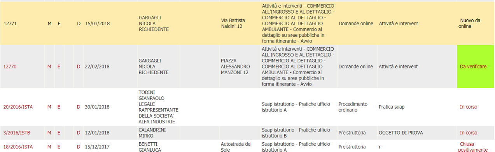
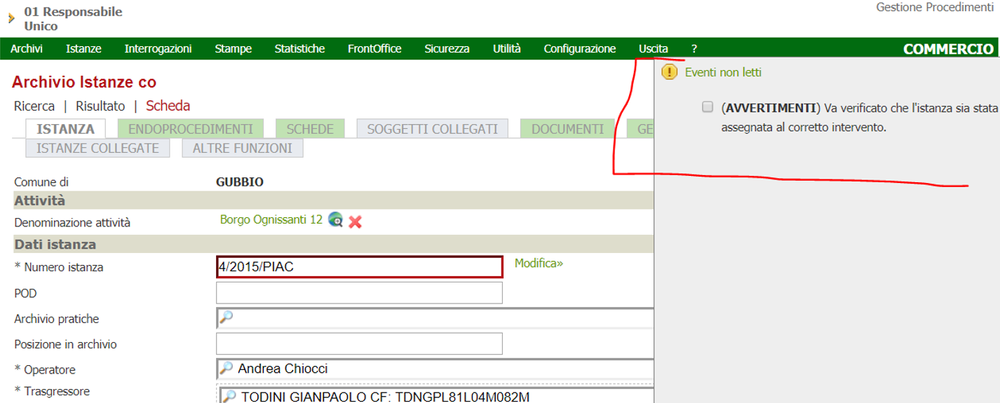
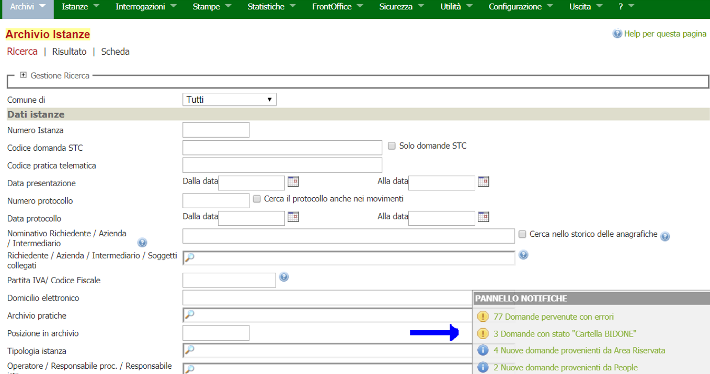
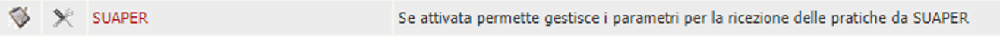
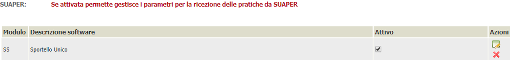
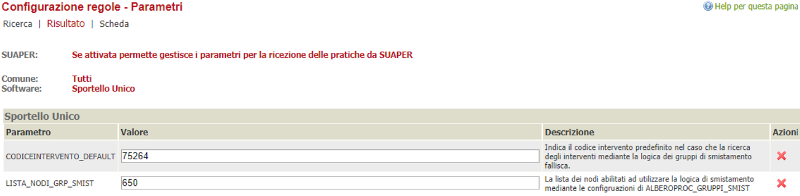

# SMISTAMENTO PRATICHE BACKOFFICE

Una pratica SUAP che nell'Ente acquisirà un unico n. ro di PG ma contenente più richieste è detta "procedimento unico".

Lo smistamento nell'albero dei procedimenti di VBG di un "procedimento unico", risulta critico.

A seguito della richiesta di adeguamento VBG per smistare agilmente qualsiasi pratica proveniente dal nuovo SUAPER, si propongono i seguenti sviluppi:

- Gestione di una serie di tabelle di configurazione:
  - Dizionario dei gruppi/endo procedimenti,
  - Associazione dei gruppi agli interventi,
- Realizzazione di una componente di business che effettua lo smistamento utilizzando le configurazioni applicative.

L'idea alla base di questo sviluppo è di ridurre la complessità delle esigenze selezionabili dall'utente, categorizzandole in gruppi. Ciascun gruppo conterrà 1 o più esigenze; ciascuna esigenza appartiene a un solo gruppo. Per esempio il gruppo "interni" potrebbe contenere tutte le esigenze gestite tramite procedimenti dell'Ente, mentre "esterni" contenere tutte le esigenze gestite da Enti terzi.

Così una pratica "procedimento unico" contenente 10 esigenze, nel caso migliore potrebbero appartenere tutti ad unico gruppo e lo smistamento avverrebbe agevolmente nella cartella di VBG assegnata al medesimo gruppo.

Nel caso peggiore cioè VBG non riesce a determinare dove smistare la pratica, essa verrà smistata in una cartella (bidone) che ne implica la protocollazione automatica, invio pec di ricevuta e segnalazione all'operatore SUAP.

## Dizionario dei termini

Per chiarire la terminologia usata, elenchiamo il significato dei termini come inteso da Lepida e da Init

| Init             | Ente:termine      | descrizione                                                                       |
| ---------------- | ----------------- | --------------------------------------------------------------------------------- |
| Endoprocedimento | Lepida:Intervento | Singola esigenza individuata dall'utente del servizio on line SUAPER              |
| Intervento       | Com.Ra:cartella   | Cartella nell'albero degli interventi di VBG, a cui si associa specifico workflow |
  
## Dizionario dei gruppi/endo procedimenti

In questa tabella vengono censiti i vari gruppi di endo procedimenti ad esempio (INT.TI INTERNI, INT.TI ESTERNI, SCIA EDILIZIA, ecc…) e per ogni gruppo vengono associati gli endo procedimenti.

L'obiettivo di questa tabella è mappare / associare l'esigenza identificata dall'utente SUAPER con un gruppo definito dall'Ente. La relazione tra intervento FE – gruppo è molti a 1.

La descrizione del gruppo sarà usata come chiave di ricerca, per cui prestare attenzione alla definizione dei gruppi. Per esempio le descrizioni "interni" ed "interno", definiranno due gruppi diversi. Sarà compito dell'Ente popolare tale tabella e manutenerla (vedi Tabella 4).

## Associazione dei gruppi agli interventi

L'obiettivo di questa tabella è censire le regole di VBG per smistare la pratica ricevuta tramite SUAPER, indicando in quale intervento - cartella dell'albero procedimenti VBG - deve essere accolta.
Ogni riga descrive associazione tra ciascun gruppo o combinazioni di gruppi, alla specifica voce dell'albero VBG mediante una configurazione come quella proposta dalla Tabella 2.

| IDPROGRESSIVO | IDGRUPPO1          | IDGRUPPO2     | IDGRUPPO3                | CODICEALBEROPROC |
| ------------- | ------------------ | ------------- | ------------------------ | ---------------- |
| 1             | Interventi interni |               | SUAP                     |
| 2             | Interventi esterni |               | SUAP                     |
| 3             | Interventi esterni | PDC           | PDC                      |
| 4             | Interventi interni | Scia edilizia | PDC                      | IMPROCEDIBILE    |
| 5             | Interventi interni | Paesaggistica | Telefonia autorizzazione | MADIA            |

## Associazione dei gruppi alla natura intervento

Alla cartella VBG è associato un iter. Ci sono casi in cui è necessario archiviare la pratica in una Com.Ra:cartella di VBG ma modificare l'iter associato di default alla pratica.
L'obiettivo di questa tabella è censire questi casi particolari.
Quindi sarà possibile indicare la procedura specifica in base alla natura degli endo procedimenti attivati.

## Definizione gruppi e avvertimenti

L'obiettivo della tabella (GRUPPI) è definire il nome di ciascun gruppo e per esso quando generare degli avvisi: se nella pratica sono presenti in numero maggiore o uguale di Init:Endoprocedimenti rispetto al valore in tabella (es: richiediamo avvertimento in caso di pratica con gruppo = "Interventi esterni" contenente due o più esigenze vedi Tabella 2). In tal caso viene eseguito il movimento indicato nella stessa riga.
Così sarà possibile individuare visivamente le pratiche con quegli avvisi mediante una visualizzazione di questo tipo.





**La generazione degli AVVISI avverrà solamente se la pratica non è stata assegnata all'intervento BIDONE.**

## Logica di ricerca intervento

Si assume che l'Ente abbia popolato le tabelle di configurazione precedentemente descritte, considerando che:

- Ogni intervento/esigenza appartiene a un solo gruppo;
- Ogni combinazione di gruppi è presente una sola volta, non ci sono permutazioni; per esempio se è presente la n-upla ("interni","esterni"), NON sarà presente ("esterni" ,"interni")

All'arrivo di una nuova pratica SUAPER, VBG controlla per ogni esigenza presente a quale gruppo appartiene. Se più endo appartengono allo stesso gruppo si conta solamente un gruppo.
Poi verifica quanti gruppi di procedimenti sono presenti nella pratica.
In sostanza si "filtra" la pratica esaminando gli X gruppi che la compongono anziché le Y esigenze, ovviamente lo scopo della logica è ottenere X<Y.
Sono gestiti tre casi:

- caso 1
  - un solo gruppo
- caso 2
  - due gruppi
- caso 3
  - 3 o più gruppi

### CASO 1

Nel primo caso si ricerca nella tabella ALBEROPROC_GRUPPI  (vedi Tabella 2) dove le colonne IDGRUPPO2 e IDGRUPPO3 non sono popolate (ovvero dove è popolato solamente IDGRUPPO1).
Si filtra la Tabella 2 con IDGRUPPO = \<gruppo-in-pratica>
Il filtro trova una riga di configurazione allora la destinazione è univoca.
Si recupera l'intervento (codicealberoproc) e la procedura associata.
Da questa si estrare la natura. Se la natura della procedura è la stessa dell'endo la procedura è corretta, altrimenti si verifica la tabella ALBEROPROC_GRUPPID. Se presente una configurazione per la nuova natura si prende quella procedura altrimenti si mantiene quella della voce dell'albero di default.
Se si verifica una situazione critica, tipo:

- non viene trovata nessuna riga di configurazione
- vengono trovate più righe e con cartelle di configurazione differenti
allora la pratica viene messa in una cartella configurata per venire protocollata (SUAPER.CODICEINTERVENTO_DEFAULT). La cartella assegnata è quella BIDONE deve essere messa in un determinato stato e visibile dal pannello di ricerca istanze (Vedi Modifica stati istanza).

### CASO 2

Nel secondo caso si ricerca nella tabella ALBEROPROC_GRUPPI dove la colonna IDGRUPPO3 non è popolata (ovvero dove sono popolati IDGRUPPO1 e IDGRUPPO2).
Si filtra la Tabella 2 con
IDGRUPPO1 = \<gruppo1-in-pratica>
e
IDGRUPPO2 = \<gruppo2-in-pratica>
Se il filtro restituisce alternativamente:

- una riga di configurazione;
- più righe con stessa cartella di destinazione
allora lo smistamento è certo. Si recupera l'intervento (codicealberoproc) e la procedura associata.
Da questa si estrare la natura. Se la natura della procedura è la stessa dell'endo la procedura è corretta, altrimenti si verifica la tabella ALBEROPROC_GRUPPID. Se presente una configurazione per la nuova natura si prende quella procedura altrimenti si mantiene quella della voce dell'albero di default.

Se si verifica una situazione critica, tipo:

- non viene trovata nessuna riga di configurazione
- vengono trovate più righe e con cartelle di configurazione differenti
allora la pratica viene messa in una cartella configurata per venire protocollata (SUAPER.CODICEINTERVENTO_DEFAULT). La cartella assegnata è quella BIDONE deve essere messa in un determinato stato e visibile dal pannello di ricerca istanze  (Vedi Modifica stati istanza).

### CASO 3

In questo ultimo caso si ricerca nella tabella ALBEROPROC_GRUPPI dove tutte le colonne dei gruppi sono popolate.
Si filtra la Tabella 2 con

IDGRUPPO1 = \<gruppo1-in-pratica>

e

IDGRUPPO2 = \<gruppo2-in-pratica>

e

IDGRUPPO3 = \<gruppo3-in-pratica>

Se il filtro restituisce alternativamente:

- una riga di configurazione;
- più righe con stessa cartella di destinazione
allora lo smistamento è certo. Si recupera l'intervento (codicealberoproc) e la procedura associata.

Da questa si estrare la natura. Se la natura della procedura è la stessa dell'endo la procedura è corretta, altrimenti si verifica la tabella **ALBEROPROC_GRUPPID**. Se presente una configurazione per la nuova natura si prende quella procedura altrimenti si mantiene quella della voce dell'albero di default.

Se si verifica una situazione critica, tipo:

- non viene trovata nessuna riga di configurazione
- vengono trovate più righe e con cartelle di configurazione differenti

allora la pratica viene messa in una cartella configurata per venire protocollata (**SUAPER.CODICEINTERVENTO_DEFAULT**). La cartella assegnata è quella **BIDONE** deve essere messa in un determinato stato e visibile dal pannello di ricerca delle istanze. (Vedi Modifica stati istanza).

#### Caso 3.1

Se vengono trovati più di tre gruppi di procedimenti nella pratica si crea una serie di ricerche a gruppi di tre.
Immaginiamo, ad esempio, che sono stati individuati i seguenti gruppi di endoprocedimenti per una pratica:

> 1, 4, 9, 15, 22

Si applica un algoritmo di "combinazioni semplici di n oggetti distinti di classe k, con k <= n" che ritorna una serie di gruppi di ricerca di questo tipo:

```xml
 1 - 4 - 9
 1 - 4 - 15
 1 - 4 - 22
 1 - 9 - 15
 1 - 9 - 22
 1 - 15 - 22
 4 - 9 - 15
 4 - 9 - 22
 4 - 15 - 22
 9 - 15 - 22
```

Si ricerca ognuna di queste triple nelle tabelle di configurazione. Se tutte portano alla stessa cartella allora si recupera quella altrimenti si applica la cartella BIDONE.

### SITUAZIONI COMUNI AI CASI  2 E 3

Se nei casi 2 e 3 si dovesse verificare la condizione che per uno dei gruppi individuati siano presenti più endoprocedimenti di quanti configurati nella colonna **NUM_ENDO_WARNING** e sia configurata la colonna **GENERA_MOVIMENTO** (es: INTERVENTI ESTERNI), allora viene eseguita la seguente logica aggiuntiva:

- Viene inserito un nuovo movimento nella pratica (del tipo definito in **GENERA_MOVIMENTO**). Il movimento deve essere configurato per cambiare lo stato della pratica. Il movimento imposta un contromovimento che sarà interrogabile dallo scadenzario. Lo stato della pratica dovrà essere opportunamente configurato per avere impostate le colonne FLAG_WARNING e TESTO_WARNING;
- Viene inserito un evento nella pratica dove viene scritto quanto presente nella colonna TESTO_WARNING;

Nel caso ci sia almeno un procedimento che non fa parte di nessun gruppo (procedimento non presente in nessun gruppo), viene generato un evento collegato alla pratica di modo che l'operatore possa avere evidenza della cosa.

## Modifica stati istanza

Quando la pratica finisce nel BIDONE viene impostata con uno stato definito in configurazione che ne permette l'evidenziazione nella maschera di ricerca istanze.



## Caricamento dati da EXCEL

La funzionalità rappresenta una utility che permette di configurare le mappature a partire da un file excel scritto secondo particolari regole.
Un foglio (GRUPPI) con le colonne:

| descrizione gruppo | Num_endo_warning \>=**maggiore uguale** | Tipomovimento |
| ------------------ | --------------------------------------- | ------------- |
| Interventi interni |                                         |
| Interventi esterni | 2                                       | SS01          |
| PDC                |                                         |
| ...                | ...                                     | ...           |

Un foglio (GRUPPI_ENDO) con le colonne
| descrizione gruppo | Codice inventario | Descrizione inventario |
| ------------------ | ----------------- | ---------------------- |
| Interventi interni | 150               | Apertura vicinato      |
| Interventi interni | 245               | cessazione             |
| Interventi esterni | 158               | Notifica sanitaria     |
| ...                | ...               | ....                   |

Un foglio (CONFIGURAZIONE_GRUPPI)
ELIMINATA COLONNA PROCEDURA AUTOMATICO perché coincide con il workflow associato alla cartella.

| GRUPPO1            | GRUPPO2 | GRUPPO3 | CODICE INTERVENTO | Descrizione INTERVENTO | PROCEDURA in caso di SCIA (codice iter da assegnare) | PROCEDURA ORDINARIO (codice iter da assegnare) |
| ------------------ | ------- | ------- | ----------------- | ---------------------- | ---------------------------------------------------- | ---------------------------------------------- |
| Interventi interni |         |         | 1501              | SUAP                   |                                                      |
| Interventi interni |         |         | 1656              | SUAP                   | 250                                                  | 100                                            |
| Interventi esterni |         |         |                   | PDC                    | 180                                                  | 251                                            |
| ...                | ...     | ...     | ...               | ...                    | ...                                                  | ...                                            | ... |

Le descrizioni del gruppo dovranno essere le stesse in tutti e tre i fogli.
I codici intervento/codiceinventario/procedure dovranno essere quelli presenti nella base dati applicativa di backoffice.
I codici procedimento suaper vengono censiti all'interno della configurazione VBG di Init:endoprocedimenti nella funzionalità **MAPPING STC**. Questa configurazione è attualmente operativa in VBG.
La procedura che carica una nuova configurazione deve:
Eliminare tutte le configurazioni esistenti dei gruppi (gruppi interventi) e delle mappature esistenti.
Ricreare tutte le nuove configurazioni dal file caricato.
Sarà possibile scaricare le attuali configurazioni dei gruppi/interventi su un file excel.

## Configurazione

Nuova regola di verticalizzazione da attivare



Parametri da configurare



Nuovo menù da attivare sol modulo software specifico.


### Template del file excel per il caricamento dei dati
  
[Template xlsx per lo smistamento](./risorse/template_smistamento.orig.xlsx)
