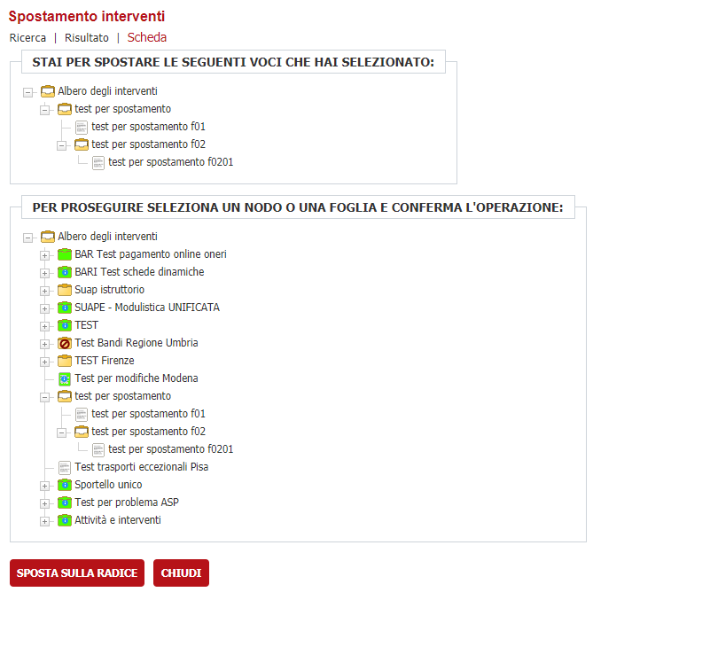
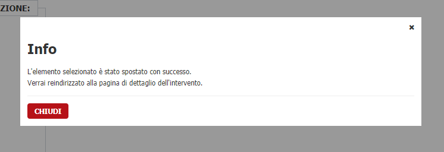

# Modifica albero degli interventi (v. 1.0)

È possibile apportare delle modifiche all'albero dei procedimenti per spostare rami/foglie sotto altri rami/foglie oppure spostare nella root principale.

## Panoramica 

A questa modifica è possibile accedere dal dettaglio del ramo/foglia che vorremmo spostare. 

È stato aggiunto un nuovo bottone **"SPOSTA"** in basso 

che rimanda alla pagina della funzionalità.

In alto viene mostrata la parte di albero, oppure la singola foglia, che vorremmo spostare.

Nella parte centrale si potrà scegliere la posizione in cui andare a spostare il ramo/foglia prescelto. 

Nella parte in basso sono presenti due bottoni:
- **Sposta sulla radice** permette di spostare la nostra selezione direttamente a livello di root dell'albero dei procedimenti;
- **Chiudi** ci permette di tornare indietro. 

## Funzionalità dello spostamento

Dopo aver effettuato la scelta si aprirà un popup che ci chiederà la conferma dell'operazione appena effettuata.

Confermando, si verrà reindirizzati alla pagina di dettaglio, mentre invece premendo il bottone **Chiudi** verrà chiuso il popup e sarà possibile effettuare una nuova scelta.

Se l'operazione è andata a buon fine si aprirà un altro popup 

 

e premendo chiudi torneremo alla pagina di dettaglio.

In caso di errore, comparirà un messaggio come in figura

## Errori

I possibili errori (controllati) sono dovuti al fatto che:

1. Non è possibile spostare una cartella in una sua sottocartella.