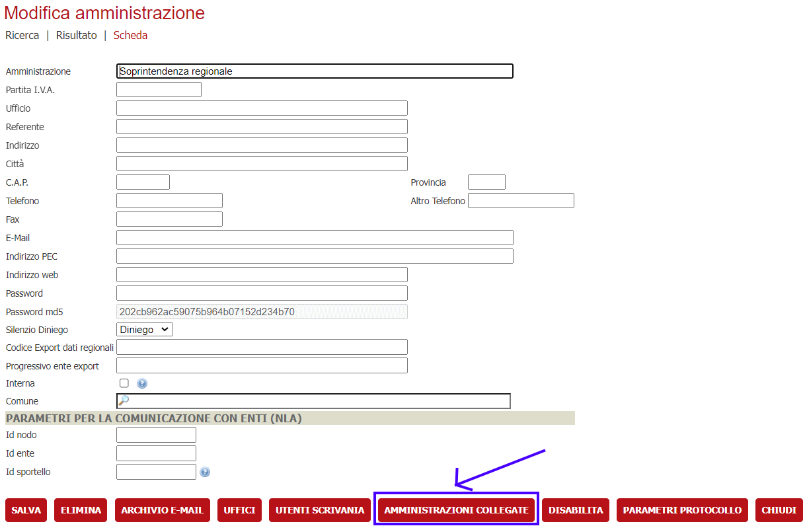
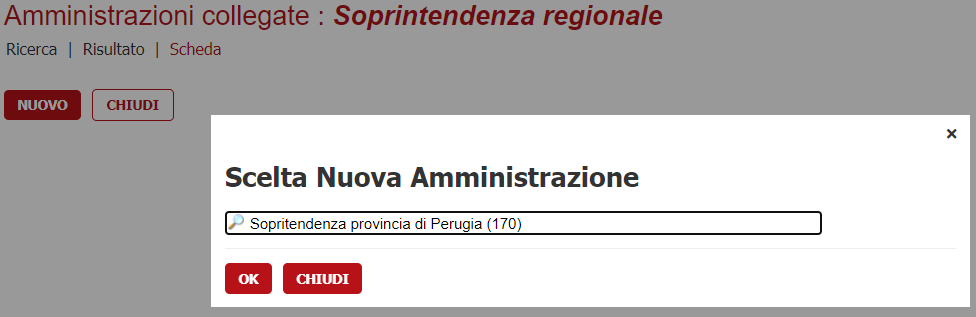
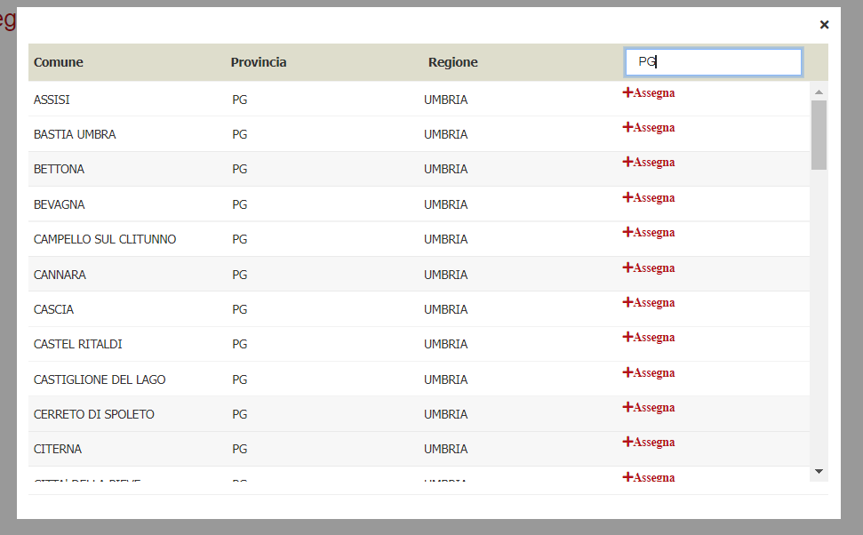
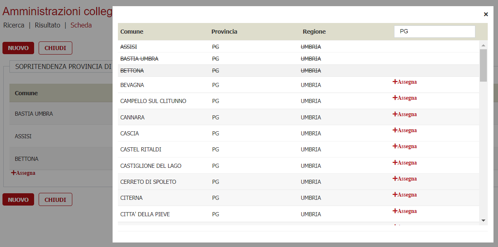
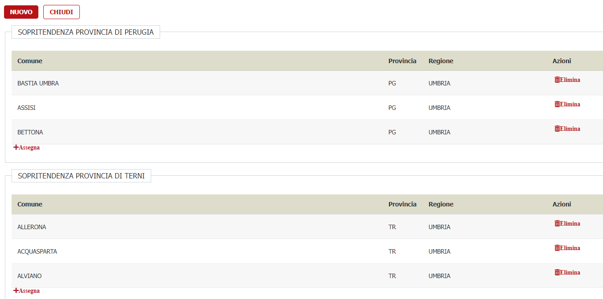
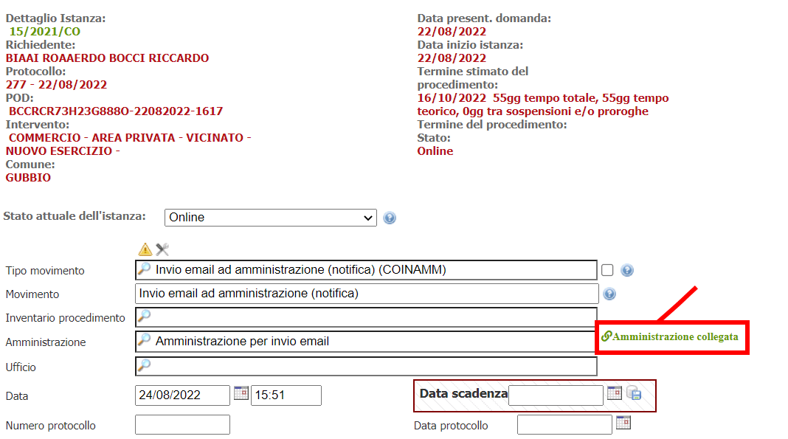
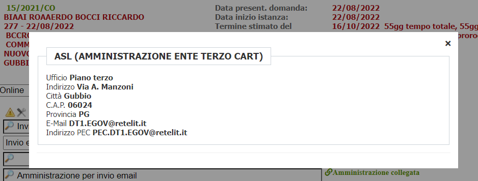
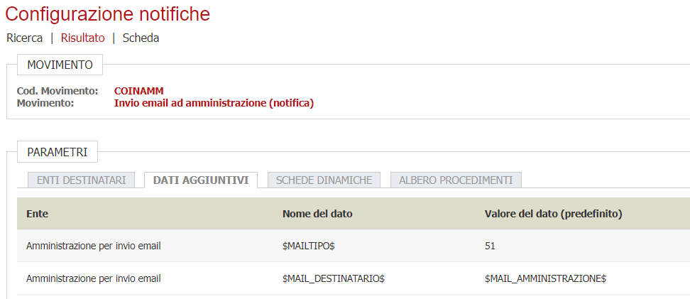

# Amministrazioni

Le amministrazioni sono configurabili mediante il menù Archivi==>Amministrazioni.

## Amministrazioni collegate

Nel caso di amministrazioni la cui competenza ricade su comuni differenti, ad esempio soprintenzenda dei beni culturali, allora è possibile configurare le cosiddette **Amministrazioni collegate**.

>

Cliccando su **nuovo** va recuperata l'amministrazione da collegare.

>

Verrà proposta la lista dei comuni da associare a questa amministrazione collegata.

>

La lista dei comuni che è possibile associare è quella definita nelle tabelle dei "comuni associati".

>

Al termine della  configurazione verrà visualizzata la lista.

>

### Movimenti

Se una amministrazione ha delle configurazioni per l'ente della pratica allora nei movimenti appare il link come da immagine.

>

Al click sul link verranno riportate le informazioni dell'amministrazione collegata.

>

### Scopi della funzionalità

Attualmente la configurazione viene usata per inviare, mediante notifica automatica STC (**Mail Service**), una mail/PEC sfruttando le configurazioni di notifica dei segnaposto configurati in ***Configurazioni notifiche ==> Dati Aggiuntivi*** per il tipo movimento da notificare.

>

In particolare il valore segnaposto **\$MAIL_DESTINATARIO\$** può assumere i valori **\$MAIL_AMMINISTRAZIONE\$** o **\$PEC_AMMINISTRAZIONE\$** significando che quando viene recuperata l'amministrazione viene usato come destinataria la mail o la pec dell'amministrazione collegata al movimento.

La modifica permette di recuperare i dati (MAIL o PEC) dell'amministrazione collegata a quella configurata nel movimento e che è associata al comune su cui la pratica è stata presentata.

È il caso, ad esempio, della Regione abruzzo dove viene configurata nei flussi una amministrazione della console - soprintendenza - e la mail deve essere inviata al comune di competenza della pratica es: Pratica su Pescara alla soprintendenza che gestisce l'area del pescarese.
