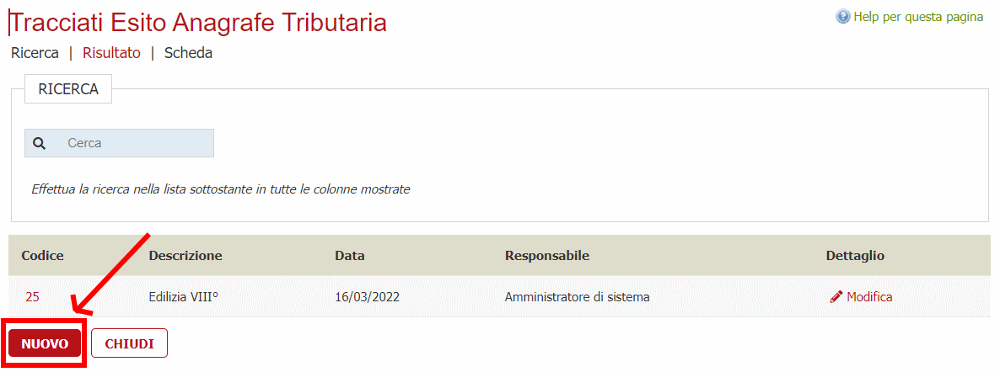
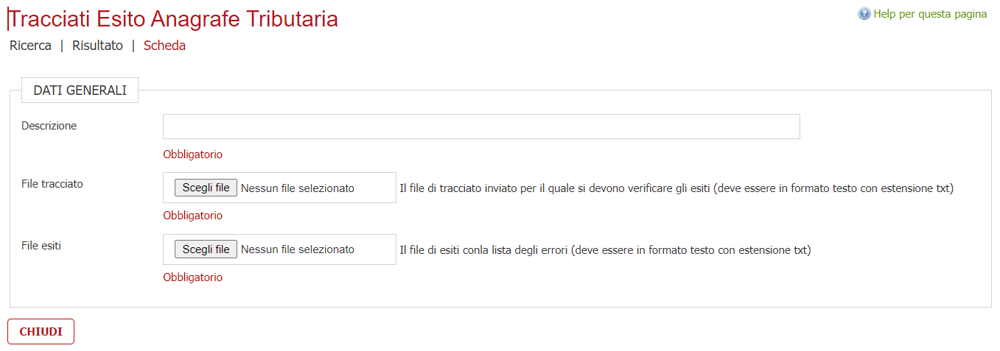
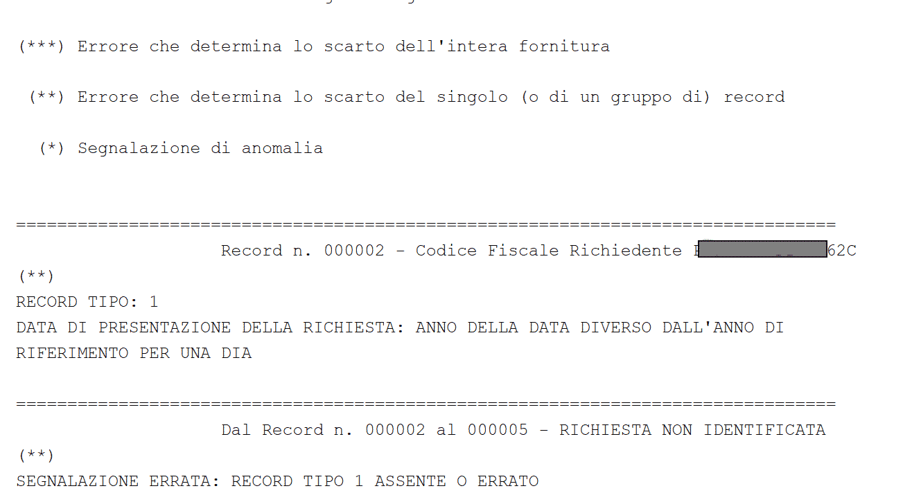
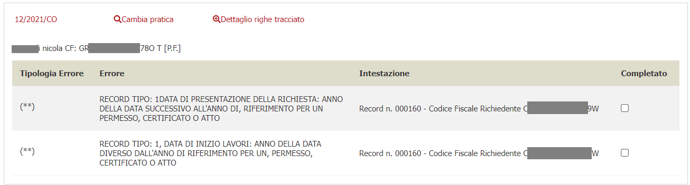
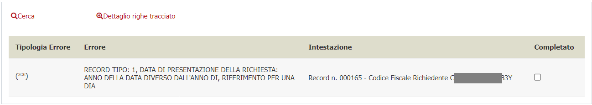
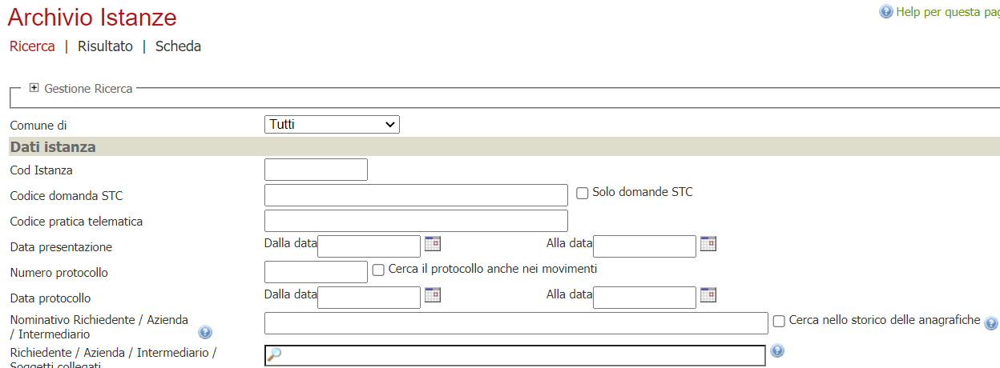
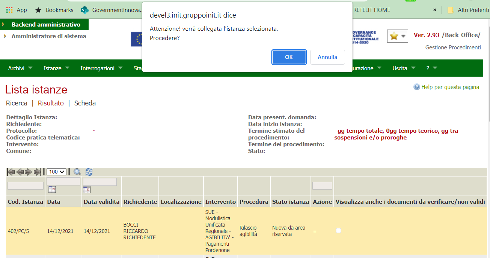
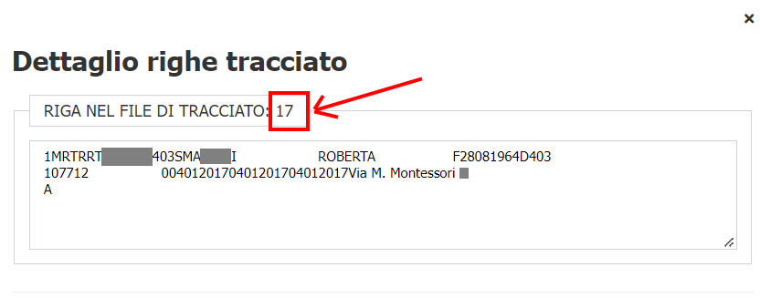

# ESPORTAZIONE ANAGRAFE TRIBUTARIA

In questo documento viene spiegata l'integrazione che permette di esportare i dati presenti nell'applicativo e produrre i tracciati di anagrafe tributaria da comunicare all'amministrazione preposta da parte dell'ente.

I tracciati vengono prodotti per due tematismi:

- **Commercio**

    "Atti di concessione, autorizzazione e licenza (ad esclusione dei codici R1, R2 e R3);"
- **Edilizia**

    "Comunicazione dei dati in materia edilizia (DIA, Permessi e atti di assenso) da parte degli uffici comunali - secondo le specifiche tecniche previste nel Provvedimento del Direttore dell'Agenzia delle Entrate del 2 ottobre 2006, e modificate dal Comunicato del 2 gennaio 2007;"

## Edilizia

## Commercio

vedi  [(documentazione)](./commercio/readme.md)

## Analisi tracciati anagrafe tributaria

La funzionalità è stata sviluppata per permettere una verifica dell'esito dei tracciati da interfaccia grafica.

Una volta che L'operatore ha ottenuto il tracciato lo processa tramite un programma esterno che produce un file di estiti di solito in formato PDF o txt.

Questo file contiene le eventuali anomalie/errori che determinano l'eventuale esito positivo scarto della fornitura all'anagrafe tributaria.

### Accesso alla funzionalità

La funzionalità viene attivata tramite permessi su menù operatore.
Il menù è posizionato sotto la voce

- **Utilità**
  - **Modulo software (es.commercio/edilizia)**
    - **Verifica Tracciati Anagrafe Tributaria**

### Uso della funzionalità

L'operatore una volta acceduto alla funzionalità dovrà creare una nuova voce di verifica nella quale fondamentalmente dovrà inserire il file di tracciato prodotto dal nostro applicativo (in formato txt) ed il file di esiti prodotto dall'applicativo esterno che esegue le verifiche sul file di tracciato.

L'operatore sceglierà il pulsante **NUOVO**
>

Per poter proseguire viene richiesto di inserire il file di tracciato, il file degli esiti e di indicare una descrizione della verifica che si intende fare (per eventualmente accedervi in secondo momento dalla pagina di lista).
>

Di solito il file di esiti prodotto dall'applicativo esterno può essere restituito in formato pdf.
>

Per poter essere processato nella funzionalità il file deve essere trasformato in txt.

Per far questo l'operatore deve selezionare tutto il testo dal PDF, incollarlo in un file di testo, senza fare ulteriori modifiche sul testo incollato, e salvarlo nel suo dispositivo locale (PC, notebook, laptop).

Una volta inseriti nei campi di interfaccia specifici il file txt del tracciato e il file txt degli esiti l'operatore dovrà cliccare su **OK** ed attendere l'esito del caricamento.

La funzionalità realizzata processa il file di esito, verifica tutte le anomalie e presenta all'utente una serie di gruppi che permettono all'operatore di prendere delle azioni correttive.

La procedura durante l'analisi tenta di associare una pratica alla riga di anomalia tenendo presente i dati prodotti nel tracciato. Ove riesce ad associare l'istanza nell'interfaccia per ogni blocco prodotto presenterà il collegamento con la pratica individuata. In caso di errore l'operatore potrà comunque modificare la pratica.
>

Nel caso invece che la procedura non riesca a recuperare la pratica di pertinenza allora l'operatore potrà cercare in autonomia la pratica secondo le informazioni presenti nel blocco presentato.
>

Il link alla pratica permette di accedere alla pratica individuata e correggere a seconda dell'errore indicato nella tabella degli errori l'anomalia.
Una volta verificato l'errore e corretto l'operatore dovrà cliccare sulla casella **[X] completato**.
Questo permette di nascondere le operazioni completate e concentrarsi su quelle da finire.

Il link **Cambia pratica** permette di associare un'altra pratica a quella riga di blocco.

Il link **Cerca** permette di associare una pratica a quella riga di blocco.

Entrambe i link portano l'operatore alla maschera di ricerca delle istanze.
>

Una volta definiti i filtri di ricerca l'operatore dovrà selezionare la pratica cercata e confermare l'operazione.
>

Il link **Dettaglio righe tracciato** permette di visualizzare le righe originali del tracciato che hanno generato l'errore.
Nel dettaglio viene riportata anche il numero di linea ovvero la posizione del record in errore.
>

Al termine della verifica sarebbe bene eliminare l'analisi mediante il pulsante **ELIMINA**.
