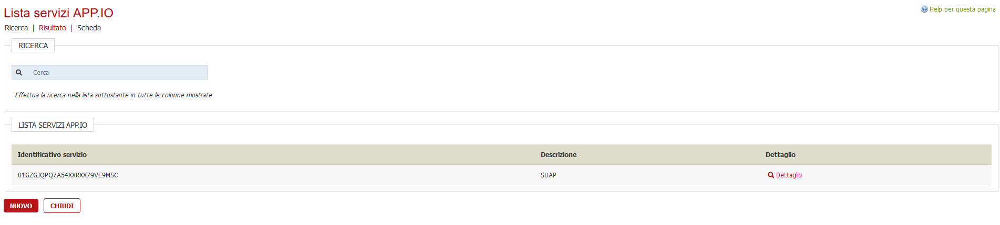
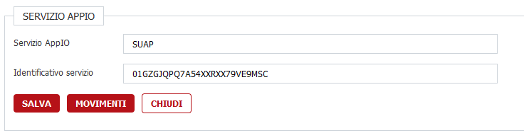
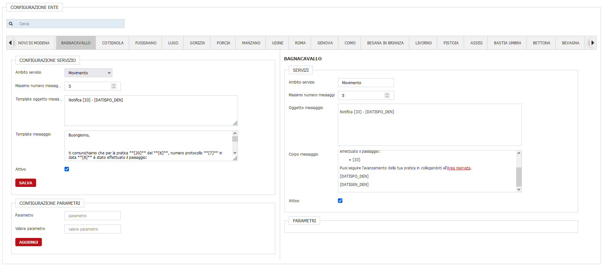
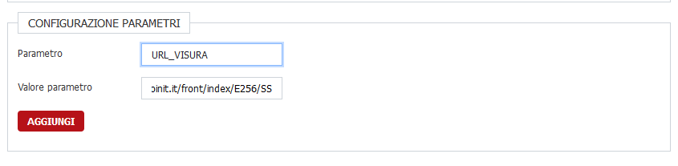
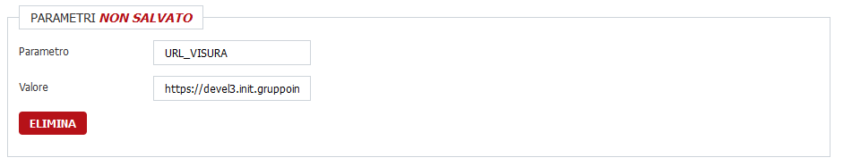
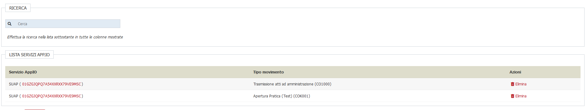
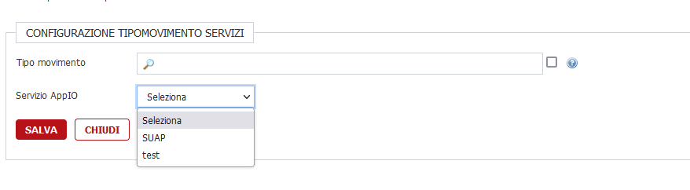

# Servizi APP IO

## Prerequisiti

Versione del Backoffice a partire dalla 2.112.

## Configurazione servizi

Per accedere alla funzionalità andare sulla voce di menu _Utilità -> < SOFTWARE > -> Configurazione APP.IO_

Seguendo il percorso si arriva alla lista dei servizi attivati per software.

Cliccando su **Nuovo** si accede alla schermata di configurazione di un nuovo servizio.

Per configurare un nuovo servizio bisognerà inserire una descrizione e l'identificativo del servizio.

Premendo il bottone _Salva_ salviamo il servizio.

### Configurazione ente

Ora andiamo a settare i parametri per ogni comune.

Dopo aver selezionato il comune (oppure più comuni se installazione lo prevvede), si aprirà l'interfaccia di "anteprima" sulla parte destra.

Selezionare:

- l'ambito del servizio (per ora è funzionante solo **Movimento**),
- max numero di messaggi che possono essere inviati in giornata (le eccedenze verranno processate nei giorni successivi);
- un oggetto del messaggio (<ins>la lunghezza dev'essere compresa tra 10 e 120 caratteri<ins>);
- un messaggio, si possono utilizzare anche i segnaposti delle Mailtipo e utilizzare la formattazione Markdown (la lunghezza dev'essere compresa tra 80 e 10000 caratteri);
- spuntare se il servizio è attivo oppure no.

### Aggiunta dei parametri

Per aggiungere un parametro alla configurazione, basta inserire il parametro come se fosse un segnaposto e il corrispettivo valore che verrà poi sostituito.

Cliccando sul bottone **AGGIUNGI** verrà riportato sulla colonna di destra della pagina.

Per salvare i cambiamenti bisognerà cliccare sul bottone **SALVA**.

## Configurazione movimenti

Cliccando sul bottone **Movimenti** si accederà alla lista dei movimenti che possono essere configurati per mandare notifiche tramite l'app IO

Cliccando sul bottone **Nuovo** si aggiungerà un nuovo movimento

Per eliminare un movimento precedentemente inserito, basterà cliccare su **Elimina** nella corrispondente linea della tabella.
