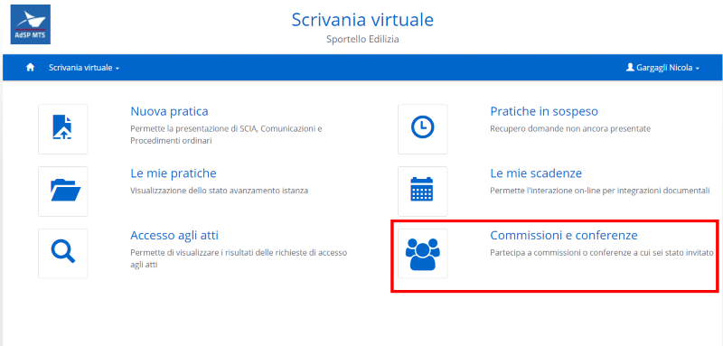
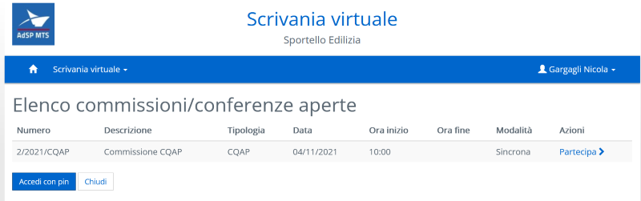
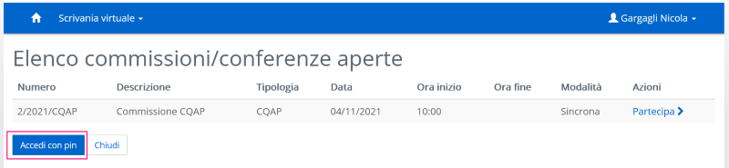
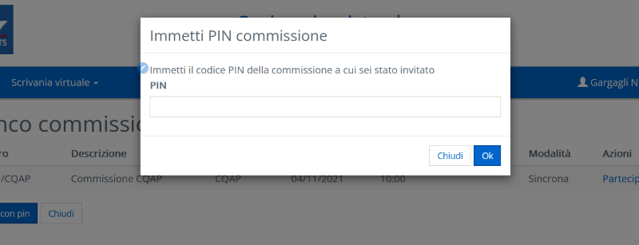
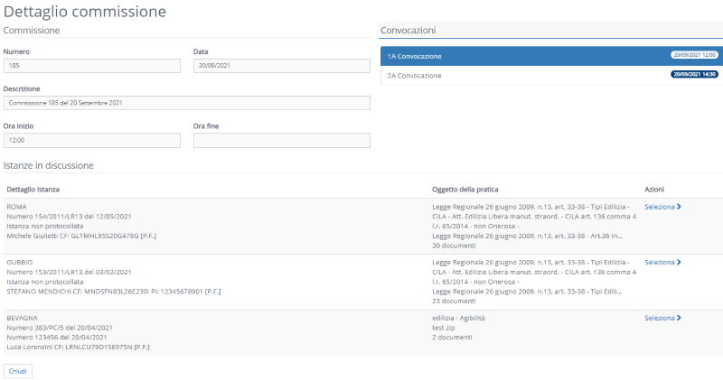
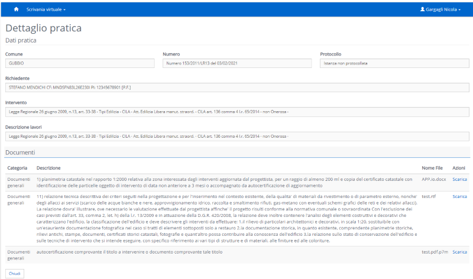
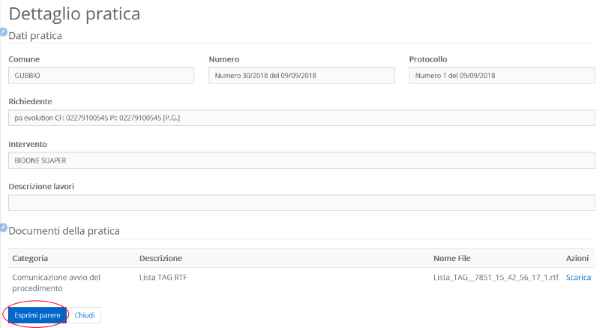
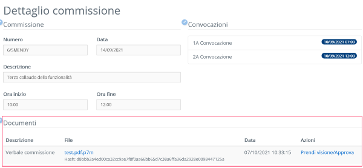
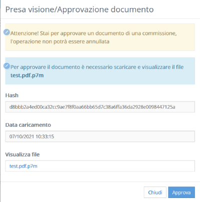

# Commissioni e conferenze

## Configurazione

Per attivare la funzionalità nell'area riservata è necessario aggiungere una nuova voce di menu nel file menu.xml

```xml
        <MenuItem icona-fa="fa fa-users">
          <Titolo>Commissioni e conferenze</Titolo>
          <Descrizione>Partecipa a commissioni o conferenze a cui sei stato invitato</Descrizione>
          <Url>~/reserved/commissioni/lista-commissioni.aspx</Url>
        </MenuItem>
```

## Gestione dei logs

Per semplificare il debug e la diagnostica di problemi si consiglia di realizzare un appender apposito
da utilizzare esclusivamente per la funzionalità di gestione commissioni.

Per creare un appender occorre modificare il file **web.config** dell'area riservata.

Nella sezione **log4net** creare un nuovo appender aggiungendolo a quelli già esistenti:

```xml
    <appender name="commissioniLog" type="log4net.Appender.RollingFileAppender">
      <file value="Logs/commissioni.log.txt"/>
      <appendToFile value="true"/>
      <maximumFileSize value="1500KB"/>
      <rollingStyle value="Size"/>
      <layout type="log4net.Layout.PatternLayout">
        <conversionPattern value="%d [%t] %-5p %c - %m%n"/>
      </layout>
    </appender>
```

aggiungere poi due logger accodandoli a quello di root:

```xml
    <logger name="Init.Sigepro.FrontEnd.AppLogic.GestioneCommissioni" additivity="false">
        <level value="ERROR"/>
        <appender-ref ref="commissioniLog"/>
    </logger>

    <logger name="Init.Sigepro.FrontEnd.Reserved.Commissioni" additivity="false">
        <level value="ERROR"/>
        <appender-ref ref="commissioniLog"/>
    </logger>
```


## Accesso alla funzionalità

L'utente troverà nella pagina iniziale della area riservata la nuova funzionalità evidenziata nella seguente immagine


Cliccando sul link **Commissioni e conferenze** l'utente accederà alla sezione della lista delle commissioni attive per le quali è stato indicato come convocato.



Cliccando su **partecipa** l'utente accederà al dettaglio della commissione

## Accesso con PIN

Per ciascuna ammnistrazione che viene aggiunta tramite l'appello nel backoffice verrà generato un PIN. L'utente dell'area riservata
potrà utilizzare questo PIN per essere collegato a tale amministrazione e accedere alla commissione.

Il PIN potrà essere immesso utilizzando la funzionalità "Accedi con PIN" presente nella lista commissioni



All'utente verrà richiesta l'immissione del pin e, se il codice immesso sarà valido, verrà collegato all'amministrazione
nella commissione corrispondente.
Da quel momento all'utente saranno conferiti i permessi di accesso a quella commissione.



> NOTA: La ricerca del PIN viene effettuata tra tutte le amministrazioni invitate a commissioni
> che non hanno un'anagrafica collegata.
> Se un'amministrazione ha già un'anagrafica collegata allora il PIN verrà considerato non valido
> anche nel caso in cui fosse corretto.

## Dettaglio commissione



Per ogni commissione vengono riportate le informazioni principali, relative alle convocazioni / pratiche discusse.

L'accesso dell'utente alle informazioni della commissione viene registrato nei log descritti nel paragrafo di AUDITING.

## Dettaglio pratica

Vengono riportate le informazioni della pratica come da immagine che segue.



Anche l'accesso al dettaglio della pratica sarà registrato nella tabella dei logs di accesso.

L'utente connesso avrà la possibilità di scarica per visionarli i documenti configurati per la pratica nelle commissioni.
Anche questa operazione sarà registrata nelle tabelle di auditing.

## Invio del parere (TODO)

Un utente puè esprimere un parere su una pratica se:

- carica del soggetto loggato abbia diritto di voto
- la discussione della pratica non sia stata terminata (voto complessivo emesso sulla pratica)
- l'utente o l'amministrazione a cui l'utente appartiene non abbia espresso già un parere sulla pratica

Nel caso in cui tali condizioni siano vere il bottone "Esprimi parere" sarà abilitato sulla pagina di dettaglio della pratica.



Verrà quindi aperta la funzionalità di inserimento/modifica parere che permetterà di specificare:

- Il parere
- Delle note
- Allegare un file (a seconda della configurazione della commissione il caricamento del file potrebbe essere obbligatorio)


> NOTA: Il parere potrà essere inviato una sola volta e una volta confermatone l'invio il bottone "Esprimi parere"
> verrà disabilitato.
> Per poter riabilitare il bottone è necessario che un utente di backoffice elimini il parere presente ed
> annulli il protocollo (nel caso in cui il parere sia stato protocollato)

## Firma del verbale

Una volta terminata la commissione e redatto il verbale questo verrà mostrato nella sezione "Documenti" del "Dettaglio commissione"



Facendo click su "Prendi visione/Approva" verrà aperta una finestra che consentirà all'utente di confermare la presa visione



L'operazione non potrà essere annullata e per poter proseguire e confermare la presa visione l'utente dovrà scaricare il file allegato

## Backoffice

Per le configurazioni e spiegazioni della funzionalità nel backoffice far riferimento alla [documentazione](/configurazione/commissioni-conferenze/README.md)
