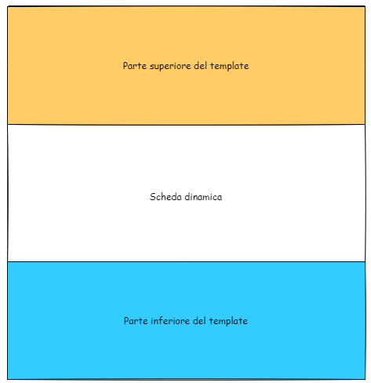
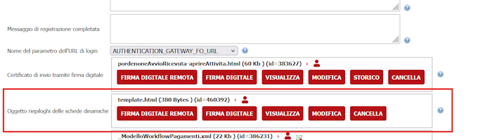

# Configurazione template riepilogo schede

Dalla versione 2.123 è possibile personalizzare il template che verrà utilizzato per generare i riepiloghi delle singole schede dinamiche.

Il template è un semplice file html che viene utilizzato come contenitore della scheda dinamica. La scheda dinamica verrà visualizzata utilizzando dei segnaposto.




I segnaposto da utilizzare per decidere dove posizionare la scheda sono: **&lt;cssScheda/&gt;** e **&lt;schedaDinamica/&gt;**

- **cssScheda** permette di inserire i css tipici delle schede dinamiche. Se omesso allora al documento risultante non verrà applicato nessun foglio di stile e sarà responsabilità di chi compila il template impostare tutti gli stili del documento.
Nel caso in cui invece sia presente allora verranno riportati gli stili di default delle schede dinamiche _**escluse**_ le informazioni relative ai fonts. Sarà responsabilità di chi compila il template impostare un font di default per l'intero documento.

## Segnaposto

I segnaposto sono case insensitive e ammettono uno o più spazi prima dei caratteri di chiusura ma non ammettono spazi tra il carattere di apertura tag e il nome del tag. Ad esmpio sono validi (ma non consigliati :) ) &lt;sChEdAdInAmIcA /&gt; o &lt;schedaDinamica &nbsp;&nbsp;&nbsp;&nbsp;/&gt; mentre non è valido &lt; &nbsp;&nbsp;&nbsp;&nbsp;schedaDinamica/&gt; o &lt;s chedaDinamica/&gt;

Un esempio di template html è:

```html

<!DOCTYPE html>
<html lang="en">
<head>
  <meta charset="utf-8">
  <title>Riepilogo scheda</title>
  <style media="all">
    * {font-family: arial, helvetica, sans-serif;}
  </style>
  <cssScheda/>
</head>
<body>
	<div style="margin-bottom: 50px; padding: 20px; background-color:red">Prima della scheda dinamica</div>
	<schedaDinamica/>
	<div style="margin-top: 50px; padding: 20px; background-color: blue">Dopo la scheda dinamica</div>
</body>
</html>

```

## Caricamento del template

Il template va caricato nel backoffice nella sezione "**Configurazione**"->"**Frontoffice {SOFTWARE}**"->"**Area riservata**", nella sezione "**Oggetto riepiloghi delle schede dinamiche**" 	
"

