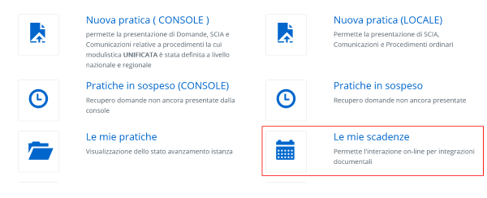
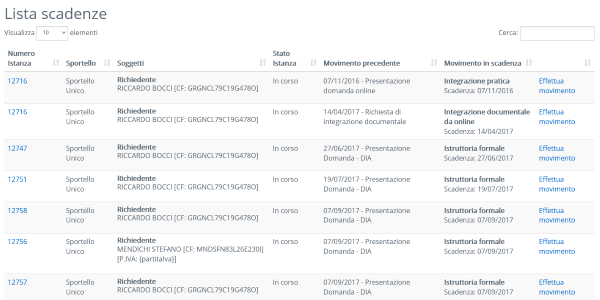
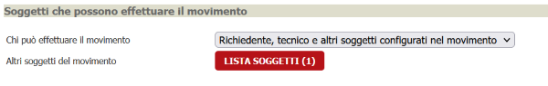
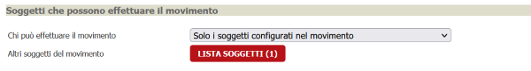
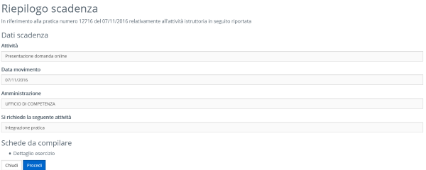
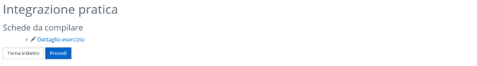
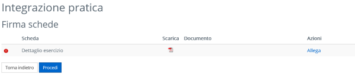
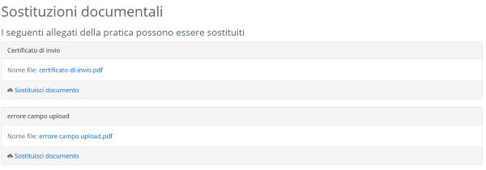
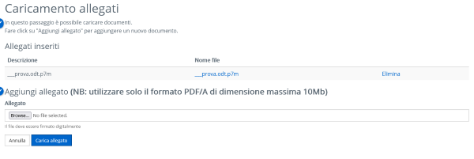
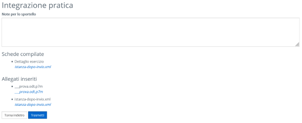

# Movimenti

Tramite lo scadenzario dell'area riservata è possibile effettuare movimenti e/o integrazioni documentali.

La lista delle scadenze comprende tutti i movimenti che l'utente correntemente loggato riesce a visualizzare:

Se in una pratica è stato effettuato un movimento il cui contromovimento è stato contrassegnato come "Front Office Richiedenti" o "Front Office Amministrazioni" (nel caso di enti terzi)allora l'utente corrente visualizzerà il movimento se:

- Il movimento è pubblicato nella relativa configurazione
- L'utente loggato è tra i soggetti collegati e il tipo soggetto a cui è associato ha il flag "Modifica la pratica" impostato
- Se il campo "Chi può effettuare il movimento" della sezione "Soggetti che possono effettuare il movimento" è impostato a "Richiedente, tecnico e altri soggetti configurati nel movimento" e l'utente corrente nella pratica è richiedente, tecnico o uno dei soggetti configurati in "Altri soggetti del movimento"

    

- Se il campo "Chi può effettuare il movimento" della sezione "Soggetti che possono effettuare il movimento" è impostato a "Solo i soggetti configurati nel movimento" e l'utente corrente nella pratica è uno dei soggetti configurati in "Altri soggetti del movimento" (in tal caso il richiedente o il tecnico NON vedranno il movimento nel proprio scadenzario)

    

## Flusso di presentazione di un movimento

La presentazione di un movimento si compone di vari passaggi:

### Riepilogo dei dati del movimento

In questo step vengono visualizzati i dettagli del movimento che è stato effettuato nel backoffice e del relativo contromovimento che si andrà ad effettuare

In questa pagina la visualizzazione di alcuni dati è opzionale:

- Esito: viene visualizzato solo se nella configurazione del tipo movimento il flag TIPOLOGIAESITO è diverso da 0
- Oggetto: viene visualizzato solo se nella configurazione del movimento di origine il flag PUBBLICAPARERE  è impostato a 1
- Note: viene visualizzato solo se nella verticalizzazione AREA_RISERVATA il parametro NASCONDI_NOTE_MOVIMENTO è impostato a 0 o non è presente

Se presenti in questo step verrà anche mostrato un riepilogo delle schede dinamiche da compilare e degli allegati del movimento di origine

### Schede del movimento

L'utente verrè portato allo step di compilazione schede se:

- nel movimento di origine sono state collegate schede dinamiche
- nella configurazione del tipo movimento da effettuare sono state configurate schede e si è impostato il flag "Pubblica schede"

Per poter uscire dallo step necessario che tutte le schede siano state compilate e salvate

### Firma dei riepiloghi schede dinamiche

L'utente arriverà in questo step se:

- è stato visualizzato lo step precedente
- nella verticalizzazione AREA_RISERVATA il parametro INTEGR.NO_UPLOAD_RIEPILOGHI_SD è impostato a 0 o non è presente

L'utente dovrà scaricare e ricaricare i riepiloghi delle schede compilate nello step precedente.

Nel caso in cui nella configurazione del tipo movimento del movimento da effettuare sia stato impostato il flag "Richiedi firme digitali" allora l'utente dovrà caricare un file firmato digitalmente.

### Sostituzioni documentali

Lo step verrà mostrato se nella configurazione del tipo movimento del movimento da effettuare il flag "Sostituzione documentale" è stato impostato a "Permette sost.doc per documenti non validi" oppure a "Permette sost.doc per documenti non validi o da verificare"

Nel caso in cui nella configurazione del tipo movimento del movimento da effettuare sia stato impostato il flag "Richiedi firme digitali" allora l'utente dovrà caricare solo files firmati digitalmente.

### Caricamento allegati

Lo step si attiva solamente se il parametro INTEGR.NO_UPLOAD_ALLEGATI della verticalizzazione AREA_RISERVATA è impostato a 0 o se è assente.

Se nella configurazione del tipo movimento è stato impostato il flag "Richiedi firme digitali" allora i files caricati dovranno essere firmati digitalmente.

Se il flag INTEGR_NO_NOMI_ALLEGATI nella verticalizzazione AREA_RISERVATA è impostato a 0 o non è presente allora l'utente dovrà immmettere una descrizione per il file caricato.

### Riepilogo del movimento e invio

In questo step viene visualizzato un riepilogo delle operazioni effettuate sul movimento:

- Schede compilate
- Sostituzioni documentali effettuate
- Allegati inseriti

Inoltre, se il flag INTEGR_NO_INSERIMENTO_NOTE della verticalizzazione AREA_RISERVATA è impostato a 0 o non presente allora sarà possibile per l'utente inserire delle note da inviare allo sportello.
