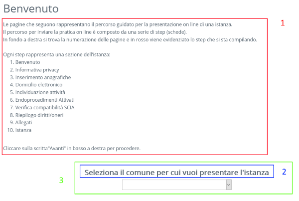

# Benvenuto.aspx
## Path: ~/reserved/inserimentoistanza/benvenuto.aspx



## Lista parametri:

### TestoDescrizioneSteps [System.String]

Testo che viene mostrato nella parte descrittiva dello step (sezione 1 dell'immagine sopra).
Può contenere al suo interno il segnaposto {0} che verrà sostituito con la lista dei titoli dello step.

Es.
```
    <ControlProperty name="TestoDescrizioneSteps">
      <!-- Nel segnaposto {0} viene riportata la lista degli steps come lista ordinata-->
      <![CDATA[ 
			Le pagine che seguono rappresentano il percorso guidato per la presentazione on line di una istanza. <br />

			Il percorso per inviare la pratica on line è composto da una serie di step (schede). <br />
			In fondo a destra si trova la numerazione delle pagine e in rosso viene evidenziato lo step che si sta compilando. 
			<br /><br />
			Ogni step rappresenta una sezione dell'istanza:
			{0}
			<br />
			Cliccare sulla scritta"Avanti" in basso a destra per procedere.<br />
		]]>
    </ControlProperty>
```


### TestoSelezionaComune [System.String]:
Il valore impostato in questa property verrà utilizzato come etichetta della combo di selezione comuni (sezione 2)


### SelezionaComune [System.String]
Se impostato verrà automaticamente selezionato il comune con il codice passato e la sezione contenente la combo di selezione comune (sezione 3) non verrà mostrata


### EscludiComuni [System.String]
Può contenere una lista di codici comune separati da una virgola. Nella combo di selezione communi verranno mostrati solamente i comuni che hanno un codice presente nella lista. Il filtro applicato tramite questa property è a cascata rispetto alla lista dei comuni abilitati per il software (vd sezione "Popolamento della combo comuni")


## Popolamento della combo comuni
La combo di selezione comuni è popolata con tutti i comuni associati che hanno il frontoffice attivo (flag DISATTIVO_FO della tabella COMUNIASSOCIATI = 0) e che non sono stati disabilitati per lo specifico software tramite l'apposita configurazione di backoffice backoffice (vd sezione [Configurazione lista comuni](./configurazione-lista-comuni.md) ).
Tale lista viene ulteriormente filtrata tramite il parametro **EscludiComuni**
