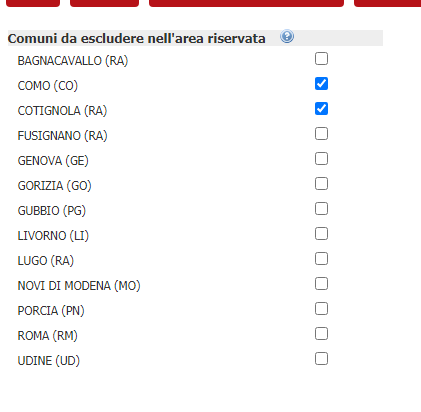

# Configurazione comuni esclusi

E' stata implementata una nuova funzionalità che permette, ad un insieme di comuni associati, di poter scegliere in base al software quale comune visualizzare nello step di benvenuto nell'area riservata.

## Modifiche backoffice

Alla nuova funzionalità si accede tramite "Configurazione->Front Office {software}->Area riservata".

Nella configurazione dell'area riservata è stata aggiunta una tabella con la lista dei comuni facenti parte di una associazione di comuni.



Affinché un comune sia escluso dall'area riservata dovrà essere spuntata la relativa casella corrispondente.

## Modifiche servizio rest

La chiamata al servizio REST è stata modificata in modo che restituisca la lista dei comuni associati che sono stati attivati in base alla configurazione precedente.
La chiamata restituisce in formato JSON le seguenti informazioni:

```json
​​​​ {
    "codiceComune": "D829",
    "siglaProvincia": "RA",
    "provincia": "RAVENNA",
    "comune": "FUSIGNANO",
    "cf": "D829"
},
{
    "codiceComune": "A547",
    "siglaProvincia": "RA",
    "provincia": "RAVENNA",
    "comune": "BAGNACAVALLO",
    "cf": "A547"
}
```

