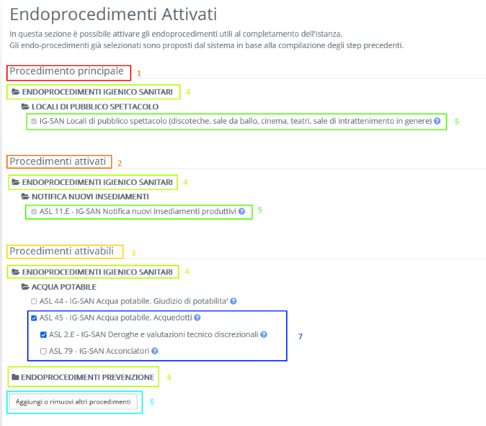
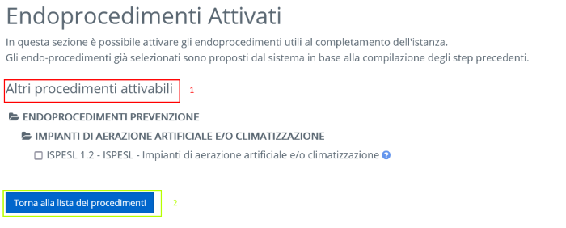
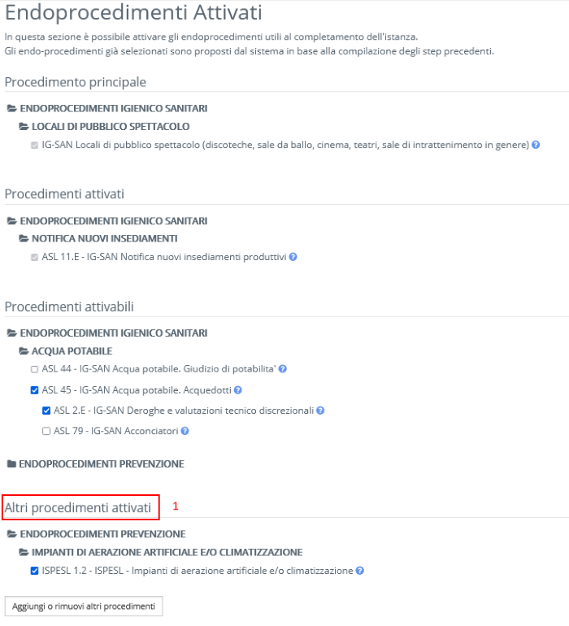
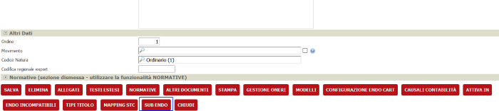
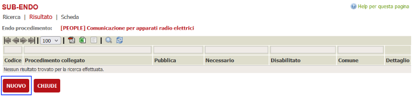
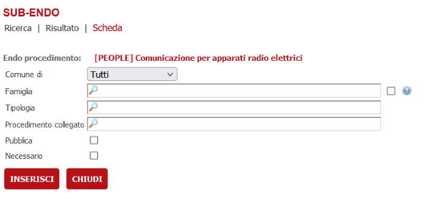

# GestioneEndoV2.aspx

## Path: ~/reserved/inserimentoistanza/GestioneEndoV2.aspx

Fig. 1

Fig. 2

Fig. 3

## Lista parametri

### TitoloEndoPrincipale [System.String]

Titolo della sezione "Endo principale" (Fig.1, sezione 1)

### TitoloEndoAttivati [System.String]

Titolo della sezione "Endo attivati" (Fig.1, sezione 2)

### TitoloEndoAttivabili [System.String]

Titolo della sezione "Endo attivabili"  (Fig.1, sezione 3)

### MostraFamiglieEndo [System.Boolean]

Se impostato a true mostra l'albero degli endo a partire dalle famiglie (Default: true)  (Fig.1, sezione 4)

### ModificaProcedimentiProposti [System.Boolean]

Se impostato a true permette di modificare la lista degliendoprocedimenti proposti deselezionando gli endo spuntati di default (Default: false)  (Fig.1, sezione 5)

### TestoSezioneAltriEndo [System.String]

Titolo della sezione "Altri endoprocedimenti attivabili"  (Fig.3, sezione 1)

### TestoBottoneAltriEndo [System.String]

Testo del bottone "Altri endoprocedimenti"  (Fig.1, sezione 6)

### TestoBottoneTornaAListaEndoEndo [System.String]

Testo del bottone "Torna alla lista degli endoprocedimenti"  (Fig.2, sezione 2)

### TestoSezioneEditAltriEndo [System.String]

Titolo della sezione "Altri endoprocedimenti attivabili" (Fig.2, sezione 1)

### IgnoraIncompatibilitaEndoprocedimenti [System.Boolean]

Se impostato a true ignora eventuali incompatibilità tra gli endoprocedimenti selezionati (normalmente la verifica della compatibilità viene delegata ad un altro step) (Default: true)

### SelezionareAlmenoUnEndo [System.Boolean]

Se impostato a true è obbligatorio selezionare almeno un endoprocedimento della lista per poter proseguire allo step succcessivo (Default: false)

### MessaggioErroreSelezionareAlmenoUnEndo [System.String]

Testo dell'errore da mostrare se nella lista degli endo non è stato selezionato nessun endo. Dipende dal parametro "SelezionareAlmenoUnEndo" (Default: Selezionare almeno un elemento della lista)

### SelezioneEsclusivaEndoAttivabili [System.Boolean]

Se impostato a true è possibile selezionare un solo endo per volta. La selezione di un endo deselezionerà altri endo già selezionati

## Gestione sub procedimenti

Se un endo ha dei subprocedimenti configurati questi verranno mostrati sotto l'endoprocedimento stesso (Fig. 1, sezione 7).
Selezionando un subprocedimento senza selezionare un endoprocedimento verrà selezionato automaticamente anche l'endoprocedimento di riferimento.
Deselezionando un endoprocedimento con subprocedimenti ne verranno deselezionati tutti i subprocedimenti.

Un subprocedimento si comporta esattamente come un normale endoprocedimento durante il flusso di presentazione domanda quindi potrà avere collegati allegati o schede dinamiche.

### Configurazione dei sub procedimenti nel backoffice

Dalla pagina di dettaglio di un endoprocedimento fare click su "Sub endo" per accedere alla lista dei sub endo collegati all'endoprocedimento.

Fare click su "Nuovo" per aggiungere un nuovo sub procedimento.

Se si sta lavorando su un installazione multicomune allora un sub endo può essere associato anche ad un singolo comune dell'associazione.
Lasciando la voce "Comune di" su "Tutti" il sub endo verrà utilizzato da tutti i comuni dell'associazione.

Il flag "Pubblica" permette di gestire la visualizzazione o meno del sub endo nel frontoffice.

Il flag "Necessario" forza la selezione del sub endo nel frontoffice. Nel caso in cui il flag necessario sia impostato allora nell'area riservata il sub endo sarà sempre attivato qualora venga attivato l'endoprocedimento a cui fa riferimento
