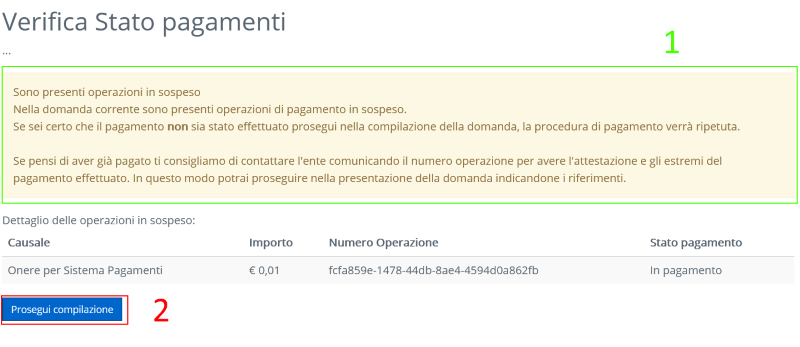
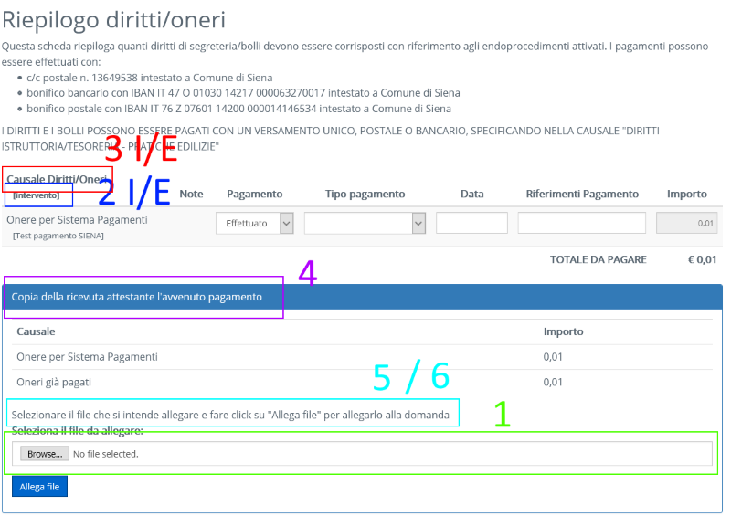
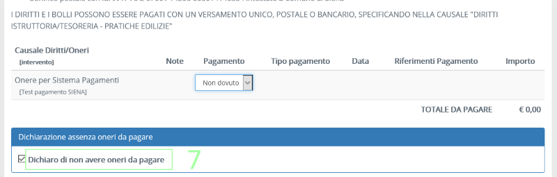

# Configurazione dei pagamenti tramite nodo pagamenti generico
Questa configurazione permette di attivare i pagamenti on line utilizzando il nodo di pagamenti generico di backend.

Gli steps che permettono di gestire il pagamento sono:

-  ~/reserved/inserimentoistanza/pagamenti/VerificaStatoPagamentiNodoPagamenti.aspx
-  ~/reserved/inserimentoistanza/pagamenti/GestionePagamentiNodoPagamenti.aspx
-  ~/reserved/inserimentoistanza/pagamenti/PagamentoNodoPagamenti.aspx

Vedi la sezione [Configurazione dei pagamenti on line](../../README.md) per informazioni generali sui singoli step

## Properties degli step
### VerificaStatoPagamentiNodoPagamenti.aspx

-  MessaggioErrore (1): Messaggio di errore da mostrare all'utente. 
-  TestoBottoneProcedi (2): Testo del bottone che permette di annullare il pagamento e procedere. 

### GestionePagamentiNodoPagamenti.aspx

-  VerificaFirmaDigitaleBollettino (1): Se true effettua la verifica della firma digitale della ricevuta attestante il pagamento degli oneri (solo per oneri dichiarati "già pagati") 
-  EtichettaColonnaEndoprocedimento (2E): Etichetta da utilizzare per la colonna "Endoprocedimento"
-  EtichettaColonnaCausaleEndo (3E): Etichetta della colonna "Causale" per la tabella degli oneri endo
-  EtichettaColonnaIntervento (2I): Etichetta da utilizzare per la colonna "Intervento"
-  EtichettaColonnaCausaleIntervento (3I): Etichetta della colonna "Causale" per la tabella degli oneri intervento
-  TitoloCaricamentoBollettino (4): Titolo del blocco caricamento bollettino
-  DescrizioneCaricamentoBollettino (5): Testo interno della sezione di caricamento bollettino 
-  DescrizioneCaricamentoBollettinoEffettuato (6): Testo mostrato nel momento in cui il bollettino è stato caricato

-  TestoDichiarazioneAssenzaOneri (7): Testo da mostrare nel box "Dichiaro di non avere oneri da pagare"

### PagamentoNodoPagamenti.aspx
Non ha parametri specifici

## Altre dipendenze
Dipende dalla verticalizzazione NODO_PAGAMENTI.

I parametri utilizzati sono:

- URL_WS: Url dei servizi del nodo pagamenti
- AR_COD_FISC_ENTE_CREDITORE: Codice fiscale ente creditore da utilizzare per l'area riservata
- AR_URL_BACK: Url a cui ritornare quando si annulla un pagamento o quando si fa click su "indietro nel sistema di pagamento"
- AR_URL_RITORNO: Url di ritorno al termie della procedura di pagamento
- ID_MODALITA_PAGAMENTO: fk su TIPIMODALITAPAGAMENTO, id della modalità di pagamento da impostare a pagamento completato

