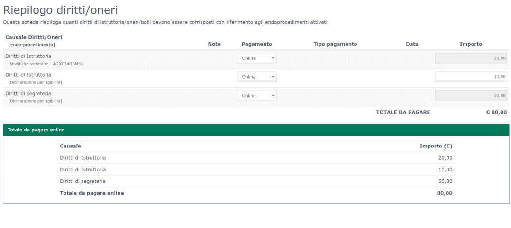
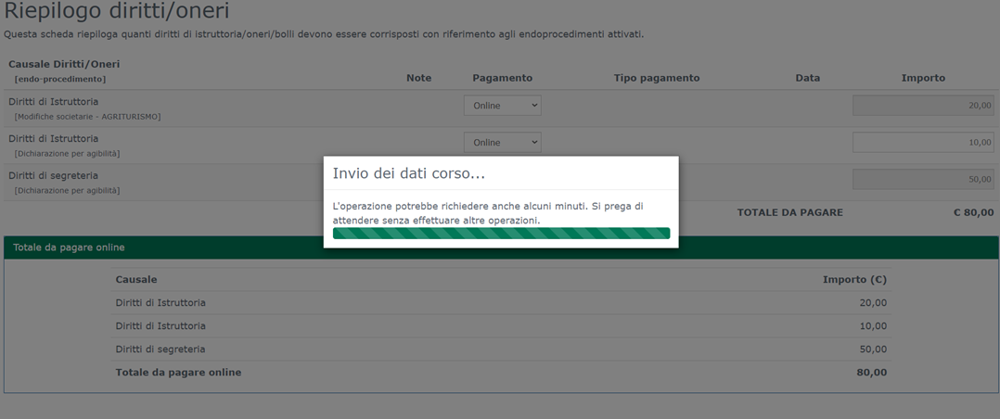
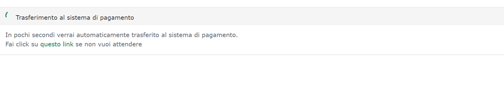
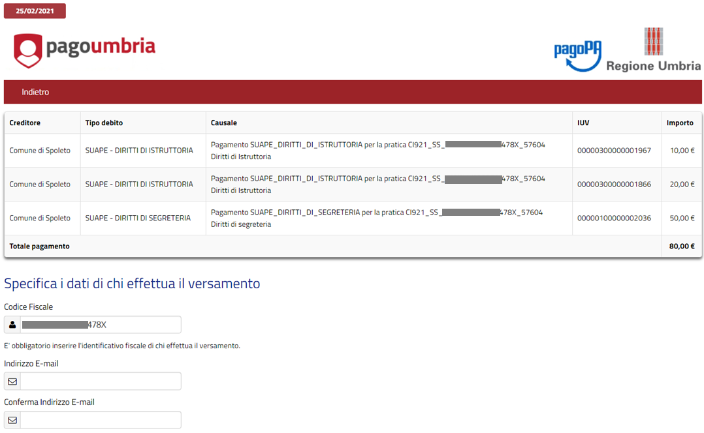
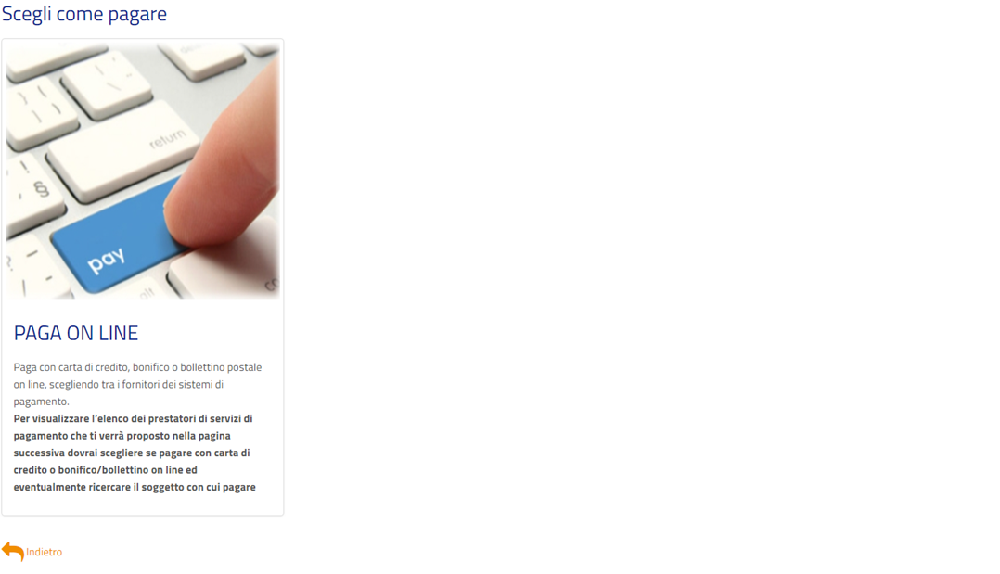
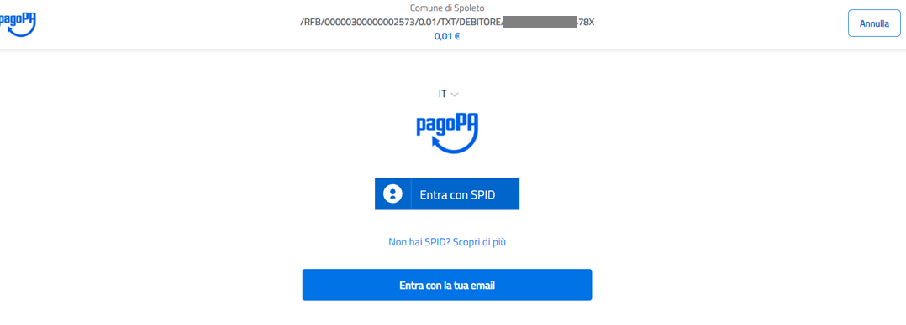
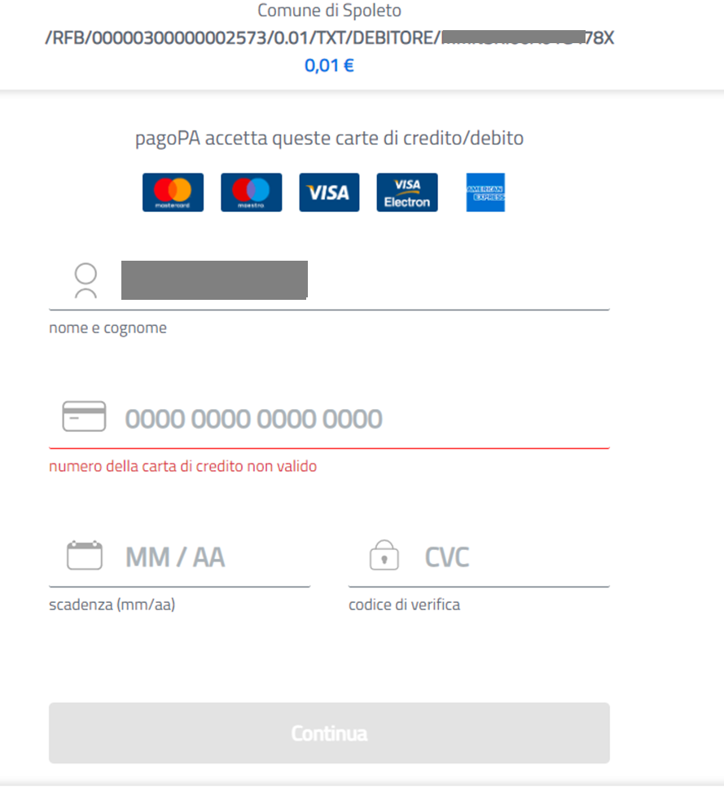
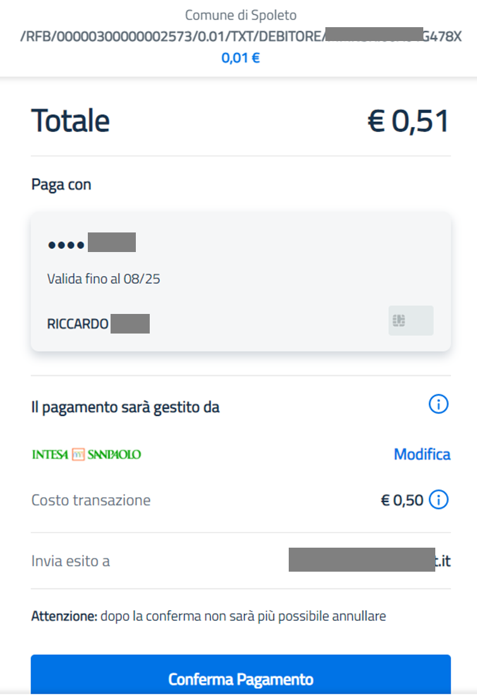
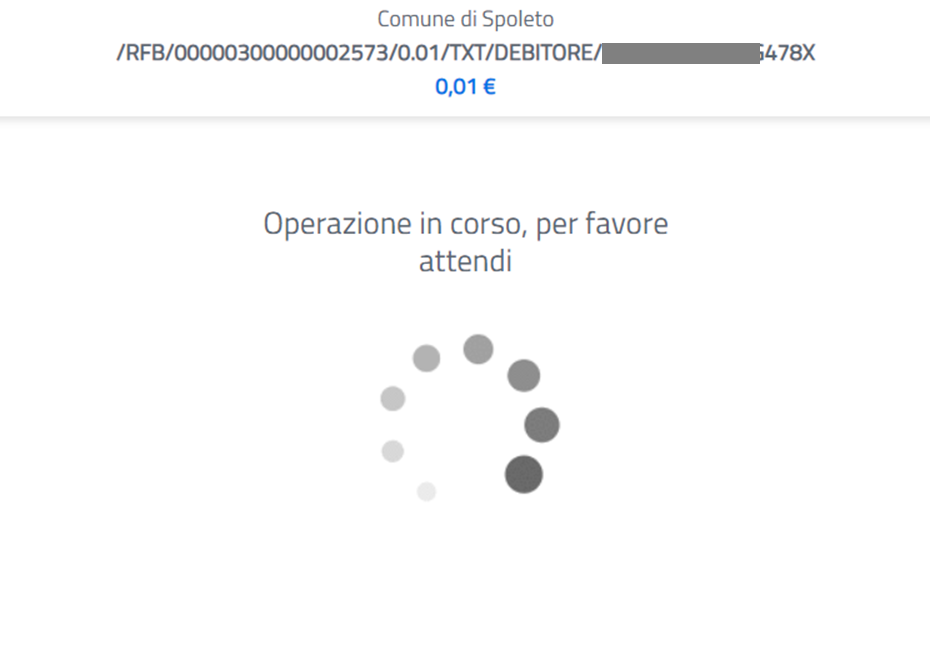
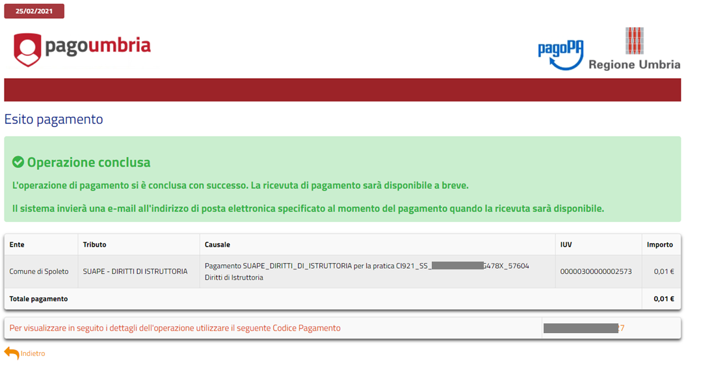

# Manuale utente pagamento oneri PagoPa
Il seguente documento descrive i passaggi che l'utente incontrerà durante la compilazione della domanda online quando il portale è abilitato ai pagamenti PagoPa.

Durante il flusso di compilazione, a seconda degli interventi e configurazioni attivate, l'utente si troverà al passaggio dei pagamenti descritto qui in seguito.

## Riepilogo oneri da pagare
L'utente si ritrova a pagare le pendenze calcolate dal sistema come da immagine che segue

È possible segnare ogni pendenza predisposta a video come pagamento **Online** oppure come **Non dovuto** nel caso l'utente ritenga che l'importo non sia dovuto. 

In questo caso l'utente viene invitato caricare un documento che attesti il motivo del non pagamento.

Confermando le operazioni l'utente viene rediretto al portale di pagamento  e si troverà di fronte alle seguenti schermate

> 

> 

## Step pagamento su portale **PAGOUMBRIA**

In questo passaggio l'utente deve compilare le informazioni della mail e cliccare sul riquadro **PAGA ONLINE** 
> 
> 

## Step pagamento PAGOPA
Questa è la sezione che permette di effettuare il vero e proprio pagamento su **PagoPA**
in questo passaggio l'utente dovrà decidere se accedere con SPID o con la sua mail.
>

a seguito dell'autenticazione sarà invitato a impostare i dati di pagamento.

>

e a confermare il pagamento 
>

# Esito dei pagamenti
Dopo aver confermato i pagamenti l'utente si troverà queste schermate

>

Conferma su pagoumbria
>

e la conferma nella pratica in compilazione 
>

Se il pagamento è effettuato con successo l’utente potrà proseguire con la compilazione della pratica. L’attestazione di pagamento sarà acquisita dal sistema e non sarà necessario inviare ulteriori informazioni – ad esempio le ricevute acquisite via mail - sul pagamento effettuato.
Si consiglia di conservare le email del pagamento effettuato.
