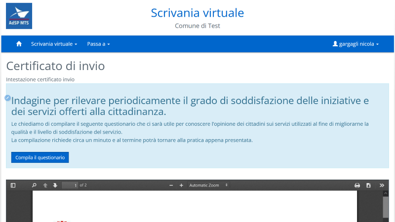
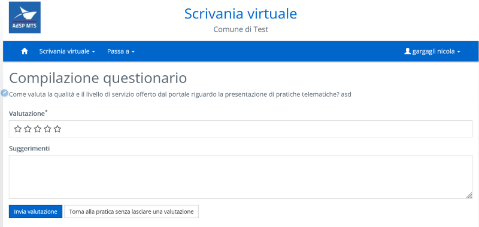
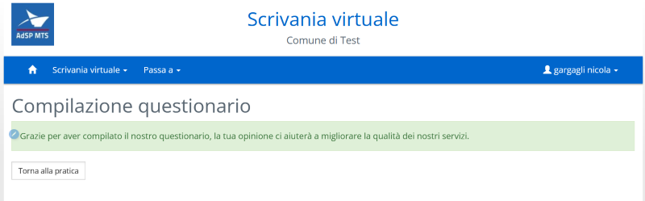

# Questionario di gradimento del servizio

Il questionario di gradimento permette all'utente di esprimere un parere sul servizio di presentazione delle pratiche.

## Attivazione

Per attivare la compilazione del questionario di gradimento occorre attivare il parametro **QUESTIONARIO_FO_ATTIVO** (impostare il valore a 1) della verticalizzazione **AREA_RISERVATA**.

Una volta attivato al termine della presentazione della domanda verrà richiesto all'utente di compilare il questionario

Al click su **Compila questionario** l'utente verrà portato nella pagina di compilazione dove potrà esprimere un voto sul servizio (da 1 a 5) e inviare consigli (max 4000 caratteri)

Da qui l'utente può decidere di ritornare alla pratica (**Torna alla pratica senza lasciare una valutazione**) oppure inviare la valutazione (**Invia valutazione**).

Una volta registrata la valutazione verrà mostrata una pagina di ringraziamento e da qui l'utente potrà tornare al dettaglio della pratica (**Torna alla pratica**)

## Personalizzazione dei testi

I testi personalizzabili dagli utenti tester sono:

- Certificato di invio: testo mostrato nell'alert azzurro in cui si chiede all'utente di compilare il questionario ( **LAYOUTTESTI-> AREA_RISERVATA.certificato-invio.questionario.label**)
- Pagina di compilazione: descrizione della pagina ( **LAYOUTTESTI-> AREA_RISERVATA.questionario.titolo-pagina** )
- Pagina di ringraziamento: testo del messaggio di ringraziamento ( **LAYOUTTESTI-> AREA_RISERVATA.questionario.titolo.compilazione-completata** )
