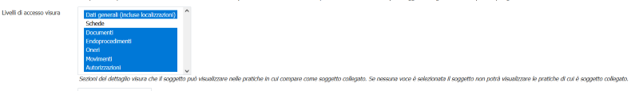
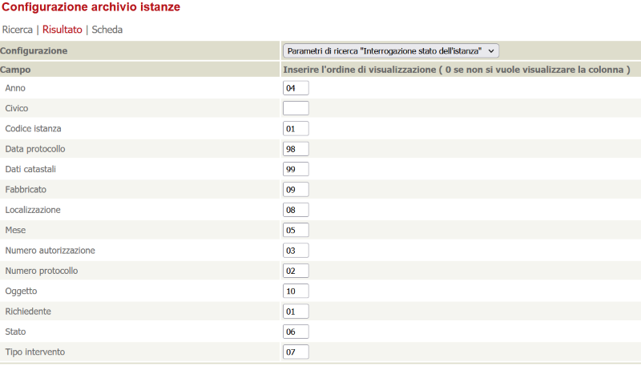
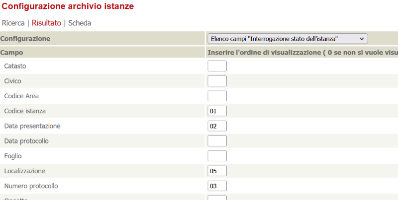
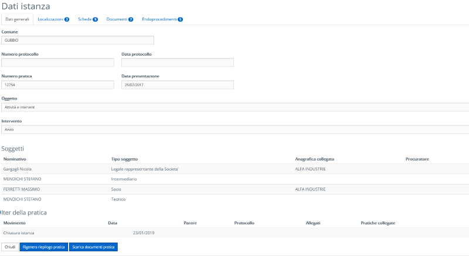
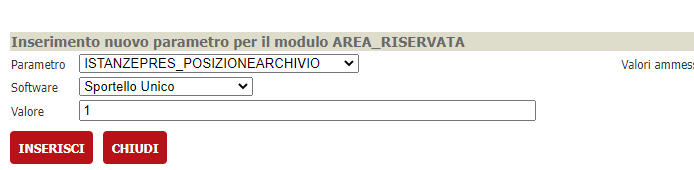
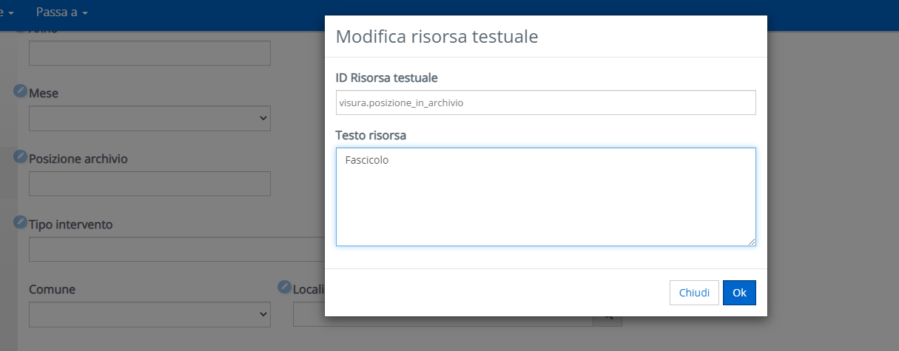
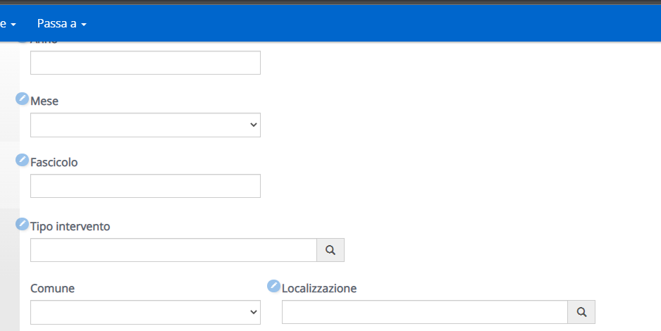
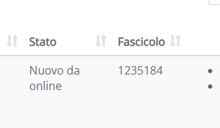
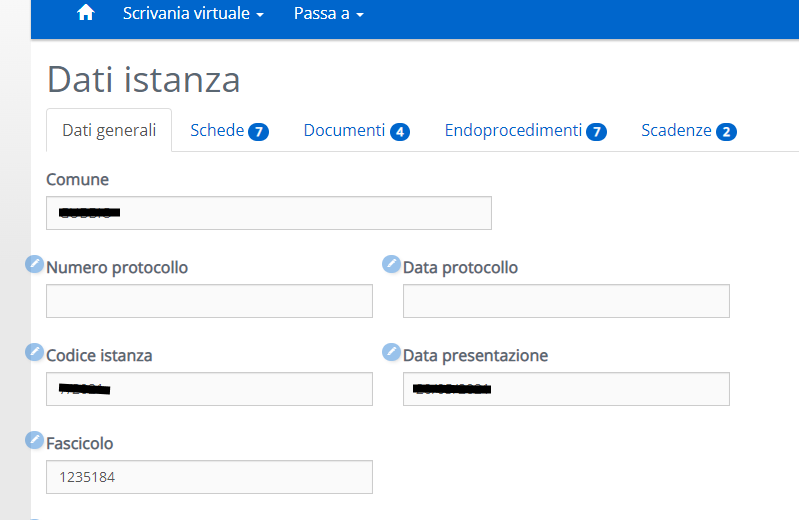

# Visura pratiche (Le mie pratiche)

Per accedere alla visura pratiche impostare nel menu.xml un link alla pagina ~/AreaRiservata/Reserved/IstanzePresentate.aspx

## Chi può accedere alla visura di una pratica

Al netto dei filtri impostati in fase di ricerca potranno accedere alla visura

- Il richiedente della pratica
- Il tecnico della pratica
- Qualunque soggetto della pratica che nel relativo tipo soggetto abbia almeno un elemento voce selezionato alla voce "Livello di accesso visura" (vedi gestione tipi soggetto del BO)

  

## Gestione filtri

I filtri visualizzati nell'area riservata sono configurabili tramite il BO alla voce "Configurazione"->"Frontoffice $SOFTWARE"->"Dati archivio istanze FO" (o tramite l'url ~/backoffice2/cl_ConfigurazioneFOListaIstanze.asp?software=XXXX).
Da qui selezionando la voce "Parametri di ricerca 'Archivio istanze presentate'"  sarà possibile configurare quali campi visualizzare e il relativo ordine.

ATTENZIONE! Se non si vuole visualizzare una determinata voce lasciare vuoto il campo "Inserire l'ordine di visualizzazione" (non impostarlo a 0 come dice la descrizione)

## Gestione campi lista

I campi visualizzati nella lista si configurano in maniera analoga ai campi di ricerca ma bisogna selezionare nella prima tendina "Elenco campi 'Archivio istanze presentate'"

## Visualizzazione dettaglio

Nel dettaglio visura la visibilità delle informazioni dipende dal ruolo che ha l'utente loggato all'interno della pratica.

Se l'utente è richiedente o tecnico allora vedrà la visura completa

Se l'utente è un soggetto collegato con permessi di visura allora vedrà solamente le linguette configurate nel relativo tipo soggetto tramite la voce "Livello di accesso visura" del menù Tipi soggetto del BO

### Posizione archivio

E' possibile, dalla versione di VBG 2.95 in poi, mostrare o nascondere il campo "Posizione archivio" dell'istanza attraverso il parametro **ISTANZEPRES_POSIZIONEARCHIVIO** della verticalizzazione **AREA_RISERVATA**

E' inoltre possibile personalizzare l'etichetta accedendo alla pagina nell'area riservata come utente tester e cliccando sull'etichetta stessa;

la modifica verrà contestualmente applicata nella ricerca delle pratiche

nella lista delle pratiche

 e nel dettaglio di una pratica

