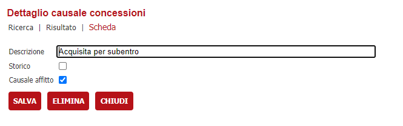
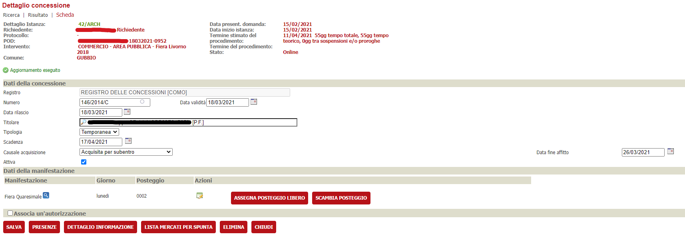
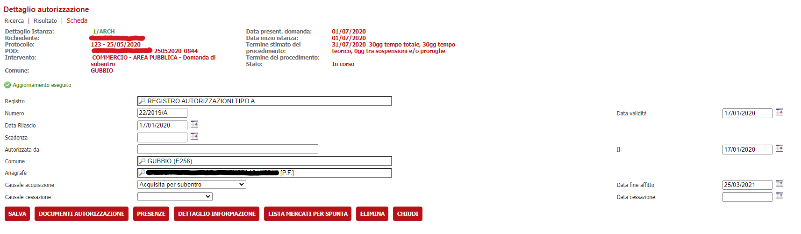

# Gestione affitto

## Introduzione

È stata introdotta la possibilità di identificare una causale di concessione come causale di affitto introducendo un flag per identificare come tale una causale e con la possibilità di impostare una data di scadenza affitto sempre per tali causali.
## Configurare una causale concessione come di affitto
 
È possibile identificare le causali concessione di acquisizione come causali di affitto accedendo al dettaglio causale oneri e spuntando il flag __Causale Affitto__.

## Implementazione dati concessione

Se è stato selezionato il flag __Causale Affitto__ nel dettaglio della causale onere, comparirà la data fine affitto nei dati della concessione, in cui è possibile selezionare tale data. 

Impostare la data e salvare per rendere effettiva la scelta.

## Implementazione dati autorizzazione

Analogamente a quanto fatto in precedenza, se è stato selezionato il flag __Causale Affitto__ nel dettaglio della causale onere, comparirà la data fine affitto nei dati dell'autorizzazione, in cui è possibile selezionare tale data. 

Impostare la data e salvare per rendere effettiva la scelta.