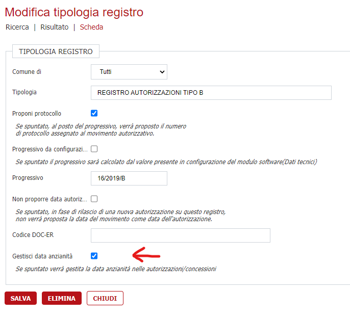
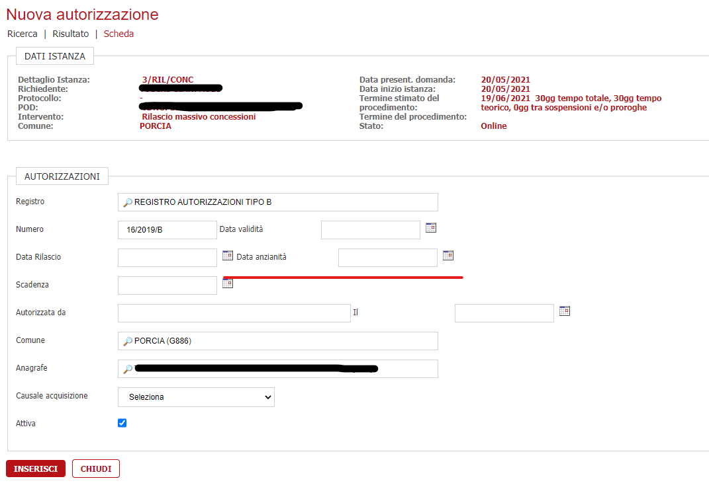
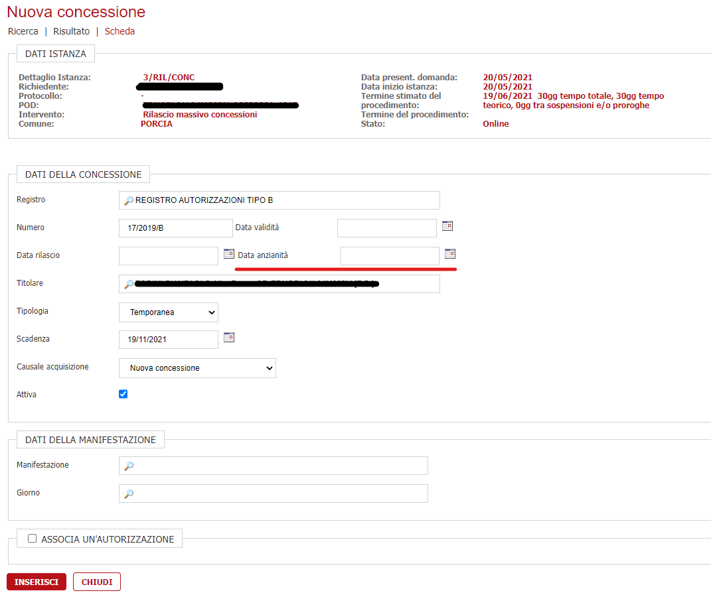
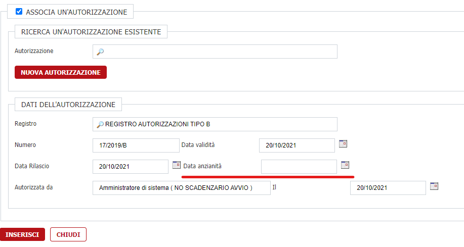

# Gestione data anzianità

## Introduzione

È stata introdotta la possibilità di gestire la data di anzianità per le autorizzazioni/ concessioni.

## Configurazione

Accedere a "Archivi -> Archivi {software} -> Tabelle -> Tipologia registri" per configurare se una determinata autorizzazione deve gestire o meno la data di anzianità; bisognerà selezionare o meno il relativo flag

## Autorizzazioni

Durante la creazione di una nuova autorizzazione, se il registro scelto è stato configurato per gestire la data anzianità, comparirà il campo "Data anzianità" come in figura sottostante.

## Concessioni

Durante la creazione di una nuova concessione, se il registro scelto è stato configurato per gestire la data anzianità, comparirà il campo "Data anzianità" come in figura sottostante.

Inoltre, se si vuole associare un'autorizzazione alla concessione nel pannello in fondo alla pagina, il comportamento sarà lo stesso delle "Autorizzazioni".

## Graduatoria spuntisti

Nel recuperare la lista della graduatoria spuntisti verrà tenuto conto anche della data anzianità nell'ordinare tale lista.
