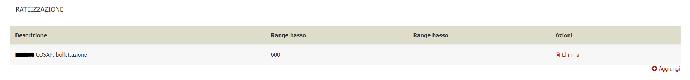
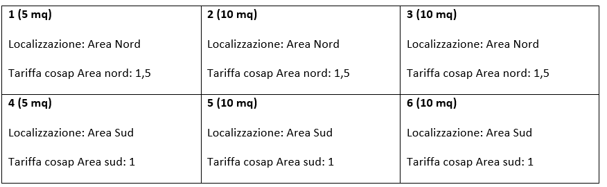
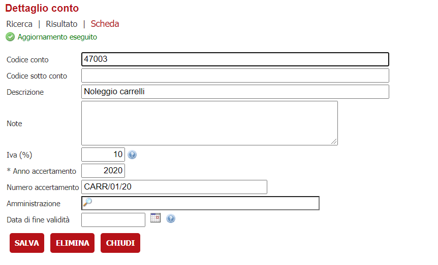
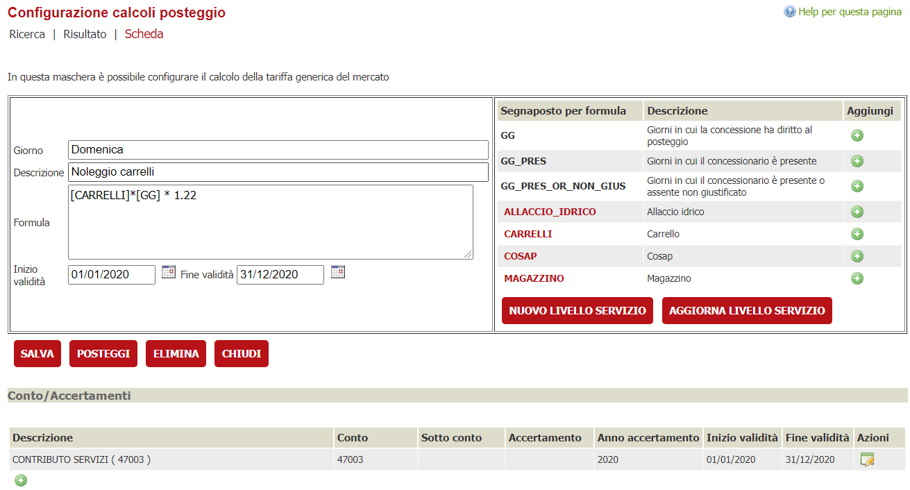
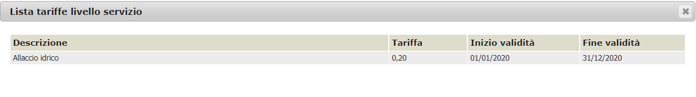
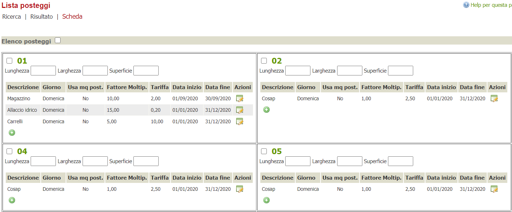
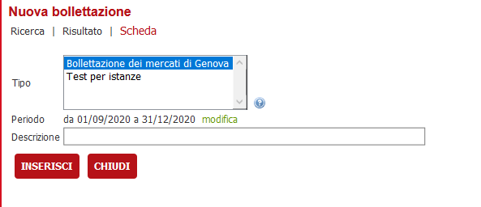
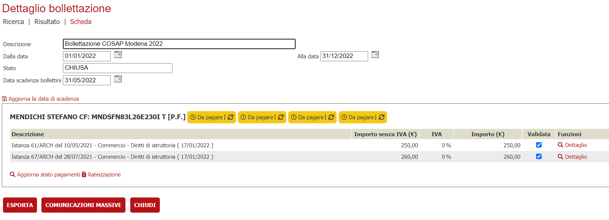
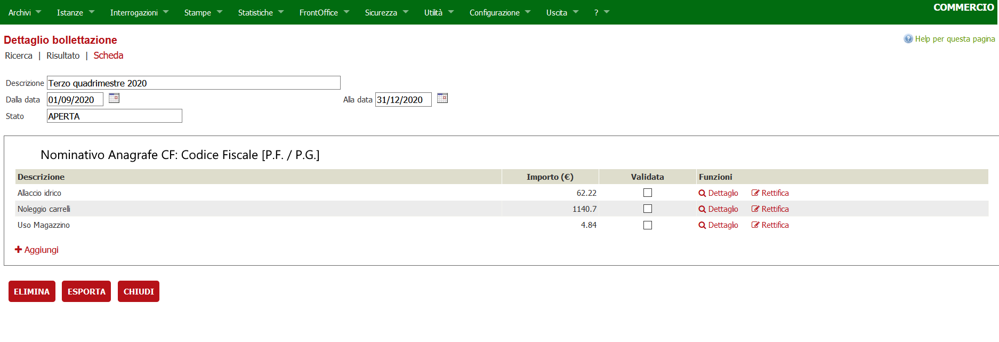

# Bollettazione

## Introduzione
Il presente documento descrive le modifiche per gestire la bollettazione nell’applicativo di backoffice.
L'esigenza della bollettazione nasce da diverse realtà, ad esempio pagamento su occupazione di posteggi di mercato, canoni demaniali, sanzioni amministrative, occupazione suolo pubblico, ecc.… e quella che si va a descrivere è una funzionalità che dovrebbe servire a gestire svariate esigenze.

La bollettazione di solito esita nell’invio di informazioni strutturate a sottosistemi di pagamento che poi sono delegati a produrre avvisi e file e notifiche tramite diversi canali.
Al momento gli oggetti principali oggetto di bollettazione sono gli oneri delle istanze, e le occupazioni dei posteggi da parte dei concessionari. In futuro potrebbero essere altri oggetti da modellare (es. autorizzazioni, concessioni demaniali). Gran parte comunque delle informazioni presenti nell’applicativo sono rappresentate dagli oneri delle istanze.

Gli oggetti degli oneri istanza copriranno i casi d’uso di:
-	Provincia di Pisa COSAP
-	Città metropolitana di Torino COSAP
-	Firenze Sanzioni

Gli oggetti dei posteggi/mercati il caso d’uso
-	Comune di Genova

La funzionalità Bollettazione è composta da una sezione di configurazione e dalla sezione operativa.

Nella configurazione si impostano i parametri di sistema, quali la tipologia di bollettazione (ad oggi possibili algoritmi di calcolo per Mercati o Istanze) o altri filtri.
Nella sezione operativa vengono prodotti i risultati dell'elaborazione dei due algoritmi principali e vi è data la possibilità di inviare al sosttosistema di pagamento implementato le righe ottenute.

Al momento sono previsti due algoritmi di calcolo per creare le varie bollettazioni:

1. **Algoritmo dei mercati**: Questo algoritmo è usato per generare la bollettazione relative ai canoni delle concessioni e costi dei servizi dei concessionari di posteggio.
1. **Algoritmo delle istanze**: Questo algoritmo viene usato per recuperare i dati della bollettazione dagli oneri non pagati delle istanze

Ogni algoritmo ha delle logiche particolari, che verranno descritte più avanti, per recuperare le informazioni contabili che comporranno le varie voci della bollettazione.

## Configurazione

### Tipi di bollettazione
La funzionalità è raggiungibile dal menù
Archivi --> Archivi < modulo software > --> Bollettazione
Alla creazione di una nuova tipologia di bollettazione verrà presentata una maschera di questo tipo 

dove sarà chiesto di immettere i valori relativi a
- Descrizione

    Il nome che avrà quella tipologia di bollettazione

-   Prevede conguaglio

    Specifico per l'implementazione dei **Mercati**, se spuntato viene ricalcolato anche il conguaglio sul periodo precedente

-   Raggruppa pagamenti per l'utenza

    Le posizioni debitorie vengono inviate uno per anagrafe individuata (al momento è l'unica implementazione)

- Implementazione di calcolo **Istanze** o **Mercati**

    Decide se recuperare le informazioni della bollettazione dagli oneri dell'istanza o dalle configurazioni dei mercati/concessioni

-  Tipologia di Scadenza della bollettazione (Vedi tabella `TIPI_SCADENZA`)

    Imposta la data di scadenza della bolletta a partire dal periodo di riferimento scelto
    - Fine Mese
    - 15 del mese successivo
    - Scadenze periodiche fisse
    - ....

- Periodi di bollettazione

    viene impostata la cadenza di bollettazione e decide le date inzio / fine di recupero della bollettazione
    - Mensile
    - Bimestrale
    - Trimestrale
    - ...

- Scadenza periodo

    Specificabile nel formato "DD/MM", comparirà solamente selezionando "Scadenze periodiche fisse" nel parametro "Calcola data scadenza".
    Viene utilizzata come data scadenza ( insieme all'anno corrente ) nella bollettazione. Se è prevista una rateizzazione, questo parametro
    indicherà comunque la data di scadenza per tutti gli importi che non sono soggetti a rateizzazione ( ad esempio se si rateizzano gli importi 
    superiori a 500€, quelli inferiori avranno la data di scadenza presa dalla bollettazione ed eventualmente impostata da questo paraametro )

-   Ignora subentri

    VALIDO Solo per **Mercati**. In questo caso durante la creazione della bollettazione verrà creata la posizione debitoria al titolare della concessione, indipendentemente dai vari subentri susseguitisi

-   Titolarità della concessione

    VALIDO Solo per **Mercati**. Indica l'anagrafica destinataria della bollettazione. 
    
    È possibile specificare i seguenti valori
    - Al primo concessionario del periodo
    - All'attuale concessionario
    - In base alle presenze / assenze ingiustificate fatte

-   Richiesta Fattura

    Impostazione per quei connettori che implementano la generazione della fattura (al momento non utilizzato)

##### Rateizzazione
E' possibile indicare un range di rateizzazione che sarà applicato automaticamente, in fase di invio al nodo dei pagamenti, 
sugli importi ( ad esempio tutti gli importi sopra i 500€ saranno soggetti a rateizzazione ). 
La configurazione delle rate ( quante rate, con che frequenza, ... ) viene effettuata attraverso la voce di menu Archivi --> Archivi < modulo software > --> Gestione oneri --> Tipi rateizzazioni;
una volta configurate è possibile richiamarle all'interno della configurazione della bollettazione

##### Ruoli e Permessi
È possibile associare delle tipologie di bollettazione a dei ruoli utente per restringere l'accesso a determinati operatori configurati con quei ruoli.

Una volta inserita la tipologia di bollettazione è possibile associare i ruoli a questa tipologia. È necessario preventivamente aver configurato opportunamente la funzionalità dei ruoli.

##### Filtri aggiuntivi per Mercati
Nel caso di implementazione dei **Mercati** viene data la possibilità di specificare per quali mercati è valida la bollettazione. 
In questo caso le righe di bollettazione verranno recuperati per i mercati configurati

##### Filtri aggiuntivi per istanze
Nel caso di implementazione per le **Istanze** viene data la possibilità di configurare eventuali causali oneri utili per i filtri su istanzeoneri

### Configurazione mercati
La funzionalità verrà spiegata attraverso:
1.	Introduzione del concetto di livello di servizio presente in un mercato
2.	Introduzione al concetto di formula per il calcolo del costo di un posteggio
3.	Introduzione alla configurazione della "bollettazione" in un mercato/posteggio
4.	Introduzione a best practices per il mantenimento della configurazione nel tempo

> **Nota**
>
> Quando nel documento parleremo di mercato faremo sempre riferimento all’informazione Mercato – Giorno.  Es. Se il mercato del pesce si svolge nelle giornate del martedì e del venerdì, >  la parola mercato starà ad indicare   1.	Mercato del pesce del martedì   2.	Mercato del pesce del venerdì

#### Livello dei servizi
È un’entità fisica o astratta che appartiene al mercato e che può essere applicata a tutti o ad un sottoinsieme dei posteggi dello stesso e può o non può avere una durata temporale predefinita. La presenza di uno o più livelli di servizio associati ad un posteggio ne determina il suo costo giornaliero. Per la determinazione del valore di un livello di servizio avremo due parametri:

1.	Tariffa giornaliera del livello di servizio  Definito a livello di **Mercato**
2.	Fattore moltiplicativo della tariffa Definito a livello di **Posteggio**

>  **nota**
>  Nel documento la dicitura di “Livello di servizio” può essere abbreviato con la parola “servizio”

La moltiplicazione tra Tariffa e Fattore Moltiplicativo definisce il Costo

> **Costo servizio = Tariffa x Fattore Moltiplicativo**

Il costo totale di un posteggio sarà dato da una combinazione matematica, detta FORMULA, del costo dei singoli servizi attivi.

_Ad ogni servizio verrà associato un segna posto univoco che verrà utilizzato nella formula._

> **Costo posteggio = Exp (CostoServizio 1, CostoServizio 2,  …., CostoServizio N)**

Il concetto di formula verrà discusso e spiegato nel paragrafo successivo.

Alcuni esempi per definire operativamente il "Livello di servizio2":

##### Livello Servizio ASTRATTO
Un esempio di livello di servizio astratto può essere una tassa da pagare perché si possiede una specifica concessione su un particolare posteggio, ad esempio, la COSAP.
Il sistema avrà configurato:

|Livello configurazione	|	Valore|	Unità misura|	Descrizione|
|---------|---------|---------|---------|
|Mercato	|	2,5 |	euro            |Tariffa giornaliera in euro|
|Posteggio	|	20  |	mq              |	Fattore moltiplicativo sono i mq del posteggio|
|		    |       |Costo servizio/gg	|50 euro|
|		    |       |	Segnaposto	    |COSAP|

##### Livello Servizio FISICO

Si può definire un Livello di servizio fisico (alcuni esempi):

1.	Un particolare spazio del posteggio: magazzino, banco vendita, cella frigorifera
2.	Una tipologia di vendita: fiori, carne, oggettistica
3.	Un servizio: allaccio servizio idrico, allaccio servizio elettrico
4.	Presenza di carrelli

Vediamo un esempio di configurazione di un posteggio di 20 mq che vende fiori:

1.	Costo magazzino 2 euro/gg per mq (5mq)
2.	Costo banco vendita 1 euro/gg per mq (15mq)
3.	Costo banco fiori 20 euro/gg
4.	Costo carelli 0,5 euro/carrella (n. 10)

_**Servizio magazzino**_

|Livello configurazione| Servizio	|	Valore|	Unità misura|	Descrizione|
|---------|------------------|---------|---------|---------|
|Mercato    | magazzino	|	2 |	euro            |Tariffa giornaliera in euro|
|Posteggio	| magazzino     |	5 |	mq              |	Fattore moltiplicativo sono i mq del posteggio|
|		    |               |     |Costo servizio/gg	|10 euro|
|		    |               |     |	Segnaposto	    |TIPOLOGIA_SPAZIO|

_**Servizio Banco vendita**_

|Livello configurazione| Servizio	|	Valore|	Unità misura|	Descrizione|
|---------|------------------|---------|---------|---------|
|Mercato    | Banco vendita	|	1   |	euro            |Tariffa giornaliera in euro|
|Posteggio	| Banco vendita |	15  |	mq              |	Fattore moltiplicativo sono i mq del posteggio|
|		    |               |       |Costo servizio/gg	|15 euro|
|		    |               |       |	Segnaposto	    |TIPOLOGIA_SPAZIO|

_**Servizio Vendita fiori**_

|Livello configurazione| Servizio	|	Valore|	Unità misura|	Descrizione|
|---------|------------------|---------|---------|---------|
|Mercato    | Vendita fiori	|	20   |	euro            |Tariffa giornaliera in euro|
|Posteggio	| Vendita fiori |	1  |	Valore assoluto              |	Valore assoluto il costo del banco fiori è 20 euro al giorno quindi moltiplico |
|		    |               |       |Costo servizio/gg	|20 euro|
|		    |               |       |	Segnaposto	    |MERCE_VENDUTA|

_**Servizio Carrelli**_

|Livello configurazione| Servizio	|	Valore|	Unità misura|	Descrizione|
|---------|------------------|---------|---------|---------|
|Mercato    | Carrelli	|	0,5   |	euro            |Tariffa per ogni carrello|
|Posteggio	| Carrelli |	10  |	Num carrelli              |	|
|		    |               |       |Costo servizio/gg	|5 euro|
|		    |               |       |	Segnaposto	    |CARRELLI|

Il costo del posteggio giornaliero sarà dato dalla combinazione dei costi dei singoli servizi attivi, nel caso più semplice potrebbe essere dato dalla sommatoria dei costi.

------
**Formule di calcolo e costo posteggi**
Come esposto nel capitolo precedente, un posteggio può avere associati in un intervallo di tempo 0,..,N servizi, ogni servizio potrà avere un costo. La combinazione matematica di questi costi ci darà il costo giornaliero del posteggio. 
La formula nella sua espressione più generale avrà questa forma

> **Costo posteggio = exp1 (servizio1,..servizio2) + ,…,+ expN(servizio1,..servizio2)**

L'espressione precedente specifica che in un mercato il costo di un posteggio può essere dato dalla somma del risultato di più formule. Il caso si può verificare, ad esempio, quando gli oneri da pagare per un singolo posteggio afferiscono a competenze/uffici/conti differenti. Facciamo un esempio; supponiamo che il costo del posteggio sia composto da due voci di costo:

1.	Tariffa tipo posteggio afferente al sottoconto 001
2.	Tariffa servizi afferente al sottoconto 002	        

Avremo configurate sul mercato due formule:

1.	Costo Valore posteggio = exp(servizio1)
2.	Costo Valore servizio = exp(servizio2)
Questo tipo di configurazione ci permetterà di poter emettere o due bollette separate o un'unica bolletta dove verranno specificate le singole voci di costo.

Nella sezione di configurazione delle formule, oltre ai segnaposto definiti per i singoli servizi saranno presenti 3 segna posto comuni a tutti i mercati

|Segnaposto|Descrizione|
|---------|---------|
|**GG**                     | Giorni in cui la concessione ha diritto al posteggio |
|**GG_PRES**                |Giorni in cui il concessionario è presente|
|**GG_PRES_OR_NON_GIUS**    |Giorni in cui il concessionario è presente o assente non giustific|

Questi segna posto saranno utilizzati nelle formule per specificare i giorni per cui il concessionario deve pagare in un arco di tempo (esempio in un bimestre, trimestre, etc) 

> In questo paragrafo è stato introdotto il concetto di sottoconto, più in generale ad una formula sarà possibile associare: 
> 1.	Conto
> 2.	Sottoconto
> 3.	Accertamento
> Ad oggi questa informazione non ha una valenza operativa, ma solamente permette di specificare sulla bolletta la competenza del costo

-------
#### Casi d'uso
In questo paragrafo, tralasciando ancora le modalità di configurazione,
andremo a spiegare con casi reali come si combinano "Livello di servizio" e "Formule" per definire il costo di un posteggio.

**COSAP MERCATI MERCI VARIE GENOVA**
Supponiamo di avere un mercato con sei posteggi, l’unico "Livello di servizio" attivo è la Cosap che nel caso specifico varia a seconda della posizione del posteggio;
il costo in un certo intervallo di tempo di un posteggio sarà dato da:

> **Costo = Giorni mercato x Tariffa cosap x mq**
 
Tradotto nel linguaggio generico sarà

> **Costo = Giorni mercato x Tariffa servizio x fattore moltiplicativo**

Composizione mercato

Vediamo come dovrà essere scritta la formula nella configurazione del mercato:
 > Costo = GG x COSAP

Dove:
1.	**GG**: il segna posto che rappresenta il numero dei giorni in cui si è svolto il mercato nell’intervallo di tempo scelto 
2.	**COSAP**: rappresenta il segna posto del “Livello di servizio” che indica il costo del singolo servizio giornaliero (Tariffa servizio x fattore moltiplicativo)

Esempio di calcolo del sistema 
**Condizioni**: Intervallo di tempo 01/01 – 28/02 – Giorni mercato (GG) = 10
Costo posteggio 1 = 10 x (1,5 x 5) = 75
Costo posteggio 5 = 10 x (1 x 10) = 100

> **Nota**
> Il valore del segna posto verrà il calcolato dal sistema che, in base alla configurazione sa:
> 1.	Che per il livello di servizio cosap per il posteggio N la tariffa ha un certo valore (Posteggio 1 = 1,5)
> 2.	Che il fattore moltiplicativo per il posteggio N è pari ai mq (Posteggio 1 = 5)
> Secondo la formula = Tariffa Servizio x Fattore Moltiplicativo

**COSAP MERCATI MERCI VARIE GENOVA**

Il caso d’uso dei mercati coperti, più complesso ci permette di capire meglio oltre che il concetto di formula anche il collegamento 
con i sottoconti/accertamenti. In questo caso il costo del posteggio sarà dato da due tipi di tariffe (due formule) la cui somma definirà il costo totale.

> Costo tariffa posto = (Giorni Mercato x Tariffa Tipo Posto x MQ) X IVA

> Costo tariffa servizi = Giorni Mercato x Tariffa tipo vendita x MQ  x tariffa acqua x (quota fissa / numero operatori)

•	Il primo sarà associato al sottoconto 001
•	Il secondo sarà associato al sottoconto 002

Tradotto nel linguaggio generico avremo

> Costo tariffa posto = (Giorni mercato x Tariffa servizio x fattore moltiplicativo) x costante

> Costo tariffa servizio = (Giorni mercato x Tariffa servizio x fattore moltiplicativo x costante_1 ) x (costante_2/costante_3)

Composizione mercato

|Descrizione| valore|
|----|----|
|Tipo mercato                   | giornaliero|
|Iva (costante)			        |0,22|
|Tariffa acqua (costante_1)	    | 10 euro|
|Quota fissa (costante_2)	    |2 euro|
|Numero operatori (costante_3)	| 6 |
|TIPO_VENDITA - Fiori 		    | 1 euro|
|TIPO_VENDITA - Bar 		    | 5 euro|
|TIPO_POSTO – Magazzino	        | 1 euro|
|TIPO_POSTO – Bancone         	| 2 euro|

Vediamo come dovrà essere scritta la formula nella configurazione del mercato:
> Costo tariffa posto = (GG x TIPO_POSTO x fattore moltiplicativo) x 0,22

> Costo tariffa servizio = (GG x TIPO_VENDITA x fattore moltiplicativo x 10) x 2/6)

Per semplicità abbiamo configurato due tipologie di posti, vediamo come l’algoritmo calcolerà i costi nel primo bimestre dell’anno dal 01/01 al 28/02 (58 giorni)

**POSTEGGIO 1**

_Costo tariffa posto_ = (58 x 1 x 3) x 0,22 + (58 x 2 x 7) x 0,22

_Costo tariffa servizio_ = (58 x 5 x 10 x 10) x 2/6)

**POSTEGGIO2**

_Costo tariffa posto_ = (58 x 1 x 3) x 0,22 + (58 x 2 x 7) x 0,22

_Costo tariffa servizio_ = (58 x 5 x 1 x 10) x 2/6)

Il fatto di aver associato le formule a diversi sottoconti ci permetterà in fase di emissione di bolletta
 (in realtà il sistema non emette la bolletta, ma raccoglie le informazioni necessarie da inviare per la generazione) 
 di creare due bollette differenti per ogni costo o creare una però andando a specificare i due costi differenti e a quali conti/accertamenti appartengono.

I due casi esposti rispondono a due delle esigenze espresse dal comune di Genova, 
il primo riguarda una configurazione semplice di un servizio astratto (una tassa da pagare proporzionale ai mq del posteggio
) ed una seconda più complessa dove sono presenti sia servizi astratti (tassa sull’acqua) e servizi fisici (magazzino, bancone). 
Come vedremo nei paragrafi successivi la configurazione permetterà di configurare posteggio per posteggio e questo ci permetterà 
di aumentare la flessibilità per rispondere a diverse esigenze. Naturalmente più sarà puntuale la configurazione più il sistema perderà in manutenibilità. 

-------
#### Configurazioni applicative
##### **Conti**
La funzionalità conti permette di configurare le informazioni "contabili". Nella tabella conti vengono inserite quelle informazioni che permettono di legare un importo a degli accertamenti / conti di ragioneria.

È importante inserire le voci relative all'IVA che serviranno a scorporare le varie parti dell'importo.
#### Configurazioni costi mercati/posteggi
Il mercato va configurato preventivamente con la situazione dei posteggi, dei giorni di mercato.
All'interno della scheda di gestione di un mercato è presente un pulsante di funzionalità chiamato "CONF. COSTO POSTEGGIO" all'interno della quale è possibile configurare 
le varie formule per il calcolo dei posteggi come descritto nei paragrafi precedenti.

Per ogni giorno di mercato è possibile definire una serie di formule di calcolo, ognuna con le sue caratteristiche e date di validità.

La formula viene scritta utilizzando valori numerici e una lista di segnaposto definiti nella colonna a sinistra.

Ci sono dei segnaposto fissi e validi per tutti e dei segnaposto definibili (quelli evidenziati in rosso)
che ogni ente può definire a seconda dei servizi che gestisce (nel nostro caso ad esempio CARRELLI, MAGAZZINO, ecc...).

La formula sarà una espressione matematica, quindi può utilzzare i vari operandi 
> \+ \* \- \/ 
 valori numerici fissi (da ricordarsi che i valori decimali DEVONO essere espressi con il . punto) ed eventualmente parentesi per decidedre le precedenze delle operazioni.
  
Una volta definita una formula è necessario assegnagrli dei conti mediante la sezione **"Conto/Accertamenti"** presente nella pagina.

Il conto , definirà i valori di ragioneria quali anno accertamento, numero, codice conto/sottoconto ed IVA applicata alla formula. 
Anche questa assegnazione avrà una sua validità.

***Nuovo livello di servizio***
La funzionalità permette di creare nuovi valori da associare alle tipologie di servizio. 
Un livello di servizio è rappresentato da un segnaposto/etichetta - la tipologia di livello di servizio - una tariffa da applicare a questo livello di servizio e una data di validità dello stesso.

È possibile in questo modo associare tariffe diverse per diversi periodi dell'anno (ad esempio nel periodo natalizio la tariffa portebbe essere maggiorata oppure dopo eventi sfavorevoli potrebbe essere diminuita).

***Posteggi***
Mediante il pulsante *Posteggi* è possibile accedere alla verifica e confgurazione dei servizi per i posteggi.

È possibile definire per ogni posteggio i vari livelli di servizio che usano al fine di calcolarne correttamente gli importi in bollettazione.
Il pulsante ***\+*** consente di assegnare un livello di servizio al posteggio indicandone le date di validità ed eventualmente le quantità che 
possono essere espresse mediante un valore unitario "Fattore moltiplicativo", ad esempio numero dei carrelli utilizzati o utilizzando il valore in MQ della supeficie indicata nel posteggio.

## Gestione della Bollettazione
La funzionalità è raggiungibile dal menù **Utilità** --> **< modulo software >** --> **Bollettazione**, verrà presentata una maschera del genere.

Premendo l'icona per il dettaglio si aprirà una maschera con la funzionalità di visualizzare i dettagli di una bollettazione.

Il bottone "Nuovo" crea una bollettazione dai tipi di bollettazione già esistenti.

Nella maschera deve essere selezionato il tipo di bollettazione.

Si può anche modificare il periodo relativo alla bollettazione ( ma non le singole date ) e infine va indicata un descrizione arbitraria.

Cliccando il bottone **INSERISCI**, il sistema creerà la bollettazione seondo i criteri sotto indicati e ci mostrerà il dettaglio di quanto appena fatto:

* Indicando una tipologia di bollettazione riferita ai mercati, verranno prese in considerazione tutte le giornate ( per i mercati indicati come filtro nella configurazione della tipologia di bollettazione ) all'interno del periodo  indicato. I dati riportati in bollettazione riguardano sia le giornate svolte che quelle previste
* Indicando una tipologia di bollettazione riferita alle istanze, verranno presi in considerazione tutti gli oneri, collegati ad un conto, in scadenza nel periodo indicato. Non vengono considerati gli oneri già pagati, già bollettati oppure senza una data di scadenza

Inoltre, se la tipologia di bollettazione prevede il calcolo del conguaglio, verrà fatta una simulazione della bollettazione precedente ed eventuali differenze verranno riportate come righe di conguaglio in quella che si stà inserendo

### Dettaglio della bollettazione
Questa funzionalità ci permette di visualizzare i dettagli di una bollettazione come il periodo di validità e lo stato della bollettazione (APERTA / CHIUSA).
Inoltre sotto questi dettagli si presentano delle liste, raggruppate per anagrafe, riportanti:
* i costi totali degli oneri relativi a un'istanza raggruppati per conto ( se è stata indicata una tipologia di bollettazione legata alle istanze ) es.

* i costi totali ricavati dai livelli di servizio collegati ai posteggi delle concessioni ( se è stata indicata una tipologia di bollettazione legata ai mercati ).

L'icona "Aggiungi", presente in fondo ad ogni riquadro delle anagrafiche, apre un popup con i campi necessari per l'inserimento di una nuova riga; è un inserimento libero ( non legato a un posteggio o ad un'istanza ).

L'operazioni consetite per una riga inserita sono:
* Visualizzare i dettagli della riga 
* Rettificare l'importo di una riga ( vale solo per le righe calcolate dal sistema )
* Eliminare la riga inserita ( vale solo per le righe inserite manualmente )
* Validazione di una riga

E' inoltre possibile effettuare l'invio della bollettazione a sistemi di pagamenti

#### Visualizzare i dettagli di una riga

Premendo l'icona del dettaglio, si aprirà un popup con i dettagli come visti nella maschera.

Nella zona "Note Sistema" vengono riportate tutte le eventuali modifiche fatte alla riga.

#### Rettificare l'importo di una riga

Si può rettificare una riga di un anagrafe premendo l'icona relativa. Si aprirà un popup che permette di modificare l'importo.

Una volta rettificato l'importo quello vecchio verrà visualizzato barrato e sparisce il check validata, mentre su quella nuova apparirà l'icona di elimina.

#### Eliminare la riga inserita

Premendo elimina sulla nuova riga inserita verrà tolta dalla bollettazione. E' possibile eliminare solamene le righe aggiunte manualmente; le altre possono solamente essere rettificate

#### Validazione di una riga

Spuntando il flag "validata", la riga viene congelata ed è pronta per essere inviata al sistema dei pagamenti. Non è più possibile effettuare altre operazioni di modifica a meno che, tale flag non venga tolto

#### Invio a sistemi di pagamenti

Questa funzionalità si attiva solamente se è presente un'integrazione con un sistema di pagamenti e compare solamente quando tutte le righe di ogni anagrafica sono validate.
Apparirà, in fondo alla pagina, un bottone "INVIA A SISTEMA DI PAGAMENTI" per inviare le posizioni debitorie al nodo di pagamenti.

Se è stata configurata una rateizzazione, in questa fase verrà automaticamente applicata e passata al nodo dei pagamenti il quale provvederà a creare la posizione debitoria 
e le rate secondo le modalità previste dallo specifico connettore ( aluni connettori supportano la generazione dell'avviso unico PagoPA comprensiov di rate mentre altri connettori non lo supportano e generano tante posizioni debitorie distinte )

Dopo l'invio delle posizioni debotorie, la bollettazione non può esser più modificata/eliminata e comparirà  un'icona di stato accanto all'anagrafe

che mostrerà i seguenti stati:

* **Conclusa Positivamente**
    Quando la posizione debitoria viene pagata nel sistema dei pagamenti comparià un'icona verde 
* **Conclusa Negativamente**
    Se il pagamento di una posizione debitoria è stata annullato o comunque non è andata a buon fine nel sistema dei pagamenti, viene mostrata una icona rossa 
* **In Corso**
    Se la posizione debitoria è in attesa di pagamento o annullamento da parte del soggetto a cui è stata addebitata, viene mostrata un'icona gialla 

Cliccando su tali icone sarà possibile vedere un dettaglio con l'effettivo stato dell'operazione nel sistema dei pagamenti

## Comunicazioni della Bollettazione
La funzionalità della bollettazione prevede anche la possibilità di gestire delle comunicazioni digitali alle anagrafiche coinvolte nella bollettazione.

La funzionalità è raggiungibile dal seguente link 

La funzionalità è descritta nel seguente documento
[comunicazioni massive](./comunicazioni-massive.md)