# Gestione delle comunicazioni della Bollettazione
## Introduzione
A fronte dell'esigenza di poter comunicare con le anagrafiche coinvolte nella bollettazione è stata sviluppata la funzionalità di **comunicazioni massive della Bollettazione**.

Tramite questa è possibile generare tutta una serie di comunicazioni dirette alle anagrafiche che appartengono alle varie Bollettazioni.
Ogni comunicazione avrà una serie di configurazioni che permetterà di associare allegati alla comunicazione, eventualmente di farli firmare, di protocollarli ed infine di inviarli tramite un account specifico.

Per poter fare questo è necessario configurare la specifica comunicazione che si intende avviare. Ogni comunicazione avrà tutta una serie di passaggi per poter venir portata a termine con successo.

## Descrizione della funzionalità
All'interno della bollettazione è presente il link **COMUNICAZIONI MASSIVE** 
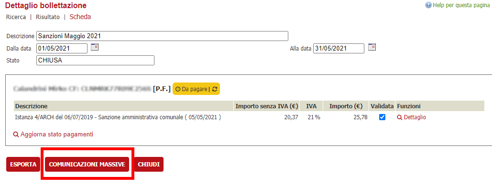
che permette di accedere a questa funzionalità.

Il click al Bottone **COMUNICAZIONI MASSIVE** porta al resoconto delle comunicazioni da creare o già create. 
Nel primo caso verrà presentata una lista vuota 

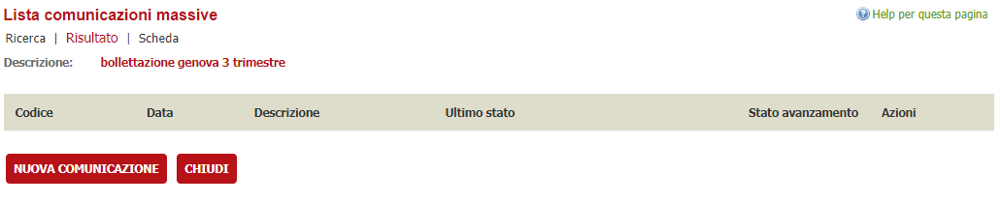

mentre qualora fossero state già create delle comunicazioni verrà presentata una lista delle comunicazioni con il loro stato di avanzamento

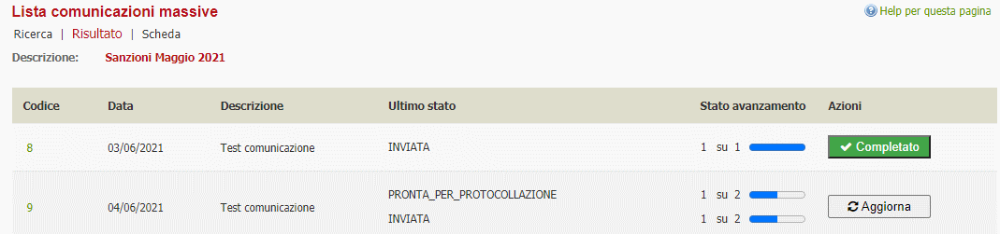

Ogni riga riporta una comunicazione inviata ad una serie di anagrafiche ricavate dai filtri impostati durante la creazione ed è presente anche una colonna per verificare visivamente lo stato globale delle comunicazioni.

Lo stato ***Completato*** indica che la comunicazione è stata inviata con successo a tutte le anagrafiche coinvolte

Se presente il Bottone ***Aggiorna*** significa che non tutte le operazioni sono state effettuate e di solito la colonna **Ultimo stato** riporta quali tipologie di operazioni sono rimaste appese.

Il click su ***Aggiorna*** manda in esecuzione le operazioni della bollettazione riprendendo le operazioni appese.

## Nuova comunicazione
Per creare una comunicazione è necessario impostare dei parametri che ne definiranno il comportamento. 

Sono presenti le seguenti sezioni:

1. **Dati generali**
    
    In questa sezione vengono riportati la definizione della descrizione della comunicazione che si intende creare, la data. Vengono impostati anche filtri per 
    - Escludere dal risultato i **destinatari senza mail**: serve per generare una serie di comunicazione per le sole anagrafiche che hanno l'indirizzo mail o pec impostato. Se l'impostazione viene selezionata allora non verranno incluse le anagrafiche senza la mail
    - Ricercare le anagrafiche che hanno **posizioni debitorie non pagate**. Serve per generare comunicazioni di sollecito pagamento, escludendo le posizioni debitorie già pagate.
2. **Allegati**

    Questa sezione serve per indicare di allegare alla mail dei file. È possibile registrare allegati generici, ovvero informative generiche (**Allegati fissi**), lettere tipo che saranno processate con i dati della specifica bollettazione (**Documenti tipo**).
    **ATTENZIONE**: il documento deve essere configurato opportunamente per le sostituzioni e non possono essere usati i segnaposto fissi.
    Qualora il nodo pagamenti presenti la possibilità di scaricare l'avviso di pagamento sarà possibile - selezionando l'apposito check **Allega avvisi di pagamento** - allegare alla mail ilo documento di avviso (*modello 3* PagoPA). È possibile in questa sezione indicare se trasformare tutti i documenti in PDF prima dell'invio (casella di spunta **Converti i file in PDF**).

3. **Metti alla firma**

    Una volta generati i file da includere nel messaggio mail, è possibile impostare la comunicazione affinché determinate persone appongano la firma elettronica ai documenti associati alla comuniocazione. In questo caso mediante il campo di ricerca dei responsabili **firmatari** sarà possibile indicare il firmatario o i firmatari in casi di firme aggiuntive.
    Il sistema di comunicazione rimarrà in attesa delle firme per proseguire con i successivi passaggi.

4. **Protocollazione**

    È possibile mediante questo passaggio configurare se protocollare i documenti prima dell'invio mail.
    In questa sezione viene data la possibilità di configurare i parametri di protocollazione quali ad esempio la *classifica*, il *tipo documento*, l'*oggetto* di protocollazione e l'*amministrazione* considerata come mittente della comunicazione.

5. **Parametri mail**

    In questa sezione vengono configurati i parametri dell'ultimo passaggio: l'invio della comunicazione mail.
    È possibile impostare:
    - L'**account** da usare per inviare la mail. Magari l'ente utilizza più account per l'invio (ad esempio PEC o mail tradizionale). Questo campo permette di impostare quello scelto per la comunicazione.
    - Il template della mail tipo da usare per la comunicazione. Il template della mail si configura nella funzionalità mail/testi tipo.
    
         **ATTENZIONE**: nella configurazione della mail tipo non sono possibili sostituzioni ma solamente oggetto e corpo fissi.
    - La **scelta della mail** questo campo viene usato per recuperare dallascheda anagrafica la mail da usare per l'invio della comunicazione. Infatti la scheda anagrafica ha due campi che contengono la mail: il campo mail e il campo pec. Questo campo permette di scegliere se recuperare la mail dal campo **mail**, dal campo **pec** oppure usare pec e se non disponibile il campo mail. Questo perché alcuni sistemi non accettano l'invio ad una casella pec per indirizzi mail non certificati, e tramite questa impostazione è possibile determinarne il comportamento.

## Visualizzazione di una comunicazione esistente
La visualizzazione di una comunicazione esistente è formata da 2 macro aree: i dati di testata e i dati di dettaglio

1. **Dati di testata**

    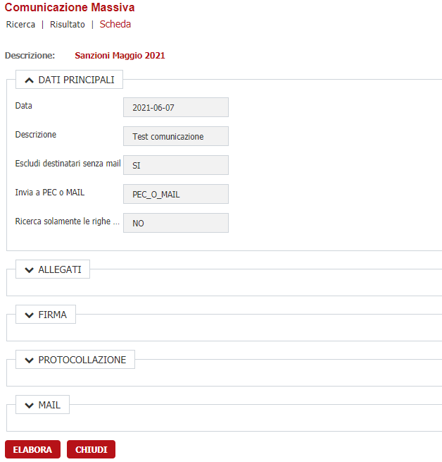

    Vengono visualizzati, senza poterli modificare, i dati utilizzati in fase di creazione per estrapolare l'elenco dei soggetti a cui tale comunicazione è indirizzata e i passaggi di cui si compone.
    I dati sono raccolti in sezioni distinte ed ogni sezione è comprimibile in modo da lasciare più spazio ai dati di dettaglio.
    Di seguito vengono riportate, suddivise nelle varie sezioni, le informazioni mostrate nella testata

    ### DATI PRINCIPALI ###

    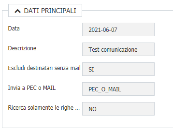

    | Informazione visualizzata | Descrizione |
    | ------------ | ----------- |
    | Data | Data di creazione della comunicazione |
    | Descrizione | Testo descrittivo che identifica la comunicazione per una rapida comprensione dell'oggetto della comunicazione |
    | Escludi destinatari senza mail | Mostra se in fase di creazione, è stato indicato di escludere ( **SI** ) o includere ( **NO** ) anche i destinatari senza indirizzo mail/pec.  |
    | Invia a PEC o MAIL | Mostra se in fase di creazione, è stato scelto di inviare la comunicazione alla casella mail ( **SOLO_MAIL** ), alla casella PEC ( **SOLO_PEC** ) oppure alla PEC e in assenza alla mail ( **PEC_O_MAIL** ) |
    | Ricerca solamente le righe con posizione debitorie non pagate | Mostra se la comunicazione creata è destinata solamente ai titolari di posizioni debitorie non pagate ( **SI** ) o a tutti ( **NO** )  |

    ### ALLEGATI ###
    
    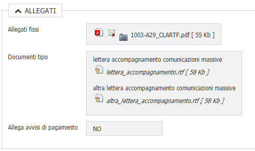

    | Informazione visualizzata | Descrizione |
    | ------------ | ----------- |
    | Allegati fissi | Riporta l'elenco di allegati "fissi" ( cioè che non necessitano di una sostituzione di segnaposti come ad esempio un'informativa ) |
    | Documenti tipo | Riporta l'elenco dei documenti tipo ( cioè i documenti RTF/ODT che contengono query o segnaposti e che verranno sostituiti per ogni riga della comunicazione, ad esempio la lettera di accompagnamento ) | 
    | Allega avviso di pagamento | Mostra se in fase di creazione, è stato indicato al sistema che per ogni comunicazione deve essere allegato l'avviso di pagamento ( **SI** ) oppure no ( **NO** ) |

    E' possibile cliccare sulle icone presenti per visualizzare il rispettivo file

    ### FIRMA ###

    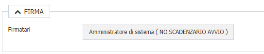
    
    | Informazione visualizzata | Descrizione |
    | ------------ | ----------- |
    | Firmatari | Riporta l'elenco dei responsabili firmatari dei documenti prodotti nelle varie comunicazioni  |

    ### PROTOCOLLAZIONE ###

    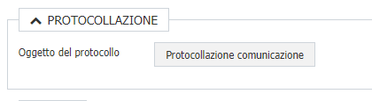
    
    | Informazione visualizzata | Descrizione |
    | ------------ | ----------- |
    | Oggetto del protocollo | Riporta il testo tipo utilizzato come oggetto per protocollare le comunicazioni |

    ### MAIL ###

    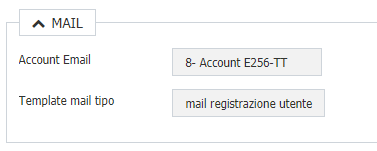
    
    | Informazione visualizzata | Descrizione |
    | ------------ | ----------- |
    | Account Email | Mostra l'account email utilizzato come mittente per inviare le comunicazioni |
    | Template mail tipo | Mostra la mail tipo che verrà utilizzata per l'oggetto e il corpo della mail della comunicazione |

    In questa sezione, tramite il bottone ELABORA presente in fondo alle sezioni, è possibile effettuare l'elaborazione dell'intera comunicazione. In quel caso, le comunicazioni non completate tenteranno di andare avanti nel loro percorso fino ad arrivare alla comunicazione finale.
    Ogni riga di dettaglio verrà aggiornata con le informazioni ottenute dopo aver ritentao l'elaborazione
    Mentre tramite il bottone CHIUDI si tornerà alla lista delle comunicazioni presenti per la bollettazione

    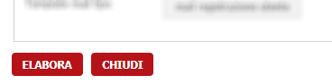

2. **Dati di dettaglio**

    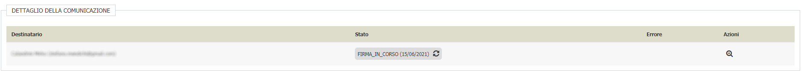

    Questa sezione riporta la lista delle comunicazioni e ne mostra il loro stato di avanzamento; permette inoltre di effettuare alcune operazioni come inserimento indirizzo mail/pec del destinatario, elaborazione della singola riga, ...
    Le informazioni mostrate riguardano il destinatario della comunicazione, lo stato di avanzamento della comunicazione e l'eventuale errore bloccante presente nel processo di completamento della comunicazione
    
    ### DESTINATARIO ###

    Mostra il nominativo e la mail/pec utilizzata in fase di comunicazione. 
    Se non è presente la mail/pec del destinatario comparirà un'icona che permette di impostarla a livello di anagrafica e di conseguenza a livello di comunicazione

    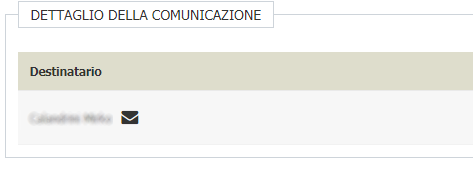

    Le informazioni richieste per inserire una mail/pec per l'anagrafica destinataria sono la mail la pec o entrambe ( a seconda dell'impostazione presente nella testata sulla voce "Invia a PEC o MAIL" )
    e di conseguenza verranno mostrati solo i campi effettivamente richiesti.
    
    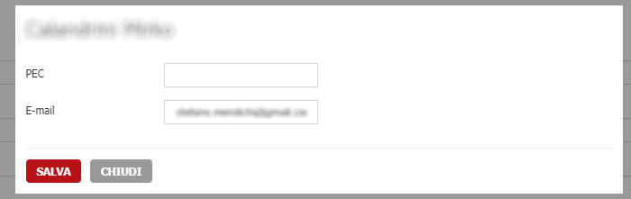

    Al salvataggio delle informazioni richieste, in automatico il sistema tenterà di eseguire i passaggi mancanti per portare a termine quella singola comunicazione
    
    ### STATO ###

    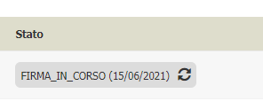

    Mostra lo stato attuale di avanzamento della singola riga di comunicazione, la data in cui tale riga è stata messa in quello stato dal sistema e un'icona con due freccie che permette di riprendere l'elaborazione della singola riga.

    Al click sull'icona il sistema riprende l'elaborazione della riga e ( l'icona inizia a ruotare durante tale elaborazione ); al termine verranno aggiornate le informazioni sullo stato qualora ci sia stata effettivamente una progressione nell'elaborazione della riga di comunicazione

    ### ERRORE ###

    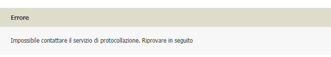

    In questa sezione viene mostrato l'eventuale errore riscontrato dalla procedura durante l'elaborazione della comunicazione.
    E' un'informazione visiva per mostrare il motivo dell'interruzione e permettere all'operatore di intervenire tempestivamente ( ad esempio se viene segnalato che il servizio di protocollazione è giù potremmo avvisare il fornitore e poi far riprendere l'elaborazione )
    Purtroppo non sempre l'informazione è chiara all'utente in quanto, come nel caso del protocollo, dipende dal sistema che genera l'errore e non sempre è direttamente VBG
    
    Una volta risolto il problema mostrato ed eseguita l'elaborazione, tale informazione scompare
    
    ### AZIONI ###

    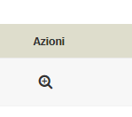

    Al momento, l'unica azione disponibile è quella che permette di visualizzare le informazioni del dettaglio della riga di comunicazione che per motivi di spazio/velocità non compaiono direttamente nella lista.
    Cliccando sull'icona, le informazioni visualizzate sono le seguenti

    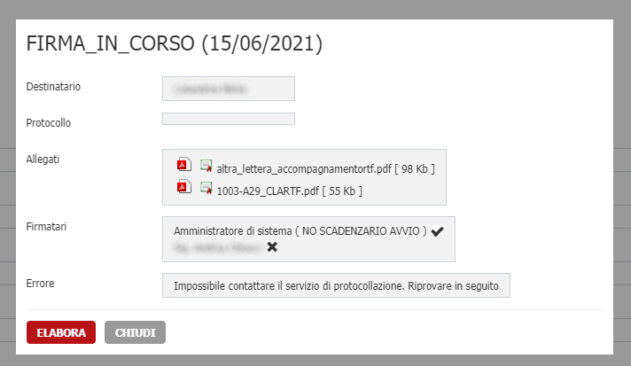

    | Informazione visualizzata | Descrizione |
    | ------------ | ----------- |
    | Titolo della pagina | Mostra le informazioni sullo stato attuale e sulla data dell'ultimo cambio di stato di avanzamento |
    | Destinatario | Nominativo e mail/pec del destinatario della comunicazione |
    | Protocollo | Mostra il numero e la data di protocollazione della comunicazione |
    | Allegati | Elenco completo di tutti gli allegati ( Allegati fissi, documenti tipo generati ed eventuale avviso di pagamento ) oggetto di invio per quella singola comunicazione |
    | Firmatari | Riporta l'elenco di tutti i firmatari per quella comunicazione. Viene mostrata a fianco una X se il responsabile non ha completato il processo di firma o un segno di spunta se il firmatario ha firmato tutti i documenti previsti |
    | Errore | Mostra l'errore presente nella comunicazione |

    A fondo del riquadro sono presenti due bottoni

    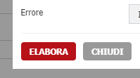

    che permettono di tentare la parte di elaborazione ancora mancante ( **ELABORA** ) o di chiudere la finestra del dettaglio ( **CHIUDI** )
