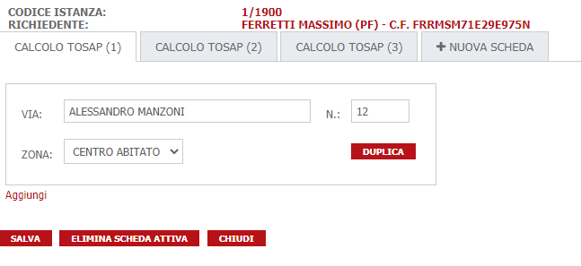
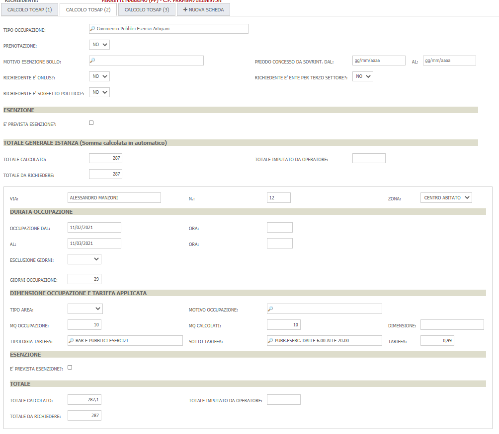
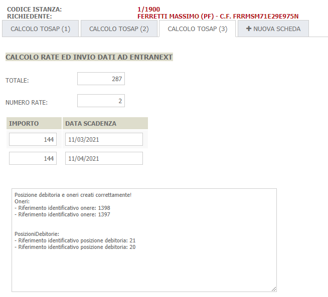

# **Calcolo TOSAP**

Di seguito verrà illustrata una guida per la configurazione del calcolo degli importi TOSAP utilizzata dal Comune di Modena
I calcoli si afferiscono a diverse tipologie di attività riguardanti vari ambiti come Ambulanti, Pubblici Esercizi, Edilizia, Scavi, ....; nonostante ognuno degli ambiti
preveda un proprio tariffario, la modalità di calcolo è abbastanza simile da poter permettere una configurazione modulare in grado di gestire tutte 
le casistiche.
A seguire, è stato anche integrato il loro nodo dei pagamenti Entranext per permettere agli operatori di backoffice, di poter generare una posizione debitoria

## Calcolo degli importi
Il calcolo degli importi, su richiesta dell'Ente, viene effettuato mediante l'utilizzo di 3 schede dinamiche separate:
- **Calcolo TOSAP (1)**
- **Calcolo TOSAP (2)**
- **Calcolo TOSAP (3)**


### Calcolo TOSAP (1)
Questa scheda permette agli operatori di poter gestire, senza uscire dalle schede dinamiche, le localizzazioni specificate nella pratica; nello specifico gli operatori
possono aggiungere localizzazioni, toglierle oppure correggere localizzazioni già indicate. Il tutto viene riportato automaticamente nella gestione standard delle
localizzazioni della pratica



#### Formule condivise tra tutti gli eventi
Questa sezione raggruppa le varie formule implementate che vengono richiamate durante il ciclo di vita dei vari eventi ( caricamento, modifica, salvataggio ) di una scheda dinamica

```
public class TempVie {
	public string Via {get; set;}
	public string Civico{get; set;}
	public string ZonaCod{get; set;}
	public string ZonaDes{get; set;}
	public string CodViario{get; set;}
}


public CampoDinamicoBase[] GetCampiIndirizzo() {
	return new [] {
		TrovaCampo("TO_VIA"),
		TrovaCampo("TO_CIVICO"),
		TrovaCampo("TO_ZONA"),
		TrovaCampo("TO_COD_VIARIO"),
	};
}

public List<TempVie> GetStrutturaCampi() {

	var campi = GetCampiIndirizzo();

	var ultimoIndice = campi[0].ListaValori.Count;
	var vie = new List<TempVie>();
	
	for(var i = 0; i<ultimoIndice; i++ ) {
		vie.Add(new TempVie{
			Via = campi[0].ListaValori[i].Valore,
			Civico = campi[1].ListaValori[i].Valore,
			ZonaCod = campi[2].ListaValori[i].Valore,
			ZonaDes = campi[2].ListaValori[i].ValoreDecodificato,
			CodViario = campi[3].ListaValori[i].Valore,
		});
	}
	
	
	return vie;
}


public void AssociaStrutturaCampi(List<TempVie> vie) {
	var campi = GetCampiIndirizzo();

	var vieOrdinate = vie.OrderBy(x => x.Via).ThenBy(x => x.Civico).ToList();
	
	for(var i = 0; i<vieOrdinate.Count; i++ ) {
		campi[0].ListaValori[i].Valore = vieOrdinate[i].Via;
		campi[1].ListaValori[i].Valore = vieOrdinate[i].Civico;
		campi[2].ListaValori[i].Valore = vieOrdinate[i].ZonaCod;
		campi[2].ListaValori[i].ValoreDecodificato = vieOrdinate[i].ZonaDes;
		campi[3].ListaValori[i].Valore = vieOrdinate[i].CodViario;
	}
}


public void OrdinaCampi() {
	AssociaStrutturaCampi(GetStrutturaCampi());
}

public void DuplicaBlocco(int indiceDaDuplicare) {
	
	var campi = GetCampiIndirizzo();
	var vie = GetStrutturaCampi();
	
	vie.Add(new TempVie{
			Via = campi[0].ListaValori[indiceDaDuplicare].Valore,
			Civico = campi[1].ListaValori[indiceDaDuplicare].Valore,
			ZonaCod = campi[2].ListaValori[indiceDaDuplicare].Valore,
			ZonaDes = campi[2].ListaValori[indiceDaDuplicare].ValoreDecodificato,
			CodViario = campi[3].ListaValori[indiceDaDuplicare].Valore,
		});
	
	AssociaStrutturaCampi(vie);
	
}

public void setLocalizzazioni(){
	var TO_VIA = TrovaCampo("TO_VIA");
	var TO_CIVICO = TrovaCampo("TO_CIVICO");
	var TO_ZONA = TrovaCampo("TO_ZONA");
	var TO_COD_VIARIO = TrovaCampo("TO_COD_VIARIO");

	
	TO_VIA.SvuotaValori();
	TO_CIVICO.SvuotaValori();
	//TO_COD_VIARIO.SvuotaValori();
	
	var nLoc = IstanzaCorrente.Stradario.Count();
	
	for(var i = 0; i < nLoc; i++){
		var s = IstanzaCorrente.Stradario[i];
		
		TO_VIA.ListaValori[i].Valore = s.Stradario.DESCRIZIONE;
		TO_CIVICO.ListaValori[i].Valore = s.CIVICO;
		TO_ZONA.ListaValori[i].Valore = s.FRAZIONE;
		TO_COD_VIARIO.ListaValori[i].Valore = s.Stradario.CODVIARIO;
	}
}

public void calcoloTotale(){
	var TO_TOTALE = TrovaCampo("TO_TOTALE");
	var TO_TOTALE_PARZIALE = TrovaCampo("TO_TOTALE_PARZIALE");
	
	var totale=0.0d;
	
	for (int i=0; i<TO_TOTALE_PARZIALE.ListaValori.Count; i++){
		totale+=TO_TOTALE_PARZIALE.ListaValori[i].GetValoreODefault(0.0d);	
	}
	TO_TOTALE.Valore=totale.ToString();
}

public void calcoloTotaleParziale(){
	var TO_TARIFFA = TrovaCampo("TO_TARIFFA");
	var TO_GIORNI_OCCUPAZINE = TrovaCampo("TO_GIORNI_OCCUPAZINE");
	var TO_MQ_OCCUPAZIONE = TrovaCampo("TO_MQ_OCCUPAZIONE");
	var TOTALE_PARZIALE = TrovaCampo("TO_TOTALE_PARZIALE");

	var totale=0.0d;
	
	for (int i=0; i<TO_MQ_OCCUPAZIONE.ListaValori.Count; i++){
		double tariffa=TO_TARIFFA.ListaValori[i].GetValoreODefault(0.0d);
		double giorniOccupazione=TO_GIORNI_OCCUPAZINE.ListaValori[i].GetValoreODefault(0.0d);
		double mqOccupazione=TO_MQ_OCCUPAZIONE.ListaValori[i].GetValoreODefault(0.0d);
		totale=tariffa*giorniOccupazione*mqOccupazione;
		TOTALE_PARZIALE.ListaValori[i].Valore=totale.ToString();
	}
}

public double GetImportoTariffa( string sottoTariffa, string zona )
{


	var tariffe = GetDecodificheAttive("TARIFFA");
	
	var importo = tariffe
					.Where(x => x.Chiave == sottoTariffa + "_" + zona )
					.Select( x => x.Valore )
					.FirstOrDefault();

	return Convert.ToDouble(importo);
}
```

#### Formula eseguita al caricamento della scheda
La formula al caricamento della scheda, controlla se sono già state riportate le localizzazioni e in caso contrario popola la scheda stessa con tutte le localizzazioni presenti nella pratica e le ordina in base alla via e civico

```
var TO_VIA = TrovaCampo("TO_VIA");
if(TO_VIA.ListaValori[0].GetValoreODefault("") == ""){
	setLocalizzazioni();
}

OrdinaCampi();
```

#### Formula eseguita alla modifica di un campo dinamico
Al click del bottone viene generata una nuova riga nella scheda dinamica che consentirà di registrare una nuova localizzazione copiando le informazioni principali dalla riga che si è scelto di duplicare. Tale informazioni verranno poi riversate in nuove localizzazioni della pratica

```
if (CampoModificato.NomeCampo == "TO_BTN_DUPPLICA" && !PerIncrementoMolteplicita) {
	DuplicaBlocco(IndiceCampoModificato);
}
```

#### Formula eseguita al salvataggio di un campo dinamico
Al salvataggio viene verificato che non sia già stata salvata la scheda TOSAP(2) in quanto non è possibile modificare la scheda TOSAP(1) se si è già provveduto a compilare la scheda successiva.

```
var schedaDue = IstanzaCorrente.IstanzeDyn2Dati.Where( x => x.CampoDinamico.Nomecampo == "TO_SCHEDA_2_COMPILATA" ).FirstOrDefault();
int valoreSchedaDue = (schedaDue == null) ? 0 : Convert.ToInt32(schedaDue.Valore);
if(valoreSchedaDue > 2)
	throw new Exception("La scheda TOSAP(2) è stata già salvata: per modificare la scheda TOSAP(1) cancellare prima la scheda TOSAP(2)");

OrdinaCampi();
```

### Calcolo TOSAP (2)
Questa scheda effettua il calcolo vero e proprio, chiedendo all'utente di inserire i dati che non riesce a recuperare in automatico e utilizzando formule dinamiche per 
implementare i diversi ambiti di calcolo



#### Formule condivise tra tutti gli eventi
Questa sezione raggruppa le varie formule implementate che vengono richiamate durante il ciclo di vita dei vari eventi ( caricamento, modifica, salvataggio ) di una scheda dinamica

```
public void calcolaSuperficieOccupazione(){
	var TO_TIPO_OCCUPAZIONE = TrovaCampo("TO_TIPO_OCCUPAZIONE");
	var TO_SOGGETTO_POLITICO = TrovaCampo("TO_SOGGETTO_POLITICO");
	var TO_PERIODO_ELETTORALE = TrovaCampo("TO_PERIODO_ELETTORALE");
	var TO_MQ_OCCUPAZIONE = TrovaCampo("TO_MQ_OCCUPAZIONE");
	var TO_MQ_OCCUPAZIONE_CALCOLATI = TrovaCampo("TO_MQ_OCCUPAZIONE_CALCOLATI");
	
	for(int i=0; i<TO_MQ_OCCUPAZIONE.ListaValori.Count; i++){
	
		var mqCalcolati=TO_MQ_OCCUPAZIONE.ListaValori[i].GetValoreODefault(0.0d);
		
		if(mqCalcolati>1000){
			// Della superficie occupata oltre 1000mq se ne considerano il 10%
			mqCalcolati=Math.Round(1000+((mqCalcolati-1000)*(0.1)));
		}
		
		if(TO_SOGGETTO_POLITICO.GetValoreODefault("0")=="1"){
			// Un soggetto politico....
			mqCalcolati=TO_MQ_OCCUPAZIONE.ListaValori[i].GetValoreODefault(0.0d);
			if(TO_PERIODO_ELETTORALE.GetValoreODefault("0")=="1"){
				// ...in periodo elettorale non paga nulla...
				mqCalcolati=0;
			}else{
				// ...altrimenti i primi 10mq sono gratis
				if(mqCalcolati<=10)
					mqCalcolati=0;
				else	
					mqCalcolati=mqCalcolati-10;
			}
		}else if(TO_TIPO_OCCUPAZIONE.GetValoreODefault("")=="TP9"){
			// Trattasi si spettacolo viaggiante
			mqCalcolati=TO_MQ_OCCUPAZIONE.ListaValori[i].GetValoreODefault(0.0d);
			if(mqCalcolati<=100){
				mqCalcolati=mqCalcolati*0.5;
			}else if(mqCalcolati<=1000){
				mqCalcolati=50+(mqCalcolati-100)*0.25;
			}else if(mqCalcolati>1000){
				mqCalcolati=50+225+(mqCalcolati-1000)*0.1;
			}
		}
		
		TO_MQ_OCCUPAZIONE_CALCOLATI.ListaValori[i].Valore=mqCalcolati.ToString();
	}
}

public void calcolaDurataOccupazione(){
	var TO_PREVEDE_ESCLUSIONE_GIORNI = TrovaCampo("TO_PREVEDE_ESCLUSIONE_GIORNI");
	var TO_GIORNI_ESCLUSIONE = TrovaCampo("TO_GIORNI_ESCLUSIONE");
	var TO_PERIODO_ESCLUSIONE_DAL = TrovaCampo("TO_PERIODO_ESCLUSIONE_DAL");
	var TO_PERIODO_ESCLUSIONE_AL = TrovaCampo("TO_PERIODO_ESCLUSIONE_AL");
	var TO_GIORNI_OCCUPAZINE = TrovaCampo("TO_GIORNI_OCCUPAZINE");
	var DATA_INI = TrovaCampo("TO_DATA_INI");
	var DATA_FINE = TrovaCampo("TO_DATA_FINE");
	
	var giorniSenzaEsclusioni=0;
	var giorniDiEsclusioni=0;
	for( int i = 0; i<DATA_INI.ListaValori.Count; i++ ){
		if(DATA_INI.ListaValori[i].GetValoreODefault("")!="" && DATA_FINE.ListaValori[i].GetValoreODefault("")!=""){
			DateTime dataInizioOccupazione = DateTime.ParseExact(DATA_INI.ListaValori[i].Valore, "yyyyMMdd",null);
			DateTime dataFineOccupazione = DateTime.ParseExact(DATA_FINE.ListaValori[i].Valore, "yyyyMMdd",null);
			
			TimeSpan ts = dataFineOccupazione - dataInizioOccupazione;
			
			giorniSenzaEsclusioni=(ts.Days+1);
		}
		if(TO_PREVEDE_ESCLUSIONE_GIORNI.ListaValori[i].GetValoreODefault("0")=="1"){
			if(TO_GIORNI_ESCLUSIONE.ListaValori[i].GetValoreODefault(0)>0){
				giorniDiEsclusioni=TO_GIORNI_ESCLUSIONE.ListaValori[i].GetValoreODefault(0);
			}
		}else if(TO_PREVEDE_ESCLUSIONE_GIORNI.ListaValori[i].GetValoreODefault("0")=="2"){
			if(DATA_INI.ListaValori[i].GetValoreODefault("")!="" && DATA_FINE.ListaValori[i].GetValoreODefault("")!=""){
				DateTime dataInizioesclusione = DateTime.ParseExact(TO_PERIODO_ESCLUSIONE_DAL.ListaValori[i].Valore, "yyyyMMdd",null);
				DateTime dataFineEsclusione = DateTime.ParseExact(TO_PERIODO_ESCLUSIONE_AL.ListaValori[i].Valore, "yyyyMMdd",null);
				
				TimeSpan ts = dataFineEsclusione-dataInizioesclusione;
				giorniDiEsclusioni=(ts.Days+1);
			}
		}else{
			
			
		}
		TO_GIORNI_OCCUPAZINE.ListaValori[i].Valore=(giorniSenzaEsclusioni-giorniDiEsclusioni).ToString();
	}
}

public void mostraNascondiCampi(){
	// Campo tipologia TIPOLOGIA MANIFESTAZIONE
	var TO_TIPO_OCCUPAZIONE = TrovaCampo("TO_TIPO_OCCUPAZIONE");
	var campoTipoManifestazione = new []{
		"TO_TIPO_OCCUPAZIONE_MANIFEST",
	};
	if(TO_TIPO_OCCUPAZIONE.GetValoreODefault("0")=="TP1"){
		MostraCampiDinamici(campoTipoManifestazione, 0);
	}else{
		NascondiCampiDinamici(campoTipoManifestazione, 0);
	}
	
	// Campi esenzione master
	var TO_ESENZIONE_SI_NO = TrovaCampo("TO_ESENZIONE_SI_NO");
	var campiEsenzione = new []{
		"TO_PERCENTUALE_ESENZIONE",
		"TO_ESENZIONE_N_ATTO",
		"TO_ESENZIONE_DATA_ATTO",
		"TO_ESENZIONE_DESC_ATTO",
	};
	
	if(TO_ESENZIONE_SI_NO.GetValoreODefault("0")=="1"){
		MostraCampiDinamici(campiEsenzione, 0);
	}else{
		NascondiCampiDinamici(campiEsenzione, 0);
	}
	
	// Campi esenzione dettaglio
	var TO_ESENZIONE_SI_NO_DETT = TrovaCampo("TO_ESENZIONE_SI_NO_DETT");
	
	var campiEsenzioneDett = new []{
		"TO_PERCENTUALE_ESENZIONE_DETT",
		"TO_ESENZIONE_N_ATTO_DETT",
		"TO_ESENZIONE_DATA_ATTO_DETT",
		"TO_ESENZIONE_DESC_ATTO_DETT",
	};
	
	for(int i=0; i<TO_ESENZIONE_SI_NO_DETT.ListaValori.Count; i++){
		if(TO_ESENZIONE_SI_NO_DETT.ListaValori[i].GetValoreODefault("0")=="1"){
			MostraCampiDinamici(campiEsenzioneDett, i);
		}else{
			NascondiCampiDinamici(campiEsenzioneDett, i);
		}
	}
	
	// Campo soggetto politico
	var TO_SOGGETTO_POLITICO = TrovaCampo("TO_SOGGETTO_POLITICO");
	
	var campoPeriodoElettorale = new []{
		"TO_PERIODO_ELETTORALE",
	};

	if(TO_SOGGETTO_POLITICO.GetValoreODefault("0")=="1"){
		MostraCampiDinamici(campoPeriodoElettorale, 0);
	}else{
		NascondiCampiDinamici(campoPeriodoElettorale, 0);
	}
	
	// Giorno da escludere
	var TO_PREVEDE_ESCLUSIONE_GIORNI = TrovaCampo("TO_PREVEDE_ESCLUSIONE_GIORNI");
	var campiGioniEsclusione = new []{
		"TO_GIORNI_ESCLUSIONE",
	};
	var campiPeriodoEsclusione = new []{
		"TO_PERIODO_ESCLUSIONE_DAL",
		"TO_PERIODO_ESCLUSIONE_AL",
	};

	for(int i=0; i<TO_PREVEDE_ESCLUSIONE_GIORNI.ListaValori.Count; i++){
		if(TO_PREVEDE_ESCLUSIONE_GIORNI.ListaValori[i].GetValoreODefault("0")=="1"){
			MostraCampiDinamici(campiGioniEsclusione, i);
			NascondiCampiDinamici(campiPeriodoEsclusione, i);
		}else if(TO_PREVEDE_ESCLUSIONE_GIORNI.ListaValori[i].GetValoreODefault("0")=="2"){
			NascondiCampiDinamici(campiGioniEsclusione, i);
			MostraCampiDinamici(campiPeriodoEsclusione, i);
		}else{
			NascondiCampiDinamici(campiGioniEsclusione, i);
			NascondiCampiDinamici(campiPeriodoEsclusione, i);
		}
	}
}

public void setLocalizzazioni(){
	var TO_VIA = TrovaCampo("TO_VIA");
	var TO_CIVICO = TrovaCampo("TO_CIVICO");
	
	//TO_VIA.SvuotaValori();
	//TO_CIVICO.SvuotaValori();
	
	var nLoc = IstanzaCorrente.Stradario.Count();
	
	for(var i = 0; i < nLoc; i++){
		var s = IstanzaCorrente.Stradario[i];
		
		TO_VIA.ListaValori[i].Valore = s.Stradario.DESCRIZIONE;
		TO_CIVICO.ListaValori[i].Valore = s.CIVICO;
	}
}

public void calcoloTotale(){
	var TO_TOTALE = TrovaCampo("TO_TOTALE");
	var TO_TOTALE_PARZIALE = TrovaCampo("TO_TOTALE_DA_RICHIEDERE_DETT");
	var TO_PERCENTUALE_ESENZIONE = TrovaCampo("TO_PERCENTUALE_ESENZIONE");
	var TO_TOTALE_OPERATORE = TrovaCampo("TO_TOTALE_OPERATORE");
	var TO_TOTALE_DA_RICHIEDERE = TrovaCampo("TO_TOTALE_DA_RICHIEDERE");

	
	var totale=0.0d;
	var totaleDaRichiedere=0.0d;
	
	for (int i=0; i<TO_TOTALE_PARZIALE.ListaValori.Count; i++){
		totale+=TO_TOTALE_PARZIALE.ListaValori[i].GetValoreODefault(0.0d);	
	}
	
	if(TO_TOTALE_OPERATORE.GetValoreODefault(0.0d)>0){
		totaleDaRichiedere=TO_TOTALE_OPERATORE.GetValoreODefault(0.0d);
	}else if(TO_PERCENTUALE_ESENZIONE.GetValoreODefault(0.0d)>0){
		totaleDaRichiedere=totale-totale*TO_PERCENTUALE_ESENZIONE.GetValoreODefault(0.0d)/100;
	}else{
		totaleDaRichiedere=totale;
	}
	totaleDaRichiedere=Math.Round(totaleDaRichiedere);
	TO_TOTALE_DA_RICHIEDERE.Valore=totaleDaRichiedere.ToString();
	
	TO_TOTALE.Valore=totale.ToString();
}

public void calcoloTotaleParziale(){
	var TO_TARIFFA = TrovaCampo("TO_TARIFFA");
	var TO_GIORNI_OCCUPAZINE = TrovaCampo("TO_GIORNI_OCCUPAZINE");
	var TOTALE_PARZIALE = TrovaCampo("TO_TOTALE_PARZIALE");
	var TO_MQ_OCCUPAZIONE_CALCOLATI = TrovaCampo("TO_MQ_OCCUPAZIONE_CALCOLATI");
	var TO_TOTALE_PARZIALE = TrovaCampo("TO_TOTALE_PARZIALE");
	var TO_TOTALE_OPERATORE_DETT = TrovaCampo("TO_TOTALE_OPERATORE_DETT");
	var TO_TOTALE_DA_RICHIEDERE_DETT = TrovaCampo("TO_TOTALE_DA_RICHIEDERE_DETT");
	var TO_PERCENTUALE_ESENZIONE_DETT = TrovaCampo("TO_PERCENTUALE_ESENZIONE_DETT");

	var TO_ONLUS = TrovaCampo("TO_ONLUS");
	var TO_ENTE_TERZO_SETTORE = TrovaCampo("TO_ENTE_TERZO_SETTORE");

	var totale=0.0d;
	var totaleDaRichiedere=0.0d;
	
	for (int i=0; i<TO_MQ_OCCUPAZIONE_CALCOLATI.ListaValori.Count; i++){
		double tariffa=TO_TARIFFA.ListaValori[i].GetValoreODefault(0.0d);
		double giorniOccupazione=TO_GIORNI_OCCUPAZINE.ListaValori[i].GetValoreODefault(0.0d);
		double mqOccupazione=TO_MQ_OCCUPAZIONE_CALCOLATI.ListaValori[i].GetValoreODefault(0.0d);
		
		if(TO_ONLUS.GetValoreODefault("0")=="1" || TO_ENTE_TERZO_SETTORE.GetValoreODefault("0")=="1"){
			var dgg=0.0d;
			var dmq=0.0d;
			if(giorniOccupazione>6){
				dgg=tariffa*(giorniOccupazione-6)*mqOccupazione;
			}
			if(mqOccupazione>100){
				if(giorniOccupazione<7){
					dmq =(mqOccupazione-100)*tariffa*giorniOccupazione;
				}else{
					dmq =(mqOccupazione-100)*tariffa*6;
				}
			}
			
			totale=dgg+dmq;
		}else{
			totale=tariffa*giorniOccupazione*mqOccupazione;
		}
		
		TOTALE_PARZIALE.ListaValori[i].Valore=totale.ToString();
		
		if(TO_TOTALE_OPERATORE_DETT.ListaValori[i].GetValoreODefault(0.0d)>0){
			totaleDaRichiedere=TO_TOTALE_OPERATORE_DETT.ListaValori[i].GetValoreODefault(0.0d);
		}else if(TO_PERCENTUALE_ESENZIONE_DETT.ListaValori[i].GetValoreODefault(0.0d)>0){
			totaleDaRichiedere=totale-totale*TO_PERCENTUALE_ESENZIONE_DETT.ListaValori[i].GetValoreODefault(0.0d)/100;
		}else{
			totaleDaRichiedere=totale;
		}
		totaleDaRichiedere=Math.Round(totaleDaRichiedere);
		TO_TOTALE_DA_RICHIEDERE_DETT.ListaValori[i].Valore=totaleDaRichiedere.ToString();
	}
}

public double GetImportoTariffa( string sottoTariffa, string zona )
{


	var tariffe = GetDecodificheAttive("TARIFFA");
	
	var importo = tariffe
					.Where(x => x.Chiave == sottoTariffa + "_" + zona )
					.Select( x => x.Valore )
					.FirstOrDefault();

	return Convert.ToDouble(importo);
}
```

#### Formula eseguita al caricamento della scheda
Queste formule inizializzano la scheda che si occupa di effettuare il calcolo vero e proprio

```
var TO_FLG_PRENOTAZIONE = TrovaCampo("TO_FLG_PRENOTAZIONE");
var TO_ONLUS = TrovaCampo("TO_ONLUS");
var TO_ENTE_TERZO_SETTORE = TrovaCampo("TO_ENTE_TERZO_SETTORE");
var TO_SOGGETTO_POLITICO = TrovaCampo("TO_SOGGETTO_POLITICO");

if(TO_FLG_PRENOTAZIONE.GetValoreODefault("")==""){
	TO_FLG_PRENOTAZIONE.Valore="2";
}
if(TO_ONLUS.GetValoreODefault("")==""){
	TO_ONLUS.Valore="2";
}
if(TO_ENTE_TERZO_SETTORE.GetValoreODefault("")==""){
	TO_ENTE_TERZO_SETTORE.Valore="2";
}
if(TO_SOGGETTO_POLITICO.GetValoreODefault("")==""){
	TO_SOGGETTO_POLITICO.Valore="2";
}

mostraNascondiCampi();
```

#### Formula eseguita alla modifica di un campo dinamico


```
mostraNascondiCampi();

switch( CampoModificato.NomeCampo )
{
	case "TO_SOTTO_TARIFFA":
	case "TO_ZONA":
	{
		var TO_TARIFFA = TrovaCampo("TO_TARIFFA");
		
		for( int i = 0; i<TO_TARIFFA.ListaValori.Count; i++ )
		{
			var sottoTariffa = TrovaCampo("TO_SOTTO_TARIFFA").ListaValori[i].GetValoreODefault("0");
			var zona = TrovaCampo("TO_ZONA").ListaValori[i].GetValoreODefault("0");
		
			TO_TARIFFA.ListaValori[i].Valore = GetImportoTariffa(sottoTariffa,zona).ToString();
		}
		
		break;
	}
}

// Calcola la durata di occupazione
if(CampoModificato.NomeCampo == "TO_DATA_INI" || CampoModificato.NomeCampo == "TO_DATA_FINE" ||
	CampoModificato.NomeCampo == "TO_PREVEDE_ESCLUSIONE_GIORNI" || CampoModificato.NomeCampo == "TO_GIORNI_ESCLUSIONE" ||
	CampoModificato.NomeCampo == "TO_PERIODO_ESCLUSIONE_AL" || CampoModificato.NomeCampo == "TO_GIORNI_OCCUPAZINE"){

	calcolaDurataOccupazione();
}

// Calcola la superficie effettiva di occupazione
if(CampoModificato.NomeCampo == "TO_TIPO_OCCUPAZIONE" || CampoModificato.NomeCampo == "TO_SOGGETTO_POLITICO" ||
	CampoModificato.NomeCampo == "TO_PERIODO_ELETTORALE" || CampoModificato.NomeCampo == "TO_MQ_OCCUPAZIONE"){
	
	calcolaSuperficieOccupazione();
}

//calcolaGiorniEffettiviOccupazione();
calcoloTotaleParziale();
calcoloTotale();
```

#### Formula eseguita al salvataggio di un campo dinamico

```
mostraNascondiCampi();

switch( CampoModificato.NomeCampo )
{
	case "TO_SOTTO_TARIFFA":
	case "TO_ZONA":
	{
		var TO_TARIFFA = TrovaCampo("TO_TARIFFA");
		
		for( int i = 0; i<TO_TARIFFA.ListaValori.Count; i++ )
		{
			var sottoTariffa = TrovaCampo("TO_SOTTO_TARIFFA").ListaValori[i].GetValoreODefault("0");
			var zona = TrovaCampo("TO_ZONA").ListaValori[i].GetValoreODefault("0");
		
			TO_TARIFFA.ListaValori[i].Valore = GetImportoTariffa(sottoTariffa,zona).ToString();
		}
		
		break;
	}
}

// Calcola la durata di occupazione
if(CampoModificato.NomeCampo == "TO_DATA_INI" || CampoModificato.NomeCampo == "TO_DATA_FINE" ||
	CampoModificato.NomeCampo == "TO_PREVEDE_ESCLUSIONE_GIORNI" || CampoModificato.NomeCampo == "TO_GIORNI_ESCLUSIONE" ||
	CampoModificato.NomeCampo == "TO_PERIODO_ESCLUSIONE_AL" || CampoModificato.NomeCampo == "TO_GIORNI_OCCUPAZINE"){

	calcolaDurataOccupazione();
}

// Calcola la superficie effettiva di occupazione
if(CampoModificato.NomeCampo == "TO_TIPO_OCCUPAZIONE" || CampoModificato.NomeCampo == "TO_SOGGETTO_POLITICO" ||
	CampoModificato.NomeCampo == "TO_PERIODO_ELETTORALE" || CampoModificato.NomeCampo == "TO_MQ_OCCUPAZIONE"){
	
	calcolaSuperficieOccupazione();
}

//calcolaGiorniEffettiviOccupazione();
calcoloTotaleParziale();
calcoloTotale();
```

### Calcolo TOSAP (3)
Questa scheda serve a definire la presenza o meno di rate e si occupa di registrare gli importi come oneri dell'istanza ed aprire, per ognuno di essi, una posizione
debitoria invocando il nodo dei pagamenti integrato con Entranext



#### Formule condivise tra tutti gli eventi
Questa sezione raggruppa le varie formule implementate che vengono richiamate durante il ciclo di vita dei vari eventi ( caricamento, modifica, salvataggio ) di una scheda dinamica

Per effettuare la registrazione degli oneri e la creazione delle posizioni debitorie verso il nodo dei pagamenti, è stata realizzata una libreria .NET utilizzabile a partire dalla versione 2.81 di VBG; per utilizzare tale libreria è necessario compilare la parte che contiene le istruzioni using indicando Init.SIGePro.Manager.Logic.PagamentiModena;

```
using System.Globalization;
using System.Text;
using Init.SIGePro.Manager.Logic.PagamentiModena;
```

Di seguito le formule configurate


```
private CultureInfo provider = CultureInfo.InvariantCulture;
private string format = "yyyyMMdd";
private int causaleId = 54; // Onere per sistema di pagamenti

public void calcolaRate(){
	var TO_TOTALE_DA_PAGARE = TrovaCampo("TO_TOTALE_DA_PAGARE");
	var TO_N_RATE = TrovaCampo("TO_N_RATE");
	var TO_IMPORTO_RATA = TrovaCampo("TO_IMPORTO_RATA");
	var TO_DATA_SCADENZA = TrovaCampo("TO_DATA_SCADENZA");

	if( TO_TOTALE_DA_PAGARE.GetValoreODefault(0.0d) <= 0.0d  )
	{
		var sb = new StringBuilder().AppendFormat("Impossibile procedere alla rateizzazione se l'importo dell'onere è {0}",TO_TOTALE_DA_PAGARE.GetValoreODefault(0.0d));
		throw new Exception(sb.ToString());
	}

	if( TO_N_RATE.GetValoreODefault(0) <= 0  )
	{
		throw new Exception("Indicare il numero delle rate da creare. ( valore minimo accettato 1 )");
	}

	TO_IMPORTO_RATA.SvuotaValori();
	TO_DATA_SCADENZA.SvuotaValori();

	double totaleDaPagare = TO_TOTALE_DA_PAGARE.GetValoreODefault(0.0d);
	int rate = TO_N_RATE.GetValoreODefault(0);
	double importoRata=Math.Round(totaleDaPagare/rate);
	//throw new Exception("pippo "+importoRata);
	for (int n=0; n<TO_N_RATE.GetValoreODefault(0); n++){
		TO_IMPORTO_RATA.ListaValori[n].Valore=""+importoRata;
	}
}


public void registraOneri()
{
	this.verificaRate();

	var service = new PagamentiModenaService(CheckToken());
	
	var codiceIstanza = Convert.ToInt32(IstanzaCorrente.CODICEISTANZA);
	var request = new AttivaPosizioneDebitoriaModenaRequest(codiceIstanza, causaleId);

	
	
	var campiRate = TrovaCampo("TO_IMPORTO_RATA").ListaValori;
	var campiScadenze = TrovaCampo("TO_DATA_SCADENZA").ListaValori;

	for( int i=0; i<campiRate.Count; i++ )
	{
		var importo = Convert.ToDouble(campiRate[i].GetValoreODefault(0.0d));
		var dataScadenza = DateTime.ParseExact(campiScadenze[i].Valore,format,provider);
		
		request.AggiungiRata(importo, dataScadenza);
	}


	var esito = service.AttivaPosizioniDebitorie(request);
	
	var sb = new StringBuilder();
	
	if (!esito.Esito) {
		sb.Append("Posizione debitoria non creata a causa di errori:\r\n");
		
		foreach(var errore in esito.Errori) {
			sb.AppendFormat("- {0}<br/>", errore);
		}
	} else {
	
		sb.Append("Posizione debitoria e oneri creati correttamente!\r\nOneri:\r\n");
			
		foreach(var idOnere in esito.IdOneri) {
			sb.AppendFormat("- Riferimento identificativo onere: {0}\r\n", idOnere.ToString());
		}
		
		sb.Append("\r\n\r\nPosizioniDebitorie:\r\n");
		
		foreach(var idPosDeb in esito.IdPosizioniDebitorie) {
			sb.AppendFormat("- Riferimento identificativo posizione debitoria: {0}\r\n", idPosDeb.ToString());
		}
	}	
	
	TrovaCampo("TO_ESITO_ONERI").Valore = sb.ToString();
	
	//ModelloCorrente.Salva(false);
}

private void verificaRate()
{
	var campiRate = TrovaCampo("TO_IMPORTO_RATA").ListaValori;
	
	
	if (campiRate.Where(x => String.IsNullOrEmpty(x.Valore)).Any())
	{
		throw new Exception("Impossibile procedere in quanto non tutte le rate hanno l'importo valorizzato");
	}
	
	var campiScadenze = TrovaCampo("TO_DATA_SCADENZA").ListaValori;
	if (campiScadenze.Where(x => String.IsNullOrEmpty(x.Valore)).Any())
	{
		throw new Exception("Impossibile procedere in quanto non tutte le rate hanno la data di scadenza impostata");
	}
}

private bool OneriRegistrati()
{
	//return false;
	return IstanzaCorrente.Oneri.Where(x => x.FKIDTIPOCAUSALE == causaleId.ToString()).Any();
}
```
#### Formula eseguita al caricamento della scheda

```
var campoTotDaPagare = IstanzaCorrente.IstanzeDyn2Dati.Where( x => x.CampoDinamico.Nomecampo == "TO_TOTALE_DA_RICHIEDERE" ).FirstOrDefault();
var TO_TOTALE_DA_PAGARE = TrovaCampo("TO_TOTALE_DA_PAGARE");

TO_TOTALE_DA_PAGARE.Valore = (campoTotDaPagare == null) ? "0" : campoTotDaPagare.Valore;

if( OneriRegistrati() )
{
	var campi = new []{"TO_AGGIORNA","TO_REGISTRA_ONERI"};
	NascondiCampiDinamici(campi, 0);
} 
else 
{
	TrovaCampo("TO_ESITO_ONERI").Valore = "";
}
```

#### Formula eseguita alla modifica di un campo dinamico

```
switch(CampoModificato.NomeCampo)
{
	case "TO_AGGIORNA":
	{
		calcolaRate();
		break;
	}
	case "TO_REGISTRA_ONERI":
	{
		registraOneri();
		break;
	}
	default:
	{
		break;
	}
}
```

#### Formula eseguita al salvataggio di un campo dinamico

```
var TO_SCHEDA_3_COMPILATA = TrovaCampo("TO_SCHEDA_3_COMPILATA");

TO_SCHEDA_3_COMPILATA.Valore=""+(TO_SCHEDA_3_COMPILATA.GetValoreODefault(0)+1);
```