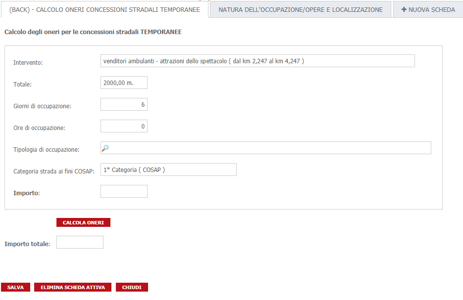

# Concessioni stradali
Di seguito viene utilizzata la procedura per il calcolo COSAP per le concessioni stradali

I dati necessari ai fini del calcolo vengono richiesti tramite una scheda dinamicha nel Front-End e sono i seguenti:

| Parametro | Descrizione |
| --------- | ----------- |
| **Tipo di intervento** | Tipologia dell'intervento oggetto della domanda( es. accesso temporaneo da cantiere, dehors e tende, ... ) |
| **Localizzazione** | Localizzazione dell'intervento composta da Via, Km e Metro |
| **Durata occupazione** | Se permanente o temporanea. In caso di occupazione temporanea va chiesta anche la durata in giorni o comunque una data inizio e una data fine |

In base a questi parametri vengono create delle mappature che portano a degli importi e/o a delle fasce di importo.
Fare riferimento alla configurazione fatta per il CSI e riportata più avanti per degli esempi concreti

## Algoritmi di calcolo
Il **Canone per le concessioni stradali** è stato calcolato secondo le indicazioni fornite da CSI Piemonte e sono le seguenti

```
I criteri di determinazione delle tariffe, adottati in conformità ai criteri generali indicati dall'art.63 comma secondo lettera c) del D.Lgs. 446/97 9, sono i seguenti
* classificazione in categorie di importanza delle strade provinciali e annesse aree e spazi
* previsioni di coefficienti moltiplicatori in aumento o in diminuzione della tariffa base
* previsioni di speciali agevolazioni per occupazioni ritenute di particolare interesse pubblico e, in particolare, per quelle aventi finalità politiche ed istituzionali

Il canone è determinato moltiplicando le tariffe per unità di superficie o di lunghezza per l'entità dell'occupazione espressa in metri quadrati o lineari.

Il canone determinato sulla base della tariffa, con riferimento alla durata dell'occupazione, può essere maggiorato di eventuali oneri di manutenzione derivanti dall'occupazione del suolo e del sottosuolo.
Dalla misura complessiva del canone va detratto l'importo di altri canoni previsti da disposizioni di legge riscossi dalla Provincia per la medesima concessione, fatti salvi quelli concessi a prestazioni di servizi.

Il canone è graduato a seconda della classificazione in categorie di importanza delle aree e spazi sulle quali insiste l'occupazione; 
a tale fine le strade provinciali sono classificate in n. 2 categorie, individuate in base all'ubicazione, tipologia, importanza dell'occupazione e traffico veicolare
La misura delle tariffe corrispondenti alla seconda categoria è pari al 70% di quelle relati-ve alla prima.

Il canone è determinato in base all'effettiva occupazione espressa in metri quadrati o in metri lineari con arrotondamento all'unità superiore o inferiore più prossima della cifra contenente decimali.
Non si applica il canone alle occupazioni che in relazione alla medesima area di riferimento siano complessivamente inferiori a mezzo metro quadrato o lineare. 
Le superfici eccedenti i 1000 metri quadri, sia per le occupazioni permanenti che per le occupazioni temporanee, sono calcolate in ragione del 10%.
Per le occupazioni realizzate con installazioni di attrazioni, giochi e divertimenti dello spettacolo viaggiante, le superfici sono calcolate in ragione del 50% sino a 100 mq, del 25% per la parte eccedente 100 mq e fino a 1000 mq, del 10% per la parte eccedente 1000 mq.
```
## Calcolo della scadenza
Allo stato attuale, non è stata fornita una data di scadenza dell'onere

## Scheda dinamica per il calcolo


Di seguito verranno illustrate le formule utilizzate. 
**Tali formule potrebbero subire variazioni nel corso del tempo che non verranno riportate in questo documento per cui trattarle semplicemente come spunto**

## Formule condivise
Sono state definite una serie di costanti che identificano le causali oneri da utilizzare, le tipologie di aree che contengono le categorie delle strade.
In generale contengono tutti i valori fissi che potrebbero variare nel tempo

```
public static class Constants
{
	public const int IdCausaleCanone = 5;
	public const int CodiceTipoAreaCOSAP = 4;
}
```

Di seguito viene mostrata la funzione richiamata al caricamento della scheda per impostare i valori iniziali
```
public void InizializzaScheda()
{
	
	var categoriaStradaCOSAP = TrovaCampo("COSAP-CATEGORIA-STRADA-COSAP");
	var descrizioneIntervento = TrovaCampo("COSAP-DESCRIZIONE-INTERVENTO");
	var quantita = TrovaCampo("COSAP-QUANTITA");
	var giorni = TrovaCampo("COSAP-CONCESSIONI-DURATA-GIORNI");
	var ore = TrovaCampo("COSAP-CONCESSIONI-DURATA-ORE");
	
	var interventi 	= IstanzaCorrente.IstanzeDyn2Dati.Where( x => x.CampoDinamico.Nomecampo == "OCCUPAZIONE_INTERVENTO" );

	if( interventi != null )
	{
		var i = 0;
		foreach (var intervento in interventi)
		{
			categoriaStradaCOSAP.ListaValori[i].Valore = this.RecuperaCategoriaStrada(Constants.CodiceTipoAreaCOSAP).Denominazione.ToString();
			descrizioneIntervento.ListaValori[i].Valore = this.GetDescrizioneIntervento();
			quantita.ListaValori[i].Valore = this.GetDescrizioneQuantita();
			giorni.ListaValori[i].Valore = this.GetGiorniOccupazione().ToString();
			ore.ListaValori[i].Valore = this.GetOreOccupazione().ToString();
		}
	}
}
```

Il metodo che effettua le chiamate pe il calcolo vero e proprio
```
public void CalcolaOneri()
{
	var campoImporto 	 = TrovaCampo("COSAP-CONCESSIONI-ONERE-IMPIANTO");
	var campoDescCalcolo = TrovaCampo("COSAP-CONCESSIONI-ONERE-IMPIANTO-DESCRIZIONE");
	var campoTotaleOneri = TrovaCampo("COSAP-CONCESSIONI-TOTALI-ONERI");

	var richieste = this.GeneraRichieste();

	var authInfo = CheckToken();
	
	var service = new CalcoloCosapConcessioniStradaliService();
	
	var i = 0;
	var totale = 0.0d;
	foreach(var richiesta in richieste )
	{
		var importi = service.CalcolaImportiTemporanei(richiesta,authInfo);
		
		campoImporto.ListaValori[i].Valore = importi.Canone.Importo.ToString();
		campoDescCalcolo.ListaValori[i].Valore = importi.Canone.SpiegazioneFormula;
		
		totale += importi.Canone.Importo.Valore;
		
		i++;
	}
	
	campoTotaleOneri.Valore = new Importo(totale).ToString();
}
```

il metodo sopra, ad un certo punto deve raccogliere i parametri per il calcolo e passarli alla libreria .NET che effettua il calcolo. 
La raccolta dei parametri avviene con una chiamata al metodo seguente
```
private List<CalcoloConcessioniStradaliTemporaneeRequest> GeneraRichieste()
{

	var retVal = new List<CalcoloConcessioniStradaliTemporaneeRequest>();
	var occupazioni = TrovaCampo("COSAP-CONCESSIONI-TIPO-OCCUPAZIONE-TEMPORANEE");
	
	if( occupazioni != null )
	{
		for (int i=0; i<occupazioni.ListaValori.Count; i++)
		{
		
			string tipoOccupazione = occupazioni.ListaValori[i].GetValoreODefault("");
			string categoriaStrada = this.RecuperaCategoriaStrada(Constants.CodiceTipoAreaCOSAP).CodiceArea.ToString();
			double quantita = this.GetQuantita();
			int oreOccupazione = ( this.GetGiorniOccupazione() * 24 ) + this.GetOreOccupazione();
						
			retVal.Add( new CalcoloConcessioniStradaliTemporaneeRequest(tipoOccupazione,categoriaStrada,quantita,oreOccupazione));
		}
	}
	
	return retVal;
}
```

il metodo seguente invece inserisce gli oneri nella pratica
```
public void InserisciOnere( )
{
	var scadenzaCanone = this.CalcolaDataScadenzaCanone();
	var codiceIstanza = Convert.ToInt32( IstanzaCorrente.CODICEISTANZA );
	
	var oneri = new List<Init.SIGePro.Manager.Logic.GestioneOneri.OnereDaRegistrare>();
	
	//importo canone
	var importoCanone = TrovaCampo("COSAP-CONCESSIONI-TOTALI-ONERI").GetValoreODefault(0.0d);
	if( importoCanone > 0 )
	{	
		oneri.Add(new OnereDaRegistrare( codiceIstanza, Constants.IdCausaleCanone, importoCanone, scadenzaCanone ));
	}
		
	var authInfo = CheckToken();
	new OneriService(authInfo).AggiornaOInserisciByIdCausale(oneri);
	
	
	//richiamare la registrazione degli oneri
	TrovaCampo("COSAP-ONERI-INVIATI").Valore = "Oneri registrati correttamente in data " + DateTime.Now.ToString("dd/MM/yyyy");
	
	
	ModelloCorrente.Salva();
	ModelloCorrente.RichiediReloadInterfaccia();
}
```
per verificare se c'è almeno un onere pagato tra quelli utilizzati dal calcolo viene utilizzato il seguente metodo
```
public bool OnerePagato()
{
	var authInfo = CheckToken();
	var codiceIstanza = Convert.ToInt32( IstanzaCorrente.CODICEISTANZA );
	
	return new OneriService(authInfo).OnerePagato(codiceIstanza, Constants.IdCausaleCanone);
}
```
e infine tutta la lista di metodi accessori creati per semplificare la lettura delle formule in un ambito complesso come questo
```
public bool OnereCalcolato()
{
	return !String.IsNullOrEmpty(TrovaCampo("COSAP-CONCESSIONI-ONERE-IMPIANTO").ListaValori[0].GetValoreODefault(""));
}

private DateTime CalcolaDataScadenzaCanone(){
	return DateTime.Now;
}

private DettaglioArea RecuperaCategoriaStrada(int codiceTipoArea)
{
	return this.RecuperaCategoriaStrada(0, codiceTipoArea);
}

private DettaglioArea RecuperaCategoriaStrada(int indice, int codiceTipoArea)
{
    var codiceStradario = Convert.ToInt32( IstanzaCorrente.IstanzeDyn2Dati.Where( x => x.CampoDinamico.Nomecampo == "LOCALIZZAZIONE_STRADA"  && x.IndiceMolteplicita == indice )
					.Select( y => y.Valore)
					.FirstOrDefault() );
	
	var kmDa = Convert.ToDouble( IstanzaCorrente.IstanzeDyn2Dati.Where( x => x.CampoDinamico.Nomecampo == "LOCALIZZAZIONE_KM_INIZIALE" && x.IndiceMolteplicita == indice )
					.Select( y => y.Valore)
					.FirstOrDefault() );
					
	var metroDa = Convert.ToInt32( IstanzaCorrente.IstanzeDyn2Dati.Where( x => x.CampoDinamico.Nomecampo == "LOCALIZZAZIONE_METRO_INIZIALE" && x.IndiceMolteplicita == indice )
					.Select( y => y.Valore)
					.FirstOrDefault());
					
	var kmA = Convert.ToDouble( IstanzaCorrente.IstanzeDyn2Dati.Where( x => x.CampoDinamico.Nomecampo == "LOCALIZZAZIONE_KM_FINALE" && x.IndiceMolteplicita == indice )
					.Select( y => y.Valore)
					.FirstOrDefault() );
					
	var metroA = Convert.ToInt32( IstanzaCorrente.IstanzeDyn2Dati.Where( x => x.CampoDinamico.Nomecampo == "LOCALIZZAZIONE_METRO_FINALE" && x.IndiceMolteplicita == indice )
					.Select( y => y.Valore)
					.FirstOrDefault());
	

	var request = new TrovaAreaDaKmAKmRequest( codiceTipoArea, codiceStradario, kmDa, metroDa, kmA, metroA );
	
	var authInfo = CheckToken();
	var response = new GestioneAreeService(authInfo).TrovaArea(request);
	
	if( response == null || response.Count() == 0 )
		return new Init.SIGePro.Manager.Logic.GestioneStradario.DettaglioArea();
		
	if( response.Count() > 1 )
		throw new Exception( String.Format("Impossibile identificare in maniera univoca la categoria stradale. Trovati {0} risultati", response.Count()));

	return response.FirstOrDefault();
}

private string GetDescrizioneIntervento()
{
	return this.GetDescrizioneIntervento(0);
}

private string GetDescrizioneIntervento(int indice)
{
	var intervento 	= IstanzaCorrente.IstanzeDyn2Dati.Where( x => x.CampoDinamico.Nomecampo == "OCCUPAZIONE_INTERVENTO" && x.IndiceMolteplicita == indice )
						.Select( y => y.Valoredecodificato)
						.FirstOrDefault();
	var kmDa = IstanzaCorrente.IstanzeDyn2Dati.Where( x => x.CampoDinamico.Nomecampo == "LOCALIZZAZIONE_KM_INIZIALE" && x.IndiceMolteplicita == indice )
				.Select( y => y.Valore)
				.FirstOrDefault();
					
	var metroDa = IstanzaCorrente.IstanzeDyn2Dati.Where( x => x.CampoDinamico.Nomecampo == "LOCALIZZAZIONE_METRO_INIZIALE" && x.IndiceMolteplicita == indice )
					.Select( y => y.Valore)
					.FirstOrDefault();
					
	var kmA = IstanzaCorrente.IstanzeDyn2Dati.Where( x => x.CampoDinamico.Nomecampo == "LOCALIZZAZIONE_KM_FINALE" && x.IndiceMolteplicita == indice )
				.Select( y => y.Valore)
				.FirstOrDefault();
					
	var metroA = IstanzaCorrente.IstanzeDyn2Dati.Where( x => x.CampoDinamico.Nomecampo == "LOCALIZZAZIONE_METRO_FINALE" && x.IndiceMolteplicita == indice )
					.Select( y => y.Valore)
					.FirstOrDefault();
					
	return intervento + " ( dal km " + kmDa + "," + metroDa + " al km " + kmA + "," + metroA + " )";
}

private string GetDescrizioneQuantita()
{
	var qt = this.GetQuantita();
	return new Init.SIGePro.Manager.Logic.Cosap.CSIPiemonte.Importo(qt) + " m.";
}

private double GetQuantita()
{
	return this.GetQuantita(0);
}

private double GetQuantita(int indice)
{
	var kmDa = Convert.ToInt32( IstanzaCorrente.IstanzeDyn2Dati.Where( x => x.CampoDinamico.Nomecampo == "LOCALIZZAZIONE_KM_INIZIALE" && x.IndiceMolteplicita == indice )
					.Select( y => y.Valore)
					.FirstOrDefault() );
					
	var metroDa = Convert.ToInt32( IstanzaCorrente.IstanzeDyn2Dati.Where( x => x.CampoDinamico.Nomecampo == "LOCALIZZAZIONE_METRO_INIZIALE" && x.IndiceMolteplicita == indice )
					.Select( y => y.Valore)
					.FirstOrDefault());
					
	var kmA = Convert.ToInt32( IstanzaCorrente.IstanzeDyn2Dati.Where( x => x.CampoDinamico.Nomecampo == "LOCALIZZAZIONE_KM_FINALE" && x.IndiceMolteplicita == indice )
					.Select( y => y.Valore)
					.FirstOrDefault() );
					
	var metroA = Convert.ToInt32( IstanzaCorrente.IstanzeDyn2Dati.Where( x => x.CampoDinamico.Nomecampo == "LOCALIZZAZIONE_METRO_FINALE" && x.IndiceMolteplicita == indice )
					.Select( y => y.Valore)
					.FirstOrDefault());
	
	return (kmA * 1000 + metroA) - (kmDa * 1000 + metroDa);
}

private int GetGiorniOccupazione()
{
	return this.GetGiorniOccupazione(0);
}

private int GetGiorniOccupazione(int indice)
{
	var strGiorni = IstanzaCorrente.IstanzeDyn2Dati.Where( x => x.CampoDinamico.Nomecampo == "DURATA_OCCUPAZIONE" && x.IndiceMolteplicita == indice )
					.Select( y => y.Valore)
					.FirstOrDefault();
	
	var giorni = 0;
	Int32.TryParse(strGiorni, out giorni);
	
	return giorni;
}

private int GetOreOccupazione()
{
	return this.GetOreOccupazione(0);
}

private int GetOreOccupazione(int indice)
{
	var strOre = IstanzaCorrente.IstanzeDyn2Dati.Where( x => x.CampoDinamico.Nomecampo == "DURATA_OCCUPAZIONE_ORE" && x.IndiceMolteplicita == indice )
					.Select( y => y.Valore)
					.FirstOrDefault();
	
	var ore = 0;
	Int32.TryParse(strOre, out ore);
	
	return ore;
}
```

## Formule al caricamento
Al caricamento della scheda vengono inizializzati i vaolori necessari e mostrati/nascosti i bottoni di calcolo e di pagamento a seconda che l'onere sia già stato pagato oppure sia già stato calcolato
```
InizializzaScheda();

if( !OnereCalcolato() ) 
{
	NascondiCampiDinamici(new []{"COSAP-REGISTRA-ONERI"}, 0);
	return 0;
}

if( OnerePagato() )
{
	NascondiCampiDinamici(new []{"COSAP-CALCOLA-ONERI","COSAP-REGISTRA-ONERI"}, 0);
	return 0;
}
```

## Formule alla modifica di un campo
Anche in questo caso vengono mostrati/nascosti campi oppure avviato il calcolo o la registrazione degli oneri
```
switch( CampoModificato.NomeCampo ){
	case "COSAP-CALCOLA-ONERI": 
		CalcolaOneri();
		MostraCampiDinamici(new []{"COSAP-REGISTRA-ONERI"}, 0);
		break;
	case "COSAP-REGISTRA-ONERI":
		InserisciOnere();
		break;
	default:
		break;
}
```