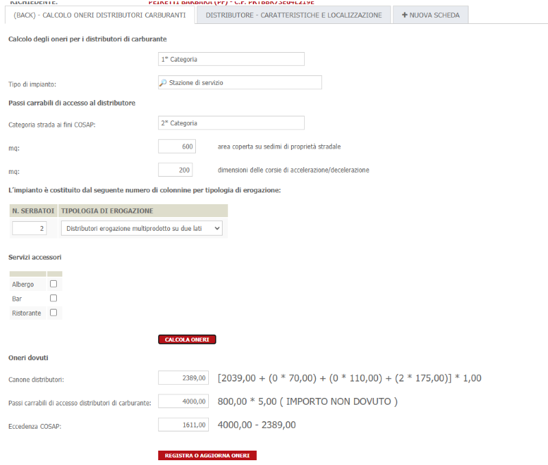

# Distributori di Carburante
In questo calcolo verranno affrontati due importi: uno per il calcolo del canone dovuto e l'altro per il calcolo dell'eventuale eccedenza COSAP da versare ( dato dalla differenza positiva tra il costo dell'eventuale occupazione con passo carrabile per l'accesso al distributore ed il canone)
I dati necessari ai fini del calcolo vengono richiesti tramite una scheda dinamicha nel Front-End e sono i seguenti:

| Parametro | Descrizione |
| --------- | ----------- |
| **Tipo di impianto** | Tipologia dell'impianto per cui si stà presentando la domanda( es. Stazione di servizio, Stazione senza gasolio, Distributori isolati, ... ) |
| **Localizzazione** | Localizzazione dell'intervento composta da Via, Km e Metro |
| **Quote aggiuntive** | Eventuali quote aggiuntive a seconda che si tratti di colonnine a singola pompa, colonnine con erogazione su entrambi i lati, colonnine di erogazione multiprodotto |
| **Servizi accessori** | Nell'area di servizio potrebbero essere presenti servizi accessori quali Bar, Ristoranti, Albergo, etc. che potrebbero avere dei coefficienti moltiplicativi aggiuntivi |
| **MQ Passi carrabili** | MQ di passi carrabili di accesso al distributore. Utilizzati per il calcolo dell'eventuale eccedenza COSAP |

In base a questi parametri vengono create delle mappature che portano a degli importi e/o a dei coefficienti moltiplicativi. Fare riferimento alla configurazione fatta per il CSI e riportata più avanti per degli esempi concreti

## Algoritmi di calcolo
Il **Canone dei distributori** è stato calcolato secondo questo algoritmo ( [Tariffa derivante dalla tipologia di impianto e categoria di strada] + (Numero distributori singoli * relativa tariffa ) + (Numero distributori doppi * relativa tariffa ) + ( Numero distributori doppi * relativa tariffa ) ) * Coefficiente servizi accessori

Il **Canone COSAP per i passi carrabili** viene calcolato semplicemente per poi verificare se c'è un eccedenza COSAP tra questo e il canone dei distributori. Non viene registrato come pendenza ma viene comunque calcolato secondo questo algoritmo [somma Mq passi carrabili * tariffa corrispondente]

L'**Eccedenza COSAP** viene calcolata con questo algoritmo [Canone COSAP per i passi carrabili - Canone dei distributori] e diventa onere solamente se maggiore di 0

## Calcolo della scadenza
Gli importi sopra calcolati, hanno scadenze diverse e sono 31/03 per quanto riguarda l'eccedenza COSAP e 30/06 per il canone dei distributori. Anche queste scadenze vengono impostate e gestite tramite le formule in una scheda dinamica di Backoffice che effettua il calcolo

## Scheda dinamica per il calcolo


Di seguito verranno illustrate le formule utilizzate. **Tali formule potrebbero subire variazioni nel corso del tempo che non verranno riportate in questo documento per cui trattarle semplicemente come spunto**

## Formule condivise
Sono state definite una serie di costanti che identificano le causali oneri da utilizzare, le tipologie di aree che contengono le categorie delle strade e altri messaggi. In generale contengono tutti i valori fissi che potrebbero variare nel tempo

```
private static class Constants
{
	public const int IdCausaleCanone = 2;
	public const int IdCausaleEccedenzaCOSAP = 3;
	public const int CodiceTipoAreaCanone = 3;
	public const int CodiceTipoAreaCosap = 4;
	public const string ErogazioneSingoloUnLato = "Distributori erogazione singolo prodotto su un lato";
	public const string ErogazioneSingoloDueLati = "Distributori erogazione singolo prodotto su due lati";
	public const string ErogazioneMultiplaUnLato = "Distributori erogazione multiprodotto su un lato";
	public const string ErogazioneMultiplaDueLati = "Distributori erogazione multiprodotto su due lati";
}
```

viene definito un'array composto dalle causali oneri previste per verificare se c'è stato qualche pagamento che non permetterebbe più di rifare il calcolo
```
public IEnumerable<int> getCausali()
{
	return new[] { Constants.IdCausaleCanone, Constants.IdCausaleEccedenzaCOSAP };

}
```

viene identificata la struttura che identifica il numero di colonnine singole, doppie e multiprodotto
```
public class TipologiaColonnine {
	public int Singolo { get; set; }
	public int Doppio { get; set; }
	public int Multiprodotto { get; set; }
	
	public TipologiaColonnine(){
		this.Singolo = 0;
		this.Doppio = 0;
		this.Multiprodotto = 0;
	}
}
```
Di seguito viene mostrata la funzione richiamata al caricamento della scheda per impostare i valori iniziali
```
public void InizializzaScheda()
{
	TrovaCampo("COSAP-CATEGORIA-STRADA").ListaValori[0].Valore = this.getCategoriaStrada(Constants.CodiceTipoAreaCanone).Denominazione;
	TrovaCampo("COSAP-CATEGORIA-STRADA-COSAP").ListaValori[0].Valore = this.getCategoriaStrada(Constants.CodiceTipoAreaCosap).Denominazione;
	
	if( TrovaCampo("COSAP-SERVIZI-ACCESSORI-ID").ListaValori[0].GetValoreODefault("") == "" ) {
		var campoId = TrovaCampo("COSAP-SERVIZI-ACCESSORI-ID");
	
		
		var campoDescrizione = TrovaCampo("COSAP-SERVIZI-ACCESSORI-DESCRIZIONE");
		var i = 0;
		var serviziAccessori = GetDecodificheAttive("SERACC");
		
		foreach( var servizio in serviziAccessori ){
			campoId.ListaValori[i].Valore = servizio.Chiave;
			campoDescrizione.ListaValori[i].Valore = servizio.Valore;
			i++;		
		}
	}

}
```

Il metodo che effettua le chiamate pe il calcolo vero e proprio
```
public void CalcolaOneri(){

	var idCategoriaStradaDistr = getCategoriaStrada(Constants.CodiceTipoAreaCanone).CodiceArea.ToString();
	var idCategoriaStradaCosap = getCategoriaStrada(Constants.CodiceTipoAreaCosap).CodiceArea.ToString();
	var idTipoImpianto = TrovaCampo("COSAP-TIPO-IMPIANTO").GetValoreODefault("");
	var idServiziAccessori = serviziAccessoriPresenti();

	var colonnine = GetTipologiaColonnine();
	
	var mqPassiCarrabili = GetMQPassiCarrabili();
	
	var service = new Init.SIGePro.Manager.Logic.Cosap.CSIPiemonte.DistributoriCarburante.CalcoloCosapDistributoriCarburanteService();
	var request = getRequest(idTipoImpianto,idCategoriaStradaDistr, idCategoriaStradaCosap, colonnine, mqPassiCarrabili, idServiziAccessori);
	var authInfo = CheckToken();
	
	var importi = service.CalcolaImporti(request, authInfo);
	
	//IMPORTI
	TrovaCampo("COSAP-IMPORTO-CANONE-DISTRIBUTORI").Valore = importi.Canone.Importo.ToString();
	TrovaCampo("COSAP-IMPORTO-PASSI-CARRABILI").Valore = importi.PassiCarrabili.Importo.ToString();
	TrovaCampo("COSAP-IMPORTO-ECCEDENZA").Valore = importi.Eccedenza.Importo.ToString();
	
	//DESCRIZIONI
	TrovaCampo("COSAP-CALCOLO-CANONE-DISTRIBUTORI").Valore = importi.Canone.SpiegazioneFormula;
	TrovaCampo("COSAP-CALCOLO-PASSI-CARRABILI").Valore = importi.PassiCarrabili.SpiegazioneFormula + " ( IMPORTO NON DOVUTO )";
	TrovaCampo("COSAP-CALCOLO-ECCEDENZA").Valore = importi.Eccedenza.SpiegazioneFormula + ( (importi.Eccedenza.Importo.Valore <= 0) ? " ( IMPORTO NON DOVUTO )" : "");
}
```

il metodo sopra, ad un certo punto deve raccogliere i parametri per il calcolo e passarli alla libreria .NET che effettua il calcolo. La raccolta dei parametri avviene con una chiamata al metodo seguente
```
private Init.SIGePro.Manager.Logic.Cosap.CSIPiemonte.DistributoriCarburante.CalcolaImportiRequest getRequest(string tipologiaDistributore,string categoriaStradaDistributore, string categoriaStradaCosap,TipologiaColonnine colonnine, double mqPassiCarrabili,IEnumerable<string> serviziAccessori )
{
	
	var distributoriSingoli = colonnine.Singolo;
	var distributoriDoppi = colonnine.Doppio;
	var distributoriMultiprodotto = colonnine.Multiprodotto;
	
	var request = new Init.SIGePro.Manager.Logic.Cosap.CSIPiemonte.DistributoriCarburante.CalcolaImportiRequest(tipologiaDistributore, categoriaStradaDistributore, categoriaStradaCosap, distributoriSingoli, distributoriDoppi, distributoriMultiprodotto, mqPassiCarrabili, serviziAccessori);
	
	return request;
}
```
il metodo seguente invece inserisce gli oneri nella pratica
```
public void InserisciOnere( )
{
	var scadenzaCanone = this.getDataScadenzaCanone();
	var scadenzaEccedenzaCOSAP = this.getDataScadenzaEccedenzaCOSAP();
	var codiceIstanza = Convert.ToInt32( IstanzaCorrente.CODICEISTANZA );
	
	var oneri = new List<Init.SIGePro.Manager.Logic.GestioneOneri.OnereDaRegistrare>();
	
	//importo canone
	var importoCanone = TrovaCampo("COSAP-IMPORTO-CANONE-DISTRIBUTORI").GetValoreODefault(0.0d);
	if( importoCanone > 0 )
	{	
		oneri.Add(new Init.SIGePro.Manager.Logic.GestioneOneri.OnereDaRegistrare( codiceIstanza, Constants.IdCausaleCanone, importoCanone, scadenzaCanone ));
	}
	
	//eccedenza COSAP
	var eccedenzaCOSAP = TrovaCampo("COSAP-IMPORTO-ECCEDENZA").GetValoreODefault(0.0d);
	if( eccedenzaCOSAP > 0 )
	{	
		oneri.Add(new Init.SIGePro.Manager.Logic.GestioneOneri.OnereDaRegistrare( codiceIstanza, Constants.IdCausaleEccedenzaCOSAP, eccedenzaCOSAP, scadenzaEccedenzaCOSAP ));
	}
	
	var authInfo = CheckToken();
	new Init.SIGePro.Manager.Logic.GestioneOneri.OneriService(authInfo).AggiornaOInserisciByIdCausale(oneri);
	
	
	//richiamare la registrazione degli oneri
	TrovaCampo("COSAP-ONERI-INVIATI").Valore = "Oneri registrati correttamente in data " + DateTime.Now.ToString("dd/MM/yyyy");
	
	ModelloCorrente.Salva();
	ModelloCorrente.RichiediReloadInterfaccia();
}
```
per verificare se c'è almeno un onere pagato tra quelli utilizzati dal calcolo viene utilizzato il seguente metodo
```
public bool OnerePagato()
{

	var authInfo = CheckToken();
	var codiceIstanza = Convert.ToInt32( IstanzaCorrente.CODICEISTANZA );
	var idCausali = getCausali();
	
	return new Init.SIGePro.Manager.Logic.GestioneOneri.OneriService(authInfo).AlmenoUnOnerePagato(codiceIstanza, idCausali);

}
```

e infine tutta la lista di metodi accessori creati per semplificare la lettura delle formule in un ambito complesso come questo
```
private IEnumerable<String> serviziAccessoriPresenti(){
	
	var lista = new List<String>();
	var serviziAccessoriId = TrovaCampo("COSAP-SERVIZI-ACCESSORI-ID");
	var serviziAccessoriPresenti = TrovaCampo("COSAP-SERVIZI-ACCESSORI-PRESENTE");
	
	for( var i = 0; i<serviziAccessoriPresenti.ListaValori.Count; i++ ){
		if( serviziAccessoriPresenti.ListaValori[i].GetValoreODefault(0) == 1 ){
			lista.Add( serviziAccessoriId.ListaValori[i].Valore );
		}
	}

	return lista;
}

private DateTime getDataScadenzaCanone(){
	string data = "30/06/" + DateTime.Now.Year.ToString();
	var dataScadenza = DateTime.ParseExact(data, "dd/MM/yyyy",null);
	
	if( DateTime.Compare( dataScadenza, DateTime.Now ) < 0 )
	{
		return dataScadenza.AddYears(1);
	}
	
	return dataScadenza;
}

private DateTime getDataScadenzaEccedenzaCOSAP(){
	string data = "31/03/" + DateTime.Now.Year.ToString();
	var dataScadenza = DateTime.ParseExact(data, "dd/MM/yyyy",null);
	
	if( DateTime.Compare( dataScadenza, DateTime.Now ) < 0 )
	{
		return dataScadenza.AddYears(1);
	}
	
	return dataScadenza;
}

public TipologiaColonnine GetTipologiaColonnine(){

	var colonnine = new TipologiaColonnine();
	var ColonnineNumero = TrovaCampo("DISTRIBUTORE_SERBATOI_NUMERO").ListaValori;
	var ColonnineTipo = TrovaCampo("DISTRIBUTORE_COLONNINE_EROGAZIONE_TIPOLOGIA").ListaValori;
	
	for(var i = 0; i < ColonnineNumero.Count; i++) {
		
		var qt = ColonnineNumero[i].GetValoreODefault(0);
		
		switch( ColonnineTipo[i].GetValoreODefault("")  ) 
		{
			case Constants.ErogazioneSingoloUnLato:
				colonnine.Singolo += qt;
				break;
			case Constants.ErogazioneSingoloDueLati:
				colonnine.Doppio += qt;
				break;
			case Constants.ErogazioneMultiplaUnLato:
			case Constants.ErogazioneMultiplaDueLati:
				colonnine.Multiprodotto += qt;
				break;
			default:
				break;
		}
	} 

	return colonnine;
}

public bool OnereCalcolato()
{
	return !String.IsNullOrEmpty(TrovaCampo("COSAP-IMPORTO-CANONE-DISTRIBUTORI").ListaValori[0].GetValoreODefault(""));
}

private double GetMQPassiCarrabili()
{
	var areaMq = TrovaCampo("AREA_MQ").ListaValori[0].GetValoreODefault(0.0d);
	var corsiaMq = TrovaCampo("CORSIA_SUPERFICIE_TOT").ListaValori[0].GetValoreODefault(0.0d);
	
	return areaMq + corsiaMq;
}

private Init.SIGePro.Manager.Logic.GestioneStradario.DettaglioArea getCategoriaStrada(int codiceTipoArea)
{
	return this.getCategoriaStrada(0,codiceTipoArea);
}

private Init.SIGePro.Manager.Logic.GestioneStradario.DettaglioArea getCategoriaStrada(int indice, int codiceTipoArea)
{
    var codiceStradario = Convert.ToInt32( IstanzaCorrente.IstanzeDyn2Dati.Where( x => x.CampoDinamico.Nomecampo == "LOCALIZZAZIONE_STRADA"  && x.IndiceMolteplicita == indice )
					.Select( y => y.Valore)
					.FirstOrDefault() );
	
	var kmDa = Convert.ToDouble( IstanzaCorrente.IstanzeDyn2Dati.Where( x => x.CampoDinamico.Nomecampo == "LOCALIZZAZIONE_KM_INIZIALE" && x.IndiceMolteplicita == indice )
					.Select( y => y.Valore)
					.FirstOrDefault() );
					
	var metroDa = Convert.ToInt32( IstanzaCorrente.IstanzeDyn2Dati.Where( x => x.CampoDinamico.Nomecampo == "LOCALIZZAZIONE_METRO_INIZIALE" && x.IndiceMolteplicita == indice )
					.Select( y => y.Valore)
					.FirstOrDefault());
					
	var kmA = Convert.ToDouble( IstanzaCorrente.IstanzeDyn2Dati.Where( x => x.CampoDinamico.Nomecampo == "LOCALIZZAZIONE_KM_FINALE" && x.IndiceMolteplicita == indice )
					.Select( y => y.Valore)
					.FirstOrDefault() );
					
	var metroA = Convert.ToInt32( IstanzaCorrente.IstanzeDyn2Dati.Where( x => x.CampoDinamico.Nomecampo == "LOCALIZZAZIONE_METRO_FINALE" && x.IndiceMolteplicita == indice )
					.Select( y => y.Valore)
					.FirstOrDefault());
	

	var request = new Init.SIGePro.Manager.Logic.GestioneStradario.TrovaAreaDaKmAKmRequest( codiceTipoArea, codiceStradario, kmDa, metroDa, kmA, metroA );
	
	var authInfo = CheckToken();
	var response = new Init.SIGePro.Manager.Logic.GestioneStradario.GestioneAreeService(authInfo).TrovaArea(request);
	
	if( response == null || response.Count() == 0 )
		return new Init.SIGePro.Manager.Logic.GestioneStradario.DettaglioArea();
		
	if( response.Count() > 1 )
		throw new Exception( String.Format("Impossibile identificare in maniera univoca la categoria stradale. Trovati {0} risultati", response.Count()));

	return response.FirstOrDefault();
}
```

## Formule al caricamento
Al caricamento della scheda vengono inizializzati i vaolori necessari e mostrati/nascosti i bottoni di calcolo e di pagamento a seconda che l'onere sia già stato pagato oppure sia già stato calcolato

```
TrovaCampo("COSAP-AREA-SEDIMI-PROP-STRADALE").Valore = "area coperta su sedimi di proprietà stradale";
TrovaCampo("COSAP-DIMENSIONI-CORSIE").Valore = "dimensioni delle corsie di accelerazione/decelerazione";

InizializzaScheda();

if( !OnereCalcolato() ) 
{
	NascondiCampiDinamici(new []{"COSAP-REGISTRA-ONERI"}, 0);
	return 0;
}

if( OnerePagato() )
{
	NascondiCampiDinamici(new []{"COSAP-CALCOLA-ONERI","COSAP-REGISTRA-ONERI"}, 0);
	return 0;
}
```

## Formule alla modifica di un campo
Anche in questo caso vengono mostrati/nascosti campi oppure avviato il calcolo o la registrazione degli oneri
```
switch( CampoModificato.NomeCampo ){
	case "COSAP-CALCOLA-ONERI": 
		CalcolaOneri();
		MostraCampiDinamici(new []{"COSAP-REGISTRA-ONERI"}, 0);
	break;

	case "COSAP-REGISTRA-ONERI":
		InserisciOnere();
		break;

	default:
		break;
}
```