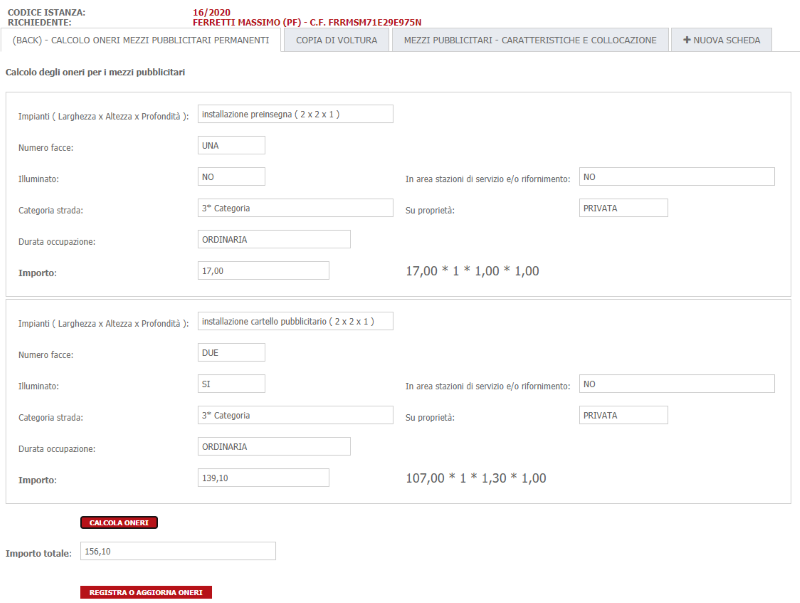

# Mezzi pubblicitari
Di seguito viene utilizzata la procedura per il calcolo COSAP dei mezzi pubblicitari

I dati necessari ai fini del calcolo vengono richiesti tramite una scheda dinamicha nel Front-End e sono i seguenti:

| Parametro | Descrizione |
| --------- | ----------- |
| **Tipo di impianto** | Tipologia dell'impianto per cui si stà presentando la domanda( es. Mezzi pubblicitari, presinsegne, ... ) |
| **Dimensioni** | Larghezza, Lunghezza e Profondità dell'impianto di cui sopra |
| **Localizzazione** | Localizzazione dell'intervento composta da Via, Km e Metro |
| **Tipo di occupazione** | Con occupazione di proprietà stradale o senza occupazione di proprietà stradale |
| **Durata occupazione** | Se permanente o temporanea. In caso di occupazione temporanea va chiesta anche la durata in giorni o comunque una data inizio e una data fine |
| **Coefficienti maggiorativi** | Potrebbero essere presenti dei coefficienti maggiorativi a seconda che si tratti di mezzo pubblicitario con illuminazione o senza, oppure in area di servizio o no, oppure che sia monofacciale o bifacciale ( quest'ultimo nel caso di CSI non è un coefficiente maggiorativo ma è scolpito nel tipo di impianto ) |


In base a questi parametri vengono create delle mappature che portano a degli importi e/o a dei coefficienti moltiplicativi. Fare riferimento alla configurazione fatta per il CSI e riportata più avanti per degli esempi concreti

## Algoritmi di calcolo
Il **Corrispettivo per i mezzi pubblicitari permanenti** è stato calcolato secondo questo algoritmo  (Tariffa derivante dalle dimensioni, tipo di impianto, occupazione stradale o meno e categoria di strada) x ( numero di impianti ) x ( Coefficiente maggiorativo illuminazione ) x ( Coefficiente maggiorativo impianto in area di servizio )

Il **Corrispettivo per le preinsegne** non tiene conto delle dimensioni per stabilire la tariffa, per il resto è identico (Tariffa derivante dal tipo di impianto, occupazione stradale o meno e categoria di strada) x ( numero di impianti ) x ( Coefficiente maggiorativo illuminazione ) x ( Coefficiente maggiorativo impianto in area di servizio )

Il **Corrispettivo per i mezzi pubblicitari temporanei** dipende anche dalla durata dell’autorizzazione pertanto l'algoritmo è lo stesso dei permanenti moltiplicato per i giorni di occupazione

## Calcolo della scadenza
I corrispettivi per i mezzi permanenti e le preinsegne hanno come scadenza il 30/06 mentre per quelli temporanei la scadenza è prima del rilascio dell'autorizzazione

## Scheda dinamica per il calcolo


Di seguito verranno illustrate le formule utilizzate. **Tali formule potrebbero subire variazioni nel corso del tempo che non verranno riportate in questo documento per cui trattarle semplicemente come spunto**

## Formule condivise
Sono state definite una serie di costanti che identificano le causali oneri da utilizzare, le tipologie di aree che contengono le categorie delle strade e altri messaggi. In generale contengono tutti i valori fissi che potrebbero variare nel tempo

```
private static class Constants
{
	public const string ChiavePreinsegna = "PERMTEMP3";
	public const string ChiaveRaggPreinsegne = "MP_PREINSEGNE";
	public const string ChiaveRaggMonofacciali = "MP_MONOFACCIA";
	public const string ChiaveRaggBifacciali = "MP_BIFACCIALI";
	public const string ChiaveFascia0 = "FASCIA0";
	public const string ChiaveFascia1 = "FASCIA1";
	public const string ChiaveFascia2 = "FASCIA2";
	public const string ChiaveFascia3 = "FASCIA3";
	public const string ChiaveFascia4 = "FASCIA4";
	public const string ChiaveFascia5 = "FASCIA5";
	public const string DueFacce = "DUE";
	public const string ConOccupazione = "OCCUPAZIONE_SI";
	public const string SenzaOccupazione = "OCCUPAZIONE_NO";
	public const string Illuminato = "SI";
	public const string OccupazionePermanente = "ORDINARIA";
	public const string OccupazioneTemporanea = "TEMPORANEA (dal {0} al {1})";
	public const int IdCausaleCanone = 4;
	public const int CodiceTipoArea = 3;
	public const string PropDemaniale = "DEMANIALE";
}
```

Di seguito viene mostrata la funzione richiamata al caricamento della scheda per impostare i valori iniziali
```
public void SetDescrizioneImpianti()
{

	var impianti      	= TrovaCampo("COSAP-MEZZI-PUBBLICITARI-IMPIANTI");
	var facce	      	= TrovaCampo("COSAP-NUMERO-FACCE");
	var illuminazione 	= TrovaCampo("COSAP-ILLUMINATO");
	var descDurata		= TrovaCampo("COSAP-PUBBLICITA-PERMANENTE");
	var descCategoria	= TrovaCampo("COSAP-PUBBLICITA-CATEGORIA-STRADA");
	var occupazioneStr  = TrovaCampo("COSAP-PUBBLICITA-OCCUPAZIONE-STRADALE");
	var inAreaServizio	= TrovaCampo("COSAP-AREA-SERVIZIO");
	
	var interventi 	= IstanzaCorrente.IstanzeDyn2Dati.Where( x => x.CampoDinamico.Nomecampo == "PUBBLICITA_INTERVENTO" );
	var larghezze  	= IstanzaCorrente.IstanzeDyn2Dati.Where( x => x.CampoDinamico.Nomecampo == "DIMENSIONI_LARGHEZZA" );
	var lunghezze  	= IstanzaCorrente.IstanzeDyn2Dati.Where( x => x.CampoDinamico.Nomecampo == "DIMENSIONI_LUNGHEZZA" );
	var profondita 	= IstanzaCorrente.IstanzeDyn2Dati.Where( x => x.CampoDinamico.Nomecampo == "DIMENSIONI_PROFONDITA" );
	var numFacce   	= IstanzaCorrente.IstanzeDyn2Dati.Where( x => x.CampoDinamico.Nomecampo == "PUBBLICITA_FACCE" );
	var illuminati 	= IstanzaCorrente.IstanzeDyn2Dati.Where( x => x.CampoDinamico.Nomecampo == "PUBBLICITA_LUMINOSITA" );
	var durata		= IstanzaCorrente.IstanzeDyn2Dati.Where( x => x.CampoDinamico.Nomecampo == "PERIODO_INSTALLAZIONE");
	var durata_da	= IstanzaCorrente.IstanzeDyn2Dati.Where( x => x.CampoDinamico.Nomecampo == "PERIODO_INSTALLAZIONE_DA");
	var durata_a	= IstanzaCorrente.IstanzeDyn2Dati.Where( x => x.CampoDinamico.Nomecampo == "PERIODO_INSTALLAZIONE_A");
	var proprieta	= IstanzaCorrente.IstanzeDyn2Dati.Where( x => x.CampoDinamico.Nomecampo == "TIPO_AREA");
	
	if( interventi != null )
	{
		var i = 0;
		foreach (var intervento in interventi)
		{
			var lar = larghezze.Where(x => x.Indice == intervento.Indice && x.IndiceMolteplicita == intervento.IndiceMolteplicita).Select(y => y.Valore).FirstOrDefault();
			var lun = lunghezze.Where(x => x.Indice == intervento.Indice && x.IndiceMolteplicita == intervento.IndiceMolteplicita).Select(y => y.Valore).FirstOrDefault();
			var pro = profondita.Where(x => x.Indice == intervento.Indice && x.IndiceMolteplicita == intervento.IndiceMolteplicita).Select(y => y.Valore).FirstOrDefault();
			var fac = numFacce.Where(x => x.Indice == intervento.Indice && x.IndiceMolteplicita == intervento.IndiceMolteplicita).Select(y => y.Valore).FirstOrDefault();
			var ill = illuminati.Where(x => x.Indice == intervento.Indice && x.IndiceMolteplicita == intervento.IndiceMolteplicita).Select(y => y.Valore).FirstOrDefault();
			var dur = durata.Select(y => y.Valoredecodificato).FirstOrDefault();
			var dda = durata_da.Select(y => y.Valoredecodificato).FirstOrDefault();
			var d_a = durata_a.Select(y => y.Valoredecodificato).FirstOrDefault();
			var prop = proprieta.Select(y => y.Valoredecodificato).FirstOrDefault();
		
			impianti.ListaValori[i].Valore = intervento.Valoredecodificato + " ( " + lar + " x " + lun + " x " + pro + " )";
			facce.ListaValori[i].Valore = fac;
			illuminazione.ListaValori[i].Valore = ill;
			descDurata.ListaValori[i].Valore = ( dur == "1" ) ? Constants.OccupazionePermanente : String.Format(Constants.OccupazioneTemporanea,dda,d_a);
			descCategoria.ListaValori[i].Valore = this.getCategoriaStrada().Denominazione.ToString();
			occupazioneStr.ListaValori[i].Valore = prop;
			inAreaServizio.ListaValori[i].Valore = "NO";
			i++;
		}
	}
}
```

Il metodo che effettua le chiamate pe il calcolo vero e proprio
```
public void CalcolaOneri()
{


	var campoImporto 	 = TrovaCampo("COSAP-PUBBLICITA-ONERE-IMPIANTO");
	var campoDescCalcolo = TrovaCampo("COSAP-PUBBLICITA-ONERE-IMPIANTO-DESCRIZIONE");
	var campoTotaleOneri = TrovaCampo("COSAP-PUBBLICITA-TOTALE-ONERI");

	var requests = this.richieste();

	var authInfo = CheckToken();
	
	var service = new Init.SIGePro.Manager.Logic.Cosap.CSIPiemonte.MezziPubblicitari.CalcoloCosapMezziPubblicitariService();
	
	var i = 0;
	var totale = 0.0d;
	foreach(var request in requests )
	{
		var response = service.CalcolaImporti(request,authInfo);
		
		campoImporto.ListaValori[i].Valore = response.Canone.Importo.ToString();
		campoDescCalcolo.ListaValori[i].Valore = response.Canone.SpiegazioneFormula;
		
		totale += response.Canone.Importo.Valore;
		
		i++;
	}
	
	campoTotaleOneri.Valore = new Init.SIGePro.Manager.Logic.Cosap.CSIPiemonte.Importo(totale).ToString();
}
```

il metodo sopra, ad un certo punto deve raccogliere i parametri per il calcolo e passarli alla libreria .NET che effettua il calcolo. La raccolta dei parametri avviene con una chiamata al metodo seguente
```
private List<Init.SIGePro.Manager.Logic.Cosap.CSIPiemonte.MezziPubblicitari.Permanenti.CalcoloMezziPermanentiRequest> richieste()
{

	var retVal = new List<Init.SIGePro.Manager.Logic.Cosap.CSIPiemonte.MezziPubblicitari.Permanenti.CalcoloMezziPermanentiRequest>();
	var interventi 	= IstanzaCorrente.IstanzeDyn2Dati.Where( x => x.CampoDinamico.Nomecampo == "PUBBLICITA_INTERVENTO" );
	
	if( interventi != null )
	{
		var i = 0;
		var codici = "";
		foreach (var intervento in interventi)
		{
			int numeroMezzi = 1;
			string tipoImpianto = this.getTipoImpianto(i);
			string classeDimensione = this.getClasseDimensione(i);
			string categoriaStrada = this.getCategoriaStrada().CodiceArea.ToString();
			string occupazioneStrada = this.getOccupazioneStrada();
			bool illuminazione = this.conIlluminazione(i);
			bool areaServizio = this.inAreaServizio(i);
			
			codici += intervento.Valore + "-" + numeroMezzi.ToString() + "-" + tipoImpianto + "-" + classeDimensione + "-" + categoriaStrada + "-" + occupazioneStrada + "-" + illuminazione.ToString() + "-" + areaServizio + "<br>";			
			
			//throw new Exception(numeroMezzi.ToString() + "-" + tipoImpianto + "-" + classeDimensione + "-" + categoriaStrada + "-" + occupazioneStrada + "-" + illuminazione.ToString() + "-" + areaServizio);

			
			retVal.Add( new Init.SIGePro.Manager.Logic.Cosap.CSIPiemonte.MezziPubblicitari.Permanenti.CalcoloMezziPermanentiRequest(numeroMezzi,
				tipoImpianto,classeDimensione,categoriaStrada,occupazioneStrada,illuminazione,areaServizio));
				
			i++;
		}
		
		//throw new Exception(codici);
	}
	
	return retVal;
}
```
il metodo seguente invece inserisce gli oneri nella pratica
```
public void InserisciOnere( )
{
	var scadenzaCanone = this.getDataScadenzaCanone();
	var codiceIstanza = Convert.ToInt32( IstanzaCorrente.CODICEISTANZA );
	
	var oneri = new List<Init.SIGePro.Manager.Logic.GestioneOneri.OnereDaRegistrare>();
	
	//importo corrispettivo
	var importoCanone = TrovaCampo("COSAP-PUBBLICITA-TOTALE-ONERI").GetValoreODefault(0.0d);
	if( importoCanone > 0 )
	{	
		oneri.Add(new Init.SIGePro.Manager.Logic.GestioneOneri.OnereDaRegistrare( codiceIstanza, Constants.IdCausaleCanone, importoCanone, scadenzaCanone ));
	}
		
	var authInfo = CheckToken();
	new Init.SIGePro.Manager.Logic.GestioneOneri.OneriService(authInfo).AggiornaOInserisciByIdCausale(oneri);
	
	
	//richiamare la registrazione degli oneri
	TrovaCampo("COSAP-ONERI-INVIATI").Valore = "Oneri registrati correttamente in data " + DateTime.Now.ToString("dd/MM/yyyy");
	
	ModelloCorrente.Salva();
	ModelloCorrente.RichiediReloadInterfaccia();
}
```
per verificare se c'è almeno un onere pagato tra quelli utilizzati dal calcolo viene utilizzato il seguente metodo
```
public bool OnerePagato()
{

	var authInfo = CheckToken();
	var codiceIstanza = Convert.ToInt32( IstanzaCorrente.CODICEISTANZA );
	
	return new Init.SIGePro.Manager.Logic.GestioneOneri.OneriService(authInfo).OnerePagato(codiceIstanza, Constants.IdCausaleCanone);

}
```

e infine tutta la lista di metodi accessori creati per semplificare la lettura delle formule in un ambito complesso come questo
```
private DateTime getDataScadenzaCanone(){
	string data = "31/10/" + DateTime.Now.Year.ToString();
	var dataScadenza = DateTime.ParseExact(data, "dd/MM/yyyy",null);
	
	if( DateTime.Compare( dataScadenza, DateTime.Now ) < 0 )
	{
		return dataScadenza.AddYears(1);
	}
	
	return dataScadenza;
}


private string getTipoImpianto(int indice)
{
	var facce = IstanzaCorrente.IstanzeDyn2Dati.Where( x => x.CampoDinamico.Nomecampo == "PUBBLICITA_FACCE" && x.IndiceMolteplicita == indice )
					.Select( y => y.Valore)
					.FirstOrDefault();


	var impianto = IstanzaCorrente.IstanzeDyn2Dati.Where( x => x.CampoDinamico.Nomecampo == "PUBBLICITA_INTERVENTO" && x.IndiceMolteplicita == indice )
			.Select( y => y.Valore)
			.FirstOrDefault();
		
	if( impianto == Constants.ChiavePreinsegna ) 
	{
		return Constants.ChiaveRaggPreinsegne;
	}
	
	return ( facce == Constants.DueFacce ) ? Constants.ChiaveRaggBifacciali : Constants.ChiaveRaggMonofacciali;
}

private string getClasseDimensione(int indice)
{
	if( this.getTipoImpianto(indice) == Constants.ChiaveRaggPreinsegne )
		return Constants.ChiaveFascia0;

	var facce = IstanzaCorrente.IstanzeDyn2Dati.Where( x => x.CampoDinamico.Nomecampo == "PUBBLICITA_FACCE" && x.IndiceMolteplicita == indice )
					.Select( y => y.Valore)
					.FirstOrDefault();
	
	var larghezza = IstanzaCorrente.IstanzeDyn2Dati.Where( x => x.CampoDinamico.Nomecampo == "DIMENSIONI_LARGHEZZA" && x.IndiceMolteplicita == indice )
					.Select( y => y.Valore)
					.FirstOrDefault();
	
	var lunghezza = IstanzaCorrente.IstanzeDyn2Dati.Where( x => x.CampoDinamico.Nomecampo == "DIMENSIONI_LUNGHEZZA" && x.IndiceMolteplicita == indice )
					.Select( y => y.Valore)
					.FirstOrDefault();	
	
	
	var numFacce = ( facce == Constants.DueFacce ) ? 2.0d : 1.0d;
	var dLarghezza = ( String.IsNullOrEmpty(larghezza) )? 0.0d : Convert.ToDouble(larghezza);
	var dLunghezza = ( String.IsNullOrEmpty(lunghezza) )? 0.0d : Convert.ToDouble(lunghezza);

	var dimensioni = dLarghezza * dLunghezza * numFacce;
	
	if( dimensioni <= 3.0d ) 
		return Constants.ChiaveFascia1;
	
	if( dimensioni <= 4.5d ) 
		return Constants.ChiaveFascia2;
	
	if( dimensioni <= 6.0d ) 
		return Constants.ChiaveFascia3;

	if( dimensioni <= 9.0d ) 
		return Constants.ChiaveFascia4;
		
	if( dimensioni <= 12.0d ) 
		return Constants.ChiaveFascia5;

	return null;
}

private Init.SIGePro.Manager.Logic.GestioneStradario.DettaglioArea getCategoriaStrada()
{
	return this.getCategoriaStrada(0);
}

private Init.SIGePro.Manager.Logic.GestioneStradario.DettaglioArea getCategoriaStrada(int indice)
{
	var codiceStradario = Convert.ToInt32( IstanzaCorrente.IstanzeDyn2Dati.Where( x => x.CampoDinamico.Nomecampo == "LOCALIZZAZIONE_STRADA" && x.IndiceMolteplicita == indice )
					.Select( y => y.Valore)
					.FirstOrDefault() );
	
	var km = Convert.ToDouble( IstanzaCorrente.IstanzeDyn2Dati.Where( x => x.CampoDinamico.Nomecampo == "LOCALIZZAZIONE_KM_FINALE" && x.IndiceMolteplicita == indice )
					.Select( y => y.Valore)
					.FirstOrDefault() );
					
	var metro = Convert.ToInt32( IstanzaCorrente.IstanzeDyn2Dati.Where( x => x.CampoDinamico.Nomecampo == "LOCALIZZAZIONE_METRO_FINALE" && x.IndiceMolteplicita == indice )
					.Select( y => y.Valore)
					.FirstOrDefault());
	
	var request = new Init.SIGePro.Manager.Logic.GestioneStradario.TrovaAreaDaKmRequest( Constants.CodiceTipoArea, codiceStradario, km, metro );
	
	var authInfo = CheckToken();
	var response = new Init.SIGePro.Manager.Logic.GestioneStradario.GestioneAreeService(authInfo).TrovaArea(request);
	
	if( response == null || response.Count() == 0 )
		return new Init.SIGePro.Manager.Logic.GestioneStradario.DettaglioArea();
		
	if( response.Count() > 1 )
		throw new Exception( String.Format("Impossibile identificare in maniera univoca la categoria stradale. Trovati {0} risultati", response.Count()));

	return response.FirstOrDefault();
}

private string getOccupazioneStrada()
{
	return getOccupazioneStrada(0);
}

private string getOccupazioneStrada(int indice)
{

	var proprieta = IstanzaCorrente.IstanzeDyn2Dati.Where( x => x.CampoDinamico.Nomecampo == "TIPO_AREA" && x.IndiceMolteplicita == indice )
					.Select( y => y.Valoredecodificato)
					.FirstOrDefault();
	return ( proprieta == Constants.PropDemaniale ) ? Constants.ConOccupazione : Constants.SenzaOccupazione;
}

private bool conIlluminazione(int indice)
{
	var illuminato 	= IstanzaCorrente.IstanzeDyn2Dati.Where( x => x.CampoDinamico.Nomecampo == "PUBBLICITA_LUMINOSITA" && x.IndiceMolteplicita == indice )
						.Select( y => y.Valore)
						.FirstOrDefault();
	return illuminato == Constants.Illuminato;
}

private bool inAreaServizio(int indice)
{
	return false;
}


public bool OnereCalcolato()
{
	return !String.IsNullOrEmpty(TrovaCampo("COSAP-PUBBLICITA-ONERE-IMPIANTO").ListaValori[0].GetValoreODefault(""));
}
```

## Formule al caricamento
Al caricamento della scheda vengono inizializzati i vaolori necessari e mostrati/nascosti i bottoni di calcolo e di pagamento a seconda che l'onere sia già stato pagato oppure sia già stato calcolato

```
SetDescrizioneImpianti();

if( !OnereCalcolato() ) 
{
	NascondiCampiDinamici(new []{"COSAP-REGISTRA-ONERI"}, 0);
	return 0;
}

if( OnerePagato() )
{
	NascondiCampiDinamici(new []{"COSAP-CALCOLA-ONERI","COSAP-REGISTRA-ONERI"}, 0);
	return 0;
}
```

## Formule alla modifica di un campo
Anche in questo caso vengono mostrati/nascosti campi oppure avviato il calcolo o la registrazione degli oneri
```
switch( CampoModificato.NomeCampo ){
	case "COSAP-CALCOLA-ONERI": 
		CalcolaOneri();
		MostraCampiDinamici(new []{"COSAP-REGISTRA-ONERI"}, 0);
		break;
	case "COSAP-REGISTRA-ONERI":
		InserisciOnere();
		break;
	default:
		break;
}
```