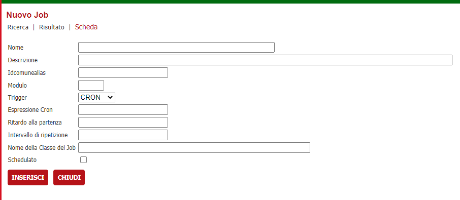
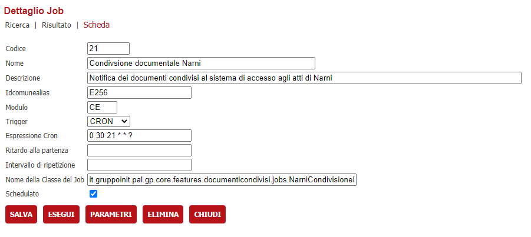

# Condivisione documentale
La funzionalità, a fronte della protocollazione di una istanza o di un movimento, permette di copiare in un percorso condiviso ( ad oggi FTP ) i documenti inviati al protocollo

## Prerequisiti
1. VBG versione 2.78 o superiore
2. Parametri per l'accesso ad un percorso FTP per la condivisione


## Configurazione

### Account FTP

Il primo passo è inserire nella tabella ACCOUNT_FTP del backoffice i dati per accedere all'indirizzo FTP. Allo stato attuale non è ancora presente un'interfaccia di gestione per questa tabella ma se ne prevede lo sviluppo in futuro.


I dati da inserire sono i seguenti:

```
IDCOMUNE: identificativo dell' installazione 
ID: numero progressivo 
INDIRIZZO: indirizzo ftp nella forma ftp://indirizzoftp:2121/
UTENTE: utente utilizzato per accedere in FTP
PASSWORD: password per accedere in FTP
UTENTEPROXY: utente del proxy ( solo se presente un proxy )
PASSWORDPROXY: password del proxy ( solo se presente un proxy )
FTP_ATTIVO: 0 se deve essere utilizzata la modalità passiva, altrimenti 1
FTP_ASCI: 1 per la modalità ASCII altrimenti 0 per quella binaria ( si consiglia di impostare comunque a 1 )
```


### Verticalizzazione CONDIVISIONE_DOCUMENTALE

Il secondo passo è configurare la verticalizzazione 	**CONDIVISIONE_DOCUMENTALE** la quale permette, al sistema, di gestire gli eventi di protocollazione e quindi prendere atto dei documenti che sono stati protocollati


L'unico parametro che va impostato è ID_ACCOUNT_FTP in cui va inserito l'ID ( ACCOUNT_FTP.ID ) dell'account descritto nella sezione *Account ftp*

## Funzionamento
Terminata la parte di configurazione, il sistema è in grado di "segnare" in due tabelle apposite ( DOCUMENTI_CONDIVISI e DOCUMENTI_CONDIVISI_LOG ) i documenti che, di volta in volta, vengono protocollati per poter poi essere condivisi in FTP tramite JOB schedulato nel backoffice.

## Schedulazione
L'invio dei documenti nel sistema FTP avviene in maniera asincrona che potrebbe variare a seconda della mole di dati e dell'utilizzo del backoffice ( ad esempio potrebbe essere fatto di sera quando gli operatori non usano il backoffice ), pertanto va schedulato attraverso un JOB di backoffice fatto ad hoc per l'Ente ( richiede supporto da parte del team di sviluppo ).

### Creazione del JOB
Accedere al pannello amministrativo del backoffice e premere il pulsante **SCHEDULER** e poi **NUOVO**



Per una nuova schedulazione, le informazioni da inserire sono le seguenti:

* Nome: descrizione sintetica del JOB 
* Descrizione: descrizione estesa esplicativa del JOB 
* Idcomunealias: Alias ( non idcomune ) dell installazione
* Modulo: Modulo software
* Trigger: allo stato attuale selezionare CRON
* Espressione Cron: Espressione CRON/Quartz di schedulazione. E possibile utilizzare questo link [Cron Expression Generator using Quartz](https://www.freeformatter.com/cron-expression-generator-quartz.html) per generare una espressione valida
* Ritardo alla partenza: Vale solamente per i trigger di tipo SIMPLE. Indica in millisecondi se deve essere ritardata la partenza
* Intervallo di ripetizione: Vale solamente per i trigger di tipo SIMPLE. Indica se l'operazione deve essere ripetuta ogni X millisecondi  
* Nome della Classe del Job: qui dentro va indicata la classe JAVA di backend.war che esegue la schedulazione
* Schedulato: Se spuntato, il JOB verrà eseguito in maniera schedulata e sarà possibile testarlo. 

**E' necessario spuntare la schedulazione e riavviare il tomcat anche solo per poterlo testare tramite il pulsante ESEGUI in quanto altrimenti il job non viene preventivamente caricato in memoria**

## Esempio del JOB schedulato per il comune di Narni
Per il comune di Narni è stata impostata una condivisione documentale che viene eseguita con cadenza giornaliera, in orario non lavorativo, la quale esamina tutti i documenti protocollati non ancora inviati al documentale, verifica che le pratiche di appartenenza di questi documenti rispettino i seguenti criteri:
* Siano pratiche chiuse positivamente
* Nelle pratiche deve essere presente il fabbricato nella localizzazione primaria

Di seguito il JOB schedulato per Narni

