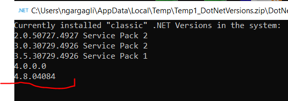
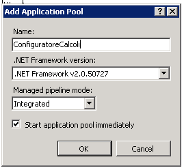
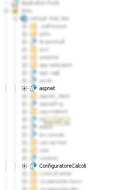

#Manuale di installazione / aggiornamento

## Versione 2.110
Si ricorda che a partire dalla versione 2.106 è stata rotta la compatibilità con il framework .net 4.0 quindi:

- I server con Windows 2003 Server non sono più supportati
- Il framework 4.8 deve essere installato nel server

## Prerequisiti

Prima di iniziare l'attività di aggiornamento verificare che il framework 4.8 sia installato nel server.
Eventualmente l'aggiornamento va coordinato con il CED del comune prima di procedere con l'installazione del configuratore dei calcoli.
(Il framework 4.8 dovrebbe essere installato in tutte le versioni server con gli ultimi service pack aggiornati ).

Per verificare la versione del framework .net installata utilizzare il software scaricabile a questo indirizzo: [https://github.com/jmalarcon/DotNetVersions/releases/download/v1.0.0/DotNetVersions.zip](https://github.com/jmalarcon/DotNetVersions/releases/download/v1.0.0/DotNetVersions.zip) e verificare che nell'output sia presente la versione 4.8

Nel caso in cui il framework non sia installato pianificare un aggiornamento completo della macchina con il CED.
Nel caso in cui ciò non sia possibile i pacchetti di installazione sono scaricabili all'indirizzo: [https://support.microsoft.com/it-it/topic/programma-di-installazione-offline-di-microsoft-net-framework-4-8-per-windows-9d23f658-3b97-68ab-d013-aa3c3e7495e0](https://support.microsoft.com/it-it/topic/programma-di-installazione-offline-di-microsoft-net-framework-4-8-per-windows-9d23f658-3b97-68ab-d013-aa3c3e7495e0) 

## Installazione del Configuratore Calcoli

1. Scaricare da devel3 gli zip contenenti il Configuratore Calcoli ( _2.110_configuratorecalcoli.zip_ )
2. Estrarre i files scaricati nella cartella **/ConfiguratoreCalcoli**
3. Nel file **appsettings.json** impostare i parametri relativi alla security ( l'utente applicativo da utilizzare e USERFO )
4. Aggiungere al file .hosts della macchina la seguente entry

    > 12.34.56.78		vbg.security

    Sostituendo al valore 12.34.56.78 l'indirizzo IP del server del security
    
5. Creare un pool di applicazioni dedicato ( consigliato per non dare fastidio alle altre applicazioni )

6. Creare l'applicazione sotto IIS allo stesso livello di aspnet

