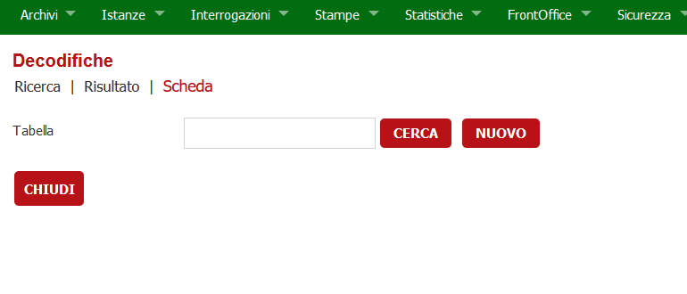
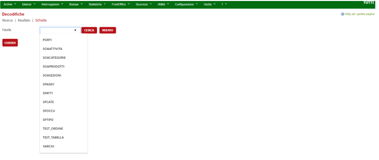
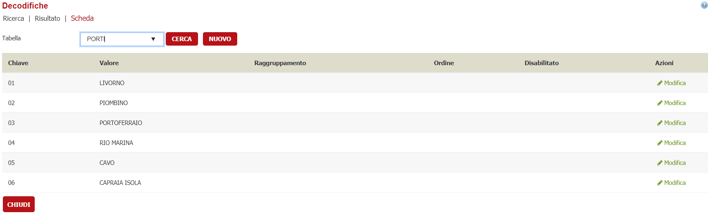
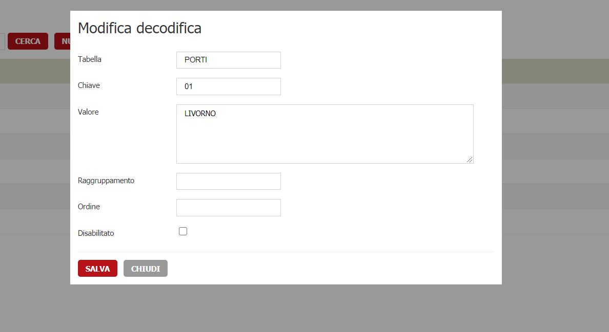
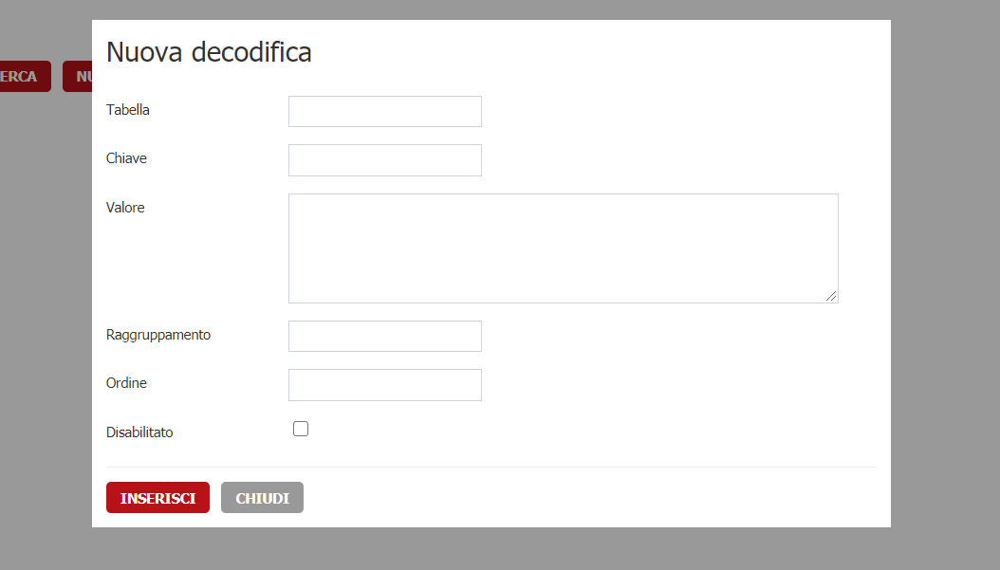
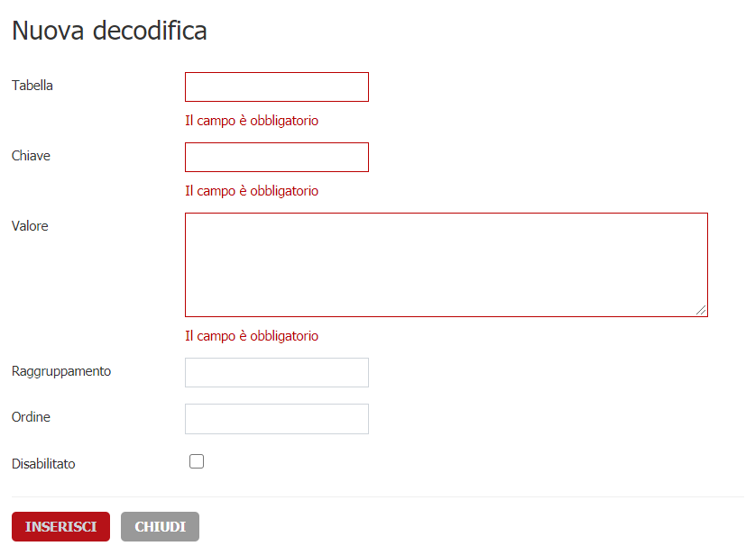

# GESTIONE DECODIFICHE

È possibile accedere all'interfaccia dai seguenti collegamenti nel menu.
>Archivi di Base-> Tabelle-> Gestione decodifiche.

Il collegamenti precedenti ti porteranno alla seguente maschera.

Da questa pagina puoi cercare in base al nome della tabella. L'input di ricerca suggerirà un elenco di tabelle già esistenti nel database .

Se si fa clic su uno dei suggerimenti, apparirà un elenco delle righe della tabella **DECODIFICHE** che hanno come tabella quella specificata nella ricerca.

Dall'elenco è possibile modificare una voce facendo clic sull'icona **modifica**. Ciò aprirà un popup con un modulo in cui puoi modificare i campi elencati e salvare cliccando il bottone **SALVA**.

Infine hai la possibilità di inserire un nuovo record nella tabella del database facendo clic sul pulsante **NUOVO**. Si aprirà un popup in cui è possibile compilare i campi richiesti.

>NB. Se hai fornito il nome della tabella prima di aprire il modulo di inserimento, il campo **Tabella** del modulo di inserimento sarà popolato con il nome fornito.

Nei moduli di inserimento e modifica, ci sono meccanismi  di validazione per aiutarti a compilare correttamente i campi.

