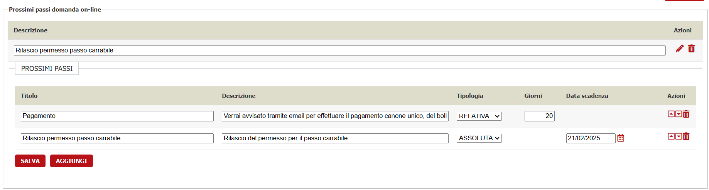
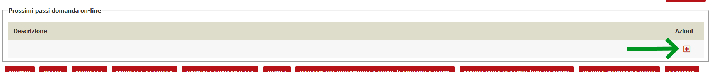
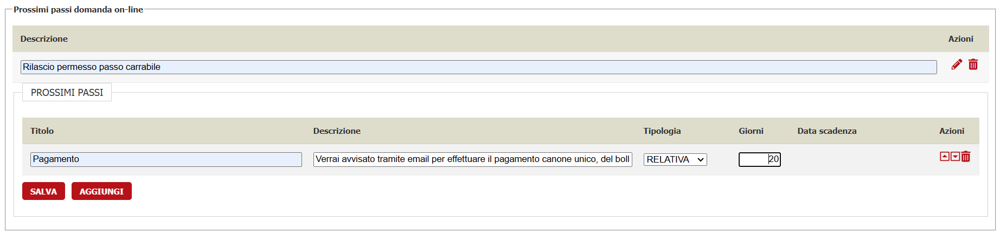
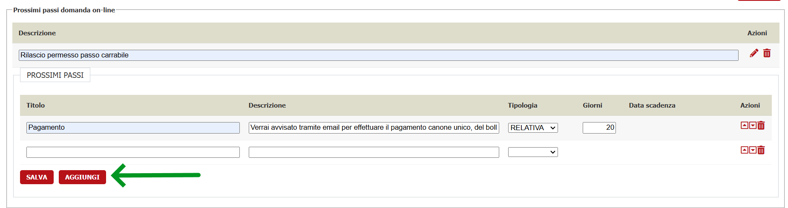
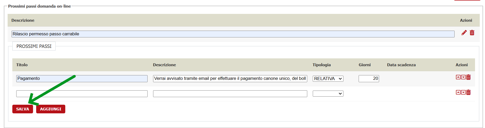

# Configurazione din un intervento per permettere la compilazione tramite Domanda On Line

## Pubblicazione dell'intervento tramite Domanda On Line

La DOL permette di compilare solamente gli interventi che hanno come regola di pubblicazione "Solo Domanda on line"

Occorre quindi impostare nel dettaglio dell'intervento il campo "Pubblica" su "Solo Domanda on line" (il valore è comunque ereditabile dal padre)

## Configurazione workflow

Il workflow di un intervento presentabile tramite DOL è molto simile a quello di una domanda dell'area riservata tuttavia presenta alcune differenze utili per una migliore visualizzazione delle varie sezioni.

Per i dettagli vedi sezione dedicata: [Configurazione workflow](./workflow/README.md)

## Configurazione titolo dell'intervento

Di default nella parte alta della compilazione domanda verrà mostrato il titolo esteso dell'intervento (**ALBEROPROC.DESCRIZIONE_COMPLETA**) ma visto che spesso il titolo è lungo e poco chiaro è possibile specificare un titolo customizzato dell'intervento.

Per specificare un nuovo titolo dell'intervento popolare il metadato **FRONTEND_TITOLO_SERVIZIO**

E'inoltre possibile specificare una descrizione estesa dell'intervento nel metadato **FRONTEND_SOTTOTITOLO_SERVIZIO**

## Configurazione metadati intervento per attivare breadcrumb verso portale comunale

Per poter visualizzare la breadcrumb sulla parte di titolo con i link corretti è necessario popolare alcuni metadati dell'intervento affinché contengano i link al portale informativo.

Secondo le specifiche PNRR la struttura della breadcrumb dovrebbe essere la seguente:

    Home -> Servizi -> Categoria servizio -> Servizio -> Compila (non cliccabile)

I metadati interessati sono:

- **FRONTEND_URL_SCHEDA_SERVIZIO** Url della scheda servizio (es. <https://www.comune.jesi.an.it/w/passo-carrabile-nuova-richiesta-senza-lavori-di-modifica-marciapiede/cordoli-di-delimitazione->)
- **FRONTEND_NOME_CATEGORIA_SERVIZIO** Nome della categoria del servizio (es. "Catasto e urbanistica")
- **FRONTEND_URL_CATEGORIA_SERVIZIO** Url del portale comunale che punta alla categoria del servizio (es. <https://www.comune.jesi.an.it/servizi-categoria/-/category_servizi-categoria/41895>)

FRONTEND_URL_SCHEDA_SERVIZIO non è obbligatorio ma è bene che sia presente, se non presente al termine della breadcrumb verrà mostrato il nome del servizio non cliccabile

FRONTEND_NOME_CATEGORIA_SERVIZIO e FRONTEND_URL_CATEGORIA_SERVIZIO non sono obbligatori e se omessi nella breadcrumb non verrà postrata la categoria del servizio

## Configurazione tempistiche "Prossimi passi"

La sezione prossimi passi viene configurata per mostrare, al termine della presentazione della domanda, quali saranno i prossimi passi in merito alla pratica presentata.

Prendiamo ad esempio una domanda presentata in data 01-01-2025, configurando i prossimi in questo modo 

chi presenta la domanda vedrà che entro il 21-01-2025 verrà avvisato che dovrà fare un pagamento, in quanto è stata impostata **tipologia RELATIVA** e una **tempistica** di **20** gg
e che entro il 21-02-2025 verrà fatto il rilascio del permesso di passo carrabile richiesto in quanto è stata configurata una **tipologia ASSOLUTA** e una 
**Data scadenza** al **21-02-2025**

Questa sezione é svincolata sia dalle procedure che dai movimenti per cui è opportuno configurare l'iter in maniera opportuna per permettere all'Ente di rispettare le 
tempistiche indicate

La configurazione dei prossimi passi inizia entrando nel dettaglio dell'intervento desiderato, spostandosi in fondo alla pagina nella sezione **Prossimi passi domanda on-line**, e cliccando il **+** che compare sulle **Azioni**

a questo punto andranno indicati:

- **Descrizione**: un titolo che, allo stato attuale, non compare da nessuna parte ma che permette di identificare rapidamente l'ambito che stiamo configurando
- **Prossimi passi: Titolo**: Breve descrizione del prossimo passo; viene mostrato all'utente che presenta la domanda
- **Prossimi passi: Descrizione**: Ulteriore descrizione estesa del prossimo passo; viene mostrato all'utente che presenta la domanda
- **Prossimi passi: Tipologia**: Può essere **ASSOLUTA** se si vuole indicare una data fissa come scadenza del prossimo passo o **RELATIVA** se si vogliono indicare i giorni che verranno aggiunti alla data di presentazione della domanda per far calcolare al sistema la data di scadenza
- **Prossimi passi: Giorni**: Appare solamente se la tipologia è **RELATIVA** e permette di indicare il numero di giorni, a partire dalla data di presentazione della domanda, che il sistema userà per calcolare la data di scadenza
- **Prossimi passi: Data scadenza**: Appare solamente se la tipologia è **ASSOLUTA** e permette di indicare una data fissa, indipendentemente da quando viene presentata la domanda, come scadenza del prossimo passo

Continuare ad aggiungere tutti i prossimi passi che dovranno comparire nel front tramite il bottone **AGGIUNGI**

alla fine cliccare **SALVA** per confermare il salvataggio della configurazione ( non è obbligatorio salvare ad ogni operazione ma è possibile anche farlo alla fine di tutto)

