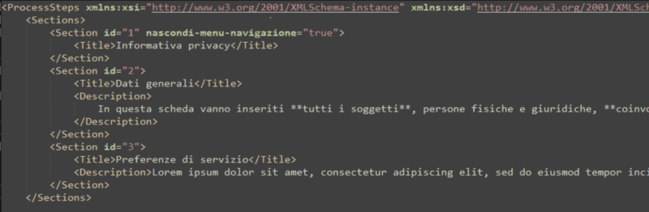
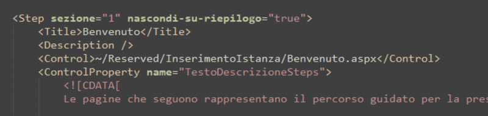

# Novità nel workflow.xml della domanda on line

Il workflow della DOL introduce il nuovo elemento "Sections". La struttura del nuovo elemento è la seguente

- Sections
  - Section (elemento, multiplo)
    - id (attributo, numerico)
    - nascondi-menu-navigazione (attributo, boolean, default "true")
    - Title (elemento, contenuto testuale)
    - Description  (elemento, contenuto testuale, markdown)

Gli elementi "Step" ora hanno due nuovi attributi:

- sezione (numerico): Indica a quale sezione appartiene lo step, l'ordine di visualizzazione sarà lo stesso in cui gli step compaiono nel workflow.xml
- nascondi-su-riepilogo (boolean): se impostato a true lo step non viene mostrato nella fase di riepilogo

## Steps supportati nella DOL

- [Gestione privacy](./privacy.md)
- TODO...