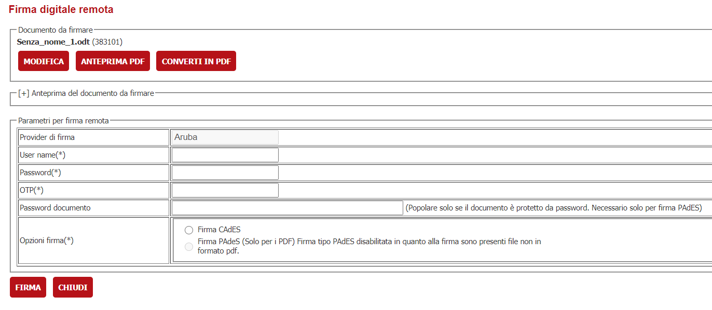
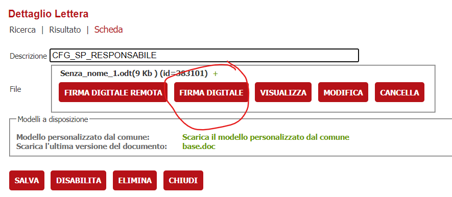
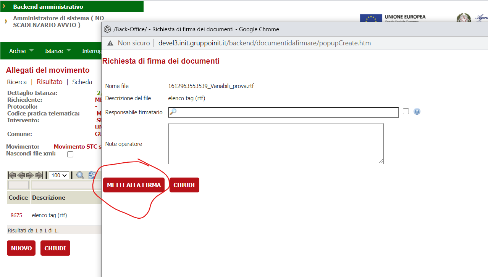

#  Conversione automatica dei documenti in fase di firma 
La funzionalità permette nelle operazioni di Firma, Firma Remota, Metti alla Firma di convertire automaticamente i file oggetto dell'operazione in PDF.
L'operazione sarà attivata automaticamente qualora il file abbia una delle estensioni configurate nell'apposito parametro.
L'operatore troverà il file automaticamente modificato al click sulla funzionalità

|Funzionalità||
|-|-|
|Firma remota||
|Firma digitale||
|Metti alla firma||

# Configurazione
1. Attivare la verticalizzazione **COMPORTAMENTO_COMPONENTE_FIRMA**
2. Attivare il parametro **CONVERTI_IN_PDF**.
Nel parametro vanno specificare la lista delle estensioni che devono essere convertite automaticamente in PDF prima di essere firmate digitalmente o messe alla firma. E' possibile indicare più estensioni separandole con ; ( Es. rtf;doc;docx;....)

