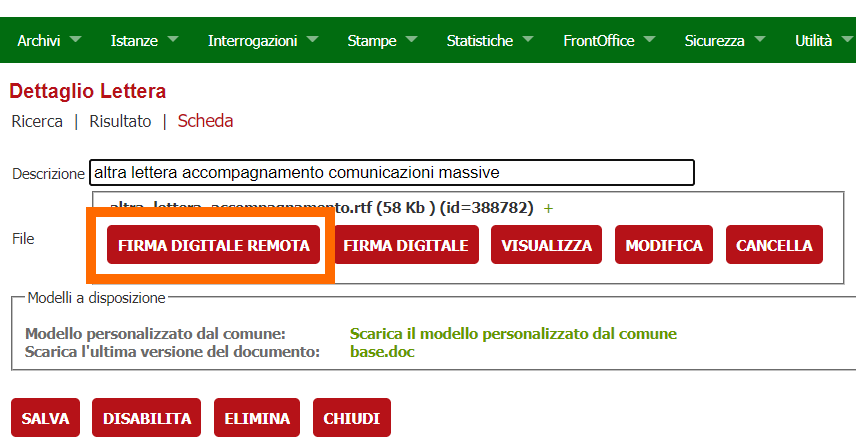
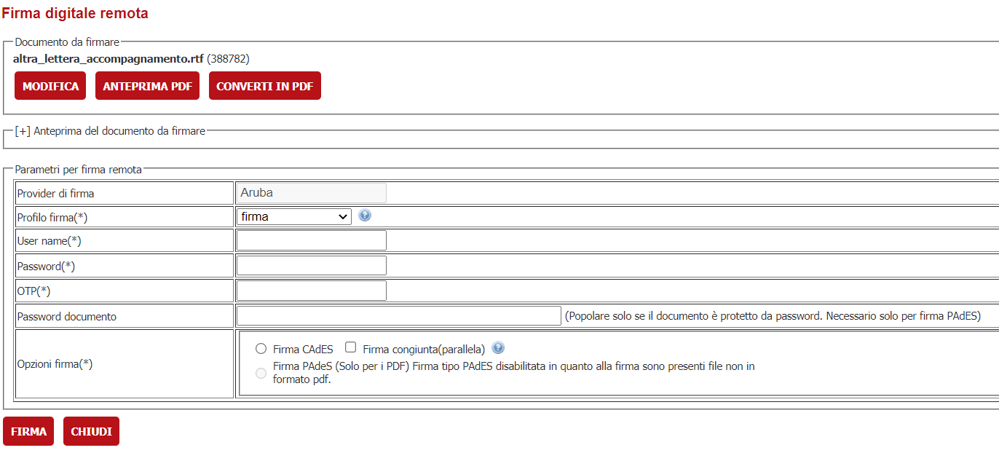

# Firma remota aruba

Se l'ente ha acquistato firme remote Aruba per gli operatori/funzionari allora è possibile utilizzare all'interno dell'applicativo di backoffice le funzionalità di firma remota.

Nelle varie funzionalità relative ai documenti nel backoffice comparirà un nuovo bottone **"FIRMA DIGITALE REMOTA"**

> 

Cliccando sul bottone si accede alla seguente schermata
> 

L'utente visualizza il file da firmare, con la possibilità di verificare l'anteprima (se supportata dal browser).

I principali parametri sono relativi all'autenticazione dell'oggetto che firma e dunque i parametri 

- Provider di firma

    - Di solito è fisso Aruba e viene impostato nelle verticalizzazioni
- Profilo di firma
    
    - Indica il dominio di autenticazione. Se la firma è stata rilasciata dall'ente di solito il dominio di autenticazione ha la forma fr&lt;IDENTIFICATIVO_DOMINIO&gt;(Es. frMioDominio).Nel caso in cui si stia utilizzando un'utenza di firma remota usare il profilo **firma**. Se non si conosce il dominio provare a firmare con entrambe per vedere quale si applica. Le informazioni saranno memorizzate dall'applicativo per le successive firme. Di solito il dominio di autenticazione è sempre uno, ma può succedere che un ente abbia acquistato firme remote da più soggetti differenti con diversi domini di autenticazione.
- User name

    -  specifica per l'utente e rilasciata da ARUBA durante l'acquisto
- Password

    -  specifica per l'utente e rilasciata da ARUBA durante l'acquisto
- OTP

    - l'OTP che viene rilasciato mediate SMS o CALL Aruba
- Password documento

    - Popolare solo se il documento è protetto da password. Necessario solo per firma PAdES

Per la firma sono disponibili le seguenti opzioni

- Firma CAdES
    - la firma CADES appone al documento una busta crittografata che contiene la firma digitale apposta. Il documento modifica l'estensione in .p7m
    
        Con la firma CAdES è possibile attivare la modalità di **firma congiunta** o **parallela** ovvero la possibilità di apporre più firme usando la stessa busta crittografica (questo al posto di aggiungere per ogni firma una busta crittografica generando file con estensioni ad esempio .p7m.p7m).
        
        
        Le firme **DIGITALI CONGIUNTE O PARALLELE** sono apposte allo stesso documento informatico da diversi soggetti utilizzando la medesima busta crittografica informatica. La firma parallela è possibile **SOLAMENTE** per file che abbiano già estensione (.p7m) ovvero precedentemente firmati.  La differenza con una seconda firma cades, nel caso in cui non si voglia firmare in modalità parallela o congiunta, è che ad ogni nuova firma viene creata una nuova busta crittografica che si sovrappone all'altra.    
        L'applicativo rilancia errore nel caso si scelga la firma congiunta ed il file non risulti già firmato. La firma congiunta **NON viene applicata ai PDF**, è il caso ad esempio del formato **PAdES**, in quanto questi non ne prevede l'utilizzo. Nel formato PAdES ogni firma è inserita in aggiunta e, pertanto, copre l'intero contenuto del file PDF di input, comprese le eventuali firme già esistenti. 

- Firma PAdES

    - la firma PAdES è disponibile solamente per i documenti con estensione .pdf e non appone una busta crittografata sopra il file ma include nel PDF la firma o le firme che via via vengono apposte al documento. La firma PAdES non modifica l'estensione del file da firmare.

# Configurazione

Per attivare la funzionalità è necessario attivare la regola **FIRMA_REMOTA_ARUBA** e configurare i parametri.

PARAMETRO | VALORE | DESCRIZIONE
---|---|---
CERT_ID|AS0|Da specifiche di Aruba valorizzare con AS0
DESCRIZIONE|Aruba|Indica il nome presentato sulla maschera di firma che permette di scegliere il provider di firma in caso ne siano presenti più di uno. Se attivo un solo provider, verrà presentato solo il nome senza la possibilità di scelta
DETACHED|0|Utilizzato per la generazione della busta CAdES senza documento originale. Può assumere i valori 0( NULL), 1. **0:** Busta CAdES contenente documento originale; **1:** Busta CAdES non contenente documento originale
IS_GENERA_OTP|0|Può assumere in valori 0(NULL) o 1. 0(NULL): non attiva la funzionalità per generare OTP, 1: attiva la funzionalità per generare OTP. La generazione dell' OTP viturtuale deve essere attivato anche a livello di servizio sul provider
IS_MARCA_TEMPORALE_RICHIESTA|0|Può assumere i valori 0(NULL),1. Utilizzato per pilotare la generazione della busta CAdES-T o PAdES-T (1); firma digitale con apposizione contestuale della marca temporale. In caso di parametro uguale ad 1, il server ARSS dovrà essere preventivamente configurato con account di marcatura temporale valido
NUM_PAGINA_FIRMA_PADES|1|Indica la pagina su cui apporre la firma; valore obbligatorio. Se non presente, di default la firma verrà apposta sull'ultima pagina
POS_RETT_FIRM_LEFT_PADES|100,100|Indica la coppia ascissa, ordinata (x,y) del margine basso del rettangolo di firma. Unità di misura espressa in px; Es. 10,6
POS_RETT_FIRM_RIGTH_PADES|150,150|Indica la coppia ascissa, ordinata (x,y) del margine alto del rettangolo di firma. Unità di misura espressa in px; Es. 10,6
PREPOPOLA_USER_NAME_CON_CF|0|Prepopola la user name con il CF dell'utente loggato. 1: attivo, 0(NULL): non attivo
PROFILO_FIRMA_PADES|BES|Indica il tipo di profilo applicato alla firma PAdES : BASIC, BES. In caso il profilo sia passato dalla maschera di firma, il valore presente sarà sovrascritto. Valore di defaul BES
RELAX_SSL|1|Può assumere i valori 0(NULL) o 1. Se 0 all'interno della JVM usata dal tomcat dovranno essere caricati i certificati associati all'indirizzo del endpoint per permettere al sistema di scaricare il wsdl per le chiamate ai servizi esposti. 1: il wsdl viene caricato dal file (ArubaSignService.wsdl) presente all'interno del backoffice e non è necessaria la configurazione dei certificati nella JVM 
RETURN_DER|1|Utilizzato per la generazione della busta CAdES in formato DER. Può assumere i valori 0 (NULL)o 1. 0: Busta CAdES in formato BER; 1: Busta CAdES in formato DER (default)
TESTO_FIRMA_PADES||Indica il testo che verrà applicato in caso di firma PAdES sul file pdf. Parametro non obbligatorio, in caso non sia valorizzato sul pdf non apparirà alcun testo, ma la firma rimarrà valida
TYPEOTPAUTH|DOMINIO DI AUTENTICAZIONE ARUBA|Stringa per indicare il dominio di autenticazione
TYPE_HSM|COSIGN|Stringa contenente il tipo di HSM. Da specifiche Aruba valorizzare con COSING
TYPE_SEND_OTP|CALL|Modalità con cui viene inviato l'otp. Possibili valori: SMS - tramite messaggio, CALL - tramite chiamata. Se attivo IS_GENERA_OTP, se NULL verrà impostato il valore di default CALL
URL_SERVIZIO|URL_SERVIZIO_WSDL|Indica l'url che espone i servizi di ARUBA per le operazioni di firma

