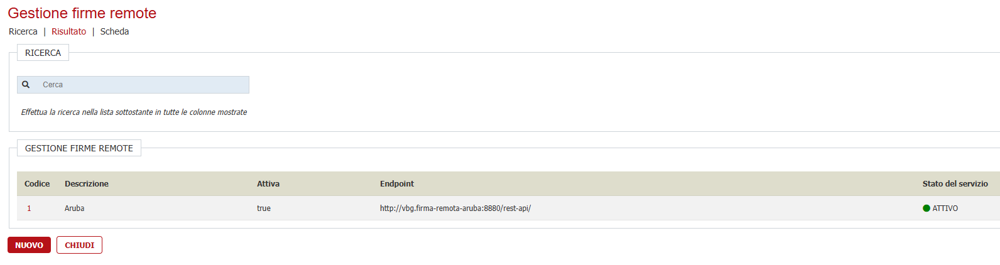
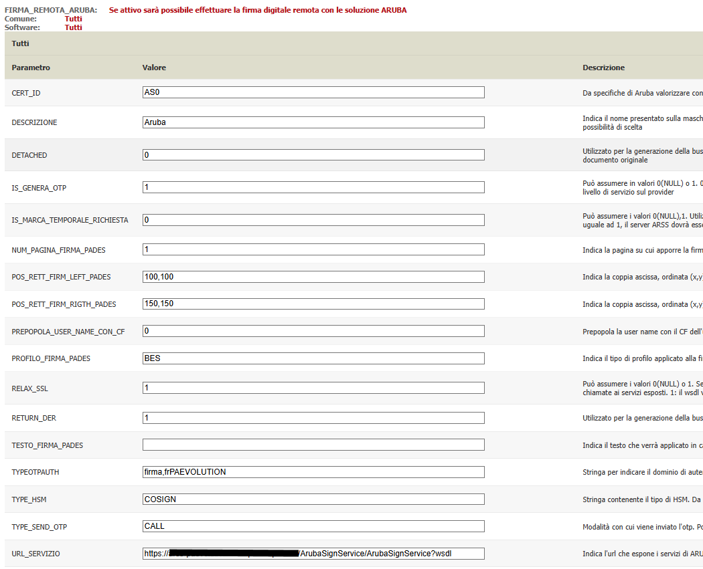
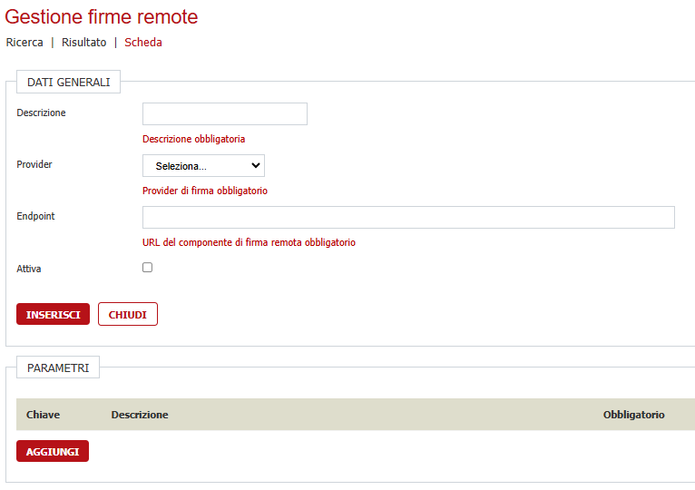
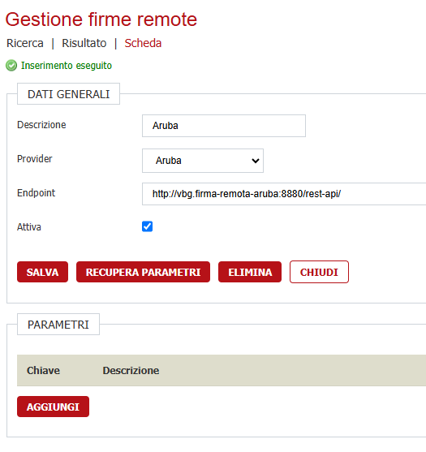
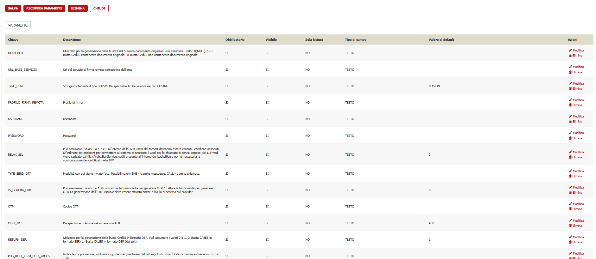
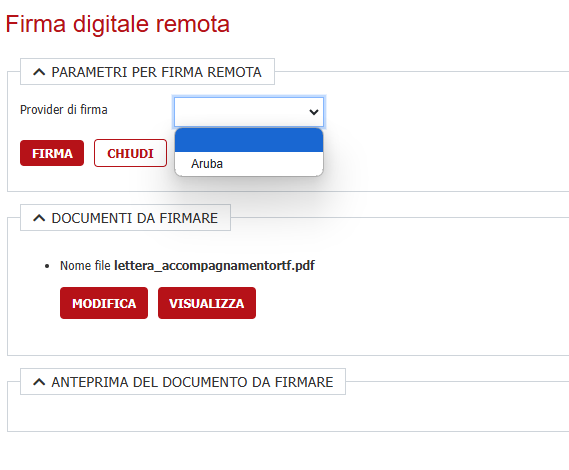
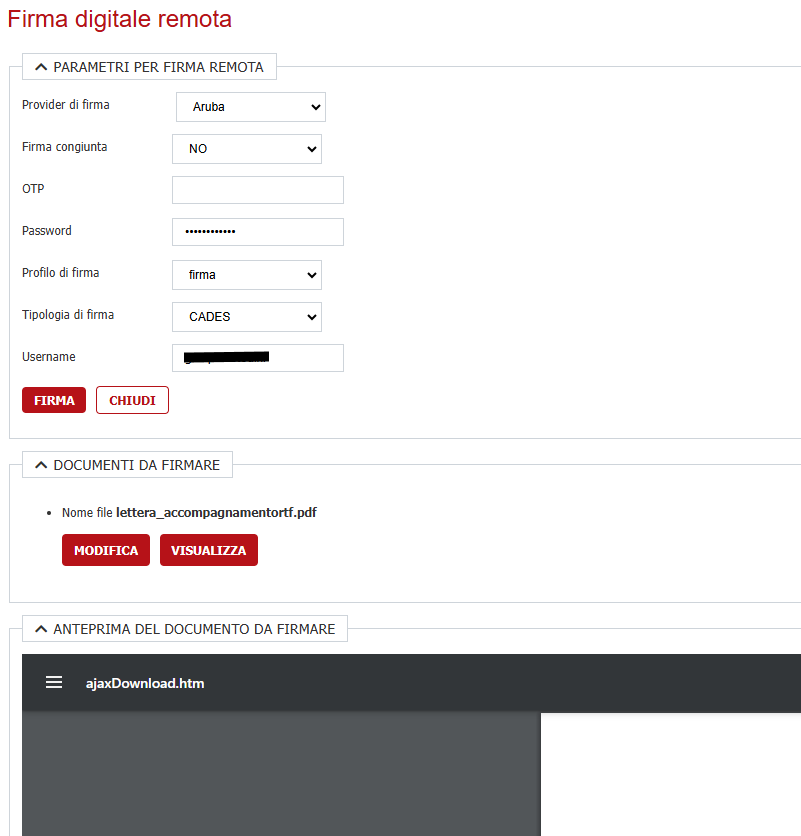
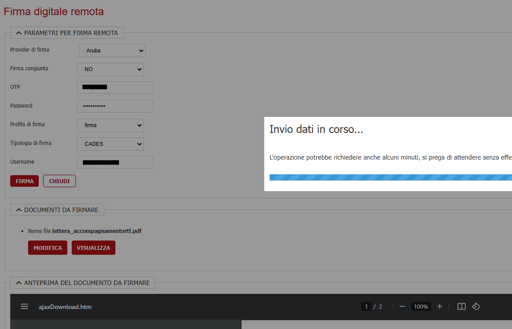
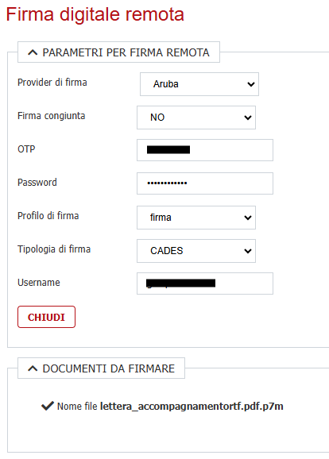

# Configurazione Firme Remote

In questa sezione viene trattata la configurazione di una firma remota integrata ( Aruba, Infocert, Uanataca ) a partire dalla parte tecnica di installazione 
del componente di integrazione fino alla configurazione applicativa.

Le firme remote di Aruba e Infocert sono già integrate a partire da versioni precedenti ma, a partire dalla versione 1.120,  la loro configurazione viene spostata dalla gestione delle verticalizzazioni
ad una sezione apposita per permettere una facile integrazione con nuovi gestori di firma remota come ad esempio Uanataca

**A partire dalla versione 2.120 le verticalizzazioni FIRMA_REMOTA_ARUBA e FIRMA_REMOTA_INFOCERT diventano obsolete e non verranno più considerate**

# Prerequisiti
  - Backend ( VBG ) alla versione 2.120 o successiva

# Configurazione

## Abilitazione voce di menu

Abilitare la voce di menu **Archivi** -> **Archivi di base** - **Gestione firme remote** per tutti gli operatori che potranno configurare nuove integrazioni o modificare integrazioni esistenti

## Prima configurazione

Accedendo alla voce di menu precedentemente abilitata verrà mostrata la lista di tutte le firme remote attualmente integrate mostrando le principali informazioni tra cui una colonna 
**Attiva** per verificare immediatamente se il componente è attivo o sta avendo dei problemi

Cliccando il pulsante **NUOVO** si inizia la configurazione di una nuova integrazione

## Scenario integrazione firma remota ARUBA

Per maggiore chiarezza verrà proposto lo scenario di un ente già integrato con Aruba che passa alla versione 2.120 o successiva per poter avere un raffronto visivo 
tra la configurazione della verticalizzazione FIRMA_REMOTA_ARUBA e la nuova modalità di integrazione.

Questa è la configurazione del caso d'uso 

Andando a configurare per la prima volta una firma remota viene proposta la seguente maschera 

in cui va indicato:

- **Descrizione**: Breve descrizione che comparirà nella tendina della firma dei documenti per poter scegliere quell'integrazione
- **Provider**: Provider di firma remota che si desidera integrare
- **Endpoint**: URL del componente installato precedentemente ( **NON** è la url del servizio di firma remota ma del componente che lo integra )
- **Attiva**: Permette di attivare / disattivare un integrazione

e cliccato su **AGGIUNGI**; in base ai parametri presenti nella verticalizzazione si ottiene la seguente schermata

Il successivo passaggio da fare è quello di configurare i parametri di cui la specifica integrazione ha bisogno, andando a definire quali parametri dovrà indicare l'utente che firma,
quali invece sono parametri di sistema e che pertanto non verranno poi richiesti in fiase di firma; per fare ciò bisogna popolare la sezione *PARAMETRI* cliccando il bottrone 
**RECUPERA PARAMETRI**. Il risultato finale sarà simile a questa schermata

Per ogni parametro andrà indicato, cliccando sul rispettivo pulsante **Modifica** :

- **Obbligatorio**: Indica se è un dato che obbligatoriamente, per quella specifica integrazione, deve essere valorizzato
- **Visibile**: Indica se è un dato che comparirà a video nella schermata di firma, serve a tenere un'interfaccia di firma pulita andando a nascondere i parametri non necessari o quelli compilati con un valore di default non modificabile
- **Sola lettura**: Indica se quel dato può essere cambiato dall'utente in fase di firma oppure no
- **Tipo di campo**: Indica come verrà mostrato quel parametro a video. E' possibile indicare **TESTO** e comparirà come una normale casella di testo, **LISTA** se si vuole mostrare una lista di valori oppure **PASSWORD** se deve comparire 
come campo password e quindi non mostrare il testo in chiaro
- **Valore di default**: Indica se quel campo deve essere precompilato con dei valori di default

Una volta popolati i parametri è necessario cliccare il pulsante **SALVA** per salvare l'intera configurazione, in caso contrario quanto fatto non verrà memorizzato e occorrerà
iniziare da capo la configurazione dei parametri

Nel caso d'uso analizzato, il risultato della configurazione dei parametri sarà il seguente:

| Chiave                        | Obbligatorio | Visibile | Sola lettura | Tipo di campo | Valore di default                                                 |
| ----------------------------- | ------------ | -------- | ------------ | ------------- | ----------------------------------------------------------------- |
| CERT_ID                       | SI           | NO       | SI           | TESTO         | AS0                                                               |
| DETACHED                      | SI           | NO       | SI           | TESTO         | 0                                                                 |
| EMAIL_NOTIFICA                | NO           | NO       | NO           | TESTO         |                                                                   |
| FIRMA_CONGIUNTA_CADES         | SI           | SI       | NO           | LISTA         | NO,SI                                                             |
| IS_GENERA_OTP                 | SI           | NO       | SI           | TESTO         | 0                                                                 |
| IS_MARCA_TEMPORALE_RICHIESTA  | SI           | NO       | SI           | TESTO         | 0                                                                 |
| NUM_PAGINA_FIRMA_PADES        | SI           | NO       | SI           | TESTO         | 1                                                                 |
| OTP                           | SI           | SI       | NO           | TESTO         |                                                                   |
| PASSWORD                      | SI           | SI       | NO           | PASSWORD      |                                                                   |
| POS_RETT_FIRM_LEFT_PADES      | SI           | NO       | NO           | TESTO         | 100,100                                                           |
| POS_RETT_FIRM_RIGHT_PADES     | SI           | NO       | NO           | TESTO         | 150,150                                                           |
| PROFILO_FIRMA_PADES           | SI           | NO       | SI           | TESTO         | BES                                                               |
| PROFILO_FIRMA_REMOTA          | SI           | SI       | NO           | LISTA         | firma,frPAEVOLUTION                                               |
| REASON                        | NO           | NO       | NO           | TESTO         |                                                                   |
| RELAX_SSL                     | SI           | NO       | SI           | TESTO         | 1                                                                 |
| RETURN_DER                    | SI           | NO       | SI           | TESTO         | 1                                                                 |
| TESTO_FIRMA_PADES             | NO           | NO       | NO           | TESTO         |                                                                   |
| TIPO_FIRMA                    | SI           | SI       | NO           | LISTA         | CADES,PADES                                                       |
| TYPE_HSM                      | SI           | NO       | SI           | TESTO         | COSIGN                                                            |
| TYPE_SEND_OTP                 | SI           | NO       | SI           | TESTO         | CALL                                                              |
| URL_BASE_SERVIZIO             | SI           | NO       | SI           | TESTO         | https://*****/ArubaSignService/ArubaSignService?wsdl              |
| USERNAME                      | SI           | SI       | NO           | TESTO         |                                                                   |

A questo punto la configurazione è terminata e se tutto è stato fatto correttamente, accedendo alla firma remota di un qualsiasi documento si otterrà una pagina simile a questa

in cui comparià nella lista dei **Provider di firma** l'integrazione appena configurata, selezionandola il sistema costruisce la pagina in base a come sono stati configurati i suoi parametri

in cui è possibile visualizzare i documenti da firmare, le anteprime dei documenti ( non tutte le tipologie di documenti sono supportate dal browser in uso ) e firmare previo 
inserimento del codice OTP. Una volta inserito il codice OTP verrà avviato il processo di firma cliccando il pulsante **FIRMA**

bisogna attendere che il processo venga completato e il risultato è la stessa pagina ma i file avranno un segno di spunta a fianco per indicare che sono stati correttamente firmati

