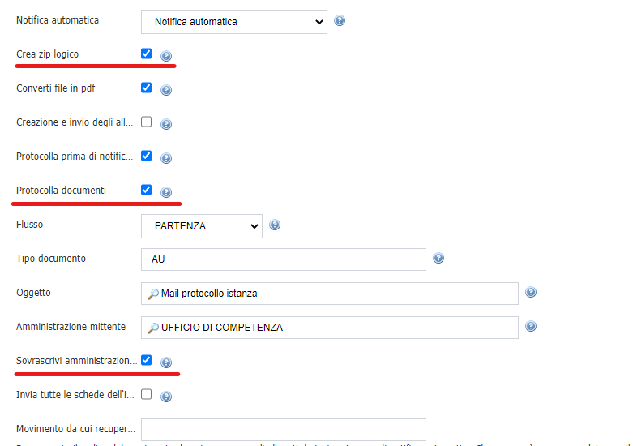
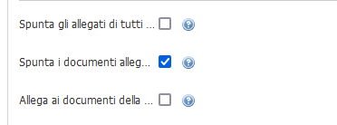

# Gestione delle domande DICO

L’obiettivo è quello di modificare il comportamento del componente di protocollazione indicando i dati corretti per la protocollazione e l’invio PEC, per dati corretti si intendono gli allegati e il destinatario, il tutto per evitare di fare un ulteriore passaggio di invio PEC da VBG.

La modifica, che riguarda soprattutto il connettore di protocollazione, riguarda la possibilità di indicare  come amministrazione destinataria l’amministrazione utilizzata per la configurazione della notifica oltre al fatto che potranno essere inviati anche gli allegati della pratica sotto forma di zip logico. 

## Modifiche interfaccia

Nel pannello di configurazione notifiche di un movimento sono stati aggiunti:
- un flag che modifichi il comportamento attuale e consenta di sovrascrivere il destinatario con l’amministrazione;
- un flag per la gestione degli allegati come zip logico;
- un flag per protocollare i documenti;

Quando verrà eseguito il movimento configurato come in figura, il movimento effettuerà la protocollazione inviando una mail con i documenti selezionati (file PDF) all'amministrazione configurata nel movimento.

Nel documento sarà presente il link per scaricare lo zip logico.