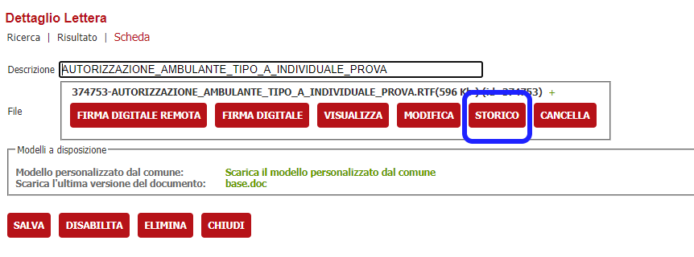
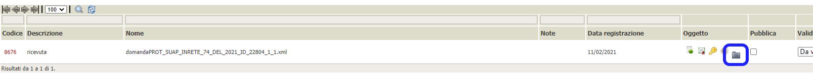
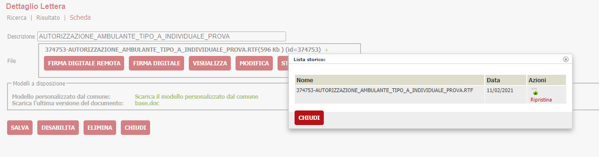
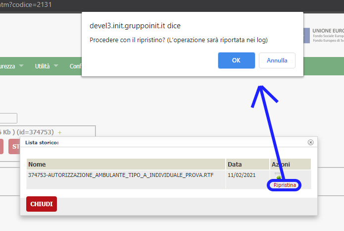

# Storicizzazione oggetti
La funzionalità è inclusa in VBG a partire dalla versione 2.81 e non necessita di nessuna configurazione.
Alla modifica di un qualsiasi documento/oggetto ( attualmente modifica di una lettera tipo, firma digitale remota, firma digitale ) il documento viene prima storicizzato per permettere il tracciamento della storia ed eventuale ripristino

## Funzionamento
Se il file che si sta modificando ha una storia, viene reso evidente dalla comparsa del bottone **STORICO**

oppure dalla comparsa di una icona a forma di cartella con un orologio

In entrambi i casi, cliccando tale bottone, sarà possibile ad accedere alla lista delle versioni di quel file

All'interno della lista sarà possibile eseguire il ripristino del file tramite il link **ripristina**, ma solamente dell'ultimo passaggio; per cui eventuali ripristini a versioni più vecchie dovranno essere effettuate in sequenza.

Compare un messaggio di conferma che avvisa l'utente anche del fatto che tale operazione verrà registrata nei log di AUDIT per tenere traccia di chi ha effettuato una modifica

## Dettagli tecnici

### Storicizzazione
A livello di Database, le informazioni verranno gestite nel seguente modo. Ad ogni evento di UPDATE di un oggetto:

- verrà creato un nuovo record nella tabella OGGETTI che conterrà l'oggetto prima della modifica
- il record che contiene l'oggetto attuale verrà aggiornato con il nuovo file ( e riferimenti collegati ); questo per permettere di mantenere invariato il campo OGGETTI.CODICEOGGETTO che viene referenziato in VBG anche da altre tabelle
- viene inserita una riga nella tabella OGGETTI_STORICO con CODICE_OGGETTO = al codice dell'oggetto attuale e CODICEOGGETTO_SOSTIT = al codice oggetto sostituito ( quello creato al primo punto di questo elenco )

### Ripristino
A livello di Database, le informazioni verranno gestite nel seguente modo:

- l'oggetto attuale viene sovrascritto con le informazioni dell'oggetto referenziato nella colonna OGGETTI_STORICO.CODICEOGGETTO_SOSTIT
- la riga di OGGETTI_STORICO viene cancellata
- se ci sono altri eventuali passaggi storici più vecchi, viene mantenuta la catena di collegamenti aggiornando i riferimenti di OGGETTI_STORICO.CODICEOGGETTO al riferimento dell'oggetto attuale