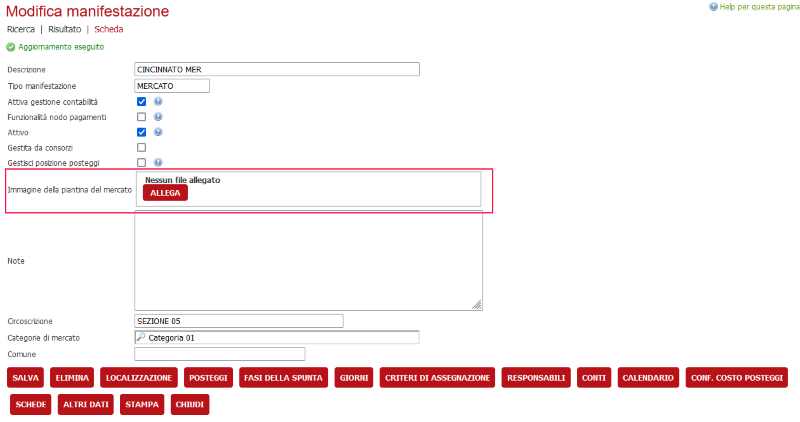
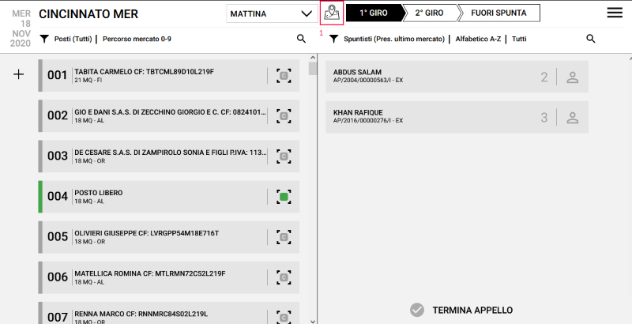
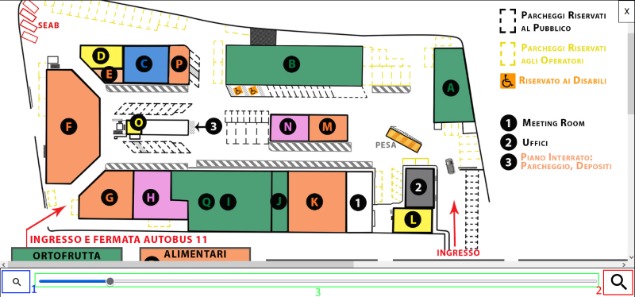

# App vigili

## Visualizzazione mappa

### Backoffice

Caricando la mappa del mercato nel dettaglio manifestazione ("Immagine della piantina del mercato") verrà abilitata la visualizzazione della pianta nell'app

### App

Se nel backoffice è stata configurata una mappa del mercato allora nell'app vigili verrà attivato il bottone per la visualizzazione mappa (1)

Al click del bottone verrà aperta la finestra di visualizzazione mappa

- All'interno della vista mappa le operazioni di trascinamento su un dispositivo con touch abilitato permetteranno di scorrere la mappa
- Il pulsante Zoom - (1) permette di ridurre il livello di zoom del 10% fino ad uno zoom minimo del 50%
- Il pulsante Zoom + (2) permette di incrementare il livello di zoom del 10% fino ad uno zoom massimo del 150%
- Lo slider (3) permette di regolare il livello di zoom in maniera lineare
