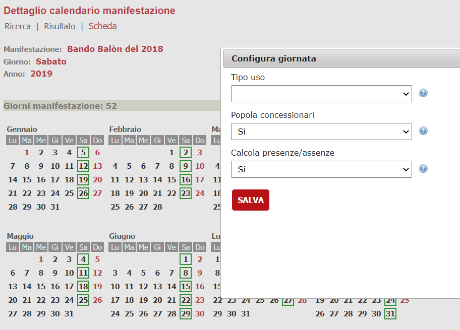
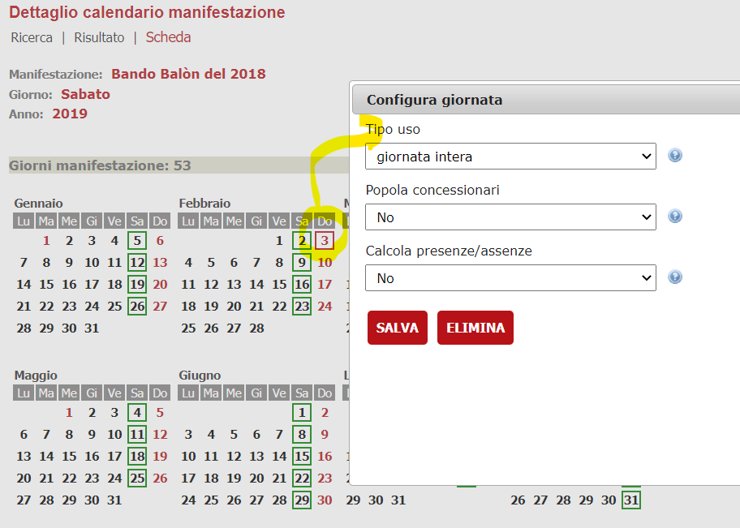

# Gestione presenze

Di seguito vengono riportate le modalità di gestione delle presenze nei mercati

## Configurazione della giornata di mercato

All'interno della gestione dei mercati è possibile specializzare per ogni giornata di mercato alcune caratteristiche che la definiscono quali ad esempio:

- la data in cui si svolge la manifestazione
- la concessione uso o fascia (es. giornata intera, mezza giornata ) configurate in < ARCHIVI SOFTWARE > ==>TABELLE ==> MANIFESTAZIONI ==> CONCESSIONI USO
- Se gestire le presenze/assenze. Se impostato a "Sì" la gestione delle presenze viene fatta secondo le regole classiche. Se impostato a "No" in ogni caso la presenza non viene impostata.
- Se popolare i concessionari (ovvero gestire tutti i soggetti della giornata come spuntisti e quindi come soggetti che pagano).
Questo è il caso di svolgimento mercato non in una giornata di mercato quali ad esempio feste patronali.
Se impostato a "Sì" allora si tratta di una gestione "standard" nella quale i posteggi vengo assegnati ai relativi concessionari e valgono le regole di validazione per l'assegnazione dei posteggi.
Se impostato a "No" allora tutti i soggetti che partecipano vengono trattati come spuntisti e sono tenuti all'eventuale pagamento dell'occupazione. In questo caso non valgono le regole di verifica di accesso ai posteggi. È il caso, ad esempio, della gestione di una giornata di mercato per le feste di quartiere che vengono svolte in quel mercato ma in giorni, ad esempio di Domenica, dove non sono presenti concessioni.

Alla creazione ad inizio anno del calendario le giornate vengono inizializzate con valori predefiniti, ovvero fascia di giornata nulla, popolamento dei concessionari impostato a "Sì" e assegnazione delle presenze impostato a "Sì"

Solamente l'operatore con particolari ruoli associati [in questo caso il ruolo **GESTIONE_CALENDARIO_MERCATI**] può modificare queste impostazioni.

È possibile modificare le impostazioni solamente nel caso di giornata non chiusa.

Ad inizio anno è possibile creare le giornate di mercato mediante lo specifico wizard presente all'interno della maschera di gestione mercati (Pulsante di azione **CALENDARIO**==>Nuovo).
È presente anche la possibilità di autoatizzare la creazione dei calendari ad inizio anno mediante la configurazione di un' attività schedulata.

Una volta creato il calendario è possibile anche aggiungere / modificare / eliminare giornate dalla configurazione del mercato.

Per fare questo è sufficiente cliccare su una data dell'anno e veridficare le opzioni disponibili.

Ad esempio qualora l'utente intenda aggiungere un giorno gli comparirà solamente il pulsante di azione **SALVA**

Nel caso di modifica invece comparirà anche il pulsante di azione **ELIMINA**

## Gestione delle presenze tramite Backoffice

La gestione delle presenze viene normalmente registrata nel Backoffice dopo la giornata di mercato.

Gli operatori della polizia municipale tornando in ufficio dopo le operazioni di spunta registrano nel backoffice le presenze / assenze dei vari concessionari/spuntisti.

La funzionalità è disponibile per gli operatori di backoffice che sono stati profilati dal menù **Istanze => [ Modulo aree pubbliche ] =>manifestazioni => Gestione presenze**

L'operatore dovrà selezionare l'anno il mercato ed accedere alla [gestione delle presenze tramite **backoffice**](./gestione-presenze-backoffice.md).

## Gestione delle presenze tramite App Vigili (Spunta digitale)

Laddove installata l'app vigili è possibile registrare in mobilità le informazioni della giornata del mercato che si è svolta.

Di solito viene fornito un link installato nel dispositivo mobile, tipicamente un tablet, dove è possibile accedere alla [gestione delle presenze tramite **app vigili**](./gestione-presenze-app-vigili.md).
