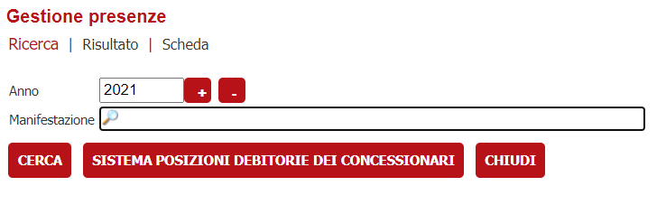
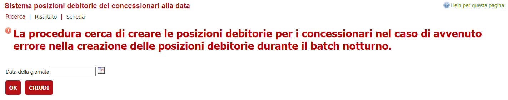
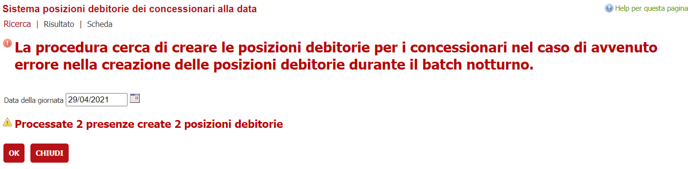
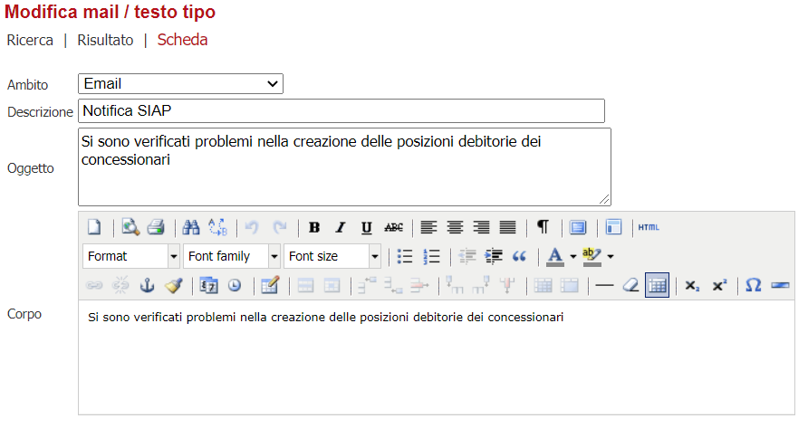

# Sistemazione delle posizioni debitorie dei concessionari in caso di problemi al batch notturno
Nel caso di gestione delle posizioni debitorie dei concessionari può succedere che il batch notturno o i servizi piemonte pay non siano raggiungibili.
Questo comporta che potrebbero vernir non  create un numero consistente di posizioni debitorie legate ai concessionari.

La seguente funzionalità serve per ricreare, a partire da una data specificata le posizioni debitorie mancanti per i concessionari.

La funzionalità va usata solamente nel caso di integrazione con i servizi sincroni PIEMONTEPAY che restituiscono lo iuv all'invocazione.

## Configurazione
La funzionalità è accedibile solamente ad operatori con il RUOLO **GESTIONE_POSIZIONI_DEBITORIE**.
Quindi l'operatore dovrà essere configurato per avere questo ruolo assegnato.

La funzionalità è disponibile a partire dal menù 

**Istanze --> Commercio --> Manifestazioni --> Gestione presenze**

Se l'utente ha abilitato il ruolo comparirà  il bottone **Sistema posizioni debitorie dei concessionari**

 che permette di accedere alla funzionalità

È obbligatorio selezionare la data per attivare la procedura.

Al termine della procedura viene presentato il report delle posizioni create.

## Configurazione invio mail batch notturno per problemi in creazione posizioni debitorie

Nelle tabelle **JOB_REPOSITORY** sono censiti i JOB SCEHEDULATI.
Il job che è delegato a segnare presenti anche i concessionari, e se configurato anche di creare le posizioni debitorie dei concessionari, è la classe 
**it.gruppoinit.pal.gp.core.jobsAperturaGiornateMercatoJob**.

Il job può essere lanciato senza parametri ed allora non esegue operazioni aggiuntive.
Qualora si intenda anche inviare una mail al termine dell'esecuzione vanno configurati alcuni parametri tabelle nel VBG.

### JOB_REPOSITORY_PARAM

ID| PARAMETRO| DESCRIZIONE| FK_JOB_REPOSITORY| VALORE
---| ---| ---| ---| ---
*PROGRESSIVO*|MAIL_ACCOUNT|L'identificativo dell'account dal quale far partire la mail|*FK_JOB_PADRE*|account id
*PROGRESSIVO*|MAIL_TIPO|L'identificativo del template della mail da far partire|*FK_JOB_PADRE*|codice mail tipo
*PROGRESSIVO*|MAIL_CONTROLLO|Se specificato al termine del service vengono verificate che le posizioni debitorie siano state create per i concessionari. Se non sono state create viene unviata una mail a questo indirizzo|*FK_JOB_PADRE*|test@mail.it

Il parametro **MAIL_ACCOUNT** definisce l'account come configurato in 
**Configurazione --> Tutti i backoffice (o Software specifico)--> Parametri mail**

Il parametro **MAIL_TIPO** rappresenta un template di *Mail Tipo* da configurare in 

**Archivi --> Archivi di base (o del software specifico) --> Mail / Testi tipo**

Il parametro **MAIL_CONTROLLO** è il destinatario della mail di controllo. Se non presente questo parametro la mail non viene inviata e non viene fatto il controllo.
