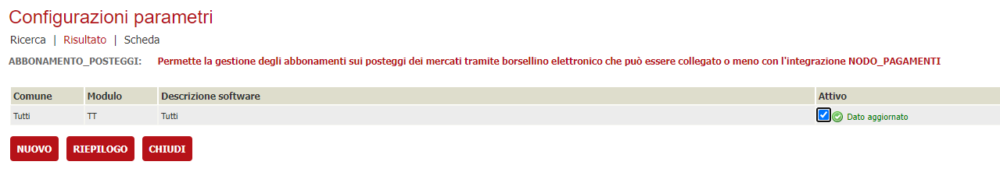

# Gestione abbonamenti e borsellino elettronico

In VBG è possibile gestire un'abbonamento ( o borsellino elettronico ) per le anagrafiche.
Ad oggi il suo utilizzo e riservato alla gestione delle presenze / assenze all'interno dei mercati o delle fiere ma potrebbe essere esteso in futuro anche ad altre funzionalità
Di seguito verranno trattati i passaggi da fare per l'attivazione / configurazione di un abbonamento

## Primo passo: configurare la verticalizzazione ABBONAMENTO_POSTEGGI

In prima battuta è necessario attivare la verticalizzazione **ABBONAMENTO_POSTEGGI**

e procedere alla sua configurazione

## Secondo passo: ??
