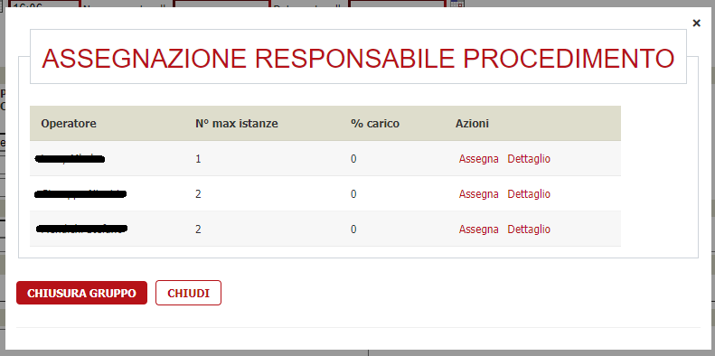
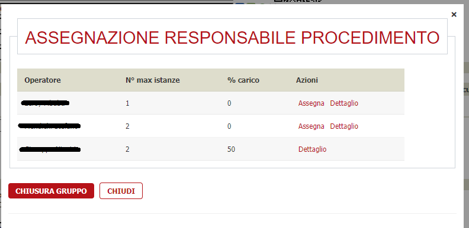

# Assegnazione operatori

La modifica richiesta riguarda una nuova modalità di assegnazione degli operatori, non più in base ad una percantuale di carico di lavoro, ma in base al numero esatto di pratiche che un operatore può effettivamente lavorare.

## Attivazione

Per attivare la nuova modalità di assegnazione degli operatori, è necessario attivare il nuovo parametro di verticalizzazione per **ASSEGNAZIONE_OPERATORI** chiamato **ASSEGNAZIONE_CAPIENZA_GRUPPO** e dargli come valore **S**.

All'interno di ciascun operatore è possibile definire il numero di pratiche che può lavorare in un periodo indicato dal campo **Peso carico di lavoro**.

Ricordarsi di attivare il flag **Modifica operatore sorteggiato**.

## Come funziona

Quando si accede ad una istanza, se le verticalizzazioni sono correttamente attivate, accanto ai Responsabili procedimento e Istruttore [1] sarà presente l'icona .
Cliccando si aprirà un popup contenente l'elenco degli operatori assegnabili all'istanza:

Cliccando su **Assegna** in corrispondenza dell'operatore scelto, l'istanza verrà assegnata a tale operatore e si avrà la seguente schermata:

Da notare nella colonna **% carico** il valore corrisponde alla percentuale del carico di lavoro assegnato all'operatore.

Cliccando invece sul **Dettaglio** si aprirà un popoup contente una lista con tutte le istanze che sono state assegnate a tale operatore, con inoltre la possibilità di accedere ad un riepilogo dei dati dell'istanza.

## Chiusura di un gruppo

La chiusura di un gruppo può avvenire in due modi:

1. **_automaticamente_**: quando tutti gli operatori hanno raggiunto il 100% del carico il gruppo si chiude;
2. **_manuale_**: quando l'operatore che ha i permessi di chiusura del gruppo clicca sul pulsante **Chiusura gruppo**.[^2]

Se un operatore dovesse eccedere il carico di lavoro, dunque andare oltre il 100% lavorato, la parte in eccesso (istanze aperte e più recenti) verrà caricata nel nuovo gruppo. 

[1]: I nomi dei campi possono variare in base a come sono stati configurati per ogni comune.

[^2]: Il pulsante **Chiusura gruppo** è disponibile solo per l'operatore che ha i permessi di chiusura del gruppo altrimenti non risulta visibile.
