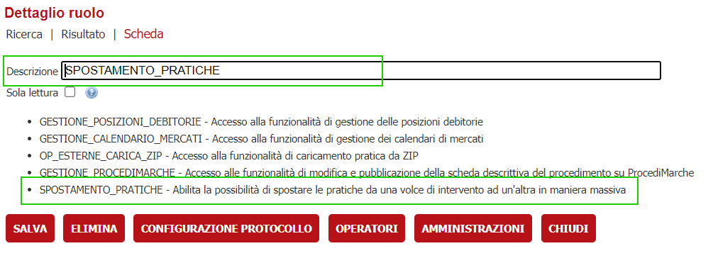
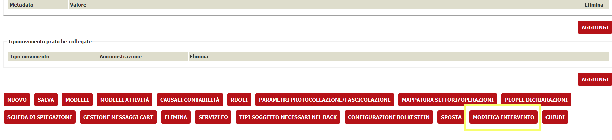
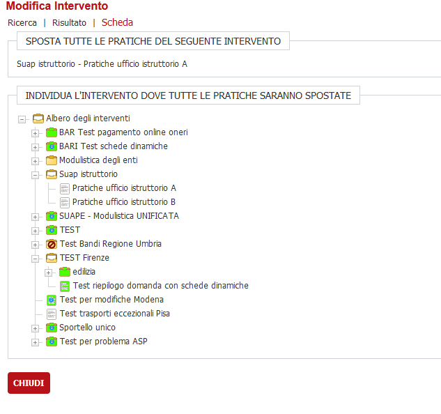
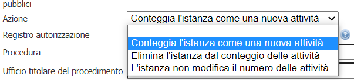
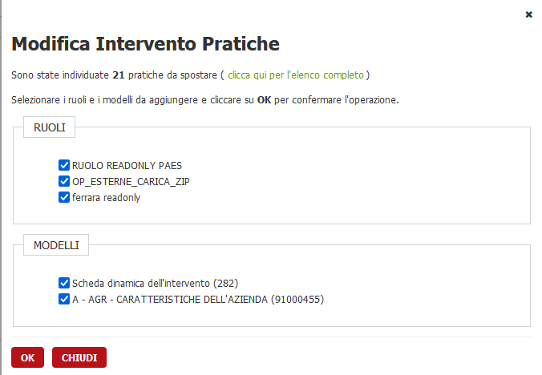
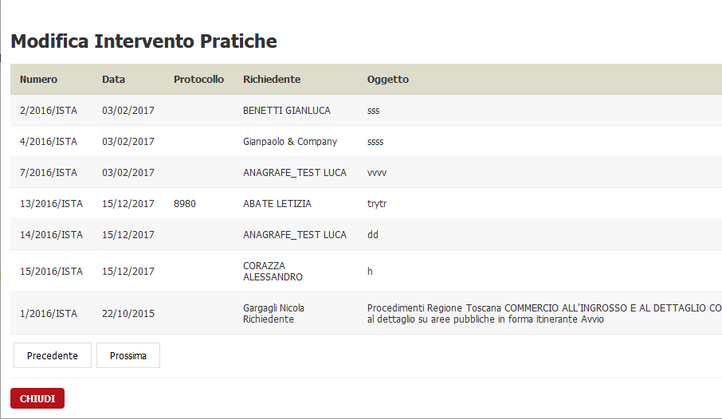
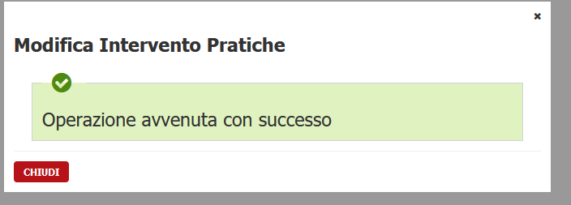

#Cambio intervento massivo
La funzionalità consente di cambiare l'intervento a più istanze in maniera massiva

## Prerequisiti
1. VBG versione 2.90 o superiore

## Configurazione
Dalla versione 2.90 in poi sarà possibile configurare un nuovo ruolo in maniera tale da permettere la modifica massiva dell'intervento a più istanze.
Per essere abilitato, l'operatore deve appartenere ad un ruolo chiamato **SPOSTAMENTO_PRATICHE** ( se non esiste va censito tale ruolo e associato 
l'operatore o gli operatori che potranno modificare massivamente l'intervento delle pratiche )

Una volta concesse le abilitazioni, basta accedere alla configurazione di dettaglio dell'intervento interessato ( *menu Archivi >> Archivi <modulo> >> Albero degli interventi e selezionare una foglia*  )
e comparirà un nuovo bottone **MODIFICA INTERVENTO**

Al click su tale bottone ci verrà mostrata una pagina in cui sarà richiesta la selezione del nuovo intervento.

La selezione del nuovo intervento dovrà rispettare alcune caratteristiche
- non è possibile indicare un intervento padre ( cartella ) come origine/destinazione
- non è possibile scegliere un intervento con configurata un'azione diversa da quella di partenza 

Il secondo criterio serve ad evitare incongruenze nella storia dei collegamenti delle istanze e delle eventuali attività a cui le istanze appartengono.

Dopo la scelta del nuovo intervento si aprirà un popup con la seguente interfaccia dove è possibile scegliere o meno di includere sia i ruoli che i modelli che saranno inseriti, se già non presenti, nelle pratiche che saranno migrate nel nuovo intervento.

Si può visualizzare la lista completa delle pratiche che saranno spostate cliccando il link sopra indicato con "**clicca qui per l'elenco completo**".

Facendo clic su ok si avvierà il processo di spostamento. Al termine del processo, verrà visualizzato un messaggio che indica se il processo ha avuto successo o meno.

## Cambio intervento della singola istanza
Tale funzionalità, già esistente, rimane invariata. E' stato aggiunto il tracciamento del cambio intervento sia come metadato della pratica 
che come log di audit allo stesso modo del cambio massivo dell'intervento

## Caso d'uso
Il caso d'uso configurato in produzione e visualizzabile nell'installazione della Provincia di Ravenna