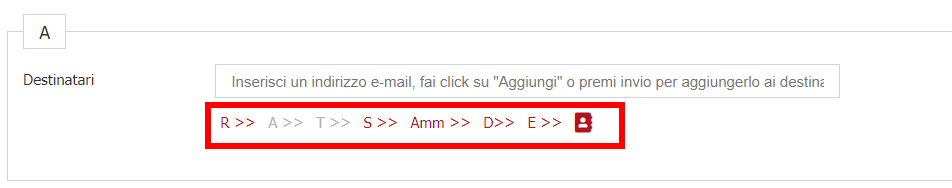
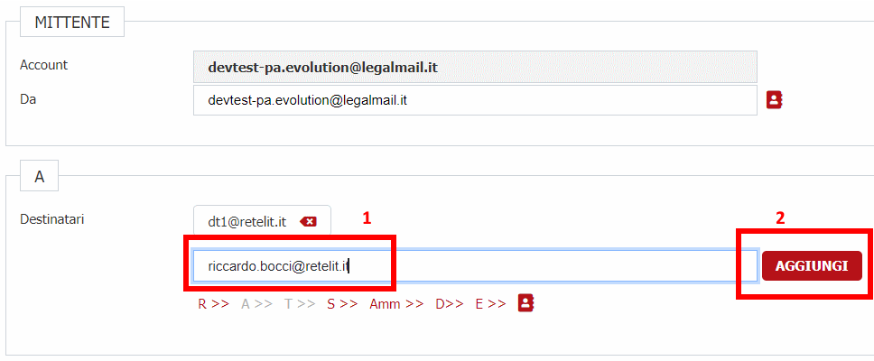
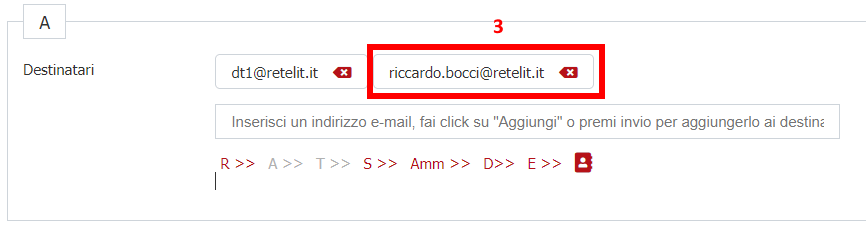
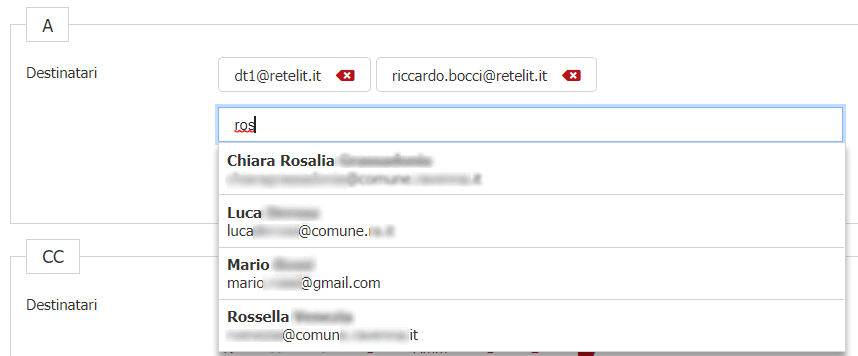

# Invio mail

È possibile all'interno dei movimenti dell'istanza inviare mail.
La funzionalità permette di indicare velocemente i soggetti coinvolti nella pratica mediante i link come da immagine

Le mail vengono recuperate:

- R: dal richiedente della pratica
- A: dall'azienda della pratica
- T: dal tecnico dell'azienda
- S: dai soggetti collegati
- A: dall'amministrazione del movimento dal quale viene inviata la mail
- D: dal domicilio elettronico della pratica
- E: dalla mail dell'ente impostato in configurazione

È possibile anche la compilazione manuale degli indirizzi.
Quando l'utente immette un indirizzo mail valido compare la possibilità di aggiungerlo.

Una volta cliccato su **AGGIUNGI**

## Rubrica

È possibile popolare una Tabella **RUBRICA** per accedere velocemente agli indirizzi da interfaccia.

Ad. Esempio è stato realizzata una componente che recupera da una directory LDAP gli indirizzi mail dell'ente e che popola questa tabella.
