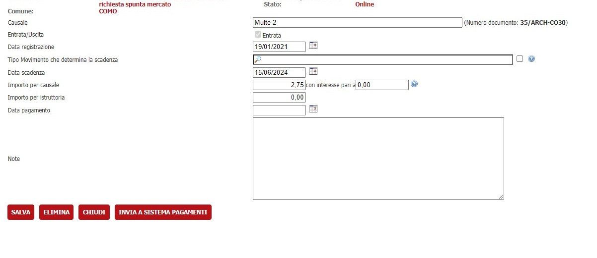
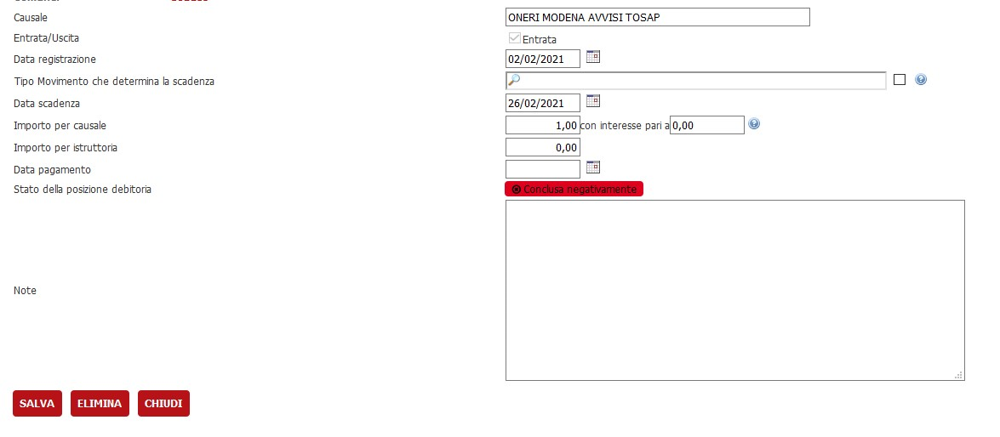
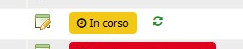

# Posizioni debitorie su istanze oneri

Per accedere alla modifica bisogna cliccare sul dettaglio di un onere presente sulla lista oneri.
## Prerequisiti

Per accedere alla nuova modifica bisogna impostare i parametri nella verticalizzazione "TIPO-INSTALLAZIONE" come in figura sottostante 

## Creazione

Se attivo nodo pagamenti e non  è presente  una posizione debitoria,  allora compare il bottone __"Invia a sistema pagamenti"__.

 
 Cliccando sul bottone si aprirà un pop up con la lista degli oneri che saranno inviati al sistema dei pagamenti.

 

 Cliccando ancora una volta, l'onere verrà inviato 

 e comparirà una snippet che segnala lo stato della posizione debitoria In corso e il pulsante __"Annulla posizioni debitorie"__.

## Annullamento 

Cliccando il bottone "Annulla", apparirà un messaggio che chiede conferma della possibilità di eliminare la posizione debitoria.
Accettando verrà annullata la posizione e comparirà il messaggio "Conclusa negativamente".

## Aggiornamento

Nella lista di tutti gli oneri presenti per l'istanza, a fianco della snippet, è presente anche l'icona di aggiornamento della posizione debitoria.

## Cancellazione

È possibile cancellare un onere selezionando il bottone "Elimina" presente nella schermata di dettaglio di un onere.