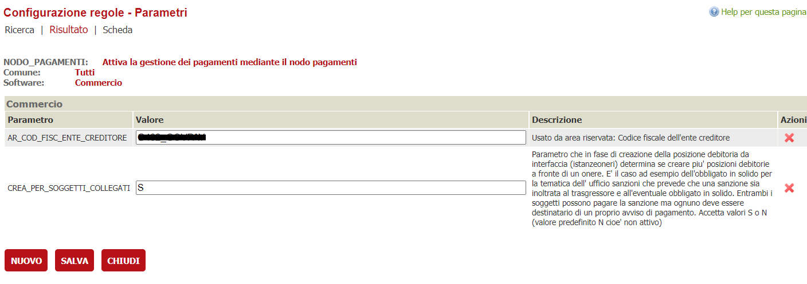
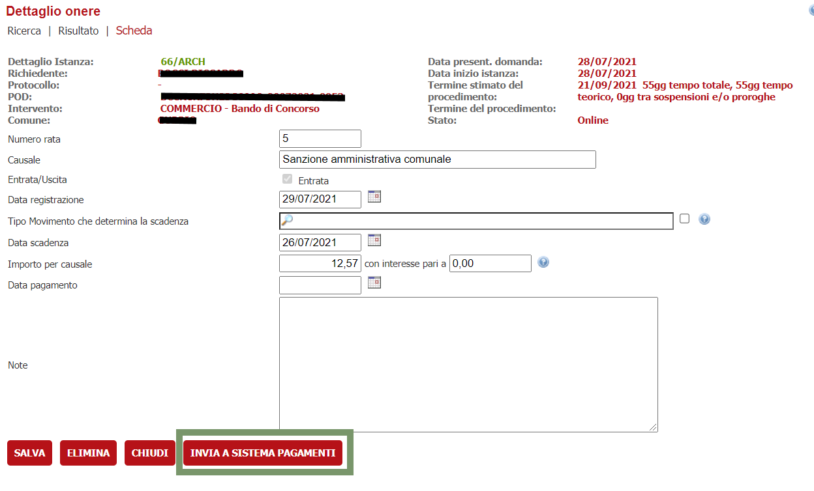
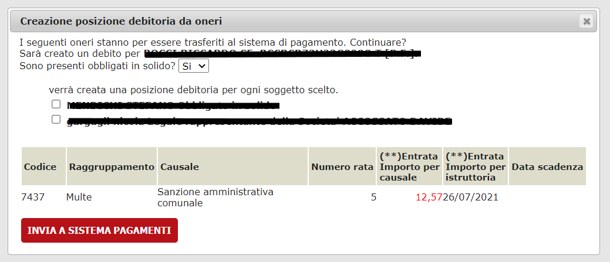
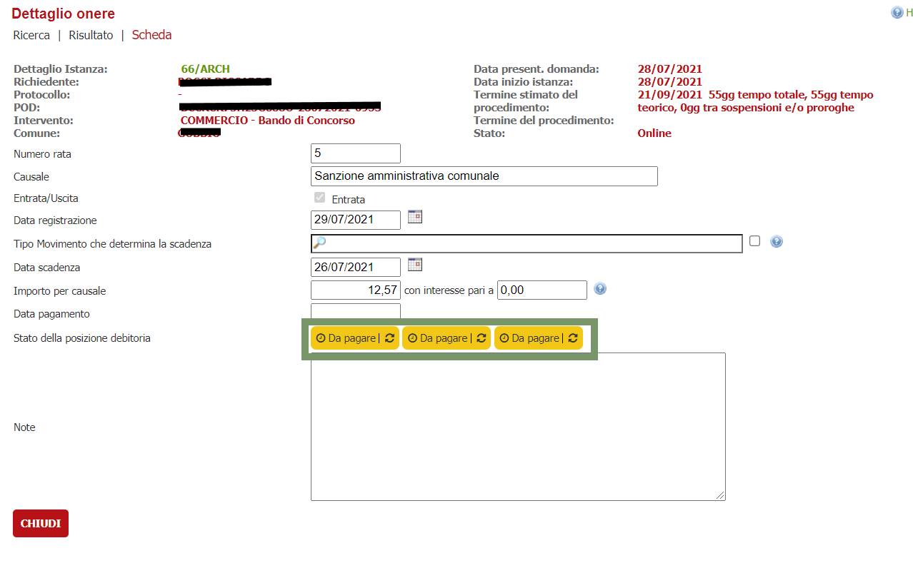
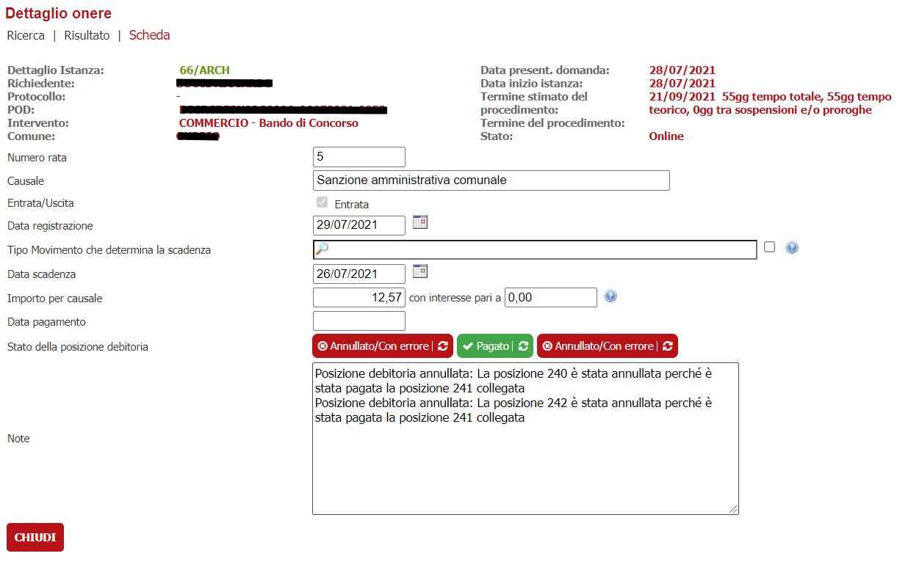

#Gestione obbligato in solido
La funzionalità consente di gestire la figura dell'obbligato in solido durante l'iter delle pratiche che in qualche modo prevedono delle sanzioni amministrative.

L'obbligato in solido è uno dei soggetti collegati alla pratica e può essere specificato in fase di trasmissione oneri al proprio sistema dei pagamenti,
come obbligato alternativo al titolare del debito. In quel caso verranno create due posizioni debitorie e il pagamento di una, automaticamente annulla l'altra

## Prerequisiti
1. VBG versione 2.89 o superiore
2. Integrazione configurata tra VBG e un sistema dei pagamenti noto
- Per la configurazione del nodo pagamenti fare riferimento all'apposita [(documentazione)](../../../nodo-pagamenti/configurazione-nodo-pagamenti.md)

## Configurazione
Dalla versione di VBG 2.89 in poi, sarà possibile configurare un nuovo parametro nella verticalizzazione **NODO_PAGAMENTI** che permette di scegliere
se aprire una posizione debitoria anche verso l'obbligato in solido

Una volta configurato il parametro **CREA_PER_SOGGETTI_COLLEGATI** con il valore **S**, in fase di invio oneri al proprio sistema dei pagamenti 
comparirà una ulteriore opzione che permette di indicare l'eventuale obbligato in solido.

Prendendo, ad esempio, un'onere di un'istanza e procedendo all'invio al nodo dei pagamenti tramite il bottone **INVIA A SISTEMA PAGAMENTI**

VBG proporrà una mascherà in cui sarà possibile indicare la presenza dell'eventuale obbligato in solido

Se viene indicata la presenza dell'obbligato in solido ( selezionando Si sulla tendina ), il sistema propone l'elenco dei soggetti collegati della pratica;
tale lista viene recuperata dalle anagrafiche presenti nella sezione **SOGGETTI COLLEGATI** dell'istanza fatta eccezione per il richiedente, l'azienda e l'intermediario che non fanno parte di questa lista

Selezionando uno o più nominativi di questa lista, il sistema genererà una posizione debitoria per ogni soggetto indicato ( oltre ovviamente a generarla
per il titolare della pratica ).

Il pagamento, in qualsiasi forma, di una qualsiasi delle posizioni debitorie legate all'onere annullerà in automatico le altre

Nelle note viene automaticamente indicata la motivazione dell'annullamento delle posizioni debitorie senza che l'operatore si ricordi di indicarle

## Caso d'uso
Il caso d'uso configurato in produzione è visualizzabile nel modulo Sanzioni della Città di Firenze