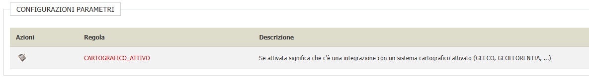
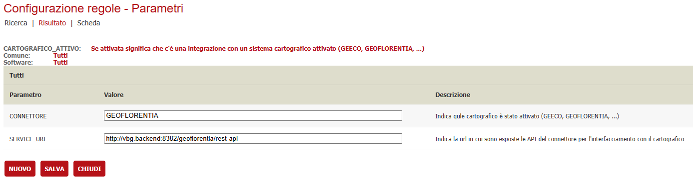
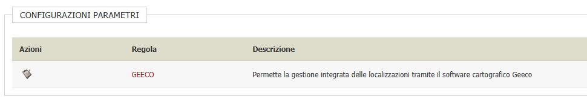
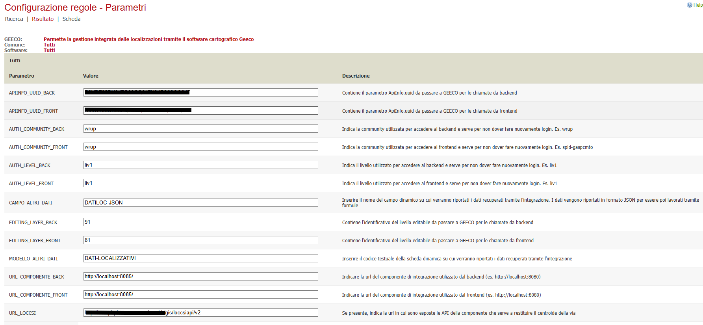

# Integrazione con sistemi cartografici

E' possibile integrare VBG con un sistema cartografico, sia nel frontend che nel backend, per diversi scopi.

## Integrazione Frontend

- Possibilità di ricavare i dati principali della localizzazione della pratica che si sta presentando direttamente dalla mappa
- Possibilità di ricavare dati aggiuntivi forniti dal sistema cartografico per poterli utilizzare, ad esempio, durante la compilazione dei modelli dinamici
- Visualizzare l'elenco delle istanze presentate all'interno di una mappa cartografica
- Visualizzare la singola istanza presentata all'interno di una mappa cartografica

## Integrazione Backend
- Possibilità di ricavare i dati principali della localizzazione dell'istanza direttamente dalla mappa
- Possibilità di ricavare dati aggiuntivi forniti dal sistema cartografico per poterli utilizzare, ad esempio, all'interno dei modelli dinamici
- Possibilità di visualizzare un elenco di istanze sulla mappa
- Possibilità di visualizzare una singola attività sulla mappa
- Possibilità di visualizzare un elenco di attività sulla mappa
- Possibilità di visualizzare una singola autorizzazione sulla mappa
- Possibilità di visualizzare un elenco di autorizzazioni sulla mappa

## Prerequisiti

- Backend ( VBG ) alla versione 2.123 o successiva
- Servizio sic-cartografico installato e configurato (VBG) 
- Servizio sic-geeco installato e configurato (VBG) se ci si integra con Geeco
- Servizio sic-geoflorentia installato e configurato (VBG) se ci si integra con GeoFlorentia
- Sistema cartografico presente nella lista di quelli già implementati

## Servizi implementati

- Geeco
    - Frontend: Presentazione istanza
    - Frontend: Elenco istanze presentate
    - Frontend: Dettaglio istanza presentata
    - Backend: Dettaglio istanza
    - Backend: Elenco istanze
    - Backend: Dettaglio autorizzazione
    - Backend: Elenco autorizzazioni

- GeoFlorentia
    - Backend: Dettaglio attività
    - Backend: Elenco attività

## Configurazione

Gli aspetti da configurare sono:
- Verticalizzazione CARTOGRAFICO_ATTIVO
- Verticalizzazione GEECO
- Verticalizzazione GEOFLORENTIA
- WorkFlow di presentazione domanda
- Modello dinamico

### Verticalizzazione CARTOGRAFICO_ATTIVO

E' necessario attivare la verticalizzazione **CARTOGRAFICO_ATTIVO** e configurare i seguenti parametri:

| Parametro | Utilizzo |
| ------ | ------ |
| **CONNETTORE** | Indica qule cartografico è stato attivato (GEECO, GEOFLORENTIA, ...) |
| **SERVICE_URL** | Indica la url in cui sono esposte le API del connettore per l'interfacciamento con il cartografico

### Verticalizzazione GEECO

Se ci si vuole integrare con il sistema cartografico GEECO è necessario attivare la verticalizzazione **GEECO** e configurare i seguenti parametri:

| Parametro | Utilizzo |
| ------ | ------ |
| **APIINFO_UUID_BACK** | Contiene il parametro ApiInfo.uuid da passare a GEECO per le chiamate da backend |
| **APIINFO_UUID_FRONT** | Contiene il parametro ApiInfo.uuid da passare a GEECO per le chiamate da frontend |
| **AUTH_COMMUNITY_BACK** | Indica la community utilizzata per accedere al backend e serve per non dover fare nuovamente login. Es. wrup |
| **AUTH_COMMUNITY_FRONT** | Indica la community utilizzata per accedere al frontend e serve per non dover fare nuovamente login. Es. spid-gaspcmto |
| **AUTH_LEVEL_BACK** | Indica il livello utilizzato per accedere al backend e serve per non dover fare nuovamente login. Es. liv1 |
| **AUTH_LEVEL_FRONT** | Indica il livello utilizzato per accedere al frontend e serve per non dover fare nuovamente login. Es. liv1 |
| **CAMPO_ALTRI_DATI** | Inserire il nome del campo dinamico su cui verranno riportati i dati recuperati tramite l'integrazione. I dati vengono riportati in formato JSON per essere poi lavorati tramite formule |
| **EDITING_LAYER_BACK** | Contiene l'identificativo del livello editabile da passare a GEECO per le chiamate da backend |
| **EDITING_LAYER_FRONT** | Contiene l'identificativo del livello editabile da passare a GEECO per le chiamate da frontend |
| **MODELLO_ALTRI_DATI** | Inserire il codice testuale della scheda dinamica su cui verranno riportati i dati recuperati tramite l'integrazione |
| **URL_COMPONENTE_BACK** | Indicare la url del componente di integrazione utilizzato dal backend (es. http://localhost:8080) |
| **URL_COMPONENTE_FRONT** | Indicare la url del componente di integrazione utilizzato dal frontend (es. http://localhost:8080) |
| **URL_LOCCSI** | Se presente, indica la url in cui sono esposte le API della componente che serve a restituire il centroide della via |

### WorkFlow di presentazione domanda

Per poter utilizzare l'integrazione nella presentazione della domanda è necessario configurare uno step ad hoc nel workflow chiamato GestioneLocalizzazioniCartografico. Per ulteriori dettagli di compatibilità andare nella sezione [area-riservata -> steps-workflow](./area-riservata/steps-workflow/README.md) e cercare lo step **Gestione localizzazioni con Cartografico**
Oltre alle ControlProperties classiche dello step della gestione delle localizzazioni, è possibile indicarne altre due:

- **ModelloDinamicoJsonDatiAggiuntivi**

    Indicare il codice della scheda dinamica ( ad esempio MEZZI_PUBBLICITARI ) nel quale è presente la formula fatta per gestire i dati aggiuntivi ritornati dal sistema cartografico

- **CampoDinamicoJsonDatiAggiuntivi**

    Indicare nome del campo dinamico ( ad esempio JSON_DATI_GEECO ) in cui verranno scritti i dati aggiuntivi ritornati dal sistema cartografico

Configurando queste due ControlProperties, ogni volta che l'utente torna allo step della localizzazione e modifica un dato ( aggiunge o toglie una localizzazione, modifica il dettaglio della localizzazione ), il sistema riporta le informazioni aggiuntive nel campo dinamico specificato e setta la scheda dinamica come non salvata; questo comportamento fa sì che non vengano persi eventuali dati salvati nella scheda ma l'utente viene comunque obbligato a riaprirla perchè potrebbero essere presenti delle variazioni

### Modello dinamico

Alcune integrazioni sono in grado di fornire un set di dati aggiuntivo dopo aver posizionato il punto sulla mappa. E' possibile utilizzare queste informazioni tramite le formule dei modelli dinamici; per poterlo fare è necessario aver compilato le sezioni **MODELLO_ALTRI_DATI** e **CAMPO_ALTRI_DATI** della verticalizzazione GEECO ( ad oggi la funzionalità è disponibile solamente per questo connettore ma potrebbe essere estesa in futuro).
Fatta la configurazione di cui al passo precedente, nel campo della scheda dinamica indicata, si otterranno i dati nel formato JSON e sarà possibile utilizzarli attraverso specifiche formule da fare in base alle proprie esigenze