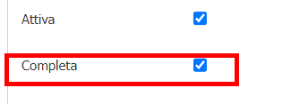

E' possibile integrare VBG con un gestionale esterno di gestione atti ( ad esempio per la gestione delle determine dirigenziali ).
In questa documentazione verrà trattata la configurazione e l'integrazione analizzando come caso d'uso l'integrazione con un sistema esterno per la gestione delle determine dirigenziali.
Allo stato attuale, tale integrazione è possibile solamente con il sistema di gestione atti di Sicraweb ma potrebbe essere espanso ad altri gestionali

# Prerequisiti
 - Backend ( VBG ) alla versione 2.109 o successiva
 - Gestionale esterno degli atti che esponga determinate funzionalità mediante WebService o Api

 # Servizi implementati
 Allo stato attuale è possibile
  - Numerare una autorizzazione ( o meglio una determina ) chiedendolo al gestionale atti esterno
  - Trasmissione allegati alla determina con possibilità di identificare il documento principale e quelli a corredo
  - Fascicolazione della determina
  - Ricezione conferma di notifica firma della determina dal gestionale esterno

# Configurazione
  Gli aspetti da configurare sono 3:
   - Verticalizzazione WS_ATTI
   - Tipologia del registro a cui verranno associati questi atti
   - (OPZIONALE) Testo tipo da passare come oggetto della determina
   - (OPZIONALE) Attivazione del protocollo per la fascicolazione

## Verticalizzazione WS_ATTI
E' necessario attivare la verticalizzazione **WS_ATTI** e configurare i seguenti parametri 

| Parametro | Utilizzo |
| ------ | ------ |
| **CLASSIFICA** | Indicare la classifica da passare al gestionale degli atti per permetterne la corretta collocazione. |
| **CODICE_DIRIGENTE** | Codice che identifica il dirigente nel sistema esterno; solitamente coincide con il firmatario |
| **CODICE_PROPONENTE** | Codice che identifica l'ufficio proponente nel sistema esterno |
| **CODICE_TRATTAMENTO** | Codice del tipo di iter che viene passato al sistema esterno per identificare l'iter che l'atto seguirà nel gestionale esterno |
| **NOTE_INTEGRATIVE** | Utilizzato qualora debbano essere aggiunte delle note fisse, sistematicamente ad ogni richiesta nuovo atto  |
| **OGGETTO_TESTOTIPO** | Contiene il riferimento al testo tipo che verrà utilizzato per recuperare l'oggetto della determina,ordinanza,.....; se nel movimento utilizzato per rilasciare la determina è valorizzato il parere, verrà preso al posto del testo tipo generico |
| **TIPO_CONNETTORE** | Connettore da utilizzare per il collegamento al servizio di gestione atti. ( Attualmente è implementato solo SICRAWEB |
| **URL** | URL dei servizi web del sistema esterno che gestisce gli atti (determina,ordinanza,...) |
| **UTENTE** | Utente applicativo utilizzato per la connessione ai servizi |

## Tipologia del registro
E' necessario configurare una o più tipologie di registro affinchè gestiscano la numerazione degli atti in maniera integrata con il gestionale esterno

Va impostata come numerazione nel campo **"Servizio di numerazione esterna"** il valore **"Numerazione da WS Atti"**

## Testo tipo
Se si desidera avere un testo tipo generico come oggetto della determina è possibile crearne uno ad-hoc. 
E' possibile utilizzare qualsiasi variabile che possa essere sostituita prendendo i valori dal movimento e/o dall'istanza
Se la determina viene rilasciata passando prima per un movimento di rilascio, e quel movimento ha il parere valorizzato, questo verrà comunque preso sempre al posto del testo tipo

## Attivazione del protocollo
Va attivata la protocollazione configurando lo specifico connettore ( non oggetto di questa guida ). 
Qualora non sia necessario fascicolare gli atti, questa funzionalità può non essere configurata

# Scenario di Utilizzo
Terminata la parte di configurazione si passa a quella operativa che non differisce di molto da un normale rilascio di un atto interno al backoffice VBG ( permesso di costruire piuttosto che concessione OSP o altro ).
In questo scenario si presuppone che durante l'iter di una pratica ci sia una fase che preveda l'emissione di una determina; pertanto il sistema proporrà l'apposito movimento per arrivare appunto alla determina stessa.

In questo caso la gestione del movimento è identica a tutte le altre per cui basta compilare i vari campi ed immettere, opzionalmente, un parere che verrà utilizzato come oggetto della determina 
( in assenza di tale parere verrà utilizzato il testo tipo di cui alla sezione **Configurazione** > **Testo tipo** ) e premere il pulsante SALVA

Nello step successivo bisogna selezionare il registro predisposto per l'integrazione ( vedi **Configurazione** > **Tipologia del registro** ) e cliccare INSERISCI

Durante la fase di inserimento inizia il dialogo tra VBG e il gestionale esterno per ottenere il numero della determina che verrà mostrato nella stessa pagina al terrmine

Comparirà inoltre una casella di spunta aggiuntiva chiamata "Completa" che identifica l'atto come completo e non ne permette più la modifica ( l'utilizzo di questa casella di spunta verrà trattato successivamente 
in questa guida )

Il secondo passaggio da fare e caricare, o produrre, tutti gli allegati necessari alla finalizzazione della determina. 
Allo stato attuale è obbligatorio produrre solamente il PDF che rappresenta il documento della determina ma possono essere anche prodotti altri documenti a corredo
Per fare questo, cliccare sul pulsante **DOCUMENTI AUTORIZZAZIONE** per andare ad indicare tutti quei documenti inerenti la determina.
Inizialmente comparirà una sezione vuota denominata **LISTA DOCUMENTI AUTORIZZAZIONE** che verrà popolata andando a selezionare i documenti necessari, presenti nelle varie sezioni della pratica, 
aggiungendoli tramite il rispettivo pulsante 

Durante questa fase nessun documento viene ancora trasmesso al gestionale esterno degli atti, per cui è possibile aggiungere/rimuovere documenti in libertà. Fatto questo passaggio, va indicato il file principale
tra quelli presenti nella sezione **LISTA DOCUMENTI AUTORIZZAZIONE** ( se non viene indicato, VBG lo segnalerà in fase di completamento autorizzazione ). Il file principale deve essere in formato PDF ed è quello 
che contiene la determina vera e propria ( solitamente viene generato come allegato del movimento tramite una lettera tipo ). Se, come in questo caso, il gestionale esterno si occuperà di gestire tutto l'iter di
firma dei vari allegati, il documento principale NON deve essere firmato all'interno di VBG

Una volta completato il caricamento dei documenti legati alla determina e aver individuato il documento principale, è possibile procedere alla trasmissione 
di tutta la documentazione al sistema esterno andando a completare la determina tramite la casella di spunta **"Completa"** presente nel dettaglio dell'atto

Completando l'atto, viene inviata automaticamente tutta la documentazione al gestionale esterno e l'atto risulta immodificabile.

A seconda del gestionale esterno integrato, la determina potrebbe avere un suo iter esterno: ad esempio in Sicraweb viene avviato l'iter di firma dei documenti e,
una volta completato, viene richiamato un servizio di VBG per notificare il completamento della firma. 
Allo stato attuale VBG ne prende atto ma in futuro, i documenti trasmessi verranno storicizzati a favore di quelli firmati restituiti dal gestionale esterno 
dopo il processo di firma
