# Integrazione con gestionale atti di terze parti

E' possibile integrare VBG con un gestionale esterno di gestione atti ( ad esempio per la gestione delle determine dirigenziali ).
In questa documentazione verrà trattata la configurazione e l'integrazione analizzando come caso d'uso l'integrazione con un sistema esterno per la gestione delle determine dirigenziali.
Allo stato attuale, tale integrazione è possibile solamente con il sistema di gestione atti di Sicraweb ma potrebbe essere espanso ad altri gestionali

## Prerequisiti
 - Backend ( VBG ) alla versione 2.111 o successiva
 - Gestionale esterno degli atti che esponga determinate funzionalità mediante WebService o Api

 ## Servizi implementati
 Allo stato attuale è possibile
  - Numerare una autorizzazione ( o meglio una determina ) chiedendolo al gestionale atti esterno
  - Trasmettere gli allegati della determina con possibilità di identificare il documento principale e quelli a corredo
  - Fascicolare la determina
  - Mettere l'atto della determina alla firma di un responsabile
  - Ricezione conferma di notifica firma della determina dal gestionale esterno

## Configurazione
  Gli aspetti da configurare sono 4:
   - Verticalizzazione WS_ATTI ed eventuali personalizzazioni a livello di intervento
   - Tipologia del registro a cui verranno associati questi atti
   - (OPZIONALE) Testo tipo da passare come oggetto della determina
   - (OPZIONALE) Attivazione del protocollo per la fascicolazione

### Verticalizzazione WS_ATTI
E' necessario attivare la verticalizzazione **WS_ATTI** e configurare i seguenti parametri 

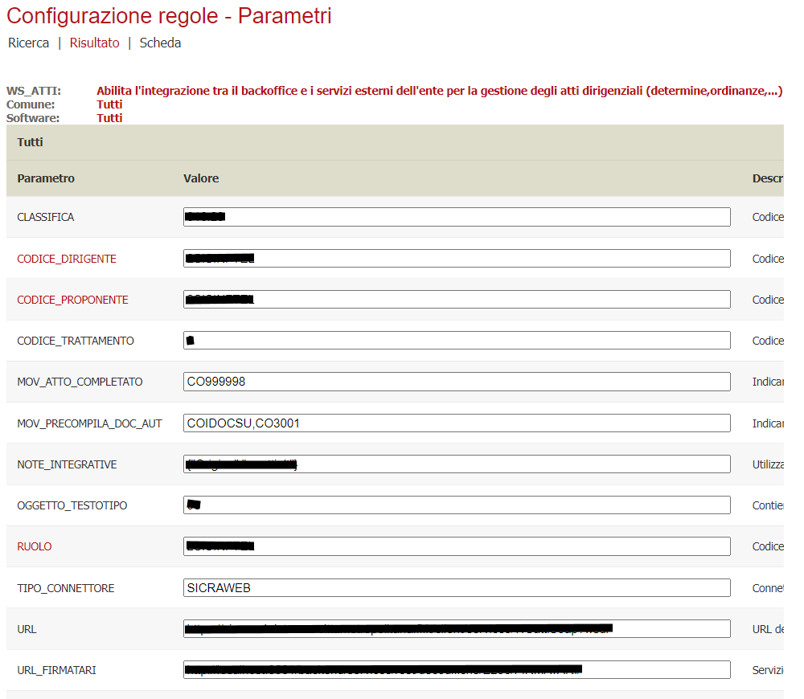

| Parametro | Utilizzo |
| ------ | ------ |
| **CLASSIFICA** | Indicare la classifica da passare al gestionale degli atti per permetterne la corretta collocazione. |
| **CODICE_DIRIGENTE** | Codice che identifica il dirigente nel sistema esterno; solitamente coincide con il firmatario |
| **CODICE_PROPONENTE** | Codice che identifica l'ufficio proponente nel sistema esterno |
| **CODICE_TRATTAMENTO** | Codice del tipo di iter che viene passato al sistema esterno per identificare l'iter che l'atto seguirà nel gestionale esterno |
| **MOV_ATTO_COMPLETATO** | Se valorizzato, il sistema esegue automaticamente un movimento una volta completata la trasmissione dell'atto. Serve a mostrare nello scadenzario che c'è un rilascio di un atto non ancora terminato. DEVE essere contromovimento del movimento di rilascio della determina |
| **MOV_PRECOMPILA_DOC_AUT** | Può contenere uno o più movimenti ( separati da una virgola ). Dopo la creazione dell'atto, il sistema proverà a recuperare gli allegati dei movimenti indicati ed aggiungerli automaticamente tra i documenti dell'atto. Solitamente vengono indicati i movimenti di rientro integrazione/parere |
| **NOTE_INTEGRATIVE** | Utilizzato qualora debbano essere aggiunte delle note fisse, sistematicamente ad ogni richiesta nuovo atto  |
| **OGGETTO_TESTOTIPO** | Contiene il riferimento al testo tipo che verrà utilizzato per recuperare l'oggetto della determina,ordinanza,.....; se nel movimento utilizzato per rilasciare la determina è valorizzato il parere, verrà preso al posto del testo tipo generico |
| **RUOLO** | Codice che identifica il ruolo nel sistema esterno |
| **TIPO_CONNETTORE** | Connettore da utilizzare per il collegamento al servizio di gestione atti. ( Attualmente è implementato solo SICRAWEB |
| **URL** | URL dei servizi web del sistema esterno che gestisce gli atti (determina,ordinanza,...) |
| **URL_FIRMATARI** | Servizio che ritorna l'elenco dei firmatari da proporre in fase di rilascio atto |
| **UTENTE** | Utente applicativo utilizzato per la connessione ai servizi |

Per ognuno di questi parametri, è possibile fare delle personalizzazioni tramite i metadati dell'albero degli interventi, sia a livello di singola foglia che 
a livello di cartella, il sistema ne verificherà la presenza cercando di rileggere la prima occorrenza partendo dalla foglia e risalendo l'alberatura.
Qualora fossero presenti delle personalizzazioni, entrando nei parametri della verticalizzazione verrà evidenziato il parametro sovrasritto in rosso

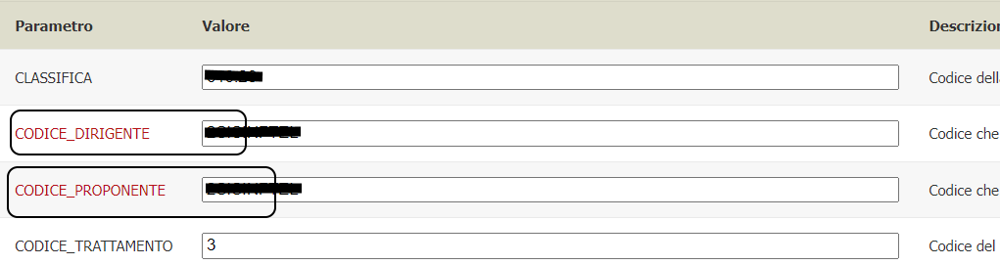

e cliccandolo verranno mostrate tutte le sovrascritture presenti con la possibilità di andare a modificarlo/eliminarlo

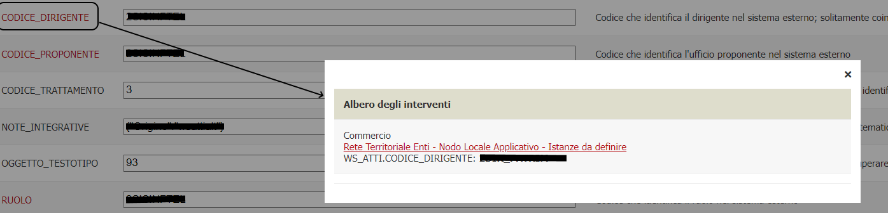

### Tipologia del registro
E' necessario configurare una o più tipologie di registro affinchè gestiscano la numerazione degli atti in maniera integrata con il gestionale esterno

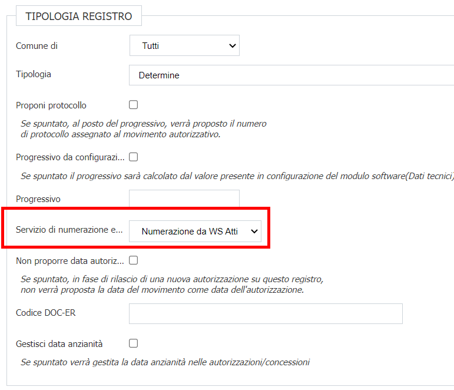

Va impostata come numerazione nel campo **"Servizio di numerazione esterna"** il valore **"Numerazione da WS Atti"**

### Testo tipo
Se si desidera avere un testo tipo generico come oggetto della determina è possibile crearne uno ad-hoc. 
E' possibile utilizzare qualsiasi variabile che possa essere sostituita prendendo i valori dal movimento e/o dall'istanza
Se la determina viene rilasciata passando prima per un movimento di rilascio, e quel movimento ha il parere valorizzato, questo verrà comunque preso sempre al posto del testo tipo

### Attivazione del protocollo
Va attivata la protocollazione configurando lo specifico connettore ( non oggetto di questa guida ). 
Qualora non sia necessario fascicolare gli atti, questa funzionalità può non essere configurata

## Scenario di Utilizzo
Terminata la parte di configurazione si passa a quella operativa che non differisce di molto da un normale rilascio di un atto interno al backoffice VBG ( permesso di costruire piuttosto che concessione OSP o altro ).
In questo scenario si presuppone che durante l'iter di una pratica ci sia una fase che preveda l'emissione di una determina; pertanto il sistema proporrà l'apposito movimento per arrivare appunto alla determina stessa.

In questo caso la gestione del movimento è identica a tutte le altre per cui basta compilare i vari campi ed immettere, opzionalmente, un parere che verrà utilizzato come oggetto della determina 
( in assenza di tale parere verrà utilizzato il testo tipo di cui alla sezione **Configurazione** > **Testo tipo** ) e premere il pulsante SALVA

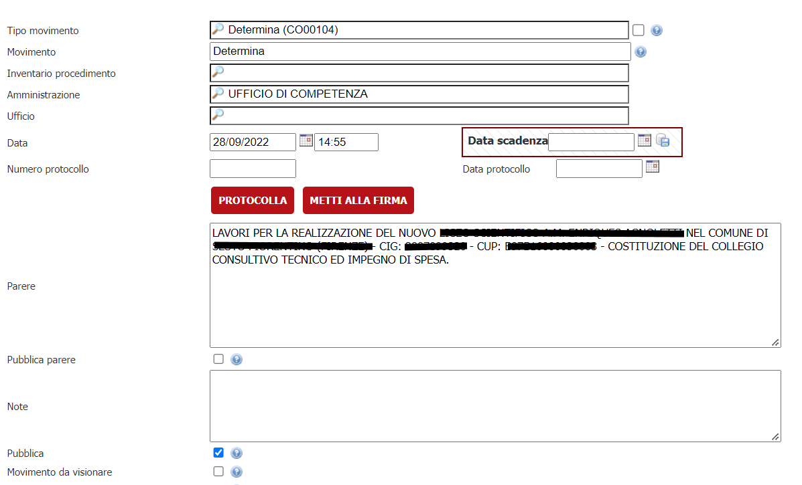

Nello step successivo bisogna selezionare il registro predisposto per l'integrazione ( vedi **Configurazione** > **Tipologia del registro** ),
selezionare il firmatario qualora sia richiesto e cliccare INSERISCI

La lista dei firmatari viene recuperata tramite un servizio messo a disposizione dal fornitore; qualora fosse necessario scegliere il firmatario ma il fornitore non ha un servizio
che mette a disposizione la lista dei firmatari, consultare la sezione **Servizio di firmatari VBG** presente in fondo alla guida

Verrà prosto di default, se presente, il firmatario specificato nel campo **CODICE_DIRIGENTE** della verticalizzazione **WS_ATTI** o la sua eventuale sovrascrittura tramite metadati dell'intervento

Durante la fase di inserimento inizia il dialogo tra VBG e il gestionale esterno per ottenere il numero "temporaneo" della determina che verrà mostrato nella stessa pagina al terrmine

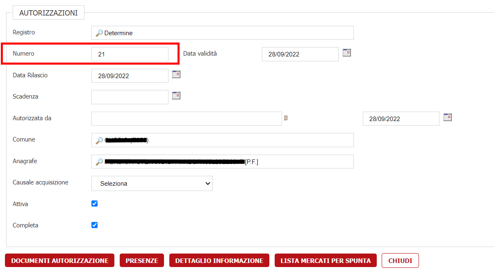

Il secondo passaggio da fare e caricare, o produrre, tutti gli allegati necessari alla finalizzazione della determina. 
Il sistema recupera in automatico gli allegati presenti nei movimenti configurati nel parametro **MOV_PRECOMPILA_DOC_AUT** della 
verticalizzazione **WS_ATTI** e, in fase di completamento della determina, produrrà in automatico il modello collegato al movimento di rilascio della determina,
convertendolo in PDF ed aggiungendolo come documento principale dell'atto

Allo stato attuale è obbligatorio produrre solamente il PDF che rappresenta il documento della determina ma possono essere anche prodotti altri documenti a corredo
Per fare questo, cliccare sul pulsante **DOCUMENTI AUTORIZZAZIONE** per andare a verificare/indicare tutti quei documenti inerenti la determina.
La sezione denominata **LISTA DOCUMENTI AUTORIZZAZIONE**  verrà popolata andando a selezionare i documenti necessari, presenti nelle varie sezioni della pratica, 
aggiungendoli tramite il rispettivo pulsante

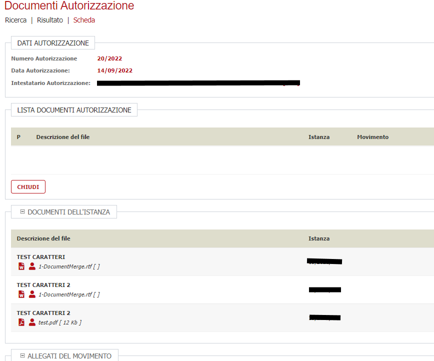

Durante questa fase nessun documento viene ancora trasmesso al gestionale esterno degli atti, per cui è possibile aggiungere/rimuovere documenti in libertà. 
Terminata questa fase, cliccare sul pulsante **COMPLETA ATTO** e VBG inizierà il dialogo con il gestionale atti esterno

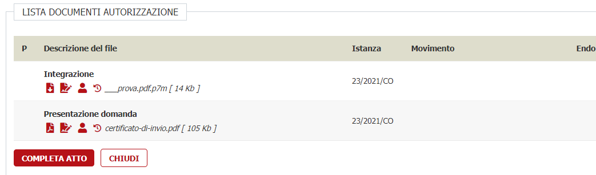

Completando l'atto, verrà numerato definitivamente l'atto, verrà generato il documento principale e verrà inviata automaticamente tutta la documentazione al gestionale esterno e l'atto risulterà immodificabile.

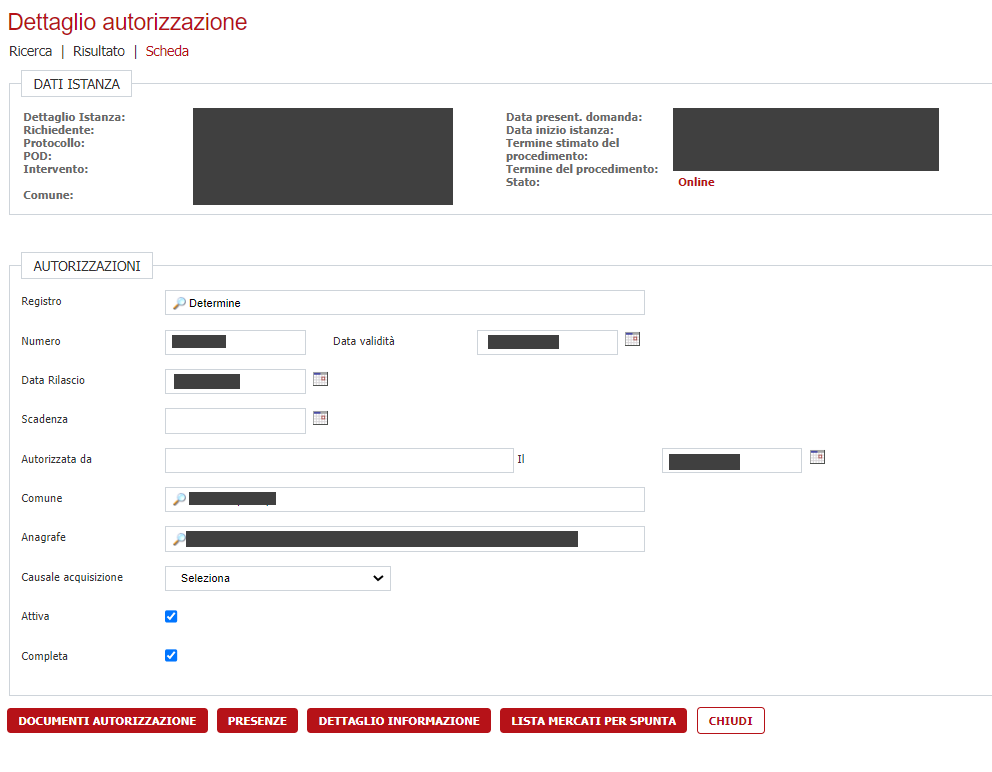

A seconda del gestionale esterno integrato, la determina potrebbe avere un suo iter al di fuori di VBG: ad esempio in Sicraweb, viene numerato defintivamente l'atto, viene avviato l'iter di firma dei documenti e,
una volta completato, viene richiamato un servizio di VBG per notificare il completamento della firma. 
Allo stato attuale VBG ne prende atto ma in futuro, i documenti trasmessi verranno storicizzati a favore di quelli firmati restituiti dal gestionale esterno 
dopo il processo di firma

## Servizio di firmatari VBG

Per venire incontro all'esigenza di poter indicare un firmatario anche se li gestionale esterno degli atti non mette a disposizione un servizio contenente l'elenco dei firmatari,
è possibile procedere in questo modo:

1. Andare in **Archivi** > **Archivi di base** > **Tabelle** > **Gestione decodifiche**
2. Creare una nuova decodifica inserendo il nome del contesto nel campo Tabella ( ad esempio FIRMATARI )
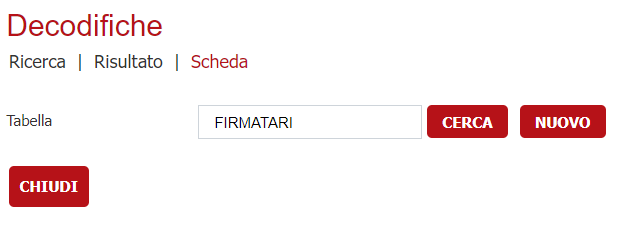
3. Censire il nuovo firmatario inserendo come **Chiave** il codice che identifica il firmatario nel gestionale atti esterno e **Valore** la descrizione del firmatario che comparirà in fase di rilascio atto
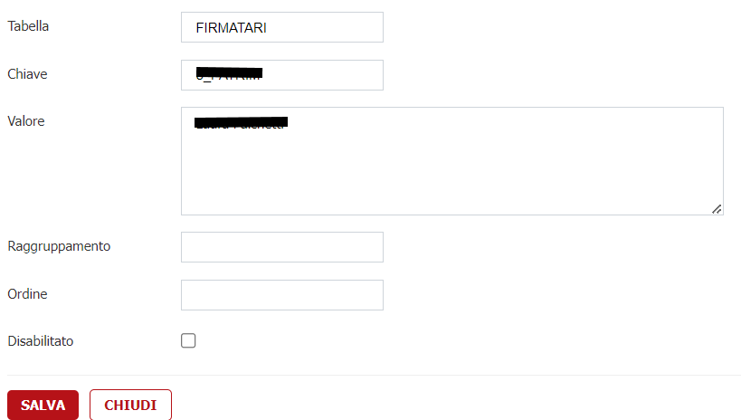
4. Riptere il passo 3 per tutti i firmatari che si intende censire
5. Configurare il parametro **URL_FIRMATARI** della verticalizzazione **WS_ATTI** con un url interno a VBG in questo formato
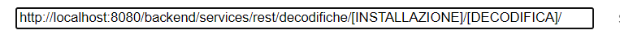
sostituendo **[INSTALLAZIONE]** con l'identificativo dell'installazione ( alias ) e **[DECODIFICA]** con quanto scritto nel campo tabella della decodifica ( punto 2 di questa lista )
Ad esempio, ponendo che l'alias dell'installazione sia **E256** e che il nome del contesto sia **FIRMATARI** andrà indicata una URL simile
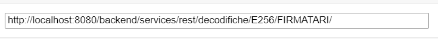
