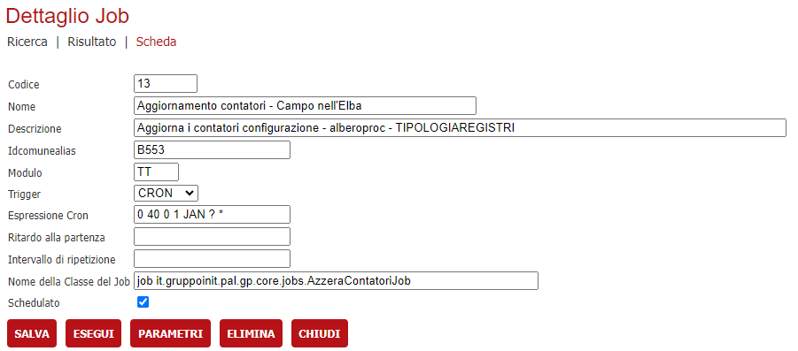

# Job schedulazioni

Per attivare le schedulazioni nel **deploy.properties** del backend va impostata la proprietà **scheduler.autoStartup** a true. 
Ricordarsi delle installazioni dove sono istanziati più backend di farlo solamente su un nodo.
Va impostato un alias di default per accendere lo schedulatore.

```properties
# PARAMETRI DELLO SCHEDULER
# abilita o disabilita lo scheduler
scheduler.autoStartup=true
# rappresenta l'alias dove sono memorizzati i job dello scheduler
scheduler.idcomunealias=E256
```

> Ogni volta che si configura un nuovo contatore va riavviato il backend che elabora le schedulazioni.

## Contatori numerazione pratiche/autorizzazioni

Il job si occupa di aggiornare i progressivi delle tabelle 
- configurazione
- alberoproc
- tipologiaregistri


Va registrata nella tabella job_repository 

```sql
insert into job_repository (ID, IDCOMUNEALIAS, JOB_NAME, DESCRIPTION, ACTIVE, TRIGGER_TYPE, START_DELAY, REPEAT_INTERVAL, CRON_EXPRESSION, JOB_CLASS_NAME, SOFTWARE) values('<nuovo_progressivo>','<idcomunealias>','Aggiornamento contatori <Nome ente>','Aggiorna i contatori configurazione - alberoproc - TIPOLOGIAREGISTRI','0','CRON',NULL,NULL,'0 40 0 1 JAN ? *','it.gruppoinit.pal.gp.core.jobs.AzzeraContatoriJob','TT');
```

Oppure da interfaccia di amministrazione bottone **SCHEDULER**

> 
