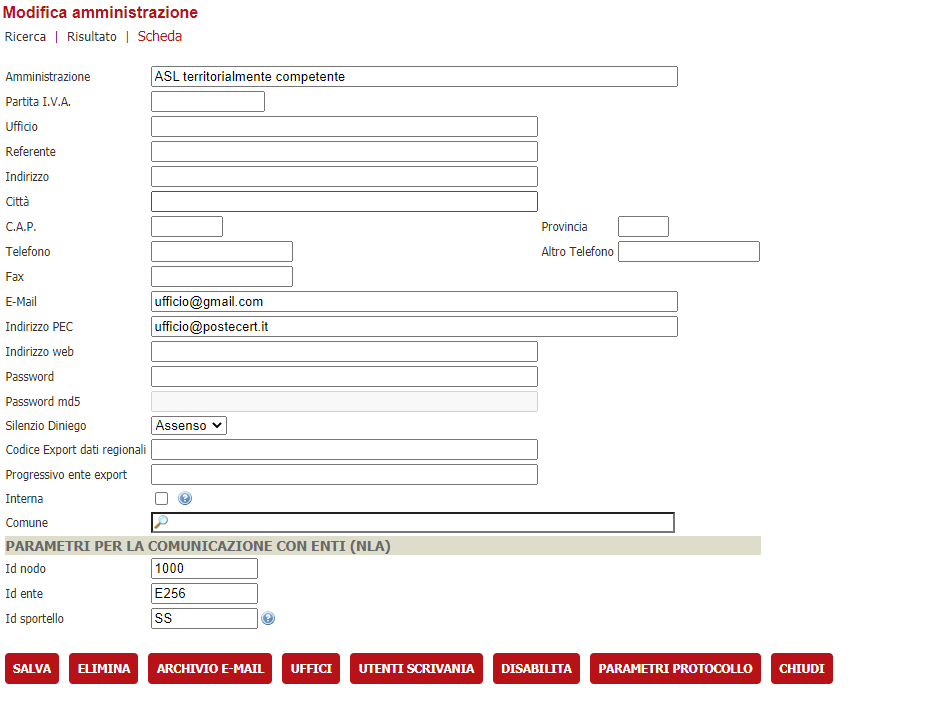
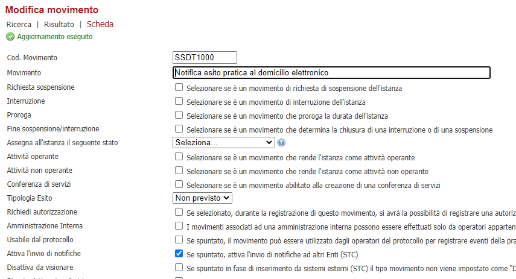
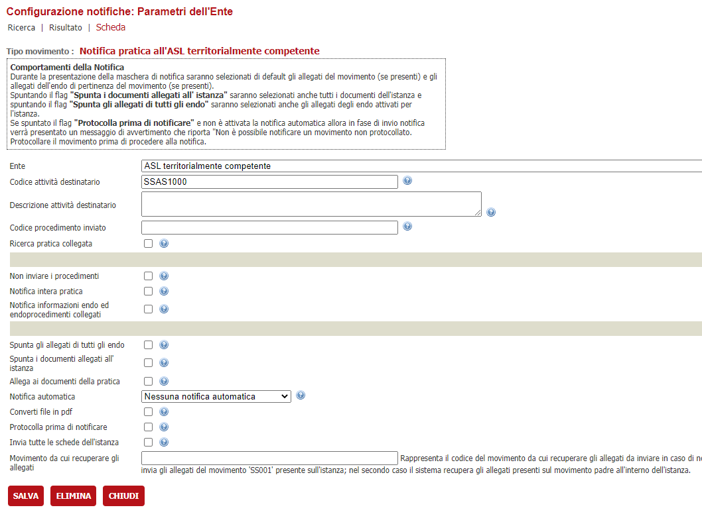
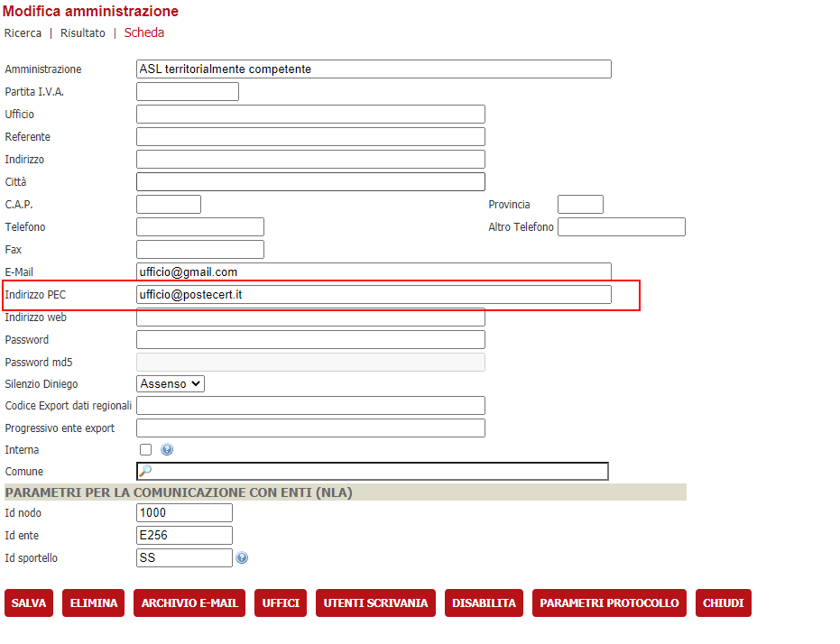
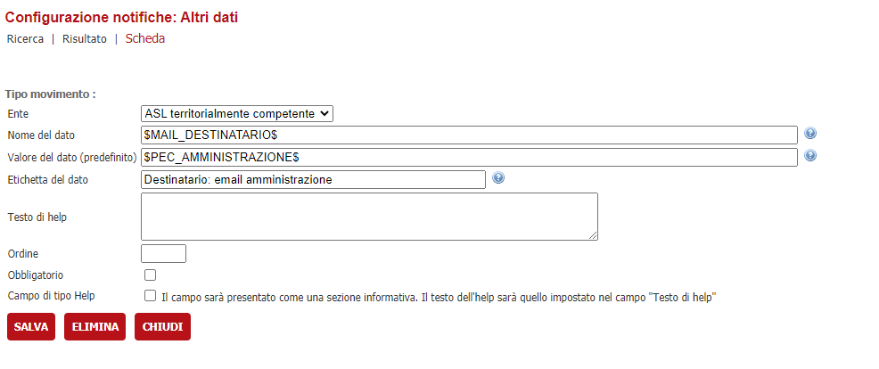
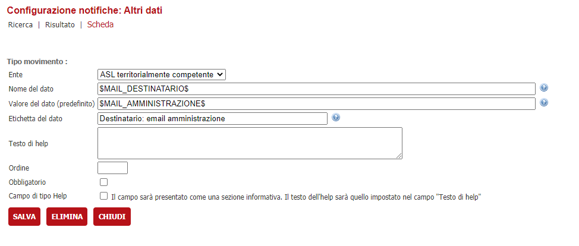
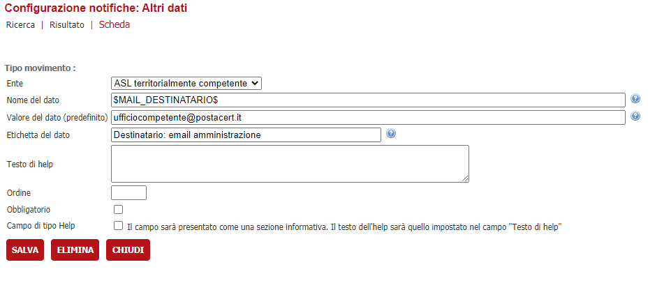

# Movimenti: invio notifica via mail/PEC ad amministrazione

E' possibile fare in modo che un movimento effettui una notifica ad un indirizzo email/pec. 
Tramite configurazione è possibile indicare se tale indirizzo destinatario deve essere recuperato:
- dal domicilio elettronico della pratica
- dalla PEC indicata nell'amministrazione legata al movimento
- dall'email indicata nell'amministrazione legata al movimento
- da un indirizzo di posta/PEC fisso

## Versione di VBG compatibile
Tale funzionalità è presente in VBG a partire dalla versione 2.83

## Configurazione della notifica al domicilio elettronico della pratica
Questa configurazione è utile quando la notifica non deve essere fatta verso un indirizzo email prestabilito ( quale ad'esempio la casella pec di un'amministrazione ) ma verso il domicilio elettronico di ogni pratica

Per fare ciò bisogna prima censire una finta amministrazione che atta ad identificare il nodo STC che invia le mail in VBG; i passaggi da eseguire sono:
- creare una nuova amministrazione chiamandola, ad esempio, Mail Service ( il nome è libero ma è consigliato riportare qualcosa che faccia capire subito a cosa si riferisce )
- impostare i valori Id nodo, Id ente, Id sportello secondo alcuni criteri:

|Parametro|Descrizione|
|-|-|
|Id nodo|E' il riferimento STC del nodo adibito all'invio delle mail|
|Id ente|Alias dell'installazione di VBG|
|Id sportello|Codice dello sportello che utilizzerà queste notifiche|

Una volta censita l'amministrazione, bisogna andare nel movimento che attiva questa notifica ed assicurarsi che abbia il flag "Attiva l'invio di notifiche" spuntato

Andare ora alla configurazione della notifica tramite il bottone "Configurazione notifiche" e censire un nuovo Ente destinatario tramite il bottone **NUOVO**

Selezionare come **Ente**, l'amministrazione precedentemente creata e indicare come **Codice attività destinatario** il codice del tipo movimento che stiamo configurando, i restanti dati sono liberamente configurabili a seconda di cosa si intende notificare; salvare per confermare quanto fatto

Chiudere e spostarsi stavolta sulla sezione **Dati aggiuntivi** e cliccare il pulsante NUOVO

Selezionare come **Ente** lo stesso indicato precedentemente, come **Nome del dato** inserire il segnaposto \$MAILTIPO\$ per indicare a VBG che l'oggetto e il corpo della mail saranno valorizzati tramite una mail tipo; nel campo **Valore del dato (predefinito)** indichiamo il codice della mail tipo che verrà utilizzato.
I campi "Etichetta del dato" e "Testo di help" non sono influenti e possono essere impostati liberamente, si raccomanda di mettere un testo che indichi cosa abbiamo configurato.

## Configurazione della notifica alla casella PEC dell'amministrazione del movimento
In questo caso l'amministrazione non è "fittizia" come al punto precedente ma è un'amministrazione/ufficio realmente esistente.

La configurazione è analoga a quanto sopra con in più il fatto che tale amministrazione deve aver valorizzato il campo **Indirizzo PEC**

Sempre in maniera analoga al punto precedente si procederà alla configurazione del movimento di notifica, la differenza è nei parametri che saranno specificati nella configurazione delle notifiche

Censire un nuovo Ente destinatario tramite il bottone **NUOVO**

Selezionare come **Ente**, l'amministrazione precedentemente creata e indicare come **Codice attività destinatario** il codice del tipo movimento che stiamo configurato; salvare per confermare quanto fatto
Chiudere e spostarsi stavolta sul tab **Dati aggiuntivi** dove andranno censiti due parametri:
- Codice della mail tipo da utilizzare
- Destinatario della PEC

Riguardo alla configurazione del codice della mail tipo da utilizzare il procedimento è lo stesso di quello indicato nella precedente sezione "Configurazione della notifica al domicilio elettronico della pratica"; per quanto riguarda il secondo parametro procedere in questo modo

Selezionare come **Ente**, l'amministrazione precedentemente creata.
Valorizzare il campo **Nome del dato** con il seguente segnaposto \$MAIL_DESTINATARIO\$ e il campo **Valore del dato (predefinito)** con il seguente segnaposto \$PEC_AMMINISTRAZIONE\$.
Anche in questo caso, i campi "Etichetta del dato" e "Testo di help" non sono influenti e possono essere impostati liberamente

## Configurazione della notifica alla casella email dell'amministrazione del movimento
Il processo è identico a quanto illustrato nella "Configurazione della notifica alla casella PEC dell'amministrazione del movimento" due sole differenze:
- l'amministrazione deve avere il campo **E-Mail** valorizzato
- il segnaposto \$MAIL_DESTINATARIO\$ da indicare nei dati aggiuntivi, deve avere come **Valore del dato (predefinito)** il segnaposto \$MAIL_AMMINISTRAZIONE\$

## Configurazione della notifica ad una casella di posta/PEC fissa
Il processo è identico a quanto illustrato nella "Configurazione della notifica alla casella PEC dell'amministrazione del movimento" con la sola differenza che il segnaposto \$MAIL_DESTINATARIO\$ da indicare nei dati aggiuntivi conterrà un indirizzo mail/PEC fisso invece del segnaposto

