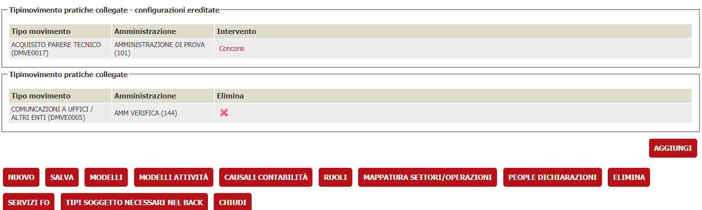
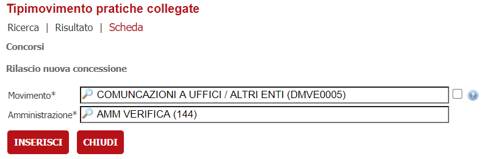

# Inserimento automatico di movimenti in istanze collegate
La funzionalità permette di inserire, nel caso di pratiche collegate mediante la funzionalità **istanze collegate**, di inserire un movimento preventivamente configurato nella pratica padre dell'istanza che si va a collegare.

La funzionalità è utile in quei casi in cui una pratica padre (ad esempio un permesso di costruire) venga collegata ad una pratica di inizio lavori. All'inserimento e collegamento di questa nel sistema viene automaticamente inserito un movimento (es. Inizio lavori) nella pratica PDC.

## Configurazione
La funionalità si configura nella configurazione dell'alberi degli interventi. 
prendiamo ad esempio l'albero

```
INTERVENTI
--> EDILIZIA
----> PERMESSO DI COSTRUIRE
----> INIZIO LAVORI
```

La pratica iniziale del permesso di costruire viene creata nell'intervento **PERMESSO DI COSTRUIRE**.
Se si vuole che al collegamento di una pratica di Inizio Lavori a quella di PDC si vada ad inserire in quest'ultima un movimento allora è nell'intervento **INIZIO LAVORI** va configurato un movimento di *Inizio Lavori*.



Il movimento configurato sarà inserito automaticamente all'operazione di collegamento della pratica.

Mediante il pulsante **AGGIUNGI** viene inserita una nuova configurazione.




Le configurazioni possono venir configurate nei rami padre.
Qualora esista una configurazione nell'intervento specifico viene presa questa e non altre, ovvero a partire dall'intervento specifico si risale alla prima configurazione trovato risalendo la gerarchia degli interventi.

Nel caso di una pratica che proviene dall'area riservata, se questa prevede il collegamento ad una pratica padre, allora in automatico verrà creato in questa il movimento.
