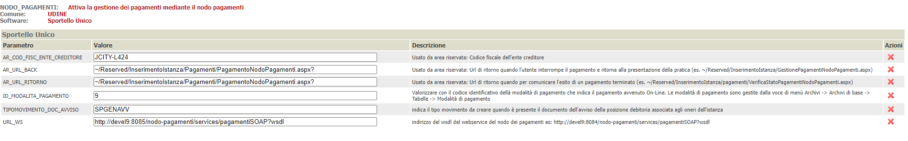

# Connettore J-City.Gov PagoPA

In questa documentazione verrà trattata la configurazione che è necessaria per attivare il connettore JPPA nel nodo pagamenti.
Per quanto riguarda l'installazione del nodo pagamenti in generale e la configurazione delle verticalizzazioni sul backoffice fare riferimento al documento  [Configurazione del nodo dei pagamenti](./configurazione-nodo-pagamenti.md)

## NODO-PAGAMENTI

### Attivazione ente

Per attivare l'ente contattare il fornitore dei servizi (MAGGIOLI). È importante preventivamente capire con l'ente quali servizi o tipi di dovuto (causali attivare).

## Configurazione del connettore

Il connettore JPPA è deployato già col nodo pagamenti e per poter essere utilizzato deve essere configurato inserendo un record nella tabella _PAY_CONNECTOR_CONFIG_

### PAY_CONNECTOR_CONFIG

| Colonna | Valore | Note |
| ------ | ------ | ------------ |
| **CODICE** | JCITY | Identificativo del connettore che deve essere poi associato al profilo dell'ente creditore in PAY_PROFILI_ENTI_CREDITORI.CODICE_CONNETTORE
| DESCRIZIONE | Connettore Maggioli JCity-GOV | Descrizione del connettore |
| PAY_CONNECTOR_JAVA_CLASS | it.gruppoinit.pal.gp.pay.connector.jcitygov.JCityGovConnector | Classe java che identifica il connettore |
| URL_PORTALE_PAGAMENTI | | Url per accedere al portale dei pagamenti |
| FK_WS_CARICAMENTO | 1 | FK ai parametri di configurazione del servizio per il caricamento delle posizioni debitorie configurato al paragrafo precedente |
| FK_WS_ANNULLAMENTO | 1 | FK ai parametri di configurazione del servizio di annullamento delle posizioni debitorie configurato al paragrafo precedente |
| FK_WS_VERIFICA | 2 | FK ai parametri di configurazione del servizio di verifica dello stato di una posizione debitoria configurato al paragrafo precedente |
| FK_WS_ATTIVA_SESSIONE | 1 | FK ai parametri di configurazione del servizio di attivazione di una sessione di pagamento configurato al paragrafo precedente |
|FK_WS_AVVISO||FK ai parametri di configurazione del servizio di generazione/invio dell'avviso di pagamento

### PAY_CONNECTOR_WS_ENDPOINT 

| CODICE_CONNETTORE | ID | ENDPOINT_URL | UTENTE | PASSWORD | TIMEOUT | DESCRIZIONE | QUARTZ_SCHEDULE | FLAG_SOLO_SCHEDULATO | MAX_CHIAMATE | FLAG_SPEGNI_SCHEDULER |
| ------ | ------ |------ | ------ |------ | ------ |------ | ------ |------ | ------ |------ |
| *Codice del connettore nel nodo pagamenti come definito in PAY_CONNECTOR_CONFIG.CODICE, si può impostare qualunque codice. Il codice deve essere valorizzato in FK nel campo PAY_PROFILI_ENTI_CREDITORI.CODICE_CONNETTORE* | *Numero progressivo* | *URL dell'endpoint SOAP* | *credenziali utente* | *password utente* | *numero di millisecondi da impostare come timeout per la connessione al servizio* | *descrizione facoltativa del servizio* | *Espressione chron che configura lo scheduling del servizio, se lasciato vuoto il servizio non è schedulato* | *impostare a 1 per i servizi che devono essere invocati SOLO sulla base dello scheduler* | *numero massimo di tentativi di invocazione del servizio eseguiti dallo scheduler in caso di errore* | *flag per spegnere temporaneamente lo scheduling del servizio* |
JCITY | 1 | https://collaudopagopa.comune-online.it/jcitygov-pagopa/web/config/#/enti |  |  | 180000 | |
JCITY | 2 | https://collaudopagopa.comune-online.it/jcitygov-pagopa/web/config/#/enti |  |  | 150000 | VERIFICA STATO |

In questa tabella sono rappresentati gli url dell'ambiente di collaudo.

## Configurazione dell'amministrazione

Deve essere inserito un record in _AMMINISTRAZIONI_ per popolare gli attributi dell'anagrafica  dell'ente per cui si effettua la configurazione.
I campi nell'elenco sottostante, se presenti, vengono riportati nei dati (facoltativi) descrittivi dell'ente creditore durante la trasmissione delle posizioni debitorie al sistema di pagamento JPPA.

| Colonna | Descrizione |
| ------ | ------ |
| **IDCOMUNE** | Identificativo dell'installazione  |
| **CODICEAMMINISTRAZIONE** | Numero progressivo  |
| AMMINISTRAZIONE | Denominazione dell'ente |
| INDIRIZZO | Indirizzo  |
| CITTA | Località  |
| CAP | CAP  |
| PROVINCIA | Provincia  |
| TELEFONO1 | Numero di telefono  |
| EMAIL | Email  |

### pay_connector_config_values

| Colonna | Descrizione |
| ------ | ------ |
| **IDCOMUNE** | Identificativo dell'installazione |
| **ID** | Numero progressivo |
| CONFIG_PARAM | Nome del parametro |
| CODICE_CONNETTORE | Identificativo del connettore |
| VALORE | Valore che assume per la specifica configurazione dell'ente |

### pay_registrazioni_causali

| Colonna | Descrizione |
| ------ | ------ |
| **ID** | Numero progressivo |
| **IDCOMUNE** | Identificativo dell'ente |
| SOFTWARE | Identificativo del modulo dell'ente |
| DESCRIZIONE | Descrizione della causale |
| ORDINE |  |
| FLAG_RIDUZIONE | |
| FLAG_NOINCASSI | |
| CODICE_VERSAMENTO | Codice che identifica l'onere nel sistema dei pagamenti dell'ente |

ad esempio

ID|IDCOMUNE|SOFTWARE|DESCRIZIONE|ORDINE|CODICE_VERSAMENTO|PARAMETRI
---|---|---|---|---|---|---
progressivo|idcomune|TT|Votive JCITY-GOV | 1 | RETELIT|

Ad esempio **Votive JCITY-GOV** è l'identificativo della pendenza configurata in JPPA per l'ente

### pay_profili_enti_creditori

| Colonna | Descrizione |
| ------ | ------ |
| **IDCOMUNE** | Identificativo dell'ente |
| **ID** | Numero progressivo |
| CODICECOMUNE | Codice Belfiore che identifica il comune |
| CODICEAMMINISTRAZIONE | Fk verso la tabella AMMINISTRAZIONI che identifica i dati dell'ente |
| SOFTWARE | Identificativo del modulo dell'ente |
| CBILL |  |
| CC_POSTALE | Conto Corrente Postale |
| CF_CODICE_PROFILO | E' il codice che il backoffice trasmette per identificare il sistema dei pagamenti da utilizzare |
| CODICE_CONNETTORE | Identificativo del connettore |
| FK_CUSALE_REG_DEFAULT | FK verso pay_registrazioni_causali |
| ID_APP_PSP | l'identificativo che viene passato come ida2a|
| CF_CODICE_PROFILO_PSP | Il codice fiscale dell'ente/piva  |
| URL_ESITO_PAGAMENTO | Url da richiamare per sapere l'esito di un pagamento |
| URL_ANNULLAMENTO_PAGAMENTO | Url assoluto che gestisce il ritorno all'app chiamante dopo l'annullamento del pagamento online |
| CODICE_SEGREGAZIONE | Identificativo numerico del punto di emissione degli iuv di un ente creditore |
| APPLICATION_CODE | Identificativo numerico dell'archivo di pagamenti associato a questo servizio dell'ente creditore in pagopa, utilizzato per la generazione del codice avviso con aux digit = 0 |
|CF_ENTE_QRCODE_PAGOPA|Il codice fiscale/partitaiva dell'ente che serve per generare la sezione Identificativo Ente/codice fiscale dell'Ente Creditore dell'algoritmo di generazione qrcode|

Ad esempio:
IDCOMUNE|ID|CODICECOMUNE|CODICEAMMINISTRAZIONE|SOFTWARE|CBILL|CC_POSTALE|CF_CODICE_PROFILO|CODICE_CONNETTORE|FK_CUSALE_REG_DEFAULT|ID_APP_PSP|CF_CODICE_PROFILO_PSP|URL_ESITO_PAGAMENTO|URL_ANNULLAMENTO_PAGAMENTO|CODICE_SEGREGAZIONE|APPLICATION_CODE|CF_ENTE_QRCODE_PAGOPA
---|---|---|---|---|---|---|---|---|---|---|---|---|---|---|---|---
IDCOMUNE|PROGRESSSIVO||0|TT|||JCITY-L424|JCITY|1|EntTest1|RETELIT|http://devel3.init.gruppoinit.it/nodo-pagamenti/esitoSessionePagamento/jcity-l424`||||01232713456 

# Configurazione del backend/console

Ora che il nodo-pagamenti e il connettore sono configurati, bisogna indicare al backend che è attivo un sistema per poter pagare in maniera integrata. Per fare ciò bisogna recarsi nella voce di menù del backend _**Configurazione**_ -> _**Tutti i backoffice**_ -> _**Configurazione regole**_  

attivare la verticalizzazione NODO_PAGAMENTI

e configurare i seguenti parametri personalizzandoli a seconda dell'ente

| Parametro | Valore |
| ------ | ------ |
| AR_COD_FISC_ENTE_CREDITORE | JCITY-L424 |

