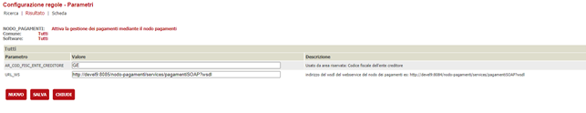

# Configurazione connettore Plug And Pay


In questa documentazione verrà trattata la configurazione che è necessaria per attivare il connettore **Plug And Pay** nel nodo pagamenti.
Per quanto riguarda l'installazione del nodo pagamenti in generale e la configurazione delle verticalizzazioni sul backoffice fare riferimento al documento 

[Configurazione del nodo dei pagamenti](./configurazione-nodo-pagamenti.md)


# Prerequisiti
  - backend ( VBG ) alla versione 2.85 o successiva
  - applicativo nodo-pagamenti versione 2.85


# Servizi usati dal connettore 
Il connettore Plug And Pay implementa i servizi di:
- caricamento delle posizioni debitorie
- caricamento delle posizioni debitorie OTF
- annullamento delle posizioni
- verifica dello stato di pagamento 
- attivazione della sessione di pagamento
- download dell'avviso di pagamento PDF
- download della ricevuta di pagamento PDF

Il sistema di pagamenti Plug And Pay espone tutti i servizi utilizzati dal connettore tramite 4 diversi endpoint.
Perciò sarà necessario configurare 4 record nella tabella *pay_connector_ws_endpoint* e impostare i riferimenti a questi 4 endpoint nei campi di *pay_connector_config* così come illustrato nei due paragrafi seguenti.


#### PAY_CONNECTOR_WS_ENDPOINT 
| CODICE_CONNETTORE | ID | ENDPOINT_URL | UTENTE | PASSWORD | TIMEOUT | DESCRIZIONE | QUARTZ_SCHEDULE | FLAG_SOLO_SCHEDULATO | MAX_CHIAMATE | FLAG_SPEGNI_SCHEDULER |
| ------ | ------ |------ | ------ |------ | ------ |------ | ------ |------ | ------ |------ |
| *Codice del connettore nel nodo pagamenti come definito in PAY_CONNECTOR_CONFIG.CODICE, si può impostare qualunque codice. Il codice deve essere valorizzato in FK nel campo PAY_PROFILI_ENTI_CREDITORI.CODICE_CONNETTORE* | *Numero progressivo* | *URL dell'endpoint SOAP* | *credenziali utente* | *password utente* | *numero di millisecondi da impostare come timeout per la connessione al servizio* | *descrizione facoltativa del servizio* | *Espressione chron che configura lo scheduling del servizio, se lasciato vuoto il servizio non è schedulato* | *impostare a 1 per i servizi che devono essere invocati SOLO sulla base dello scheduler* | *numero massimo di tentativi di invocazione del servizio eseguiti dallo scheduler in caso di errore* | *flag per spegnere temporaneamente lo scheduling del servizio* |
PNP | 1 | https://services.integrazione.plugandpay.it/Feed/DigitBusFeed.svc |  |  | 10000 |  |  | 0 |  | 0 |
PNP | 2 | https://services.integrazione.plugandpay.it/Deliver/DigitBusDeliver.svc |  |  | 10000 |  |  | 0 |  | 0 |
PNP | 3 | https://pos.integrazione.plugandpay.it/WsPayment/DigitBusPayment.svc |  |  | 10000 |  | 0 5/5 * * * ? | 0 | 100 | 0 |
PNP | 4 | https://generatorpdf.integrazione.plugandpay.it/GeneratorPdf.svc |  |  | 10000 |  |  | 0 |  | 0 |


# Configurazione del connettore
Il connettore Plug And Pay è deployato già col nodo pagamenti e per poter essere utilizzato deve essere configurato inserendo un record nella tabella PAY_CONNECTOR_CONFIG

#### PAY_CONNECTOR_CONFIG
| Colonna | Valore | Note |
| ------ | ------ | ------------ |
| **CODICE** |  | Identificativo del connettore che deve essere poi associato al profilo dell'ente creditore in PAY_PROFILI_ENTI_CREDITORI.CODICE_CONNETTORE |
| DESCRIZIONE | PlugAndPay | Descrizione del connettore usata nei messaggi di errore |
| PAY_CONNECTOR_JAVA_CLASS | it.gruppoinit.pal.gp.pay.connector.plugandpay.PlugAndPayConnector | Classe java che implementa il connettore |
| URL_PORTALE_PAGAMENTI |  | URL del portale dei pagamenti online (non usato da Plug And Pay) |
| FK_WS_CARICAMENTO | 1 | FK all'enpoint SOAP configurato al paragrafo precedente |
| FK_WS_ANNULLAMENTO | 1 | FK all'enpoint SOAP configurato al paragrafo precedente |
| FK_WS_VERIFICA | 2 | FK all'enpoint SOAP configurato al paragrafo precedente |
| FK_WS_ATTIVA_SESSIONE | 3 | FK all'enpoint SOAP configurato al paragrafo precedente |
| FK_WS_AVVISO | 4 | FK all'enpoint SOAP configurato al paragrafo precedente |
| FK_WS_NOTIFICA | 3 | FK all'enpoint SOAP configurato al paragrafo precedente |
| FK_WS_RICEVUTA | 4 | FK all'enpoint SOAP configurato al paragrafo precedente |

gli altri campi devono essere lasciati vuoti


# Configurazione dell'amministrazione
Deve essere inserito un record in AMMINISTRAZIONI per popolare gli attributi dell'anagrafica dell'ente per cui si effettua la configurazione.
Nel caso di Plug And Pay le informazioni che vengono utilizzate dal connettore sono indicate nella tabella seguente.
Nella tabella sottostante viene mostrato un esempio di configurazione per la Provincia di Pisa.
| Colonna | Valore | Descrizione |
| ------ | ------- | ------ |
| **IDCOMUNE** | G702 | Identificativo dell'installazione  |
| **CODICEAMMINISTRAZIONE** | 3 | Numero progressivo  |
| AMMINISTRAZIONE | | Provincia di Pisa | Denominazione dell'ente |
| PARTITAIVA | 00184280360 | Partita IVA dell'ente |


# Configurazione delle causali di registrazione 
Tutti i debiti che vengono caricati nel nodo pagamenti devono essere associati ad una causale di registrazione. 

#### pay_registrazioni_causali 
| Colonna | Valore | Note |
| ------  | ------ | ------ |
| **ID** | 1 | Numero progressivo |
| **IDCOMUNE** | G702 |  |
| DESCRIZIONE | Oneri Provincia di Pisa | Descrizione della causale di registrazione che dipende dalla tipologia di onere (libero) |
| CODICE_VERSAMENTO | 0000016 | Codice che identifica la tipologia di onere. Deve corrispondere nel backoffice a TIPICAUSALIONERI.CODICECAUSALEPEOPLE. il codice configurato qui è quello usato come valore di default nel caso in cui il client non lo passi nella richiesta di caricamento della posizione debitoria |

gli altri campi della tabella non sono utilizzati e devono essere lasciati vuoti


# Configurazione del profilo dell'ente
Tutte le chiamate che il nodo pagamenti riceve devono contenere un parametro **cfEnteCreditore** che deve fare riferimento all'identificativo del profilo di un ente censito nel nodo pagamenti.
Per attivate il connettore PlugAndPay per un ente è quindi necessario inserire il corrispondente profilo ente nella tabella PAY_PROFILI_ENTI_CREDITORI.
Il record inserito associerà l'amministrazione che si è appena configurata nella tabella AMMINISTRAZIONI al connettore PlugAndPay precedentemente configurato in PAY_CONNECTOR_CONFIG.
Il CF_CODICE_PROFILO usato per ??? è '???'. 
Tale valore deve essere configurato nella apposita verticalizzazione del BackOffice per assicurarsi che il nodo pagamenti sia invocato con il parametro corretto.

#### pay_profili_enti_creditori
| Colonna | Valore | Note |
| ------ | ------ | ------ |
| **IDCOMUNE** | G702 | Identificativo dell'installazione |
| **ID** | 1 | Numero progressivo |
| CODICEAMMINISTRAZIONE | 1 | FK verso la riga di AMMINISTRAZIONI che identifica i dati dell'ente |     
| CF_CODICE_PROFILO | PI | E' il codice che il backoffice trasmette per identificare il connettore e la configurazion ente da utilizzare |
| CODICE_CONNETTORE | PNP | Identificativo del connettore PlugAndPay già configurato |
| FK_CUSALE_REG_DEFAULT | 1 | FK verso pay_registrazioni_causali che definisce la causale di registrazione del debito da usare nel caso in cui non venga specificata in fase di caricamento. |
| ID_APP_PSP | 9637CBAE-207C-4B24-8076-84838DC225E1 | Identificativo dell'applicazione nel sistema PlugAndPay |
| CF_CODICE_PROFILO_PSP | 0000110 | Ientificativo dell’ente nel sistema PlugAndPay |
| URL_ESITO_PAGAMENTO | http://[host]:[port]/nodo-pagamenti/esitoSessionePagamento/pi?esito=1 | URL di ritorno delle sessioni di pagamento andate a buon fine |
| URL_ANNULLAMENTO_PAGAMENTO | http://[host]:[port]/nodo-pagamenti/esitoSessionePagamento/pi?esito=1 | URL di ritorno delle sessioni di pagamento andate a buon fine |
| CODICE_SEGREGAZIONE | 2 | codice segregazione per la generazione dello IUV |
| APPLICATION_CODE | 16 | application code usato per la generazione dello IUV |
| CF_ENTE_QRCODE_PAGOPA | 00184280360 | Il codice fiscale/partitaiva dell'ente che serve per generare la sezione Identificativo Ente/codice fiscale dell’Ente Creditore dell'algoritmo di generazione qrcode|

Le colonne della tabella PAY_PROFILI_ENTI_CREDITORI che non sono mostrate non devono essere valorizzate.


# Configurazione del backend
Ora che il nodo-pagamenti e il connettore sono configurati, bisogna indicare al backend che è attivo un sistema per poter pagare in maniera integrata. Per fare ciò bisogna recarsi nella voce di menù del backend _**Configurazione**_ -> _**Tutti i backoffice**_ -> _**Configurazione regole**_ 


attivare la verticalizzazione NODO_PAGAMENTI


e configurare i seguenti parametri personalizzandoli a seconda dell'ente



| Parametro | Valore |
| ------ | ------ |
| AR_COD_FISC_ENTE_CREDITORE | F257 |
| URL_WS |  http://devel9:8085/nodo-pagamenti/services/pagamentiSOAP?wsdl |
|TIPOMOVIMENTO_DOC_AVVISO | TTGENAVV|
|TIPOMOVIMENTO_DOC_FATTURA | TTGENFATT|

Sono i movimenti da specificare nel caso si voglia riportare i documenti delle posizioni debitorie nella pratica di riferimento

## conti

ID|CODICECONTO|CODICESOTTOCONTO|DESCRIZIONE|NOTE|FK_CODICEAMMINISTRAZIONE|SOFTWARE|IDCOMUNE|IVA|ANNO_ACCERTAMENTO|NUMERO_ACCERTAMENTO|DATASCADENZA|NUMERO_SOTTO_ACCERTAMENTO
-|-|-|-|-|-|-|-|-|-|-|-|-
2||Servizi|ONERI AVVISI TOSAP|||CO|F257|0|2021||31-DIC-99|T525009

Sono importanti le colonne CODICESOTTOCONTO che **DEVE** corrispondere con una delle causali definite in 
```java
@XmlType(name = "CausaliImporti")
@XmlEnum
public enum CausaliImporti {

    @XmlEnumValue("Servizi")
    SERVIZI("Servizi"),
    @XmlEnumValue("Sanzioni")
    SANZIONI("Sanzioni"),
    @XmlEnumValue("Spese")
    SPESE("Spese"),
    @XmlEnumValue("Bollo")
    BOLLO("Bollo"),
    @XmlEnumValue("Interessi")
    INTERESSI("Interessi"),
    @XmlEnumValue("Arrotondamento")
    ARROTONDAMENTO("Arrotondamento"),
    @XmlEnumValue("DepositiCauzionali")
    DEPOSITI_CAUZIONALI("DepositiCauzionali"),
    @XmlEnumValue("RimborsoDepositiCauzionali")
    RIMBORSO_DEPOSITI_CAUZIONALI("RimborsoDepositiCauzionali"),
    @XmlEnumValue("RimborsoServizi")
    RIMBORSO_SERVIZI("RimborsoServizi"),
    @XmlEnumValue("SpeseTenutaConto")
    SPESE_TENUTA_CONTO("SpeseTenutaConto"),
    @XmlEnumValue("ImpostaRegistro")
    IMPOSTA_REGISTRO("ImpostaRegistro"),
    @XmlEnumValue("Commissioni")
    COMMISSIONI("Commissioni"),
    @XmlEnumValue("InteressiPassiviCCP")
    INTERESSI_PASSIVI_CCP("InteressiPassiviCCP"),
    @XmlEnumValue("SpeseDomiciliazione")
    SPESE_DOMICILIAZIONE("SpeseDomiciliazione"),
    @XmlEnumValue("CommissioniBolloSpeseTenutaConto")
    COMMISSIONI_BOLLO_SPESE_TENUTA_CONTO("CommissioniBolloSpeseTenutaConto"),
    @XmlEnumValue("CommissioniSpeseTenutaConto")
    COMMISSIONI_SPESE_TENUTA_CONTO("CommissioniSpeseTenutaConto"),
    @XmlEnumValue("Urgenza")
    URGENZA("Urgenza"),
    @XmlEnumValue("SanzioniInfedele")
    SANZIONI_INFEDELE("SanzioniInfedele"),
    @XmlEnumValue("SanzioniOmessa")
    SANZIONI_OMESSA("SanzioniOmessa"),
    @XmlEnumValue("SanzioniLiquidazione")
    SANZIONI_LIQUIDAZIONE("SanzioniLiquidazione"),
    @XmlEnumValue("Addizionali")
    ADDIZIONALI("Addizionali");
```
ed è importante la colonna numero_sotto_accertamento che è un valore che deve essere comunicato dall'ente e configurato per quel tipo di pendenza


## causali oneri

CO_ID|CO_DESCRIZIONE|CO_SERICHIEDEENDO|IDCOMUNE|SOFTWARE|FK_RCO_ID|CO_DISABILITATO|CO_ORDINAMENTO|CODICECAUSALEPEOPLE|PAGAMENTIREGULUS|FKIDCAUSALEBOLLO|FLG_TIPICAUSALIINTERESSI|FK_TIPICAUSALIINTERESSI|FLAG_GENERA_FATTURA|FLAG_GENERA_AVVISO
-|-|-|-|-|-|-|-|-|-|-|-|-|-|-
54|ONERI AVVISI TOSAP|0|F257|CO||0||TOSAP|0||0||0|1

È importante la colonna CODICECAUSALEPEOPLE che va a corrispondere  nel nodo pagamento la colonna PAY_REGISTRAZIONI_CAUSALI.CODICE_VERSAMENTO e serve per capire se generare un avviso o una fattura.


## job repository

Il job permette di agganciare il documento alla pratica

IDCOMUNEALIAS|JOB_NAME|DESCRIPTION|ACTIVE|TRIGGER_TYPE|START_DELAY|REPEAT_INTERVAL|CRON_EXPRESSION|JOB_CLASS_NAME|SOFTWARE
-|-|-|-|-|-|-|-|-|-  
'F257'|'VerificaDocumentiPosizioniDebitorieJob'|'VerificaDocumentiPosizioniDebitorieJob'|'0'|'CRON'|null|null|'0 0/10 * * * ? *'|'it.gruppoinit.pal.gp.core.features.oneri.jobs.VerificaDocumentiPosizioniDebitorieJob'|'TT'

## job repository params

ETICHETTA|DESCRIZIONE|VALORE|FK_JOB_REPOSITORY
-|-|-|-
'LISTA_ALIAS_DA_ELABORARE'|'La lista degli alias da elaborare separata da ; se non specificato prende la lista dalla security'|'F257'|'2'
'NUM_RECORD_DA_ELABORARE'|'Indicare il numero di record da processare per ente. Ogni esecuzione del job cerca di elaborare questo numero di record. Il conteggio viene incrementato quando una riga della tabella ISTANZEONERI_POS_DEB_BATCH viene segnata come completata'|'150'|'2'